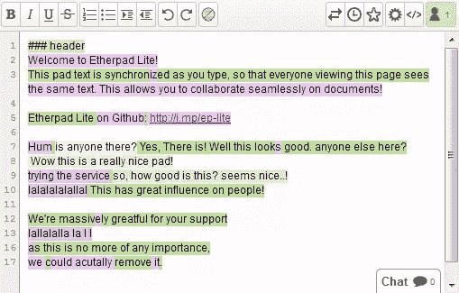
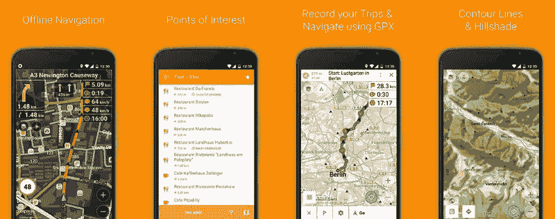
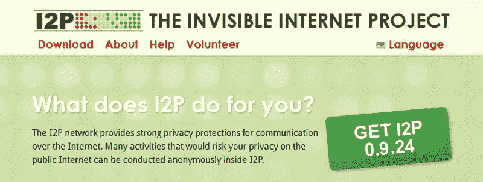
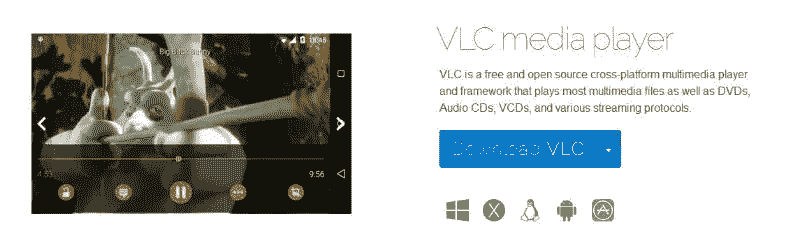
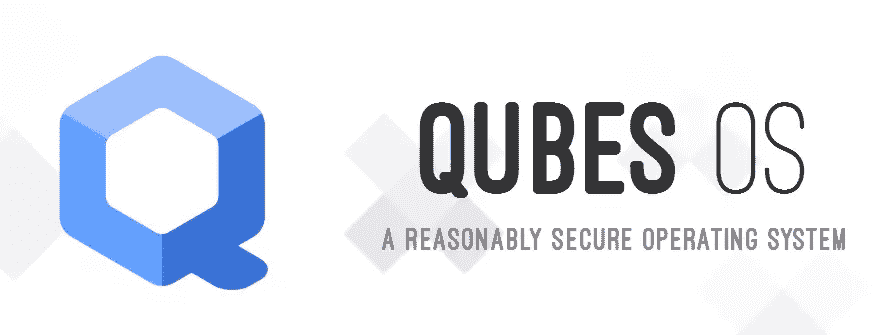

# Sourcehunt 设计#2:二月——留下你的印记

> 原文：<https://www.sitepoint.com/sourcehunt-design-february-make-mark/>

在[上个月](https://www.sitepoint.com/talented-designer-sourcehunt-needs/)发布 Sourcehunt Design 之后，我们很高兴为您带来 5 个新的开源项目，这些项目可能需要设计帮手。正值情人节，为以下项目贡献一些时间，分享一些爱。

这个月有一些大的项目，所以在你的简历中加入这些项目无疑会给人留下深刻的印象。这个月我们选择了一些历史悠久的开源项目，所以期待成熟的系统和经验丰富的项目管理。

像往常一样，查看一下 GitHub 指南,以防你被 GitHub 问题所困扰(尽管这应该很简单)。

## [以太垫](http://etherpad.org/)

Etherpad 允许您实时协作编辑文档，就像在浏览器中运行的实时多播放器编辑器一样。写文章、新闻稿、待办事项等。和其他人一起，同时处理同一个文档。

所有实例都通过一个记录良好的 API 提供对数据的访问，并支持对许多主要数据交换格式的导入/导出。如果内置的特性集对你来说还不够，还有大量的插件允许你定制你的实例来满足你的需求。

虽然 Etherpad 对关键的设计决策没有迫切的需求，但在 [GitHub](https://github.com/ether/etherpad-lite) 上有一些与 [UI 和 UX](https://github.com/ether/etherpad-lite/issues?q=is%3Aopen+is%3Aissue+label%3AUI+label%3AUX) 相关的重要问题。虽然 Etherpad 目前是一个非常有用的工具，但可以说还有空间让它在美学上更令人满意。如果你同意，站出来，让我们看看你的印章，并随时提出问题或[联系开发者。](http://etherpad.org/#contact)

*   [网站](http://etherpad.org/)
*   [GitHub 回购](https://github.com/ether/etherpad-lite)

## [第二页](http://osmand.net/)第二页

OsmAnd (OSM 自动导航方向)是一个地图和导航应用程序，可访问免费的全球高质量 OpenStreetMap (OSM)数据。配备了语音和光学导航器，能够查看兴趣点，管理 GPX 轨道等等。

它是目前世界上最受欢迎的开源移动地图应用程序，因此为它做贡献可以获得宝贵的街头信誉。OsmAnd 最近更新了他们的 Android 用户界面，设计风格更加物质化，但是它还有很大的改进空间。如果你想参与的话，这是一个完美的首要任务。这里有一个例子，你可以为用户界面添加一些图标。

*   [网站](http://osmand.net/)
*   [GitHub 回购](https://github.com/osmandapp/Osmand/)

## [I2P](https://geti2p.net)

I2P 是一个匿名的覆盖网络——网络中的网络。它旨在保护通信免受第三方(如 ISP)的严密监视和监控。I2P 被许多关心自己隐私的人使用:活动家、受压迫者、记者和告密者，以及普通人。

任何网络都不可能“完全匿名”。I2P 的持续目标是让攻击变得越来越难发动。随着网络规模的扩大和持续的学术审查，它的匿名性将变得更强。截至目前，I2P 可以在桌面、嵌入式系统(如树莓 Pi)和安卓手机上使用。

乍一看，在 I2P 参与设计的入门门槛可能看起来很难，但是一旦融入社区，他们的设计需求就会很快显现出来。I2P 希望更新其网站，所以如果你有兴趣尝试一下，请随时与团队联系。

*   [网站](https://geti2p.net/)

## [VLC](https://www.videolan.org/)

VLC 是一个免费和开源的跨平台多媒体播放器和框架，可以播放最常见的多媒体格式，从 DVD 到音频 CD 到 vcd 和各种流媒体协议。

作为最常用的多媒体播放器之一(如果不是最常用的)，VLC 自诩为这个资本主义时代最成功的开源/自由软件项目之一。当讨论开源软件的优点时，我个人把它作为我最喜欢的例子之一。

VLC 也对设计投稿开放。你可以用 VLC 皮肤为实际的软件做贡献，这可能是一个很好的学习曲线。你也可以贡献图标和宣传设计，[查看设计页面](https://wiki.videolan.org/VideoLAN_Design/)。VLC 网站的设计改进也非常有价值，所以[联系论坛上的 VLC 人参与进来。](https://forum.videolan.org/)

VLC 在 GitHub 上并不活跃，但是你可以查看他们的 bug 追踪器来记录或跟踪问题。

*   [网站](https://www.videolan.org/)

## [Qubes OS](https://www.qubes-os.org/)

Qubes 是一个面向安全的 Linux 发行版，专注于用户友好的安全性。它采用了一种称为“分区安全”的方法，允许用户将其数字生活的各个部分划分到安全隔离的虚拟机(VM)中。把它想象成一台模拟的计算机和作为软件在物理计算机上运行的操作系统。

Qubes OS 是一个非常注重用户体验和设计的开源项目。这部分是由于 [Brennan Novak](https://twitter.com/brennannovak) 的参与，他是[开源设计组织](http://opensourcedesign.net/)的一名非常活跃的成员，Sourcehunt 也是从那里获得灵感的。

该项目成立于 2010 年，为设计师提供了大量的插话空间。仅 GitHub 上的 [UX 问题就会让优秀的设计师忙碌一段时间。](https://github.com/QubesOS/qubes-issues/labels/UX)

实际上，这是 Qubes 操作系统设计问题的一个很好的例子。如果你想为网站做贡献，[这期可能适合你](https://github.com/QubesOS/qubes-issues/issues/1711)。

如果你想在做出贡献之前融入并了解团队，你可以通过他们的邮件列表联系他们。

*   [网站](https://www.qubes-os.org/)
*   [GitHub 回购](https://github.com/QubesOS/qubes-issues)

## 狩猎季节！

像往常一样，在投稿之前，请务必通读每个项目的投稿指南。不要犹豫，联系 GitHub 上的项目开发人员，他们的邮件列表或者 IRC。

你参与过任何项目的设计吗？请在评论中告诉我们，或者使用# sourcehunt #设计标签！

## 分享这篇文章