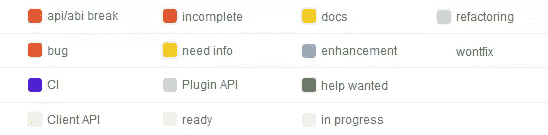
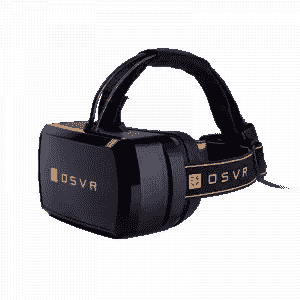
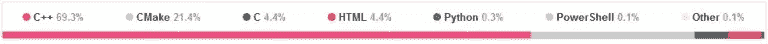
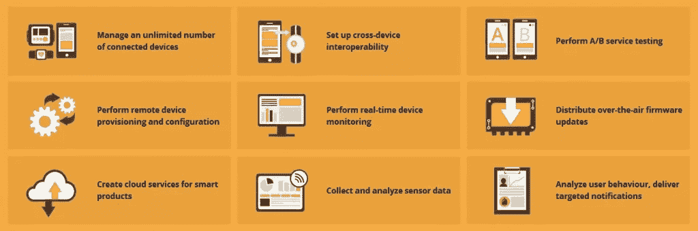
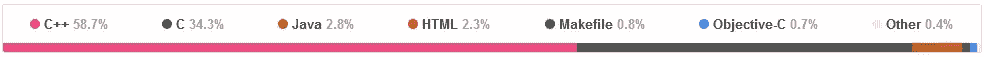
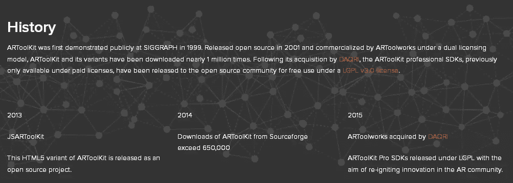

# Sourcehunt:新兴科技版

> 原文：<https://www.sitepoint.com/sourcehunt-emerging-tech-edition/>

2015 年 10 月，我们[在 PHP 频道](https://www.sitepoint.com/sourcehunt-hacktoberfest-2015-edition-hack-to-glory/)推出了 Sourcehunt。SitePoint 上 Sourcehunt 的目标是帮助开源项目找到新的贡献者，同时帮助贡献者通过参与开源项目获得经验和街头信誉。怀着同样的目标，两个月后我们[在设计频道](https://www.sitepoint.com/talented-designer-sourcehunt-needs/)推出了 Sourcehunt。在本文中，我们将把它带到一个正在 SitePoint 成长的全新领域——[新兴技术](https://www.sitepoint.com/learn-emerging-tech/)！

协同是这里的关键词。在开源项目上留下印记会对未来的项目产生很大的影响。我个人非常幸运地成为志愿者，为像 Mozilla 或 T2 Fedora 这样的项目做贡献。为这些项目做贡献让我为其他要求更高的项目做好了准备，这些项目最终会支付我的账单。如果你能抽出几个小时来做类似这样的副业，你很快就会看到它的优势！

在这一期，我们将聚焦于新兴技术领域的开源项目。具体来说，来自虚拟现实、物联网和增强现实领域的 3 个项目。我们将对这个项目做一个简短的介绍，你可以如何贡献，并以每个项目中使用的主要编程语言和许可证来结束每个项目。准备好了吗？让我们开始吧。

## [OSVR](http://osvr.org)

[https://www.youtube.com/embed/XZBfRtriw_Y](https://www.youtube.com/embed/XZBfRtriw_Y)

> OSVR 是一个用于虚拟和增强现实的开源软件平台。它允许发现、配置和操作数百个 VR/AR 设备和外围设备。OSVR 支持多种游戏引擎和操作系统，并提供异步时间扭曲和直接模式等服务，以支持低延迟渲染。

名字就说对了——**开源虚拟现实**。对游戏玩家和开源爱好者来说都非常令人兴奋！这尤其令人兴奋，因为它是由[雷蛇](http://www.razerzone.com/)维护的，这是一家在游戏玩家中很受欢迎的游戏硬件制造商。OSVR 的另一个维护者是 [Sensics](http://sensics.com/) 。

该项目相对复杂，大量的开发、讨论和跟踪都不是在一个中心进行的。然而，当寻找帮助、贡献方式或如何投入开发时，首先要查看的是 [OSVR GitHub repo](https://github.com/OSVR/OSVR-Core) 。如果你想以任何特定的方式提供帮助，请查看回购的问题列表。为了便于检查，它们被整齐地贴上了标签:

OSVR 开发者门户是参与该项目的枢纽。要开始，请查看以下内容:

*   [幻灯片&演示文稿](http://osvr.github.io/presentations/)
*   [兼容设备/系统/框架列表](http://osvr.github.io/compatibility/)
*   [Gitter 聊天室](https://gitter.im/orgs/OSVR/rooms)
*   [时事通讯&邮件列表](http://osvr.github.io/mailing-lists/)

如果你想开发你的第一个 bug，你应该寻找红色的“bug”标签并开始开发它们。

### 奖金

如果你有一些闲钱，可以看看 [OSVR HDK(黑客开发工具包)](http://www.osvr.org/hardware.html)。它是完全开源的，任何人都可以免费下载和修改硬件原理图。如果你想更进一步，看看吧。

### 编程语言和许可证

超过 *69.3%* 的代码写在 **C++** 中， *21.4%* 写在 **CMake** 和 *4.4%* **C** 中。

代码是在 Apache 2.0 许可证下授权的。[如果你有兴趣了解更多关于开源许可的信息，也可以看看我的文章](https://www.sitepoint.com/introduction-to-open-source-licenses/)。

## [Kaa](http://www.kaaproject.org/)

随着物联网的兴起，[对安全和隐私漏洞的担忧](http://www.wired.com/2015/12/2015-the-year-the-internet-of-things-got-hacked/)也随之出现。一个名为 [Kaa](http://www.kaaproject.org/) 的项目旨在改变这种状况。

> Kaa 是一个生产就绪的多用途中间件平台，用于构建完整的端到端物联网解决方案、互联应用和智能产品。Kaa 平台为物联网产品开发提供了一个开放、功能丰富的工具包，从而大幅降低了相关成本、风险和上市时间。

听起来很有希望，对吧？Kaa 是完全开源和免费的(免费的意思是自由和免费啤酒)。它提供社区支持和商业支持。在这篇文章中，我们将重点关注社区方面以及如何参与其中。

为了开始 Kaa，[查看 Kaa 项目的概述](http://www.kaaproject.org/overview/)。它非常丰富的信息和解释，你应该在潜水。 [Kaa 入门](http://www.kaaproject.org/getting-started/)页面是你应该去的下一个地方。它会让你很快对这个项目有一个印象。

如果你觉得自己已经准备好了，并且最终想亲自动手，那就迁移到 [Kaa GitHub repo](https://github.com/kaaproject/kaa) 吧。然而，它主要是 [Kaa JIRA 实例](http://jira.kaaproject.org/browse/KAA/)的镜像。您可以从 GitHub 为相应的 JIRA 票证创建一个 pull 请求。Kaa 网站上的[投稿](http://www.kaaproject.org/community/)页面很好地解释了这一点。

简而言之，这些是项目围绕的核心会议场所:

*   [JIRA](http://jira.kaaproject.org/browse/KAA/)
*   [维基](http://docs.kaaproject.org/display/KAA/)
*   [论坛/邮件列表](https://groups.google.com/forum/#!forum/kaaproject)

### 编程语言和许可证

超过 69.8%的代码是用 **Java** ， *9.5%* 用 **C** ， *9%* **C++** 和*9%***Objective-C**编写的。

代码是在 Apache 2.0 许可证下授权的。

## ARToolKit

还记得增强现实是最新的闪亮工具吗？尽管该行业的很大一部分在主流意义上盖过了 AR，但随着物联网或 VR 等更引人注目的技术的出现，AR 如今仍有许多用例，并继续蓬勃发展。最近的一个例子是口袋妖怪 Go，它在过去的几个月里被游戏新闻媒体大肆宣传。

ARToolKit 提供了一个完整的框架，使程序员能够开发 AR 应用程序。该公司引以为豪的是，自 2001 年以来，他们一直是一个开源项目，从那时起，他们的工具已经被部署在数千个商业和社区项目中。听起来绝对不像是在你爸爸的车库里做的小项目。让我们看一看。

不出所料，考虑到 ARToolKit 15 年的悠久历史，该项目使用了一个 [phpBB 论坛](http://artoolkit.org/community/forums/)。然而，故事发生在 [ARToolKit GitHub repo](https://github.com/artoolkit/artoolkit5) 中。你可以通过 [GitHub 问题列表](https://github.com/artoolkit/artoolkit5/issues)来了解这个项目。这个项目也鼓励你直接联系项目维护人员来参与进来:[contributions@artoolkit.org](mailto:contributions@artoolkit.org)。

### 编程语言和许可证

超过 *58.7%* 的代码用 **C++** ， *34.3%* 用 **C** ， *2.8%* **Java** 编写。

代码(大部分)是在 **LGPLv3** 下授权的。也有一些例外，所以请前往[许可](http://www.artoolkit.org/artoolkit-licensing)页面了解更多信息。

## 还没测试吗？

如果(除了糟糕的双关语)这也让你感兴趣，试一试，让我们在下面的评论中知道效果如何。如果你在某个时候遇到困难，也可以随时联系我。你也可以[点击这里](https://www.sitepoint.com/sourcehunt-open-source-week-edition/)查看所有 SitePoint Sourcehunt 的帖子。

狩猎愉快！

## 分享这篇文章