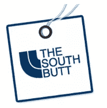
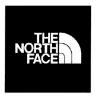

# 厚颜无耻的南屁股去法院与北脸超过标志

> 原文：<https://www.sitepoint.com/south-butt-north-face-logo/>

South Butt 是一家美国在线服装店，销售帽衫、夹克、t 恤和短裤。他们最近发现自己因为商标设计以及与另一家(也是非常著名的)服装店 North Face 的相似性而陷入了困境。商标侵权、商标淡化和不正当竞争是上周三开始的案件中的问题。

*南屁股标志(左)和北脸标志。容易分辨？*

Jimmy Winkleman 创办了 South Butt 商店，目标是“那些不想成为胸前印有 North Face 标志的人群中的一员”(引自[经理](http://www.themaneater.com/stories/2010/1/22/north-face-takes-south-butt-court/))

关于 North Face 的投诉，即侵权商标“可能会在被侵权产品吸引的消费者中造成最初的混淆、错误和欺骗，他们认为这些产品来自 North Face、与 North Face 有关联或者得到了 North Face 的授权”, South Butt 在其网站上发布了一份免责声明，声明如下

> 我们与 North Face 服装公司或其以“The North Face”品牌销售的产品没有任何关系，也不想与之混淆。如果你不能辨别脸和屁股的区别，我们鼓励你购买 North Face 的产品。

现在没有理由把两者混为一谈了。上周的听证会是为了确定案件的日期和期限。看看会发生什么会很有趣。你可以在 [South Butt 网站新闻](http://www.thesouthbutt.com/2010/01/25/south-butt-supporters-we-need-your-help-court-appearance-details-inside/)栏目和 [Maneater 网站](http://www.themaneater.com/stories/2010/1/22/north-face-takes-south-butt-court/)上了解更多信息。

你对此有什么看法？南屁股 logo 是不是太像当初的北脸设计了？你会支持那个小人物吗，或者你认为南巴特在利用别人的提携赚钱吗？

## 分享这篇文章