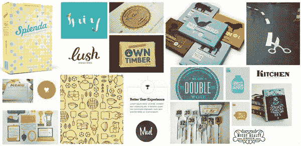
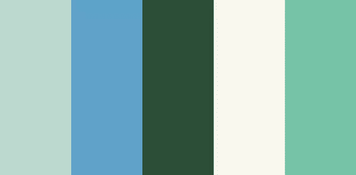

# 南方储蓄者案例研究，第二部分:颜色

> 原文：<https://www.sitepoint.com/southern-savers-case-study-part-ii-color/>

回到我们的设计案例研究，当我们在[第一部分](https://www.sitepoint.com/southern-savers-case-study-part-i-layout-and-composition/)中停止南方储蓄者时，Squared Eye 团队在重新设计方面取得了很大进展。他们经历了一个发现阶段，逐渐熟悉了网站、用户以及 Jenny 如何管理内容。他们参加了一个优惠券研讨会，进行了一些可用性测试，甚至在 Omnigraffle 中规划一些布局概念之前做了一些便签信息架构。现在是时候给这个项目增添一点色彩了。

为了做到这一点，Squared Eye 的马修·史密斯邀请了合作伙伴兼品牌专员安德鲁·拉莫斯(Andrew Ramos)来创建一个视觉品牌标识，并开始为南方储户制作印刷资产。“从一开始，”马修说，“我们都意识到南方储户可以使用更名。它缺乏清晰的视觉识别，但概念和业务非常强大，所以我们有很多工作要做。”要开始品牌化过程，他们需要知道什么颜色最适合这个设计。除了直接向珍妮询问她喜欢的颜色，安德鲁还为这个项目制作了一个**情绪板**。

如果你曾经看过关于室内或景观设计的电视节目，你可能会看到设计师向他们的客户展示一块板，上面有织物样品、家具图片和油漆颜色。这些演示帮助设计师衡量客户对设计决策的反应，然后再投入大量工作来创建更花哨、更耗时的视觉效果。这个过程在网页设计领域同样适用。下图显示了安德鲁为南方储户创建的情绪板中的一些图像。

 **美丽南方意象的心情板**

当你浏览上图的元素时，你会注意到有各种各样的颜色、纹理和字体。安德鲁的灵感，以及将所有这些缩略图联系在一起的概念，是关键词“南方”珍妮最喜欢的一些图片如下所示。

珍妮最喜欢的东西:儒勒·凡尔纳的封面、古董收银机和彩色动物

虽然 Jenny 没有特意挑选这些图片的颜色，但你会注意到贯穿所有三张图片的一个共同主题——蓝绿色！不管她是否知道，Jenny 用她的情绪板选择为她的网站的配色方案提供了一个基础。另外一种在这三张图片中都出现的颜色是橙红色。正如你从我们之前讨论过的“事物的方案”一节中所知道的，这本来可以成为一个漂亮的补色方案，但是 Andrew 和 Squared Eye 团队却选择了基于 Jenny 对蓝绿色的喜爱来构建一个补色调色板。他们从她挑选的*海底 20，000 里格*封面上摘下了一些果岭，它们起到了双重作用，提醒游客他们可以在网站上省钱。然后，他们将这些绿色与一些乳黄色搭配，并在类似色块的另一侧添加亮蓝色，作为强调色。下面最终的配色方案是有趣的，随意的，友好的。

 **南方储户新配色**

当我问珍妮她对颜色选择的看法时，她解释说，尽管她的访问者中很大一部分是女性，但她想避免网站看起来太女性化。“我希望每个人在使用这个网站时都感到舒适，”她说。从情感的角度来看，这种颜色的粉底是一个显而易见的选择。安德鲁说:“蓝色和绿色通常能唤起一种平静和随意的感觉。”。“这显然非常适合接近……南部储户，那里的人们可能会根据他们过去的优惠券惨败认为事情会变得复杂。”这个练习给了 Andrew 继续他的品牌工作所需的颜色灵感。这也增加了方形眼团队对该项目的了解深度。事实上，深度正是我们接下来要探索的。不，我不会读《海底两万里》；相反，我们要谈谈质地。

**note:**Want more?

这是五个案例研究中的第二个，摘自 SitePoint 的[《美丽网页设计的原则》，第二版](https://www.sitepoint.com/books/design2)。这本书涵盖了所有与网络相关的平面设计原理，并且以一种非设计人员也容易理解的方式呈现。

查看本系列的其他部分:

*   [第一部分:布局和构图](https://www.sitepoint.com/southern-savers-case-study-part-i-layout-and-composition/)
*   [第三部分:纹理](https://www.sitepoint.com/southern-savers-case-study-part-iii-texture/)
*   第四部分:字体设计
*   [第五部分:意象](https://www.sitepoint.com/southern-savers-case-study-part-v-imagery/)

## 分享这篇文章