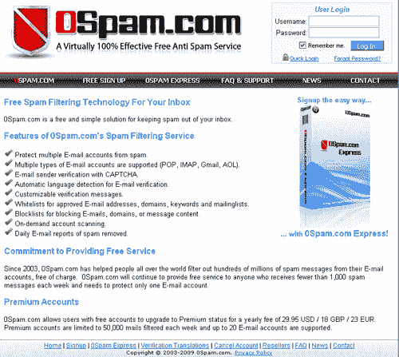
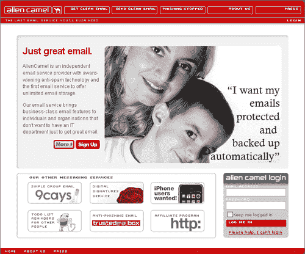
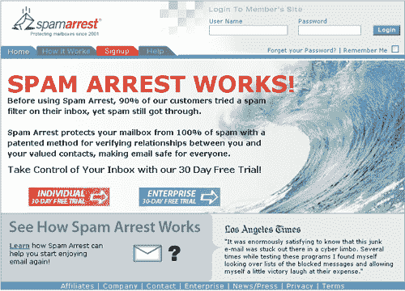
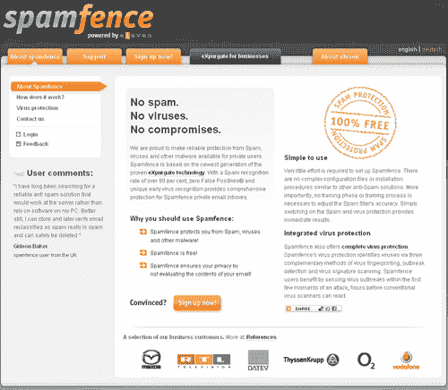
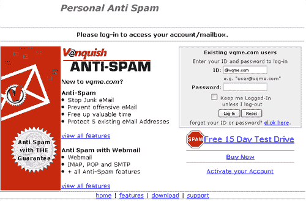
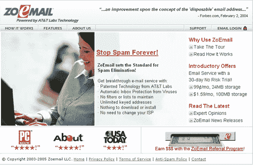
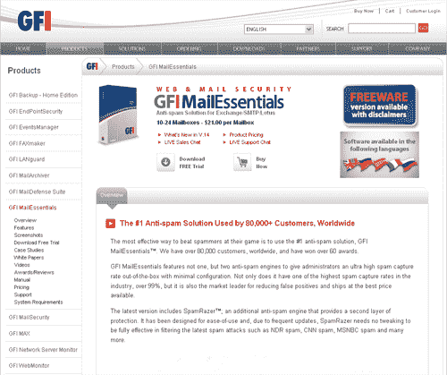
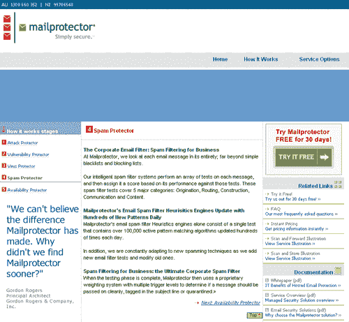
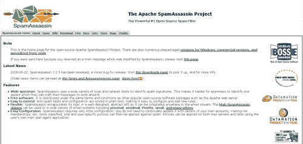
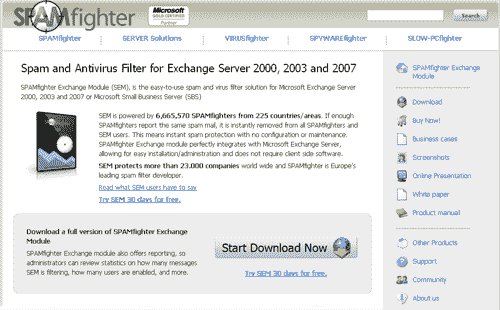

# 10 个绝妙的垃圾邮件过滤解决方案

> 原文：<https://www.sitepoint.com/spam-filtering-solutions/>

不管人们有多讨厌垃圾邮件，它似乎不会很快就消失。幸运的是，有很多方法可以阻止垃圾邮件离开你的服务器，或者如果你只是想在邮箱中阻止它，你也可以这样做。

我们收集了 10 个解决方案，可以让你创建一个没有垃圾邮件的收件箱，或者只是在服务器端阻止它。幸运的是，其中一些甚至是免费的！

## 反垃圾邮件解决方案

**[0 垃圾邮件](http://www.0spam.com/)**:0 垃圾邮件与 POP、IMAP、Gmail 和 AOL 合作，在你的电子邮件送达之前下载它，将垃圾邮件分类，然后将好的邮件送达给你。您可以使用验证码来验证发件人，为单个电子邮件或整个域设置白名单，自定义验证电子邮件，下载包含一周垃圾邮件的列表等等。这项服务对每周收到的垃圾邮件少于 1000 条的单个电子邮件帐户是免费的。如果您需要覆盖多个帐户或有比免费级别更多的垃圾邮件，您可以支付高级帐户。

:alien camel 提供 IMAP 和 POP 电子邮件选择，在其服务器上为您提供无限的电子邮件存储空间，并为您将电子邮件分类到“待定”和“垃圾邮件”文件夹中，以便您可以在下载到系统之前查看所有内容。这项服务适用于 Windows 和 Mac OS X 的大多数流行电子邮件客户端，他们目前也在测试一款 iPhone 应用程序。这项服务每月收费 8 美元，一年收费 80 美元。主要的缺点是它不能使用你现有的地址，但是它允许你即时创建一次性的电子邮件地址，这是一个很好的好处。

**[垃圾邮件拦截](http://www.spamarrest.com/)** :垃圾邮件拦截允许你为你的联系人建立一个白名单，但在此之后，每个给你发邮件的人都会收到一个自动验证码回复，他们必须回复才能通过他们的邮件联系到你。这只会发生在他们的第一封邮件上，所以他们不会再这样做了，但可能会让一些人很烦。所有的垃圾邮件都会在垃圾邮件拦截服务器上保存 7 天，这样你就可以查看是否有你想让其通过的邮件。该服务每月收费 5.95 美元，如果提前两年付费，折扣会越来越大。

**[spam fence](http://www.spamfence.net)**:spam fence 有点别扭，但是一个有趣的概念。您需要向邮件提供商提供两个电子邮件地址:邮件被发送到第一个地址，然后被传递到 Spamfence 以检查是否有病毒和垃圾邮件，然后被清除的电子邮件被发送到第二个地址，并添加了一个额外的标题来告诉您该电子邮件。这是一项免费服务，如果你有太多垃圾邮件要处理，值得一试。

**[Vanquish Anti-Spam](https://www.vqme.com/pk/index)**:虽然 Vanquish Anti-Spam 将覆盖你的 5 个电子邮件地址，并很好地隐藏了服务的成本，但它被列入这个列表更多的是因为它的古怪。如果垃圾邮件碰巧通过并浪费了您的时间，您可以向垃圾邮件发送者发送一份账单，为您的收件箱受到的入侵支付费用。这是如何执行的还不完全清楚，目前设定为每封邮件 0.05 美元，但这只是一个“在那里”的想法，你不得不笑。

**[ZoEmail](http://www.zoemail.com/index.php)** : ZoEmail 用“密钥”创建邮件地址(如“sean.key@zoemail.com”)，只允许用已知密钥发送的邮件进入。您可以创建密钥，供在线零售商、朋友等使用。成本极低，最小的邮箱每月只需 0.99 美元。

## 服务器端反垃圾邮件解决方案

**[GFI mail essentials](http://www.gfi.com/mes/?adv=733&loc=2)**:mail essentials 使用两个垃圾邮件检测引擎，试图降低误报率，确保电子邮件到达真正属于它的文件夹。该系统支持 Microsoft Exchange 2000、2003、2007 和 Lotus Domino，并根据您选择的标准提供大量黑名单和白名单。

**[【mail protector】](http://www.mailprotector.com.au/Australia/how_spam.aspx)**:mail protector 针对企业和公司用户，对每封电子邮件的发起、路由、构造、通信和内容进行测试，然后根据结果给它打分。测试失败，它将被发送到垃圾邮件文件夹。

SpamAssassin :由 Apache 基金会发布，SpamAssassin 是一个多功能的垃圾邮件过滤系统，可以放在电子邮件流的任何地方来完成它的工作。由于这一功能，它可以与大量的电子邮件设置，包括 Gmail。它可以在运行 Linux、Mac、Unix 或 Windows 的服务器上使用。

**[spam fighter](http://www.spamfighter.com/)**:spam fighter 是一个交换模块，它将与 Microsoft Exchange Server 2000、2003 和 2007 或 Microsoft Small Business Server(SBS)一起工作，在垃圾邮件交付之前清除您系统中的垃圾邮件。除了打击垃圾邮件，该系统还可以生成分析，向您显示它阻止了多少电子邮件，系统上有多少用户，等等。

## 分享这篇文章