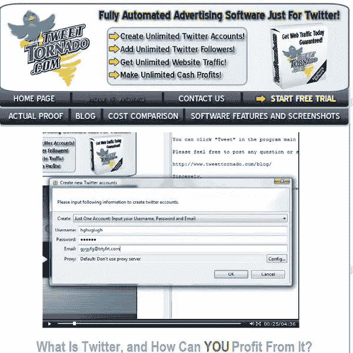
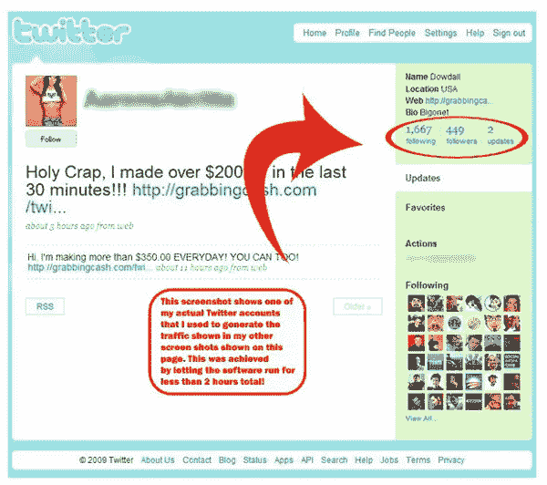

# 现在发送 Twitter 垃圾信息比以往任何时候都容易

> 原文：<https://www.sitepoint.com/spam-twitter/>

只要 150 美元的低价，你也可以随心所欲地发送 Twitter。一种名为 Tweet Tornado 的新软件工具允许其用户创建无限数量的 Twitter 账户，并做许多其他微博客的细节。正如我个人几天前发现 T2 一样，Twitter 的一个问题是它容易受到各种垃圾邮件的攻击。

这条最新的[新闻来自雅虎！在接下来的几周和几个月里，这可能会成为 Twitter 的一个大问题。Tweet Tornado，或者像](http://tech.yahoo.com/news/pcworld/20090205/tc_pcworld/newappletsspammerstargettwitter) [Magpie](http://www.ewriting.pamil-visions.com/2009/01/25/magpie-destroy-twitter/) (由 SitePoint 的 Mihaela Lica 解释)这样的程序，实际上可以在更糟糕的情况下使整个平台变得无用。

如何视频展示表格填写

##### 推特不在堪萨斯

ZDNet [的 Dancho Danchev 早些时候报道了该工具的发布。独立安全顾问 Danchev 建议 Twitter 开始要求注册时使用有效的电子邮件地址，这似乎是最合理的解决方案。Tweet Tornado 利用了这个漏洞，允许其用户创建几乎无限的虚拟账户，并且每个账户都有可能拥有无限的追随者。由此产生的消息或推文显然代表了垃圾邮件的几何级数。](http://blogs.zdnet.com/security/?p=2477)

由丹赫夫发现的 Tweet Tornado 的概念简介的证明[已经被停用，但正如你在 TT 网站的屏幕上看到的，虚构的所有者有一个明显的追随者。其他 TT 网站的屏幕显示了开发者的厚颜无耻，以及他们的工具可以多么容易地扩散 Twitter。从与 Adwords 比较到展示实际的带宽增长，Tweet Tornado 毫不掩饰他们在做什么。如果垃圾邮件发送者得逞，Twitter 用户可能很快就会点击他们的脚跟并高呼口号；“没有一个地方像](https://twitter.com/AarensAbritta)[斋谷](http://jaiku.com/)一样。”

Tweet Tornado 上的证据简介

##### 结论

公然无视用户、社区甚至一个网站的 TOS 现在似乎是几乎被接受的行为。社交网络如何在这些和其他压力下生存？如果用户体验显著下降，许多人不会这么做。Twitter 是一个有趣的案例研究，不仅研究了人们想要什么，还可能作为一种新型营销的载体。

有一点是肯定的，用垃圾推销术让小鸟陷入困境最终会疏远甚至是最虔诚的用户。我敢打赌，Twitter 只是在等待时机，允许一定程度的这种胡说八道，直到他们关闭闸门，给他们的数百万用户贴上价格标签。我希望每个享受服务的人都是这样。

**作者注:**我故意没有包含 Tweet Tornado 网站的链接。对于那些需要自己去看的人，或者无耻的商人来说，用简单的谷歌搜索就不难找到。

## 分享这篇文章