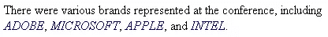

# span (HTML 元素)

> 原文：<https://www.sitepoint.com/span-html-element/>

### 描述

对于一个不提供内部内容的语义信息，也不提供样式变化或任何其他视觉变化的元素来说，低级 span 元素是 HTML 工具箱中最有用的元素之一。

当您用开始`<span>`和结束`</span>`包装文本时，您只是提供了一个钩子——一个允许您添加样式(通过添加一个`class`属性并使用 CSS 定义该类的外观)或通过 JavaScript 和文档对象模型(DOM)与元素交互的钩子。

在此处显示的示例中，作者决定所有品牌名称都应归类为“brandname ”,并通过 CSS 以斜体大写字母进行不同的样式化，如下图所示。



通过 span 元素设计的公司名称

span 是一个行内元素，并且只能包含文本内容或嵌套的行内或短语元素。它不应该用于包围块级元素——这种用法在内容管理系统中很常见，内容管理系统试图通过在元素周围添加 span 来对几乎所有元素应用样式。

span 与 div 元素密切相关，div 元素是块级通用容器，而 span 是内联通用容器。

需要注意的是:人们疯狂使用扳手并不是没有听说过，到处都是。span-itis 是一种不好的做法——它就像一剂 div-itis 一样糟糕。一定要检查您是否恰当地使用了 span 元素。例如，如果您发现自己应用了这样的跨度，您就有麻烦了:

```
He said it was *<span class="important">really</span>* important
    to know the difference.
```

很明显，在上面的例子中，em 元素更合适，因为它在所有浏览器中都意味着强调。另一方面，如果没有 CSS 样式，将毫无意义。

### 例子

下面是一个用于 CSS 样式化
目的的`span`元素的例子:

```
.brandname {font-style:italic;color:#006;text-transform:uppercase;}

⋮
<p>There were various brands represented at the
    conference, including *<span class="brandname">Adobe</span>*,
    *<span class="brandname">Microsoft</span>*, *<span
    class="brandname">Apple</span>*, and *<span
    class="brandname">Intel</span>*.</p>

```

## 分享这篇文章