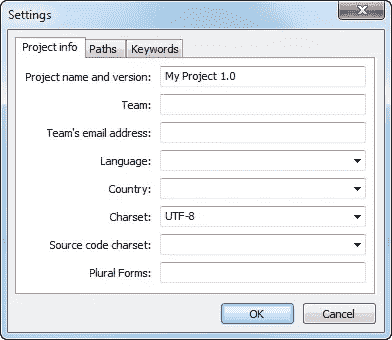
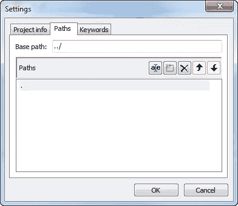
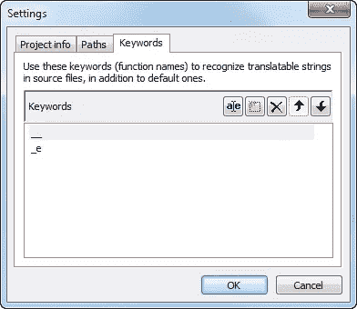
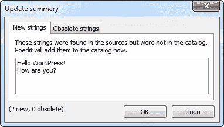
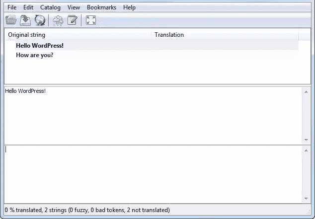
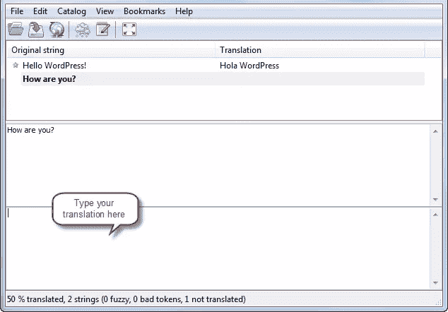

# 请用我的语言！–翻译 WordPress 主题和插件

> 原文[https://www.sitepoint.com/in-my-language-please/](https://www.sitepoint.com/in-my-language-please/)

全世界有数百万人访问 WordPress 支持的网站。对他们中的许多人来说，英语不是他们的母语，这使得使用这些网站更加困难。幸运的是，这个问题可以通过向用户提供翻译来轻松解决。

WordPress 本身被翻译成多种语言，人们可以用他们喜欢的语言使用它。但是主题、插件和其他前端定制就不是这样了。每个主题或插件开发者都有责任为自己的工作添加翻译支持。虽然给主题或插件添加翻译不是必须的，而且需要一些额外的工作，但从长远来看，这是一个很大的优势。翻译你的主题或插件是一个双赢的局面，双方都受益。你受益于有更多的人使用你的主题或插件，用户受益于用他们的语言使用主题或插件。

这篇文章的目的是向你展示如何使用国际化和本地化的方法正确地翻译任何主题或插件。简而言之，国际化(i18n)处理确保文本字符串被包装在特定的函数调用中。它是使文本为本地化做好准备的实践，而本地化(L10n)本身是翻译特定区域的文本的过程。WordPress 通过检查特定的翻译文件，然后执行翻译来处理本地化过程。这听起来很容易，所以让我们来看看。

## 入门指南

你需要做的第一件事是决定在哪里存储翻译。许多主题和插件将翻译文件放在根目录中。虽然使用这种方法可以进行翻译，但是可能会有点混乱，尤其是当您有多种语言的翻译文件时。对于最有组织的系统，最好在你的主题或插件文件夹中创建一个名为语言的子目录。当你发布你的主题或插件时，你可以将默认的翻译文件保存在这个目录中，当翻译人员发送翻译文件给你时，你只需将这些文件放在这个目录中。

翻译过程包括三个步骤。让你的主题或插件可翻译的第一步是使用一个特殊的功能，告诉 WordPress 加载一个用户语言的翻译文件。对于主题翻译，您可以将此函数调用放在主题的 functions.php 文件中:

```
<?php
$domain = "myplugin";
$path = "myplugin/languages/";
load_theme_textdomain($domain, $path);
```

`$domain`是一个唯一的字符串，用于标识主题中已准备好进行翻译的文本。出于组织的目的，您应该赋予它与主题目录名称相同的值。`$path`是主题中翻译文件的路径。

这是另一个例子，这个例子来自 WordPress 默认的 twentyeleven 主题的`functions.php`文件:

```
<?php
load_theme_textdomain( 'twentyeleven', TEMPLATEPATH.'/languages' );

$locale = get_locale();
$locale_file = TEMPLATEPATH."/languages/$locale.php";
if ( is_readable( $locale_file ) )
require_once( $locale_file );
```

这里，“twentyeleven”是匹配主题目录名称的域。您可以使用任何您想要的，但这被认为是最佳做法。在第二个参数中，使用了`TEMPLATEPATH`常量来获取主题的根目录，然后将“/languages”字符串连接到它，以给出文件的正确路径。剩下的代码告诉 WordPress 从 languages 文件夹中获取翻译文件。

在插件的情况下，所使用的函数是相似的，但是需要三个参数:

```
<?php
load_plugin_textdomain($domain, $abs_rel_path, $plugin_rel_path);
```

`$abs_rel_path`实际上是一个不推荐使用的参数，所以只需将其设置为 false 或 null。`$plugin_rel_path`是翻译文件的相对路径。你应该把这个放在你的插件文件里，而不是`functions.php`:

```
<?php
add_action("init", "pluginname_init");

function pluginname_init() {
   load_plugin_textdomain("myplugin", false, "myplugin/languages/");
}
```

## 使用本地化功能

接下来，您需要定义哪些文本字符串将被翻译。这是通过用识别您想要的本地化类型的函数包装您的文本内容来实现的。很多本地化功能都是可用的，但事实上只有两个是你经常使用的。

第一个函数使您的文本准备好进行翻译，并返回供 PHP 使用。这里有两个例子:

```
<?php
$text = "Hello World!";
$domain = "myplugin";
__($text, $domain); // begins with double underscore
```

```
<?php
edit_post_link(__("Edit", "twentyeleven"), '<span class="edit-link">', "</span>");
```

`__()`函数将一个文本字符串作为参数，在提供的翻译文件中查找`$text`的翻译版本并返回结果(如果有)。它用于控制 PHP 标签中已经包含的文本的显示。如果不存在除英语以外的本地化文件，那么文本将保持不变。`$domain`变量的值使 WordPress 能够将其识别为你的主题或插件翻译文件的一部分。

您将使用的第二个功能使您的文本准备好进行翻译，并直接打印到浏览器。它采用与您刚才看到的相同的参数:

```
<?php
_e($text, $domain);
```

`_e()`函数寻找`$text`的翻译版本，并将结果回显到屏幕上。这应该用于将在屏幕上显示的标题和标题，它们还没有包含在 PHP 标签中。

在某些情况下，您可能希望在运行时使用占位符将动态信息插入文本字符串。占位符很有用，因为它们使您能够翻译字符串而不会将它们分开。然而，WordPress 中的翻译函数不能自己输出占位符，所以你需要使用合适的 PHP 函数，比如`printf()`或`sprintf()`。

```
<?php
printf(__("About %s", "twentyeleven"), get_the_author());
```

这里，`get_the_author()`函数返回用`printf()`替换占位符的作者。

有时，您需要在一个文本字符串中包含多个占位符。幸运的是，`printf()`和`sprintf()`都很好地处理了这个问题。最好使用带编号的占位符，因为一种语言中的单词顺序在另一种语言中可能不同。

```
<?php
$site_name = get_bloginfo("name");
$comments_count = wp_count_comments();
$mod_comments = $comments_count->moderated
$appr_comments = $comments_count->approved
$all_comments = $comments_count->total_comments

printf(__('There are %3$s comments on %4$s. %2$s approved and %1$s in moderation.', $domain), $mod_comments, $appr_comments, $all_comments, $site_name);
```

## 创建翻译文件

现在你的主题或插件文件已经正确国际化，你需要创建翻译文件，WordPress 将使用这些文件来查找翻译。

您需要创建的第一个文件是 POT(可移植对象模板)文件。POT 文件列出了您的应用程序中可以找到的所有可翻译的文本字符串，并作为单个 PO 文件的模板。PO(可移植对象)文件是将文本字符串映射到实际翻译的文件。翻译人员使用该文件提供翻译。POT 和 PO 文件不是运行插件翻译所必需的，但是最好将其与插件下载包在一起，供其他用户使用，他们可能希望更新翻译以满足他们的需求。最后，PO 文件被编译成阿莫(机器对象)文件，这是一个完成的翻译文件，WordPress 用它来翻译你的主题或插件的国际化文本字符串。

当翻译者创建你的主题或插件的翻译时，他们使用你的 POT 文件创建两个文件，主题的`*$locale*.po`和`*$locale*.mo`，插件的`*pluginname-$locale*.po`和`*pluginname-$locale*.mo`。`*$locale*`在这里表示由 GNU gettext 框架指定的一种[语言](http://www.gnu.org/software/gettext/manual/html_node/Usual-Language-Codes.html#Usual-Language-Codes)和一种[国家](http://www.gnu.org/software/gettext/manual/html_node/Country-Codes.html#Country-Codes)代码的组合——你可以在 gettext 手册中看到语言和国家缩写。例如，WordPress 使用“en_US”作为它的默认区域设置。“en”代表英语，US 代表国家/方言。

各种翻译工具都是开源的，可以免费下载。然而，最常用的工具之一是简单易用的 [Poedit](http://www.poedit.net/) 。以下是使用 Poedit 创建 POT 文件的步骤:

选择`File` > `New Catalog`。将出现一个带有三个选项卡的设置框。在项目信息选项卡中，填写与您的插件相关的输入框，将字符集框保留为 UTF-8。



在路径选项卡中，将基本路径更改为`../`，如果你将翻译放在插件的`languages`文件夹中，则添加一个额外的路径`.`。如果没有，则保留默认值。



在“关键词”标签中，输入您在上面学到的函数作为关键词。



点击确定，将文件保存为`languages`目录中的`*themename*.po`或`*pluginname*.po`。Poedit 将扫描你的 PHP 文件，搜索`__()`和`_e()`包装的字符串，并自动在一个对话框中输出它们。



单击确定。现在你会看到一个有你的线的窗口。



再次保存文件并关闭它。在您的`languages`目录中，您现在将看到由 Poedit 生成的 PO 和 MO 文件。删除 MO 文件，并用扩展名`.pot`重命名 PO 文件。就是这样。现在你的主题或者插件已经可以翻译了。

如果你有所需的技能，你可以更进一步，使你的文件实际翻译。要做，选择`File` > `New catalog from POT file`。找到 POT 文件，打开它，然后单击 OK 进行后续的目录设置(它们与您自己设置的完全相同)。Poedit 将询问您希望将新的 PO 文件保存为什么——给它一个合适的名称，例如`es_ES.po`或`*pluginname*-es_ES.po`,并将其保存在`languages`目录中。

现在只需在 Poedit 中点击你想要翻译的字符串，并在 Poedit 窗口底部的框中键入翻译。



为了看到你的主题或插件被翻译，你需要做的最后一件事是在`wp-config.php`文件中设置你的语言环境。这告诉 WordPress 寻找该地区的任何翻译并加载它们。如果你将你的语言环境设置为 es_ES(西班牙语)，WordPress 会加载一个名为`es_ES.mo`的主题文件，或者一个名为`*pluginname*-es_ES.mo`的插件文件。

```
<?php
define('WPLANG', ''); // this is default for a fresh WordPress installation
define('WPLANG', 'es_ES') // set the second parameter to your locale
```

## 摘要

正如你所看到的，WordPress 主题和插件的翻译是一个非常简单的过程。不需要成为 PHP 大师；这只是按照逻辑顺序执行几个简单步骤的问题。现在，当你对这些步骤有了很好的理解，我希望你将这些知识应用到你现有的或未来的主题或插件项目中，从而让 WordPress 用户能够以一种他们自然的语言使用他们喜欢的发布平台。

<small>图片 via[iQoncept](http://www.shutterstock.com/gallery-248635p1.html)/[Shutterstock](http://www.shutterstock.com)</small>

## 分享这篇文章