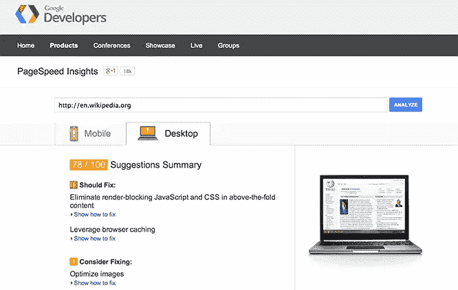
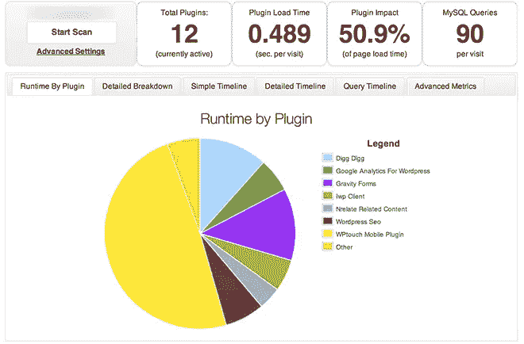
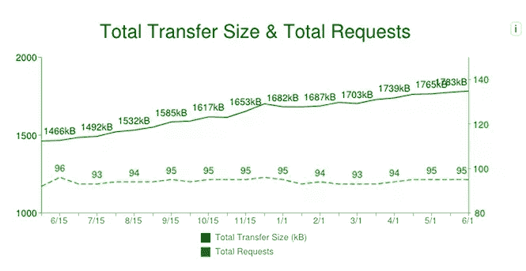
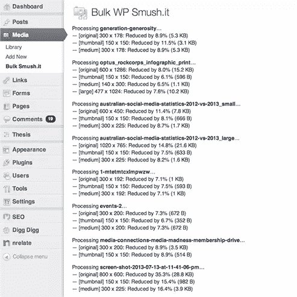

# 加速你的 WordPress 站点

> 原文：<https://www.sitepoint.com/speed-wordpress/>

*本文由 [GoDaddy](http://www.godaddy.com/hosting/wordpress-hosting.aspx?isc=sitepartwp&utm_campaign=1_mwp_article&utm_source=sitepoint&utm_medium=Other+Online&utm_content=sitepartwp&cvosrc=display.sitepoint.wordpress_article) 赞助。感谢您支持使 SitePoint 成为可能的公司！*

作为最重要的用户体验因素之一，网站性能比以往任何时候都更加重要。随着越来越多的访问者通过智能手机和平板电脑访问网络，移动设备上的网站速度和性能尤为重要。

虽然 WordPress 很容易建立和运行，但是让你的网站快速运行需要更多的工作，并且是一个持续的过程。在这篇文章中，我们将讨论为什么速度很重要，并提供一些如何提高 WordPress 速度的实用建议。

提高性能需要大量的试验和错误，但它非常有趣！

## 为什么网站速度很重要

第一印象很重要。速度更快的网站有很多好处，但主要有三点:

### 1)更好的用户体验

这是有据可查的:人们喜欢快网站，鄙视慢网站。所以，如果你关心你的用户，你应该关心你的网站的速度。缓慢的网站加载时间是导致网站废弃的最大因素之一。[根据 KISSmetrics](http://blog.kissmetrics.com/loading-time/) 的数据，47%的消费者希望网页能在两秒内加载。如果没有，他们就不太可能留下来。

### 2)改进的搜索引擎排名

Google 多年前就暗示过站点速度对搜索排名的重要性，2010 年[宣布站点速度是一个排名因素](http://googlewebmastercentral.blogspot.com.au/2010/04/using-site-speed-in-web-search-ranking.html)。一晃四年过去了，谷歌对速度的痴迷与日俱增。谷歌现在领导着一个名为[让网络更快](https://developers.google.com/speed/)的项目，提供广泛的工具和资源，旨在帮助开发者和网站管理员建立更快的网站。

雅虎！也是一个更快的网络的长期倡导者，并在 Yahoo！开发者网络。

### 3)更高的转化率

关于网站速度对公司底线的影响，已经有了大量的研究。最广为人知的统计数据来自亚马逊，它报告说页面速度每提高 100 毫秒，收入就会增加 1%。

类似地， [Mozilla 公布的数据](https://blog.mozilla.org/metrics/2010/04/05/firefox-page-load-speed-%E2%80%93-part-ii/)显示 Firefox 下载量增加了 15.4%，这是平均页面加载时间减少 2.2 秒的直接结果。

## 运行自己的网站速度测试

在对你的网站做任何改变之前，最好进行一次网页速度测试，以建立一个基线。有很多速度测试工具可用，从 web 服务到浏览器扩展。最受欢迎的工具包括:

*   [谷歌页面速度洞察](https://developers.google.com/speed/pagespeed/insights/)
*   [WebPagetest.org](http://www.webpagetest.org/)
*   [Pingdom 网站速度测试](http://tools.pingdom.com/fpt/)
*   [YSlow 浏览器扩展](https://developer.yahoo.com/yslow/)

所有这些工具都有相似的特性，给你测量和分数，以及建议改进的地方。PageSpeed Insights 还为您提供移动统计数据。

### 审查 WordPress 性能问题

除了标准的页面速度测试，你可能想仔细看看 WordPress 本身。一旦您获得了关于站点性能的可靠基线数据并发现了任何问题，您就可以尝试隔离问题。这可以通过禁用或启用插件、激活不同的主题或注释掉自定义代码来实现。或者，使用下面的工具来分析 WordPress 特定的性能。

*   [P3(插件性能分析器)](https://wordpress.org/plugins/p3-profiler/)
*   新遗迹

P3 是一个非常方便的 WordPress 插件，它提供了插件对加载时间影响的详细分析。这是诊断潜在问题和识别资源消耗者的非常简单的方法。

NewRelic 还提供了对 web 应用程序性能的深入分析。如果你正在运行自己的服务器，并且在应用程序方面需要更大的可见性，那么研究 NewRelic 吧。

## WordPress 性能因素

影响网站速度的因素很多，包括域名系统、主机、服务器资源和配置，以及主题、插件甚至内容。

### 您的主机提供商或服务器配置

说到主机，便宜并不总是更好。如果你对你网站的性能很认真，确保你选择了正确的主机提供商。如果您更喜欢动手操作的方法，有大量的指南可以帮助您构建自己的优化服务器。否则，有许多托管服务可用。

请记住，如果你使用资源饥渴的插件，WordPress 达到内存极限并不罕见，尤其是在共享主机上。如果您正在管理自己的服务器，那么服务器级优化非常值得探索。

### 专门的 WordPress 托管

在过去的几年里，托管 WordPress 已经有了长足的进步。一些最大的玩家，如 [GoDaddy](http://www.godaddy.com/hosting/wordpress-hosting.aspx?isc=sitepartwp&utm_campaign=1_mwp_article&utm_source=sitepoint&utm_medium=Other+Online&utm_content=sitepartwp&cvosrc=display.sitepoint.wordpress_article) ，提供 WordPress 优化的主机服务，包括每日备份、自动核心更新、垃圾评论过滤、内置缓存、DDoS 保护和恶意软件扫描。

很长一段时间以来，一个流行的神话占据了上风:共享主机不值得一看。但是，实际上，这确实取决于您选择的主机。一些现代主机公司专门构建主机平台以获得最佳性能。因此，大多数主机平台速度很快，可以处理数量惊人的流量。在锁定共享托管平台之前，一定要做好自己的研究和测试。你可能想从 Tech Void 最近对 WordPress 托管平台的比较开始(查看[ReviewSignal.com](http://reviewsignal.com/blog/2014/03/26/managed-wordpress-hosting-showdown-performance-benchmarks/)的原始基准)。

还有几个托管的 WordPress 托管服务，包括:

*   [媒体神殿](http://mediatemple.net/webhosting/wordpress/)
*   [WP 引擎](http://wpengine.com/)
*   [华丽地](https://pagely.com/)
*   [合成](http://websynthesis.com/)
*   [WordPress.com VIP](http://vip.wordpress.com/)
*   [金斯塔](http://kinsta.com)

### 主题的选择

选择正确的主题对你的 WordPress 站点的速度起着重要的作用。高质量的主题不在于它看起来如何；而是它的构建有多好，符合 WordPress 主题开发标准有多好。寻找积极开发的、支持良好的主题。

一个具有可靠功能的主题也是非常重要的，因为这将减少对插件的需求(很好地引导我们进入下一个要点)。

WPMU Dev 整理了一份速度最快的 10 个 WordPress 主题的列表。

### 插件数量

在撰写本文时，WordPress 插件目录中有 31，539 个插件，下载次数为 672，957，182 次。如果你是一个 WordPress 开发者或用户，正在寻找特定的网站功能，这是很棒的，但是有一种诱惑，就是再安装一个插件。

构建良好的 WordPress 网站通常安装了最少的插件。虽然包含所有的附加功能很有诱惑力，但是问问自己安装这个额外的插件是否重要。记住，WordPress 的开箱即用是非常强大的。不需要几十个插件。所以，如果有疑问，就不要安装！

### 插件的类型

当你选择一个插件时，多花几分钟时间研究一下最佳选项。WordPress 插件目录显示了一些有用的信息，旨在使选择过程更容易:

*   星级评定(从 0-5 颗星)
*   如果插件两年没有更新，会发出通知
*   下载次数
*   链接到支持论坛
*   用户反馈

只安装最高质量的插件:那些评级高、下载量大、积极开发和支持的插件。

### 保持你的网站干净整洁

良好的内务管理可提高整体现场绩效；始终运行更新并修复任何断开的链接。定期监控您的 web 服务器错误日志也非常重要。

评论垃圾邮件是一种常见的黑帽 SEO 策略。机器人抓取网站，接受评论，然后发布垃圾链接，以获得 SEO 好处。除非你能做到这一点，否则你的网站会不断受到僵尸程序的攻击，很快耗尽你的服务器资源。网站成为垃圾评论的牺牲品，积累成千上万的评论，这并不罕见。

答案是:如果你不需要评论，就禁用它们，如果你需要，就使用 Akismet 插件(默认设置)或服务来帮助管理垃圾邮件。

如果您的网站已经受到垃圾评论的攻击，有几个插件可以帮助您回到正轨，包括:

*   [删除所有评论](https://wordpress.org/plugins/delete-all-comments/)
*   WP 数据库管理器
*   [WP 优化](http://wordpress.org/plugins/wp-optimize/)

### 缩小和合并资产

JavaScript、CSS 和网页字体给了我们一个更好看、更有用的网页，但是它们也增加了网页的重量。正如您在下面的图表中从 [HTTP Archive](http://httparchive.org/trends.php#bytesTotal&reqTotal) 看到的，从 2013 年 6 月到 2014 年 6 月，所有响应的平均传输大小增加了，而请求的数量保持不变。

缩小是从 HTML、CSS 和 JavaScript 文件中去除空白的过程。它减小了需要下载的文件的大小。

文件也可以合并，减少了加载过程中站点向服务器发出的请求数量。结果是:更快的加载时间。在 WordPress 中有很多缩小和合并资产的选项，包括:

*   [更好的](http://wordpress.org/plugins/bwp-minify/)
*   [自动优化](http://wordpress.org/plugins/autoptimize/)

### 图像压缩

高质量的内容总是让你的网站与众不同，但是你需要确保这些内容是以合适的格式并且是压缩的(如果可能的话)。

有一些方便的插件可以压缩媒体库中现有的和新的图像:

*   [WP Smush.it](http://wordpress.org/plugins/wp-smushit/)
*   [批量调整媒体大小](https://wordpress.org/plugins/bulk-resize-media/)
*   [北海巨妖图像优化器](http://wordpress.org/plugins/kraken-image-optimizer/)
*   [EWWW 图像优化器](https://wordpress.org/plugins/ewww-image-optimizer/)

大多数压缩插件仅适用于媒体库中的文件。因此，请确保媒体库之外的任何内容都被手动压缩。如果你使用了大量的图标，为了减少请求，可以考虑使用精灵或者图标字体。

无限滚动/延迟加载和预加载技术也能给人速度的错觉，如果你在运行一个图像密集型网站，这是值得研究的。

### 贮藏

缓存可以极大地缩短网站的加载时间，并且可以通过安装缓存插件来轻松实现。

WordPress 缓存插件生成静态 HTML 文件，然后提供给访问者，而不是执行 PHP 和进行数据库调用。它们还支持其他优化选项，如压缩和预加载。缓存也有助于你的网站处理更大的流量。有相当多的专用缓存插件，最流行的有:

*   [WP 超级缓存](https://wordpress.org/plugins/wp-super-cache/)
*   [W3 总缓存](https://wordpress.org/plugins/w3-total-cache/)
*   [WP 火箭](http://wp-rocket.me/)

同样值得一提的是，甚至像 WordFence [这样的安全插件现在也包含了缓存功能](http://www.wordfence.com/blog/2014/04/wordfence-5-with-falcon-engine-released/)。

您可以使用以下工具在您的站点上模拟负载并测量性能:

*   [ab Apache HTTP 服务器基准测试工具](http://httpd.apache.org/docs/2.2/programs/ab.html)
*   [blitz.io](https://www.blitz.io)
*   [loader.io](https://loader.io)

使用 **ab** 发出 100 个请求(5 个并发连接)的简单测试如下所示:

`$ ab -n 100 -c 5 http://example.com/`

### 内容交付网络(cdn)

如果您的网站获得了合理的流量，并且您正在考虑在网站性能方面采取下一步措施，那么内容交付网络(CDN)可能就是您的不二之选。

cdn 在 web 上的多个点存储静态资产，如图像、CSS 和 JavaScript 文件，通常位于比 web 服务器更靠近网站访问者的地理位置。历史上，cdn 非常昂贵，但现在它们非常实惠，如果你有大量或全球受众，或大量静态资产，那么它们值得额外收益。流行的 cdn 包括:

*   [MaxCDN](http://www.maxcdn.com/)
*   [CloudFlare](https://www.cloudflare.com/)
*   [亚马逊 CloudFront](http://aws.amazon.com/cloudfront/)

配置 WordPress 使用 CDN 非常容易；你的缓存插件会有一个区域让你输入你的账户信息。

## 结论

正如你所看到的，有很多因素会影响网站的性能。性能调整是一个持续的监控和改进过程；不断地测试和衡量是至关重要的。

概括一下:

*   选择优质主机
*   选择高质量的主题和插件
*   运行速度测试并确定性能问题
*   尽量减少插件的数量
*   压缩、缩小和合并
*   保持你的网站精简
*   使用缓存和 cdn

如果你想了解更多关于网络性能的信息，看看 [Planet Performance](http://www.perfplanet.com/) 和官方 [WordPress Codex 页面上的 WordPress 优化](http://codex.wordpress.org/WordPress_Optimization)。

*这篇文章在[网上也有韩语版本，实际上是](http://www.webactually.co.kr/archives/12397)*

## 分享这篇文章