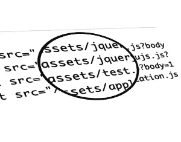

# 分割的链轮:资产标签

> 原文：<https://www.sitepoint.com/sprockets-dissected-asset-tags/>



Rails 是一个受欢迎的 Ruby web 框架，也是构建 web 应用程序的流行选择。它有许多令人惊叹的部分，其中许多可以独立于 Rails 使用。例如，ActiveSupport 可以在任何 Ruby 项目中使用，以获得 Rails core 提供的一些优秀特性。ActiveRecord 是一个独立的 ORM，提供了一种用单一代码库处理不同数据库的良好方式。

Rails 的另一个组件在 Rails 之外被广泛使用:资产管道，或者从技术上来说，链轮。链轮是由 Sam Stephenson 开发的 Ruby gem，它为资产编译、资产缩减、资产服务等提供支持。在本文中，我们将讨论 Rails 如何使用链轮服务资产。

我建议在继续之前阅读[资产预编译如何工作，第一部分](https://www.sitepoint.com/asset-precompile-works-part/)和[资产预编译如何工作，第二部分](https://www.sitepoint.com/asset-precompile-works-part-ii/)。这里使用的许多概念在那些文章中都有详细的讨论。

*本文基于`Rails 3.2.17`和`Sprockets 2.2.2`。如果你还没有安装`Rails 3.2.17`，请先安装。*

让我们来回答以下与 Rails 资产相关的问题:

*   如何插入资产标签？
*   什么是`/assets`及其目的？
*   `ActionDispatch::Static`中间件是用来做什么的？

### 如何插入资产标签？

为资产提供服务的第一步是拥有适当的资产标签(JavaScript 标签、样式表标签、图像标签等)。)在发送给客户端的 HTML 响应中。如果 HTML 中没有资产标签，那么我们就没有使用/链接任何外部库，这在今天是相当忌讳的。我们的站点中至少需要一个样式表标签、一个 JavaScript 标签和一些图像标签。让我们看看如何将 JavaScript 标签插入到典型 Rails 应用程序生成的 HTML 响应中。

源代码路径在本地和网上都有提及。这里有两个感兴趣的文件夹，可以在 Rails 应用程序中使用以下命令发现:

```
bundle show actionpack

bundle show sprockets
```

使用您的编辑器打开这些库，这样您就可以跟踪源代码。

在 Rails 中插入 JavaScript 资产标签的默认方式是:

```
<%= javascript_include_tag "application.js" %>
```

从 Rails 3.1 开始，默认的`application.js`可能是这样的:

```
//= require jquery
//= require jquery_ujs
//= require_tree .
```

Rails 开发人员知道，他们可以通过使用链轮[特殊语法](https://github.com/sstephenson/sprockets#the-directive-processor)来定义任何 JavaScript 文件的依赖关系，插入的附加文件实际上是`application.js`的依赖关系。

`javascript_include_tag`是这里定义的的一个 Rails 助手。默认的 Rails 助手在`actionpack/lib/action_view/helpers`目录中定义，`javascript_include_tag`也不例外。但是这种方法只能将脚本标记添加到 HTML 响应中，而不能智能地解析文件来解决依赖性。解决资产依赖性是由链轮处理的。

链轮根据`actionpack/lib/sprockets/railtie.rb`中的轨道环境进行配置。 [Railtie](http://api.rubyonrails.org/classes/Rails/Railtie.html) 是 Rails 框架的核心，它提供了几个钩子来扩展 Rails 和/或修改初始化过程。如果我们想在初始化过程中或之后的任何时候修改 Rails 的行为，我们可以使用`Railtie`。

链轮[通过在`action_view`加载后包含`Sprockets::Helpers::RailsHelper`模块来扩展](https://github.com/rails/rails/blob/v3.2.17/actionpack/lib/sprockets/railtie.rb#L46)轨道的行为。这意味着新添加的模块将覆盖已经在`action_view`下的模块中定义的同名方法。

现在是时候做一个小实验了。创建一个带有控制器的新 Rails 应用程序，并设置其路由。

```
# creates a new rails application
rails new rails_asset_serve

# navigate to newly created rails directory
cd rails_asset_serve

# create a new controller named test with one method index
rails generate controller test index
```

继续编辑`app/views/test/index.html.erb`并在那里添加一些虚拟文本。现在编辑`config/routes.rb`并添加以下行，以便从浏览器访问`test`控制器。

```
root :to => 'test#index'
```

运行 Rails 服务器，导航到`localhost:3000`，您将看到您想要的输出。但是，我们的兴趣点是这个页面的来源。查看源代码，您会看到 HTML 响应中包含以下 JavaScript 标记。

```
<script src="/assets/jquery.js?body=1" type="text/javascript"></script>
<script src="/assets/jquery_ujs.js?body=1" type="text/javascript"></script>
<script src="/assets/test.js?body=1" type="text/javascript"></script>
<script src="/assets/application.js?body=1" type="text/javascript"></script>
```

这些 JavaScript 文件是`application.js`的依赖项，如上所述。现在是有趣的部分。注释掉`actionpack/lib/sprockets/railtie.rb:46`并重启你的服务器。

这一次，当您访问页面时，您将看不到任何输出差异，除非您查看源代码。这里，注意只有一个 JavaScript 标签指向`application.js`。这是因为默认的 Rails 助手不是智能的，因此跳过了依赖项。链轮足够智能，可以解析依赖关系，从而链接到我们所有的 JS 源文件。

让我们看看`Sprockets`是如何表演这个魔术的。

*别忘了取消注释`actionpack/lib/sprockets/railtie.rb:46`*

#### 旅程开始了

我们以`application.js`为例。在`line:7`的`actionpack/lib/sprockets/helpers/rails_helper.rb`中，你可以看到`Sprockets::Helpers::RailsHelper`模块已经包含了`ActionView::Helpers::AssetTagHelper`模块。`ActionView::Helpers::AssetTagHelper`是保存默认 Rails 助手的主模块。通过将它们包含在自己的模块中，链轮确保它仍然可以访问所有默认的 Rails 助手。

在`line:20`上你可以看到`javascript_include_tag`被定义。当我们想要包含一个 JavaScript 资产时，就会调用这个方法。在`line:26`上有一个名为`collect`的枚举器，它返回一个分开的脚本标签数组。在我们的例子中，`sources`将指向`application.js`。

在`line:27`上，您可以看到一条`if`语句。如果我们在`development`环境中，那么`debug`评估为`true`。另一部分(`asset = asset_paths.asset_for(source, 'js')`)有点意思。如果你读过我上面提到的那两篇推荐文章，那么你会很容易明白发生了什么。

`assets_paths`是在`line:9`定义的方法，它返回在`line:117`定义的类`AssetPaths`的实例。那个方法里有一堆作业，但是我们感兴趣的是关于`line:12`的。

`asset_environment`是一个方法，其结果被赋给`paths.asset_environment`。`asset_environment`定义在`line:113`。这个方法返回的是`Rails.application.assets`，它是`Sprockets::Environment`的一个实例，负责与链轮下的资产相关的所有事情的顶级类。

在`line:122`处的`asset_for`，是一个实例方法，被调用以获得所需的资产。`asset_environment[source][/source]`负责返回一个指向所需资产的`Sprockets::BundledAsset`实例(在我们的例子中是`application.js`)。`[]`是`find_asset`方法的简写，在这里定义为。

`asset_environment`返回包含我们资产的所有依赖关系的`Sprockets::BundledAsset`的实例。对这些依赖项的迭代是用`to_a`方法完成的，就像`Sprockets`对`line:28`做的一样。

在`line:29`处，有一个对`super`的调用，它是默认的 Rails 助手。是啊，没错。链轮做了一些聪明的事情。首先，当`action_view`被加载时，它已经包含了它的模块，导致覆盖了那些方法。然后，它在自己的模块中包含了默认的 Rails 助手。通过调用`javascript_include_tag`中的`super`，它从默认的 Rails 助手中调用`javascript_include_tag`。默认的`javascript_include_tag`助手能够为源添加脚本标签，所以在`line:29`我们调用它并传递必要的信息，瞧！插入`application.js`的每个依赖项的脚本标签。

总结这个过程，`Sprockets`首先覆盖默认的 Rails 助手，智能地解决资产依赖，然后再次调用被覆盖的方法来完成它的工作。

您可能认为资产解析是在每次调用 Rails 应用程序时进行的，但这不是真的。当我们启动/重启 Rails 服务器时，所有的资产解析都发生在对这些资产的第一次调用中。资产被缓存并在后续调用中重用，直到资产被修改。

在`production`环境中，这个过程很简单。让我们回到`line:20`，这里定义了`javascript_include_tag`。

当我们在`production`环境中时，`line:27`上的`if`语句评估为假，因为`debug`为假。将执行`else`案例(`line:31`)并通过传递适当的值来调用`super`。在`production`中，只插入一个资产标签，因为它的所有依赖项都被链轮合并到一个文件中(当我们运行`rake assets:precompile`时)。

插入样式表资产标签的过程与 JavaScript 相同。包含其他资产标签，如图像、字体、音频等。很简单。在默认的 Rails helpers 中，这些资源的路径被预先添加了适当的目录(images 表示图像，audios 表示音频，font 表示字体)。但是在`Sprockets`中，这个东西被一个方法代替了，那就是用`Rails.application.config.assets.prefix`(默认情况下是/assets)预先计划所有的资产路径，这里定义的是。我们都知道，Rails 应用程序中使用`Sprockets`的每个资产都有这种格式`/assets/__asset_name__`。在`line:94`有一个方法`asset_prefix`正在返回`Rails.application.config.assets.prefix`。

#### 包裹

我们已经看到了`Sprockets`如何施展它的魔法来解决依赖性并插入适当的资产标签。在下一篇文章中，我们将回答本文开头提到的其余两点。在那之前，去告诉你所有的朋友，你已经掌握了链轮和资产标签！

## 分享这篇文章