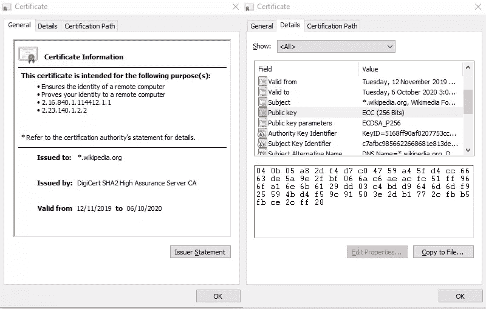
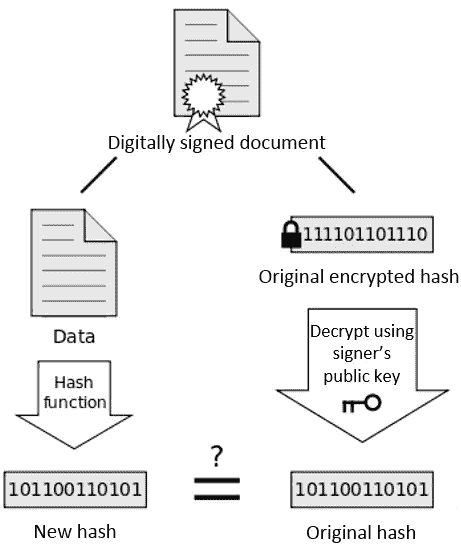

# 什么是 SSL，哪种证书类型适合您

> 原文：<https://www.sitepoint.com/ssl-which-certificate/>

*本文是与 [GoGetSSL](https://www.gogetssl.com/) 合作创作的。感谢您对使 SitePoint 成为可能的合作伙伴的支持。*

在过去的十年里，网络犯罪率急剧上升。已经有许多声誉良好的商业组织和政府机构没有实施足够的网络安全措施，已经被抓了个措手不及。谷歌已经开始对不使用 HTTPS 的网站采取强硬立场。如果网站访问者要通过不安全的连接提交任何信息，他们会收到通知。

在本文中，您将了解如何保护您的客户和您的企业免受隐私侵犯和数据窃取。您将了解如何使用 SSL 技术来保护您的网站和应用程序，防止敏感数据泄露给窃听者。

我不能向您展示如何安装 SSL，因为这是一个高级主题。您可以在此找到关于安装过程[的更多信息。](https://www.gogetssl.com/wiki/installation/)

## SSL 如何用简单的英语工作

想象你在你的酒店房间里，在你的笔记本电脑上，连接着酒店的无线网络。您即将登录银行的在线门户网站。与此同时，一名邪恶的黑客巧妙地预订了你隔壁的一个房间，并设置了一个简单的工作站来监听酒店大楼内的所有网络流量。黑客可以明文看到所有使用 HTTP 协议的流量。

假设该银行的网站只使用 HTTP，一旦您按下 submit，黑客就会看到用户名和密码等表单细节。那么我们如何保护这些数据呢？答案显然是加密。数据加密包括将纯文本数据转换成看起来乱码的东西，也就是加密数据。要加密纯文本数据，你需要所谓的加密算法和密钥。

假设您要加密以下数据:

```
Come on over for hot dogs and soda! 
```

在加密形式下，它看起来像这样:

```
wUwDPglyJu9LOnkBAf4vxSpQgQZltcz7LWwEquhdm5kSQIkQlZtfxtSTsmaw
q6gVH8SimlC3W6TDOhhL2FdgvdIC7sDv7G1Z7pCNzFLp0lgB9ACm8r5RZOBi
N5ske9cBVjlVfgmQ9VpFzSwzLLODhCU7/2THg2iDrW3NGQZfz3SSWviwCe7G
mNIvp5jEkGPCGcla4Fgdp/xuyewPk6NDlBewftLtHJVf
=PAb3 
```

使用当前的计算能力，在没有密钥的情况下解密上述消息可能要花费超过一生的时间。没有人能读它，除非他们有用来加密它的密钥。这种类型的加密称为对称加密。既然我们已经知道了如何保护数据，我们需要一种安全的方法将密钥安全地传输给消息的接收者。我们可以通过使用一个名为**公钥加密**的非对称加密系统来做到这一点。

公钥加密使用一对数学上相关的密钥:

*   **公钥**:可以安全地与任何人共享
*   **私钥**:绝对不能传输，秘密存储

当一个密钥用于加密时，另一个密钥用于解密。同一个密钥不能用来解密它加密的内容。以下是对其工作原理的描述:


然而，我们不能信任任何发给我们的公钥，因为它们可以由任何人生成。为了确保公钥的真实性，需要将它们打包在所谓的 SSL 证书中。这是一个签名的数字文件，包含以下信息:

*   主体名称:个人、组织或机器名称
*   公开密钥
*   数字签名(证书的指纹)
*   颁发者(签署证书的实体)
*   有效日期(开始和到期)

我只列出了必需品。SSL 证书通常包含更多信息。这里有一个真实的例子:



正如您所看到的，上面的证书已经被签名了(参见缩略图部分)。数字签名只是一个文件的加密散列。我们先来解释一下什么是 hash。假设你有一个 100 字的文档，你用一个哈希程序运行它。您将获得以下散列:

```
46798b5cfca45c46a84b7419f8b74735 
```

如果您更改了文档中的任何内容，即使添加了一个句号，当您再次运行哈希函数时，也会生成一个全新的哈希:

```
bc527343c7ffc103111f3a694b004e2f 
```

发送的哈希值与生成的哈希值不匹配意味着文件已被更改。这是确保 SSL 证书没有被修改的第一道防线。但是，我们需要验证发送的哈希是由证书的颁发者创建的。这是通过使用发行者的私钥加密散列来实现的。当我们执行证书的本地散列，然后解密证书的签名以获得发送的散列时，我们可以比较两者。如果有匹配的，就意味着:

*   证书没有被其他人修改过
*   我们有证据证明证书来自发行者，因为我们已经使用他们的公钥成功地解密了签名
*   我们可以信任 SSL 证书中附加的公钥的真实性。



现在，您可能想知道我们从哪里获得发行者的公钥，以及我们为什么应该信任它。发行者的公钥已经预先安装在我们的操作系统和浏览器中了。发行者是受信任的证书颁发机构(CA ),它根据官方的 CA/浏览器论坛指南和 NIST 建议对证书进行签名。例如，这里有一个在微软操作系统上可以找到的可信发行者/ca 的列表。甚至智能手机和平板电脑也在操作系统和浏览器中预装了类似的列表。

根据 W3Techs 在 2018 年 5 月进行的一项调查，以下发行方约占全球签署的有效证书的 90%:

*   识别信任
*   科莫多
*   DigiCert(被赛门铁克收购)
*   GoDaddy
*   GlobalSign

既然您已经了解了加密和 SSL 技术，那么最好是回顾一下如何使用 HTTPS 安全地登录到您的银行门户网站，而不被隔壁的黑客读取您的流量。

1.  您笔记本电脑的浏览器首先向银行的服务器请求 SSL 证书。
2.  服务器发送它。然后，浏览器根据可信 ca 列表检查证书是否可信。它还会检查它是否已过期以及是否已被撤销。
3.  如果一切检查完毕，浏览器会生成一个新的**密码密钥**(也称为**会话密钥**)。使用 SSL 证书上的公钥，它被加密，然后发送到服务器。
4.  服务器使用其私钥解密会话密钥。
5.  从现在开始，所有来回发送的通信都将使用会话密钥进行加密。对称加密比非对称加密快。

这意味着来自笔记本电脑的表单数据和来自服务器的 HTML 数据都将使用黑客无法访问的密钥进行加密。在捕获的流量日志中看到的都是乱码字母和数字。您的信息现已得到保护，不会被他人窥探。

现在您已经了解了 SSL 的一般工作原理，让我们继续下一节，看看我们可以使用的不同类型的 SSL 证书。

## SSL 的类型

### 域验证 SSL 证书

[域验证](https://www.gogetssl.com/dv-ssl/)是最实惠、最常见的 SSL 证书类型，可以颁发给任何人以保护公共域网站。为了购买这种类型的 SSL 证书，您需要证明您是您想要保护的域名的所有者。这就是为什么它被称为域验证。这是通过以下一种或多种方式实现的:

*   创建 DNS TXT 记录
*   回复发送给在域的 [whois](https://lookup.icann.org/) 记录中注册的电子邮件联系人的电子邮件
*   回复发送给你所在领域中众所周知的管理联系人的电子邮件，例如`admin@domain.com`
*   发布由自动证书发行系统提供的随机数

截至 2019 年 9 月，谷歌 Chrome 是目前最受欢迎的网络浏览器，拥有约 70%的全球桌面浏览器市场份额。谷歌最近加强了对网站所有者实施安全协议的立场，以确保最终用户的隐私得到保护。未受保护的网站被标记为不安全。如果用户试图向未受保护的网站提交表单，他们也会非常不高兴。如果网站的 SSL 证书过期或无效，该网站将被暂时阻止。

如果你不想因为你的网站不受保护而损失宝贵的流量，你需要确保你至少获得一个[域验证 SSL 证书](https://www.gogetssl.com/dv-ssl/)。只需要 5-8 分钟就可以得到一个。

### 公共 IP San SSL

SSL 证书通常是为了保护一个完全合格的域名——比如`www.domain.com`。如果你想保护一个公共 IP 地址，你需要获得一个[公共 IP SAN SSL](https://www.gogetssl.com/sslcerts/public_ip_san_ssl/) 证书。SAN 代表主观替代名称，它是证书字段中的一个字段，可用于保存 IP 地址。

### 通配符 SSL

普通的 SSL 证书只适用于单个域——比如`www.domain.com`。如果你想保护一个子域，你必须为它购买一个新的 SSL 证书。不用为您管理的每个子域购买新的 SSL 证书，您只需购买一个[通配符 SSL 证书](https://www.gogetssl.com/wildcard-ssl/)，它将应用于您的子域—即`*.domain.com`。这比购买多个 SSL 证书更划算。使用一个 SSL 证书也更容易管理。

但是，如果一个子域被破坏，这意味着使用相同证书的所有子域都被破坏。您需要将其撤销，并申请新的证书。如果你不想面对这种问题，你也可以单独购买一个。

### 多域 SSL 证书

顾名思义，你可以[购买](https://www.gogetssl.com/multi-domain-ssl/)一个多域 SSL 证书，为多达 250 个域和子域提供保护。这种类型的证书对于保护可能跨越不同地理区域的数百台办公通信服务器特别有用。即使流量被限制在公司网络内，最好也使用 SSL 来保护它，因为流氓员工很容易监控和记录每个人的流量。

## 使用 LEI 代码加快业务验证

自 2019 年以来，可以在全球范围内验证使用安磊(法人实体标识符)代码的组织。这简化并大大加快了验证过程。企业可以通过官方的 GLEIF 注册代理人获得安磊代码[。](https://www.getlei.com)

法人实体标识符(LEI)是唯一的代码，用于标识全球范围内参与金融交易的任何公司。该过程按照国际标准 ISO 17442 完成。目标是帮助监控和测量系统风险，并有效和低成本地支持遵守监管报告要求。

## 摘要

我希望您现在有足够的信息来决定购买哪个 SSL 证书。请注意，SSL 证书的有效期只有两年。这是一项安全功能，可确保证书上的信息保持最新。它还确保任何放错地方的钥匙不会被用来渗透到交通中。免费 SSL 证书的有效期通常为 90 天。如果您想确保不会忘记购买续订，您可以获得 [3 年或 4 年订阅计划](https://www.gogetssl.com/wiki/general/multi-year-subscription-ssl/)。请注意，两年的限制利率适用。到期日快结束时，我们会通知您更换新证书。选择长期订阅计划的好处是，与每年购买相比，您可以节省资金。

## 分享这篇文章