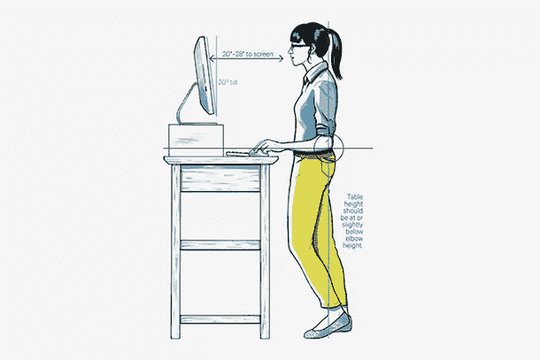

# 立式办公桌不一定能救你的命

> 原文：<https://www.sitepoint.com/standing-desk-might-necessarily-save-life/>

几年前，我发现自己无法有效地工作，经常头痛欲裂，脖子僵硬。原来这是因为我在一个不合适的工作场所工作——我的餐桌和一把糟糕的椅子——屏幕太低。幸运的是，在我找到原因并采取措施后，我很少再遇到这些问题了。

许多整天坐在办公桌前工作的人在某个时候都会有类似的经历，因为他们工作场所的设置方式而遭遇某种问题。大多数时候，他们会注意到这个问题，并努力解决它。但是如果他们仍然大部分时间坐着，他们的长期健康可能仍然处于危险之中。

由于科技的进步，我们比以前更多地过着久坐不动的生活，但似乎所有这些久坐对我们都不是很好。

一些专家认为，久坐会引发各种健康问题，导致早逝。最糟糕的事？工作时间之外的锻炼和相对积极的生活方式并不能抵消这一点。在美国，长时间坐着现在已经被正式认定为一种健康风险。[根据 Business Insider](http://www.businessinsider.com/why-using-a-standing-desk-at-work-could-save-your-life-2014-5 "Business Insider") 上的一篇文章，引用了《内科医学档案》中的一项研究:

> 与每天只坐 4 小时的人相比，每天坐 8 小时的人过早死亡的风险增加 15 %,每天坐 11 小时的人过早死亡的风险增加 40%。

因此，对于我们这些整天坐在办公桌前的人来说，这种风险是真实存在的，而且非常严重。

## 减少久坐的生活方式

虽然很容易认为在健身房锻炼一段时间就可以抵消我们坐着的时间，但研究表明这还不够。为了降低过早死亡、心脏问题、肥胖、糖尿病和肌肉问题的风险，唯一的答案就是少坐。似乎答案就在那张站立的桌子上。

为了看看有规律的站立能给你的健康带来多大的变化，丹·柯伊斯决定花整整一个月的时间尽可能多的站立。他对这个月的描述很有趣，因为它展示了每天都站着是一种怎样的挣扎。

然而，结果是丹发现自己在结束时轻了 5 磅，腿部肌肉更强壮了，而且比坐着时的工作效率显著提高了。但他发现这是一种挣扎，文章指出，一直站着和一直坐着对你同样有害。

而是找到一个快乐的平衡。不幸的是，专家们还没有就这种平衡到底是什么达成一致。

## 进入站立式办公桌

近年来，随着久坐不动的生活方式的影响越来越为人所知，立式办公桌变得越来越流行。但是几乎没有证据表明使用立式办公桌真的有帮助。事实上，根据彭宁顿生物医学研究中心的不活动生理学教授马克·汉密尔顿的说法，没有证据表明站着办公与改善健康有关系。

> 这是一个创造性的想法，但还没有被科学证明。到目前为止，真的没有研究表明它们有任何好处。

他继续说，他怀疑站立式办公桌充其量只能提供边缘益处，而且“坐得太久并不等同于锻炼太少”。长时间站立也有健康风险。自从几年前站立式办公桌的时尚出现以来，已经有无数的在线实验，比如上面丹的实验，所有的实验都抱怨脚疼，小腿肌肉酸痛。

虽然他们承认站立确实有助于增强他们的活力，但有些人遇到了问题，比如《华盛顿邮报》的悉尼·特伦特，她最终在脚趾麻木、小腿刺痛、发热后去看了医生。

> 医生的结论是:我工作时站得太多了。那些不舒服的感觉可能是我的膝盖过度伸展的结果，这会给腓骨神经带来太大的压力，腓骨神经是坐骨神经的一个分支，从膝盖后面开始，沿着腓骨或小腿骨延伸。具有讽刺意味的是，这也可能发生在你坐着的时候经常交叉双腿。

当你站了一整天，经常检查你的姿势并尽可能多走动是很重要的。立式办公桌鼓励你站在一个地方不动，所以除非你齐心协力四处走动，否则它们不太可能有太大的好处。世界上有很多工作人员一直都是站着的。对于这些人来说，静脉曲张和动脉硬化的风险大大增加。

## 走路是关键

专家们一致认为，站立式办公桌提供了一些好处，但除了轶事之外，没有证据表明它们可以对抗久坐不动的生活方式的影响。根据[作家兼探险家丹·比特纳](https://www.youtube.com/watch?v=I-jk9ni4XWk "Dan Buettner")的说法，健康生活方式的关键是“有规律的、低强度的体育活动，这是(你)日常生活的一部分。”他研究了全球最健康的社区，发现最重要的是，步行是那些希望过上健康长寿生活的人的答案。

这得到了医学界的支持。常识告诉我们，与其整天坐在或站在办公桌前，不如离开办公桌，把它混合起来，这可能是你能做的最好的事情。

## 变得更健康的小贴士

考虑到这一点，你可以做一些事情来帮助自己摆脱久坐生活的束缚——这个列表中确实包括站立式办公桌。这些[可能会很贵](http://thewirecutter.com/reviews/the-best-standing-desks/ "standing desk reviews")(尽管你可以把它看作是对未来的投资)，所以如果你买不起，你可以自己做，但重要的是你要检查自己的站姿和坐姿，找出最适合你的姿势。

资料来源:Wired.com

除了检查你的坐姿和站姿，你还应该试着在日常生活中做以下事情:

*   定期在办公室周围散步。
*   交替坐着和站着，你的身体应该决定你什么时候做。
*   如果你觉得脚疼，可以用凝胶垫站着。
*   如果您使用笔记本电脑，请使用单独的键盘和鼠标，因为它们通常不利于获得正确的姿势，并可能导致颈部和肩部问题。
*   站着的时候，做一些轻微的运动，比如将重心从一只脚转移到另一只脚，或者做一些简单的瑜伽动作。
*   多喝水。你不仅需要更频繁地去洗手间，而且在完全补充水分后，你会更好地集中注意力。
*   慢慢开始。不要整天站着，逐渐增加你的站立量。

关于你应该站多长时间的研究严重缺乏，所以我建议一个 50/50 的方法，包括大量的运动。想想如何让你的日常任务包含更多的信息。

## 结论

归根结底，如果你习惯久坐不动的生活方式，站立式办公桌并不能拯救你的生活。长时间坐着和站着都会对你的健康产生不良影响，关键是要把运动和散步融入你的日常生活。这些会对你的健康、生活和工作效率产生巨大的影响，所以*将*拯救你的生活的是做出调整，帮助你在白天和晚上多走动。

因此，与其在辛苦工作一天后回到家瘫坐在电视机前，也许走出家门去散步是个更好的主意？

你如何避免久坐不动的生活方式带来的影响？你试过立式办公桌吗？

## 分享这篇文章