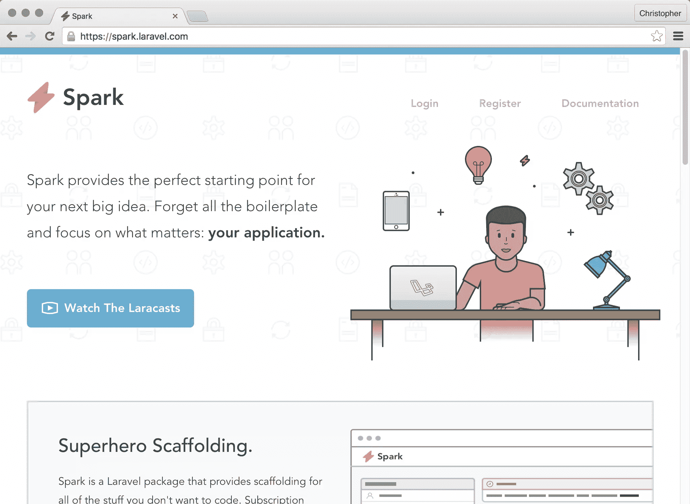
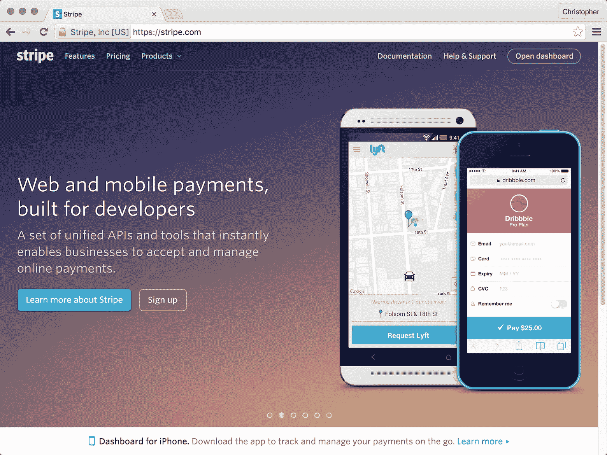
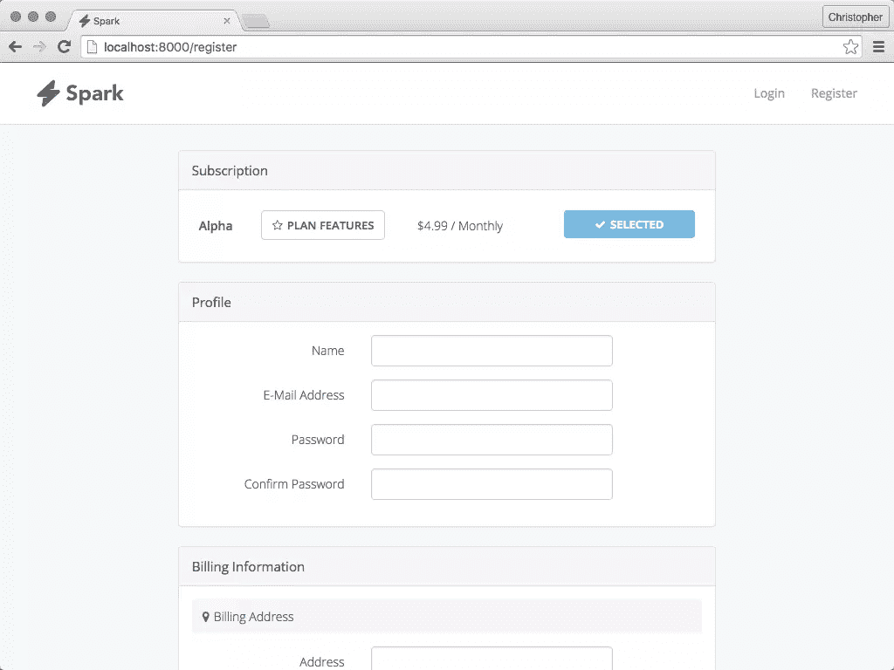
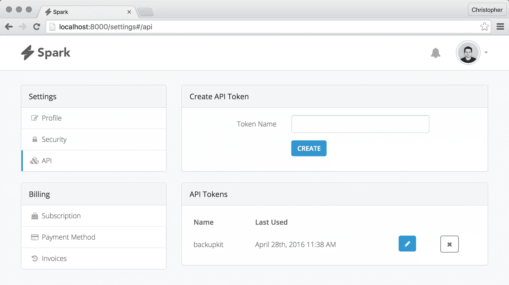
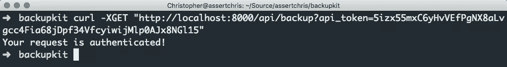

# 与 Laravel Spark 一起创业

> 原文：<https://www.sitepoint.com/starting-a-business-with-laravel-spark/>

我真的对 Laravel Spark 感到非常兴奋。当你读到这里的时候，可能会有很多帖子解释你如何设置它。对我来说，这还不如我即将开始的与 Spark 一起创建实际业务的旅程有趣！

这个想法很简单。我已经创建了一个 [Pagekit](https://www.sitepoint.com/first-look-at-pagekit-cms-clean-extensible-fast-but/) 模块，你可以用它来备份和恢复站点数据。该模块可以轻松存储和下载这些备份，并在不同的服务器上恢复它们。

问题是，将这些备份文件传输到远程服务器需要时间，而且有点麻烦。我经常希望有一种方法可以快速、轻松地将应用程序状态从一台服务器转移到另一台服务器，并自动进行异地备份。因此，我将为自己建立一个这样的网站，也许其他人会发现它非常有用，并愿意为此付费。



## 入门指南

我正在使用 Stripe，并打算有一个没有试验的单一计划。这个设置非常简单，但是我已经记下了计划 ID。我需要这个在 Spark 中建立计划…



接下来，我重置我的秘密和公共条带密钥，并更新到最新的 API(通过同一个屏幕，[https://dashboard.stripe.com/account/apikeys](https://dashboard.stripe.com/account/apikeys))。

*我忘记了`.env`中的设置不会在 Laravel 开发服务器运行时自动重新加载，所以我对那些似乎不会更新的键感到不必要的沮丧。*

Spark 有几个预期的注册/个人资料字段，但我想再添加几个。我想问用户，如果他们想自动备份，我也想收集他们的帐单地址，所以我可以显示在他们的发票上。首先，我必须为新字段创建一个迁移:

```
php artisan make:migration add_should_backup_field 
```

为此，我们可以添加该列(如果迁移回滚，请确保将其删除):

```
use Illuminate\Database\Migrations\Migration;
use Illuminate\Database\Schema\Blueprint;
use Illuminate\Support\Facades\Schema;

class AddShouldBackupField extends Migration
{
    public function up()
    {
        Schema::table("users", function (Blueprint $table) {
            $table->boolean("should_backup");
        });
    }

    public function down()
    {
        Schema::table("users", function (Blueprint $table) {
            $table->dropColumn("should_backup");
        });
    }
} 
```

收集账单地址就像调用一个方法一样简单，在`app/Providers/SparkServiceProvider.php`中:

```
/**
 * @inheritdoc
 */
public function booted()
{
    Spark::useStripe();

    Spark::collectBillingAddress();

    Spark::plan("[Stripe plan name]", "[Stripe plan ID]")
        ->price(4.99)
        ->features([
            "Backups"
        ]);
} 
```

这会将帐单地址字段添加到注册表中:



如果您正在跟进，请不要忘记定制`SparkServiceProvider.php`的其余部分以满足您的需求。

## 存储备份

这款应用的全部意义在于让内容作者能够上传、列出和下载他们的备份。接下来，我将创建一个`Backup`模型:

```
php artisan make:migration create_backups_table
php artisan make:model Backups 
```

备份表需要几个字段:

1.  每个备份的名称(可能包含站点名称、日期以及是否包括数据库和上传数据)。
2.  上传的备份文件。
3.  每次备份的大小。
4.  将备份链接到创建它的用户的字段。

自定义迁移文件如下所示:

```
use Illuminate\Database\Schema\Blueprint;
use Illuminate\Database\Migrations\Migration;
use Illuminate\Support\Facades\Schema;

class CreateBackupsTable extends Migration
{
    public function up()
    {
        Schema::create("backups", function (Blueprint $table) {
            $table->increments("id");
            $table->string("name");
            $table->string("file");
            $table->integer("size");
            $table->integer("user_id");
            $table->timestamps();
        });
    }

    public function down()
    {
        Schema::dropIfExists("backups");
    }
} 
```

鉴于这种数据库结构，我想提供一组 JSON 端点，用户可以通过它们查看和操作备份。同样，我们可以使用 make 命令开始:

```
php artisan make:controller BackupsController --resource 
```

Spark 是专门为认证 API 创建而设计的良好起点。当您使用 Spark 帐户登录时，您可以转到可以创建 API 令牌的部分:



有了这个令牌，并且创建了资源控制器，我可以让 index 方法回显一些调试文本。然后我可以向它发出 curl 请求:

```
curl -XGET http://localhost:8000/api/backup 
```

为此，我需要定义一个 API 路由(在`app/Http/api.php`中):

```
Route::group([
    "prefix" => "api",
    "middleware" => "auth:api"
], function () {
    Route::resource("backup", "BackupsController");
}); 
```

由于我没有提供`api_token` GET 参数，请求没有得到正确的认证，Spark 将尝试把我重定向到登录页面。如果我当时已登录，我会被重定向回仪表板屏幕。

如果我定义了`api_token`参数，我会看到调试文本:



我选择了一个简单的上传机制，它对文件做很少的验证(当我让原型工作时)。我想稍后通过一些验证来强化这一点，但现在我已经做到了:

```
public function store(Request $request)
{
    $file = $request->file("file");
    $name = $request->get("name");

    if (!$file || !$name) {
        return [
            "status" => "error",
            "error" => "file or name missing",
        ];
    }

    $fileExtension = "." . $file->getClientOriginalExtension();
    $fileName = str_slug(time() . " " . $name) . $fileExtension;

    try {
        $file->move(storage_path("backups"), $fileName);
    } catch (Exception $exception) {
        return [
            "status" => "error",
            "error" => "could not store file",
        ];
    }

    $backup = Backup::create([
        "name" => $name,
        "file" => $fileName,
        "size" => $file->getClientSize(),
        "user_id" => Auth::user()->id,
    ]);

    return $backup;
} 
```

我可以通过创建一个空的备份文件，然后将其提交给`store`动作来测试这一点:

```
touch backup.zip
curl
    -X POST
    -F name="My First Backup"
    -F file=@backup.zip
    "http://localhost:8000/api/backup?api_token=[my token]" 
```

我得到了类似于:

```
{
    "name": "My First Backup",
    "file": "1461802753-my-first-backup.zip",
    "size": 0,
    "user_id": 1,
    "updated_at": "2016-04-28 00:19:13",
    "created_at": "2016-04-28 00:19:13",
    "id": 8
} 
```

注意文件是如何被不同地命名以避免冲突的？它实际上是以备份的名称命名的，而不是原始文件名，我添加了时间戳，这样就可以上传名称相似的备份，而不会出现名称冲突。

当用户在同一秒上传完全相同名称的备份时，仍然存在竞争条件。这样做的风险更小，当它成为一个问题时，我准备处理它。

现在我可以定制`index`动作来返回更多有用的信息:

```
public function index()
{
    return [
        "status" => "ok",
        "data" => Auth::user()->backups,
    ];
} 
```

我还必须通过向`User`模型添加`backups`方法来创建用户和备份之间的关系:

```
public function backups()
{
    return $this->hasMany(Backup::class);
} 
```

## 下载备份

我上传备份到一个非公共文件夹是有原因的。我不希望用户能够猜测(不管他们猜对的可能性有多小)如何访问其他用户的备份。

所以我必须创建一个特殊的下载端点。然而，我可以借用`show`动作:

```
public function show($id)
{
    $backup = Auth::user()->backups()->findOrFail($id);
    $path = storage_path("backups/". $backup->file);

    return response()->download($path, $backup->file);
} 
```

由于查询的范围，用户将只被允许下载与其帐户相关联的备份，并且这些备份在这一途径之外是不可公开访问的。

## 结论

在非常短的时间内，我成功地使用 Spark 创建了一个基于订阅的托管平台，使用经过认证的 API 来存储和下载备份文件。

还有很多工作要做，从应用程序主题化到增加安全性，再到实现存储限制和备份删除。尽管如此，我对自己的起步感到鼓舞，随着我对 Spark 的了解越来越多，我可能会在以后的教程中再次使用这个应用程序！

你对这段代码有什么问题吗，或者你有什么不同的意见吗？请在评论中告诉我们！

## 分享这篇文章