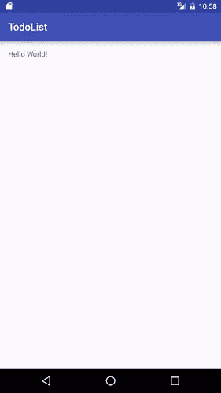
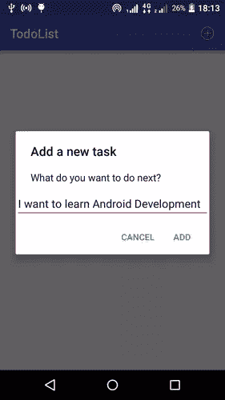
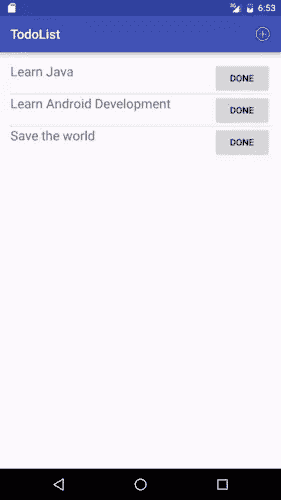

# 开始 Android 开发，创建 Todo 应用程序

> 原文：<https://www.sitepoint.com/starting-android-development-creating-todo-app/>

*本文于 2016 年 4 月更新，以反映 Android 的变化*

尽管 SitePoint 上有许多与 Android 相关的文章，但我们已经有一段时间没有真正的“初学者”教程了。有什么比入门教程“待办事项”应用更能填补这个空白呢？

## 需要的软件

每个 Android 开发者都需要的要素是:

1.  [Android Studio](http://developer.android.com/sdk/index.html) ，Android 官方 IDE(集成开发环境)。可能仍有开发人员在使用 Eclipse 的旧 ADT 插件，但这种情况已经不复存在了。 [IntelliJ IDEA](https://www.jetbrains.com/idea/features/) 也支持 Android 开发，所以你也可以使用它。
2.  Android SDK 是管理构建 Android 应用程序所需的一切的工具链。它与 Android Studio 一起发布，但是如果你决定使用另一个 ide，你必须下载它。

拥有一个 Android 设备很有用，这样你就可以在开发过程中测试应用程序。如果你不能使用 Android 设备，你可以使用默认的[模拟器](http://developer.android.com/tools/help/emulator.html)或 [Genymotion](https://www.sitepoint.com/improved-android-emulation-genymotion/) 。

**注意** : Android 最大的优点和缺点是它的灵活性。我将使用特定的 IDE 和 SDK 版本，如果您的设置不同，那么设置、代码和截图也可能有所不同。

您将需要基本的 Java 知识来学习本教程。

## 入门指南

你可以在 GitHub 上找到这个项目[的最终代码。](https://github.com/sitepoint-examples/TodoList)

要创建一个新项目，打开 Android Studio 并点击*开始一个新的 Android Studio 项目*。将应用程序命名为“TodoList”，并添加您的公司域，这将是应用程序包。Play Store 上不能有两个包名相同或名为“com.example”的应用。我将把我的名字命名为 *com.aziflaj.todolist* 。

接下来，选择你想开发的平台。我建议设置*最低 SDK* 支持 API 等级 15 及以上。这意味着该应用程序将支持每一部装有 Android 4.0.3 或更高版本的智能手机。

在下一个屏幕上，选择*空活动*并将名称保留为*主活动*。

当 Android Studio 完成生成项目时，你就有了默认的“Hello，World”应用程序。



## 构建视图

在*MainActivity.java*中，你应该编写如下代码:

```
package com.aziflaj.todolist; // This will refelect your package name

import android.support.v7.app.AppCompatActivity;
import android.os.Bundle;

public class MainActivity extends AppCompatActivity {

    @Override
    protected void onCreate(Bundle savedInstanceState) {
        super.onCreate(savedInstanceState);
        setContentView(R.layout.activity_main);
    }
} 
```

在第 11 行，您将这个活动的视图设置为`R.layout.activity_main`，它指向项目的 */res/layout* 目录中一个名为 *activity_main.xml* 的文件。一个视图控制 Android 界面的布局，如下所示:

```
<?xml version="1.0" encoding="utf-8"?>
<RelativeLayout xmlns:android="http://schemas.android.com/apk/res/android"
    xmlns:tools="http://schemas.android.com/tools"
    android:layout_width="match_parent"
    android:layout_height="match_parent"
    android:paddingBottom="@dimen/activity_vertical_margin"
    android:paddingLeft="@dimen/activity_horizontal_margin"
    android:paddingRight="@dimen/activity_horizontal_margin"
    android:paddingTop="@dimen/activity_vertical_margin"
    tools:context="com.aziflaj.todolist.MainActivity">

    <TextView
        android:layout_width="wrap_content"
        android:layout_height="wrap_content"
        android:text="Hello World!" />
</RelativeLayout> 
```

在主视图中，您将添加一个`ListView`，它将在每一行中包含一个 ToDo 项。为此，用下面的代码替换`TextView`元素:

```
<ListView
  android:id="@+id/list_todo"
  android:layout_width="wrap_content"
  android:layout_height="wrap_content" /> 
```

现在您将定义一个列表项，它将在界面中表示一个任务。

在 */res/layout* 文件夹中创建一个名为 *item_todo.xml* 的新布局文件。您将向该文件添加两个元素，一个是显示任务的`TextView`，另一个是删除任务的“Done”`Button`。将此代码添加到 *item_todo.xml* ，替换已经存在的任何内容。

```
<?xml version="1.0" encoding="utf-8"?>
<RelativeLayout xmlns:android="http://schemas.android.com/apk/res/android"
    android:layout_width="match_parent"
    android:layout_height="match_parent"
    android:layout_gravity="center_vertical">

    <TextView
        android:id="@+id/task_title"
        android:layout_width="wrap_content"
        android:layout_height="wrap_content"
        android:layout_alignParentLeft="true"
        android:layout_alignParentStart="true"
        android:text="Hello"
        android:textSize="20sp" />

    <Button
        android:id="@+id/task_delete"
        android:layout_width="wrap_content"
        android:layout_height="wrap_content"
        android:layout_alignParentEnd="true"
        android:layout_alignParentRight="true"
        android:text="Done" />

</RelativeLayout> 
```

该应用程序需要一个菜单项，允许用户添加更多的任务。在 */res/menu* 目录下添加一个 *main_menu.xml* 文件，代码如下:

```
<?xml version="1.0" encoding="utf-8"?>
<menu xmlns:android="http://schemas.android.com/apk/res/android"
    xmlns:app="http://schemas.android.com/apk/res-auto">
    <item
        android:id="@+id/action_add_task"
        android:icon="@android:drawable/ic_menu_add"
        android:title="Add Task"
        app:showAsAction="always" />
</menu> 
```

将下面的代码添加到*MainActivity.java*文件中，在`onCreate`方法之后:

```
@Override
public boolean onCreateOptionsMenu(Menu menu) {
    getMenuInflater().inflate(R.menu.main_menu, menu);
    return super.onCreateOptionsMenu(menu);
}

@Override
public boolean onOptionsItemSelected(MenuItem item) {
    switch (item.getItemId()) {
        case R.id.action_add_task:
            Log.d(TAG, "Add a new task");
            return true;

        default:
            return super.onOptionsItemSelected(item);
    }
} 
```

Android 开发人员经常用类的名称创建一个`TAG`常量来记录日志。将此添加到`MainActivity`类的开头:

```
public class MainActivity extends AppCompatActivity {
    private static final String TAG = "MainActivity";
... 
```

`onCreateOptionsMenu()`方法在主活动中膨胀(呈现)菜单，并使用`onOptionsItemSelected()`方法对菜单项的不同用户交互做出反应。如果您运行该应用程序，它应该看起来像这样:


如果你点击添加按钮，你会在 Android Studio 日志中看到如下内容:

```
03-26 22:12:50.327 2549-2549/? D/MainActivity: Add a new task 
```

接下来，您将添加一个`AlertDialog`来在单击 add item 按钮时从用户那里获取任务。您已经知道在哪里添加代码来对用户做出反应，所以用下面的语句替换日志记录语句:

```
final EditText taskEditText = new EditText(this);
AlertDialog dialog = new AlertDialog.Builder(this)
        .setTitle("Add a new task")
        .setMessage("What do you want to do next?")
        .setView(taskEditText)
        .setPositiveButton("Add", new DialogInterface.OnClickListener() {
            @Override
            public void onClick(DialogInterface dialog, int which) {
                String task = String.valueOf(taskEditText.getText());
                Log.d(TAG, "Task to add: " + task);
            }
        })
        .setNegativeButton("Cancel", null)
        .create();
dialog.show(); 
```

现在，单击加号按钮会显示以下内容:



输入一些文本，当你点击*添加*按钮时，Android Studio 日志(“logcat”)将显示如下内容:

```
03-26 23:32:18.294 12549-12549/? D/MainActivity: Task to add: I want to learn Android Development 
```

## 存储和检索数据

Android 搭载了一个嵌入式的 SQLite T2 数据库。数据库在存储任何任务之前需要一个表，称为“TaskTable”。在与*MainActivity.java*相同的位置创建一个新的 *db* 文件夹。然后创建一个名为`TaskContract`的新类，文件名为*TaskContract.java*:

将这段代码添加到*TaskContract.java*中，适当地更改两个包的名称。

```
package com.aziflaj.todolist.db;

import android.provider.BaseColumns;

public class TaskContract {
    public static final String DB_NAME = "com.aziflaj.todolist.db";
    public static final int DB_VERSION = 1;

    public class TaskEntry implements BaseColumns {
        public static final String TABLE = "tasks";

        public static final String COL_TASK_TITLE = "title";
    }
} 
```

`TaskContract`类定义了用来访问数据库中数据的常量。您还需要一个名为`TaskDbHelper`的助手类来打开数据库。在`db`包中创建这个类，并添加以下代码:

```
package com.aziflaj.todolist.db;

import android.content.Context;
import android.database.sqlite.SQLiteDatabase;
import android.database.sqlite.SQLiteOpenHelper;

public class TaskDbHelper extends SQLiteOpenHelper {

    public TaskDbHelper(Context context) {
        super(context, TaskContract.DB_NAME, null, TaskContract.DB_VERSION);
    }

    @Override
    public void onCreate(SQLiteDatabase db) {
        String createTable = "CREATE TABLE " + TaskContract.TaskEntry.TABLE + " ( " +
                TaskContract.TaskEntry._ID + " INTEGER PRIMARY KEY AUTOINCREMENT, " +
                TaskContract.TaskEntry.COL_TASK_TITLE + " TEXT NOT NULL);";

        db.execSQL(createTable);
    }

    @Override
    public void onUpgrade(SQLiteDatabase db, int oldVersion, int newVersion) {
        db.execSQL("DROP TABLE IF EXISTS " + TaskContract.TaskEntry.TABLE);
        onCreate(db);
    }
} 
```

第 15 到 17 行是这样的 SQL 查询:

```
CREATE TABLE tasks (
    _id INTEGER PRIMARY KEY AUTOINCREMENT,
    title TEXT NOT NULL
); 
```

现在您需要修改`MainActivity`来将数据存储在数据库中。在为`AlertDialog`的添加按钮定义了`DialogInterface.OnClickListener()`的地方添加这段代码，替换为:

```
String task = String.valueOf(taskEditText.getText());
Log.d(TAG, "Task to add: " + task); 
```

使用:

```
String task = String.valueOf(taskEditText.getText());
SQLiteDatabase db = mHelper.getWritableDatabase();
ContentValues values = new ContentValues();
values.put(TaskContract.TaskEntry.COL_TASK_TITLE, task);
db.insertWithOnConflict(TaskContract.TaskEntry.TABLE,
        null,
        values,
        SQLiteDatabase.CONFLICT_REPLACE);
db.close(); 
```

这使得整个`onOptionsItemSelected()`方法看起来像:

```
@Override
public boolean onOptionsItemSelected(MenuItem item) {
    switch (item.getItemId()) {
        case R.id.action_add_task:
            final EditText taskEditText = new EditText(this);
            AlertDialog dialog = new AlertDialog.Builder(this)
                    .setTitle("Add a new task")
                    .setMessage("What do you want to do next?")
                    .setView(taskEditText)
                    .setPositiveButton("Add", new DialogInterface.OnClickListener() {
                        @Override
                        public void onClick(DialogInterface dialog, int which) {
                            String task = String.valueOf(taskEditText.getText());
                            SQLiteDatabase db = mHelper.getWritableDatabase();
                            ContentValues values = new ContentValues();
                            values.put(TaskContract.TaskEntry.COL_TASK_TITLE, task);
                            db.insertWithOnConflict(TaskContract.TaskEntry.TABLE,
                                    null,
                                    values,
                                    SQLiteDatabase.CONFLICT_REPLACE);
                            db.close();
                        }
                    })
                    .setNegativeButton("Cancel", null)
                    .create();
            dialog.show();
            return true;

        default:
            return super.onOptionsItemSelected(item);
    }
} 
```

在`MainActivity`类中添加`TaskDbHelper`的私有实例:

```
private TaskDbHelper mHelper; 
```

并在`onCreate()`方法中初始化它:

```
mHelper = new TaskDbHelper(this); 
```

如果您运行该应用程序，您将不会在 UI 中看到任何差异，但是您可以通过在终端上执行以下命令来检查数据库是否在工作:

```
[local] $ adb shell
[android] $ run-as com.aziflaj.todolist
[android] $ cd databases
[android] $ sqlite3 com.aziflaj.todolist.db
sqlite3> .dump 
```

**注意**:如果最后两个命令对你不起作用，SQLite3 实用程序不包含在大多数生产设备中，但是你可以[自己安装](http://stackoverflow.com/questions/5485890/how-to-install-or-get-access-to-sqlite3-from-adb-shell)。

现在，您需要从数据库中获取所有数据，并将其显示在主视图中。

将您的`MainActivity.onCreate()`方法替换为:

```
@Override
protected void onCreate(Bundle savedInstanceState) {
    super.onCreate(savedInstanceState);
    setContentView(R.layout.activity_main);

    mHelper = new TaskDbHelper(this);
    SQLiteDatabase db = mHelper.getReadableDatabase();
    Cursor cursor = db.query(TaskContract.TaskEntry.TABLE,
            new String[]{TaskContract.TaskEntry._ID, TaskContract.TaskEntry.COL_TASK_TITLE},
            null, null, null, null, null);
    while(cursor.moveToNext()) {
        int idx = cursor.getColumnIndex(TaskContract.TaskEntry.COL_TASK_TITLE);
        Log.d(TAG, "Task: " + cursor.getString(idx));
    }
    cursor.close();
    db.close();
} 
```

当您运行应用程序时，LogCat 将显示存储在数据库中的所有任务的列表。接下来，您将使用`Adapter`在主视图中显示数据。

通过添加`ListView`的一个实例，获得对在 *activity_main.xml* 文件中创建的`ListView`的引用:

```
private ListView mTaskListView; 
```

在创建`mHelper`之后，通过将这行代码添加到`onCreate()`方法来初始化引用:

```
mTaskListView = (ListView) findViewById(R.id.list_todo); 
```

将记录任务的代码移动到一个名为`updateUI()`的私有方法中(做了一些修改):

```
private void updateUI() {
    ArrayList<String> taskList = new ArrayList<>();
    SQLiteDatabase db = mHelper.getReadableDatabase();
    Cursor cursor = db.query(TaskContract.TaskEntry.TABLE,
            new String[]{TaskContract.TaskEntry._ID, TaskContract.TaskEntry.COL_TASK_TITLE},
            null, null, null, null, null);
    while (cursor.moveToNext()) {
        int idx = cursor.getColumnIndex(TaskContract.TaskEntry.COL_TASK_TITLE);
        taskList.add(cursor.getString(idx));
    }

    if (mAdapter == null) {
        mAdapter = new ArrayAdapter<>(this,
                R.layout.item_todo,
                R.id.task_title,
                taskList);
        mTaskListView.setAdapter(mAdapter);
    } else {
        mAdapter.clear();
        mAdapter.addAll(taskList);
        mAdapter.notifyDataSetChanged();
    }

    cursor.close();
    db.close();
} 
```

将这个私有字段添加到`MainActivity`类中:

```
private ArrayAdapter<String> mAdapter; 
```

这个`ArrayAdapter`将帮助用数据填充`ListView`。

如果你不懂`updateUI()`方法，也没关系。不是记录任务，而是将它们添加到字符串的`ArrayList`中。然后检查`mAdapter`是否被创建。如果不是，并且`mAdapter`为空，则创建并设置为`ListView`的适配器:

```
mAdapter = new ArrayAdapter<>(this,
        R.layout.item_todo, // what view to use for the items
        R.id.task_title, // where to put the String of data
        taskList); // where to get all the data

mTaskListView.setAdapter(mAdapter); // set it as the adapter of the ListView instance 
```

如果适配器已经被创建(这意味着它被分配给了`ListView`)，清除它，重新填充它，并通知视图数据已经改变。这意味着视图将用新数据在屏幕上重新绘制。

要看到更新的数据，需要在每次 app 底层数据发生变化时调用`updateUI()`方法。所以，把它加在两个地方:

*   在`onCreate()`方法中，最初显示所有数据
*   使用`AlertDialog`添加新任务后



## 删除任务

在完成一项任务后，应该将其从列表中删除。

打开 *item_todo.xml* 布局，将这一行添加到`Button`标记:

```
android:onClick="deleteTask" 
```

当按钮被点击时，它调用`MainActivity`类中的方法`deleteTask()`:

```
public void deleteTask(View view) {
    View parent = (View) view.getParent();
    TextView taskTextView = (TextView) parent.findViewById(R.id.task_title);
    String task = String.valueOf(taskTextView.getText());
    SQLiteDatabase db = mHelper.getWritableDatabase();
    db.delete(TaskContract.TaskEntry.TABLE,
            TaskContract.TaskEntry.COL_TASK_TITLE + " = ?",
            new String[]{task});
    db.close();
    updateUI();
} 
```

现在，点击`Done`按钮将从列表和 SQLite 数据库中删除任务。

## 最后的话

写完所有这些代码后，您就有了一个简单的 TodoList 应用程序，它是用 Java 为 Android 构建的。如果本教程让你有兴趣了解更多，那么你的下一步是浏览其余的 [SitePoint 的 Android 内容](https://www.sitepoint.com/mobile/android/)。尽情享受吧！

## 分享这篇文章