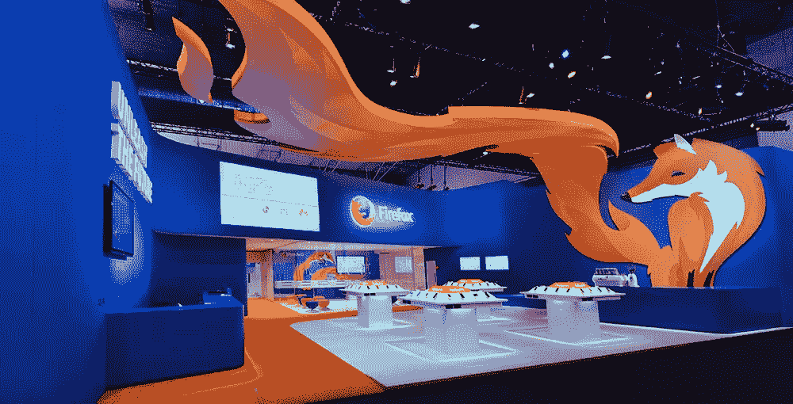
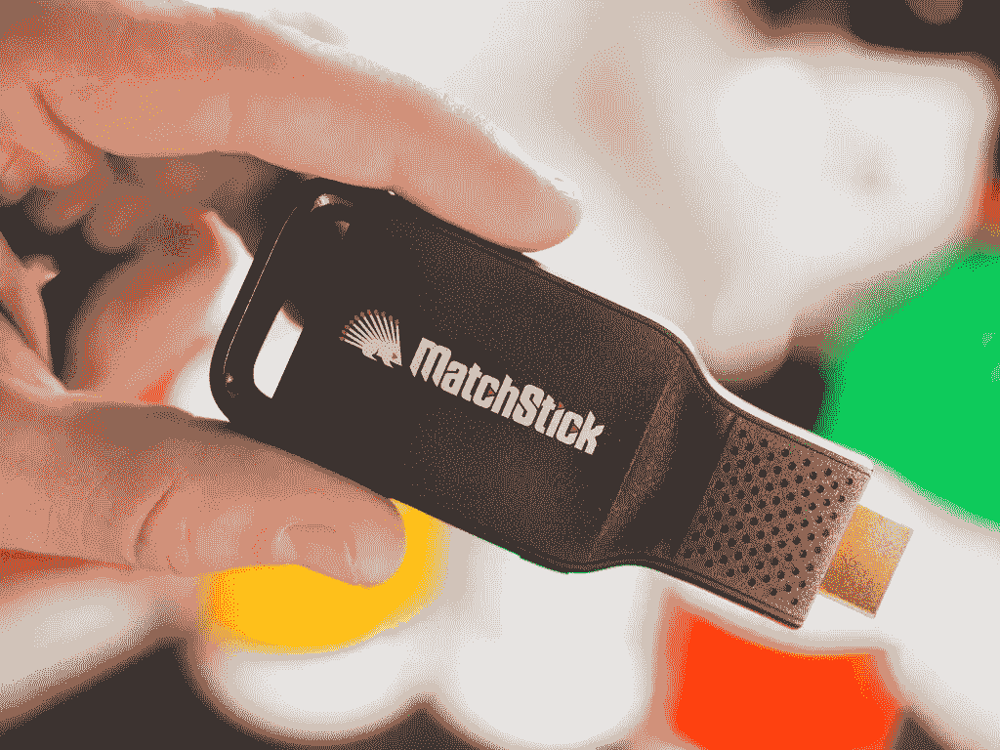
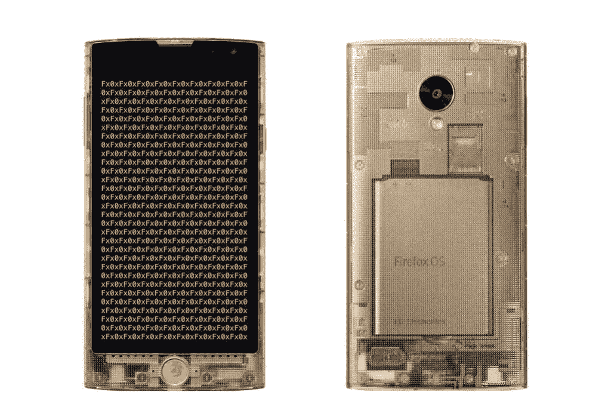
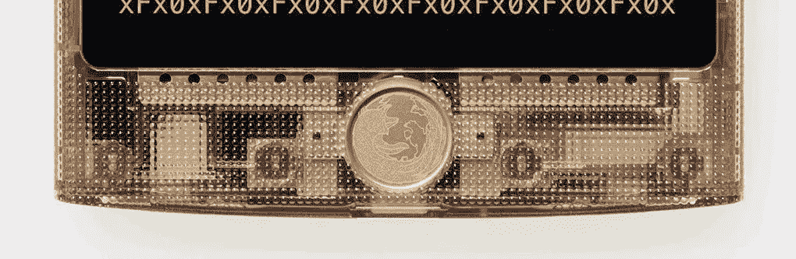
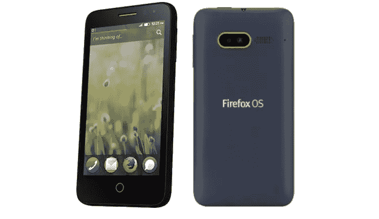

# 火狐操作系统的现状，2015 年会有什么？

> 原文：<https://www.sitepoint.com/state-firefox-os-whats-store-2015/>

2014 年对 Mozilla 来说是跌宕起伏的一年，从联合创始人布伦丹·艾希(Brendan Eich)成为首席执行官后遭到的强烈反对开始。接下来是 Firefox 中视频流 DRM 的实现。最后但并非最不重要的一点是，在与谷歌的交易结束后，雅虎成为了火狐的默认搜索引擎。

表面上看起来似乎一团糟，实际上是一个精心策划的策略，为 Firefox OS——Mozilla 的移动操作系统——留出空间，以打破移动领域的双头垄断，打入低端市场。Firefox OS(也称为“Boot to Gecko”)是一个完全基于开放 web 技术的基于 Linux 内核的开源操作系统。自 2013 年推出以来，Firefox OS 设备获得了褒贬不一的评价，但许多人忘记了大多数 Firefox OS 设备并不是为了与价格通常为 4 倍的同行竞争而设计的。 [Intex Cloud FX 就是最好的例子，标价 33 美元](https://www.mozilla.org/en-US/firefox/os/devices/#intex_cloudfx)。

正如许多人提到的，Firefox OS 使功能手机用户能够转向智能手机，同时又不影响他们的预算。Mozilla 信守承诺，在亚洲推出了几款价格低于 40 美元的设备，证明低端市场仍有未开发的市场。另一个选择是 Android One，但对于许多人来说，100 美元还是太贵了。

让我们来看看 2014 年 Firefox OS 冒险的一些里程碑。

## 29 个国家

Firefox OS 设备现已在 29 个国家上市，由全球 14 家运营商提供，并稳步增长对亚洲的关注。这是一个商业上的成功，尤其是在印度，销量已经超过 50 万台。

> ***Firefox OS 目前在以下国家可用:***
> 澳大利亚、孟加拉国、比利时、巴西、智利、哥伦比亚、哥斯达黎加、捷克共和国、萨尔瓦多、法国、德国、希腊、危地马拉、匈牙利、印度、意大利、日本、卢森堡、马其顿、黑山、墨西哥、尼加拉瓜、巴拿马、秘鲁、菲律宾、波兰、俄罗斯、塞尔维亚、西班牙、瑞士、英国、乌拉圭、委内瑞拉

## 低端，低端，火狐操作系统

在巴塞罗那举行的 2014 年世界移动通信大会上，Mozilla 发布了有史以来最便宜的智能手机“Intex Cloud FX ”,给许多人留下了深刻印象。在此之后，Cherry Mobile 在菲律宾推出了“ACE ”,价格更为疯狂，达到 22 美元(这是否符合吉尼斯世界纪录，成为有史以来最便宜的智能手机？)。

## 火狐操作系统——不仅仅是手机

在移动领域之外，Firefox OS 已经在其他领域找到了发展动力。作为谷歌 Chromecast 的替代产品，香港初创公司 Matchstick 提供了"*一款流媒体棒，让你可以从手机上向电视上播放在线内容*，价格仅为 25 美元。与 YouTube、Photowall 和 This Week in Tech 等 Chromecast 1.0 应用程序兼容，Matchstick 在 Kickstarter 上筹集并超过了 10 万美元的资金目标，达到 47 万美元。它承诺与 Chromecast 2.0 应用程序兼容，这意味着开发者可以在改变“*仅几行代码*”后重新编译应用程序，据 Matchstick 称。

Mozilla 也宣布与松下合作。同意在下一代智能电视上合作开发和推广 Firefox 操作系统。这些都是首次在 CES 上推出。

## 有时也是高端产品 Fx0

可以说，日本对任何东西都有“奢侈”的品味。你可以在 LG 最新的 Fx0 设备上看到这种影响，该设备由著名设计师吉冈德仁(曾参与 LG G3 的设计)设计。是的，它是透明的，不，它不是游戏机！

我倾向于认为 Mozilla 开放工作的特性是吉冈先生的灵感来源。无论你是否是透明手机的粉丝，你都必须承认金色的 Firefox home 键非常令人惊叹。

不过，风格是有价格的。作为迄今为止最高端的 Firefox OS 设备，Fx0 在日本的零售价为 420 美元。

## 火狐操作系统 2.0

世界各地的 Mozillians 远离了与 Android 操作系统的比较，他们努力使 Firefox OS 2.0 成为现实，其特点是经过彻底改革的用户界面和 UX，以及许多 Firefox OS 用户期待的新功能。如果你想更深入地了解 Firefox OS 2.0 的体验，我在几个月前写过这个。

Fx0 也是第一款开箱即可运行 Firefox OS 2.0 的消费设备。

## 开发商请客

Firefox OS 关心其开发者，今年晚些时候，我们能够在 Firefox OS 应用程序工作流程中体验新的开发工具。其中，WebIDE 可能是最重要的新增。WebIDE 取代了 Firefox OS 应用管理器，包括一些额外的部署和调试工具。它现在有一个基于 CodeMirror 和 tern.js 框架的代码编辑器。应用程序可以通过 USB 或 WiFi 部署在真实的 Firefox OS 设备上，或者部署在模拟器中。

随着构建模块变得过时，Mozilla 建议您使用其他工具来跟上 Firefox OS 生态系统的步伐。要了解更多细节，请看 Mozilla 开发者网络。

火狐操作系统设备中的一个亮点，Mozilla 推出了“火焰”开发者参考设备，可以在线购买，或通过他们的应用程序开发者计划购买。类似于 Nexus 设备对于 Android 的意义，火焰只有一个目的。为开发者提供所需的工具和生态系统，为 Firefox OS 开发高级应用。这款设备标价 170 美元(包括运费)，似乎实现了它的承诺。

对于那些想利用 Android 上开放网络应用的人来说，[APK 工厂就派上了用场](https://hacks.mozilla.org/2014/03/better-integration-for-open-web-apps-on-android/)。与桌面浏览器类似，如果你安装了一个 web 应用程序，Firefox 会将该应用程序重新打包为一个桌面应用程序，将其与系统的其余部分完美集成。从 Firefox 29 开始，这也适用于 Android。

Web 应用程序将被列为任务/进程，其功能与常见的 Android 应用程序类似。

## 2015?

2014 年，Mozilla 无疑让人们开始谈论 Firefox OS。尽管离领先的移动操作系统还很远，但赢得战争不是 Mozilla 的目标。颠覆移动世界是理所当然的，在 iOS 和 Android 这两个专有操作系统被视为理所当然的生态系统中，这可能是必要的。

更多消息将于 2015 年 MWC 上公布，届时 Mozilla 联合创始人 Mitchell Baker 将被确认为主题演讲人，SitePoint 将为您提供最新进展。

## 分享这篇文章