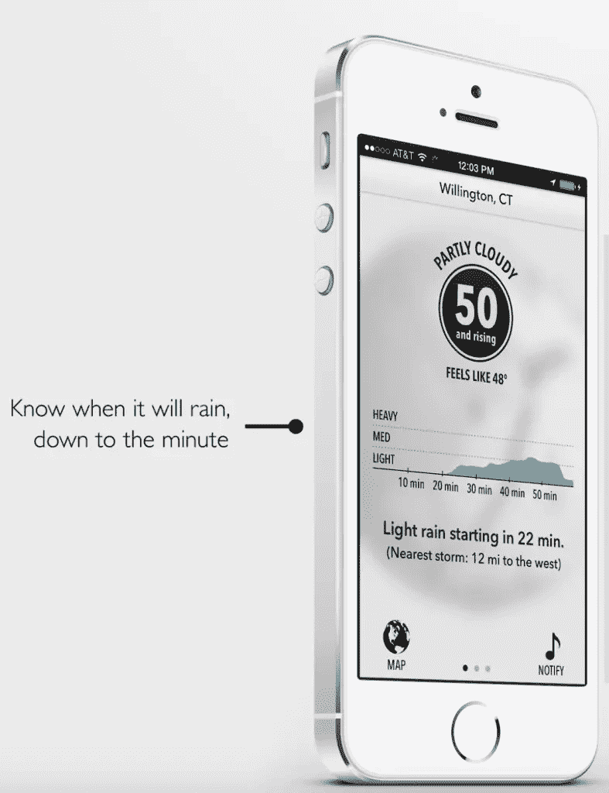
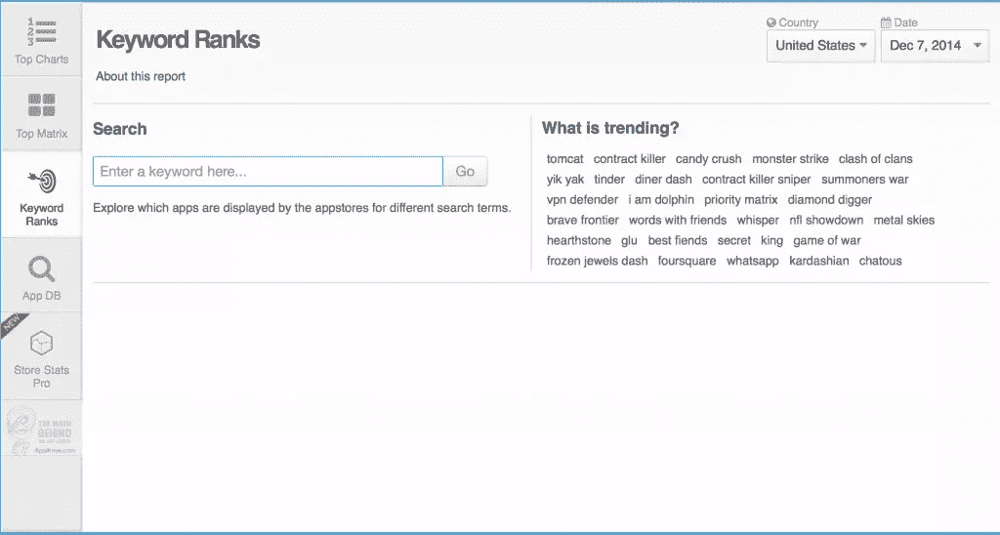
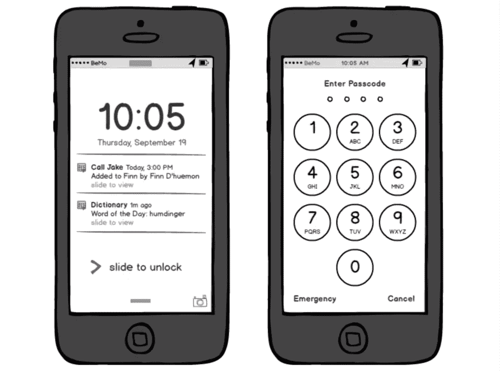
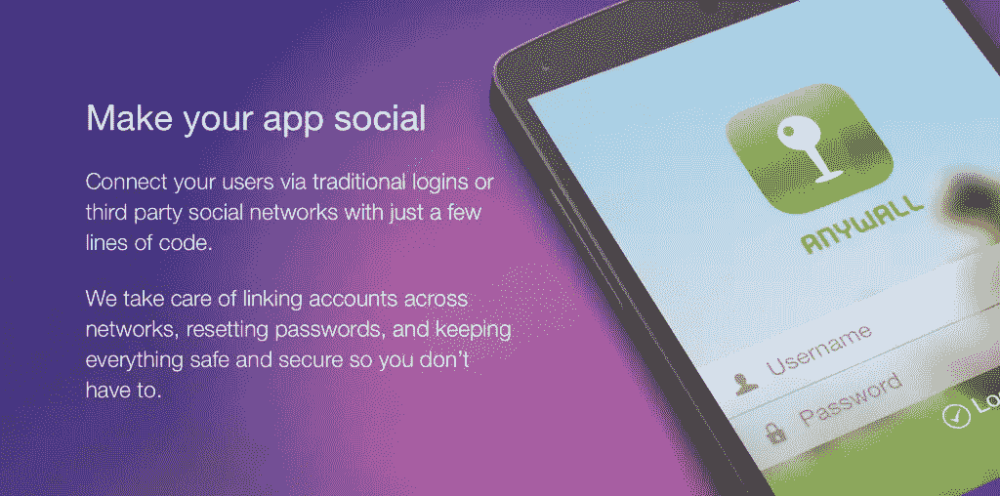

# 开始编写下一个 iOS 应用程序之前要采取的 8 个步骤

> 原文：<https://www.sitepoint.com/steps-take-start-coding-next-ios-app/>

无论你是经验丰富的 iOS 开发者，还是刚刚起步，有一个感觉是不变的。你想开始你的想法，你想现在就开始。鉴于 app store 生态系统的现状，这种方法很少能取得成功。在你输入一行代码之前，退一步回答重要的问题，进行必要的研究，为你的应用打下坚实的基础，这种需求从来没有像现在这样强烈。

在这篇文章中，我将概述一些你在着手下一个 iOS 应用之前应该考虑的步骤。我是根据经验来说的，因为我在一个周末开发了应用程序，并且在一个项目上花了大半年的时间。在许多版本发布之后，我已经确定了成功的实践，现在我将它们应用到每个项目中以促进成功。

这些步骤被提炼为八个部分，它们是:

*   验证你的想法
*   创建一份使命陈述
*   了解你的受众
*   分析竞争
*   创建功能集
*   创建实体模型
*   研究潜在技术
*   重复，重复，再重复！

## 验证你的想法

一切都是从一个想法开始的，但残酷的现实是，有些值得追求，有些不值得。app store 现在拥有超过 100 万个应用程序。这个事实已经被重复了一次又一次，但重要的是要考虑。你不能再胡乱拼凑一个应用程序，然后希望人们购买它。走这条路成功的几率很低，你可能有更好的机会玩彩票。如果有一样东西是你不想浪费的，那应该是你的时间。

当你有了一个应用程序的想法，问自己这三个问题:

*   这个想法以前有人做过吗？
*   人们会购买或搜索类似的应用吗？
*   这个想法是解决了问题还是满足了需求？

### 这个想法以前有人做过吗？

如果第一个问题的答案是否定的，不要气馁。为什么？因为几乎总是会在这一点上。如果你真的提出了一个以前没有人提出过的想法，那就值得花时间去研究。不过，在很大程度上，你想出的东西已经以某种形式被执行了。

没关系，因为你总能做得更好。例如，有几千种天气应用程序可用，但仍有新的应用程序成功发布。为什么？因为开发人员对这个想法的执行方式不同，或者把它分解成更小的部分。他们在一个广泛的用户群中找到了一个利基观众，他们正在寻找一个大流派中的其他东西。

像 [Dark Sky](http://darkskyapp.com) 这样的应用程序以一种非常以设计为中心的方式呈现天气信息。它还有一个大多数天气应用程序都没有的突出功能，那就是它可以精确到分钟预测天气。因此，如果你有一个以前已经有人提出过的想法，试着去填补这个领域中缺失的空白，或者找一个新的角度来阐述它。

### 人们会购买或搜索类似的应用吗？

像任何生意一样，需要有需求。幸运的是，有几种方法可以确认你的应用会被用户群搜索和需要。有一些有用的网站可以让你浏览 app store 中与需求相关的数据。

其中一个网站就是现在无处不在的 AppAnnie。它提供免费的应用分析和市场数据，其中一个免费功能是能够看到哪些关键词正在流行或被搜索。为你正在考虑的应用运行一些潜在的关键词是一个好主意，看看这些是不是人们在你的应用类型中用来搜索的术语。

### 这个想法是解决了问题还是满足了需求？

苹果经常重申，最好的应用程序解决一个问题，而且解决得非常好。成功的软件为最终用户提供了问题的解决方案，这并不奇怪。当你在思考你的 app 时，确保你能毫不犹豫地回答这个问题。

如果你在弄清楚你的应用程序在帮助解决什么问题上有问题，这是一个很好的迹象，表明你需要改进它。当你知道你的应用有助于实现什么时，它可以加速开发。设计和开发决策更容易做出，范围评估更准确，对最终用户的描述更准确。这是因为它有助于形成应用的使命宣言。

## 创建一份使命陈述

这一步对应用程序的开发至关重要。使命陈述用一两句话来定义你的应用要做什么。它没有深入到极端的细节，而是触及了大的想法或字幕功能。

例如，假设您正在创建一个简单待办事项列表的应用程序。回到我们之前关于验证你的想法的讨论，让我们假设你想出了一个尚未在待办事项应用中实现的杀手级功能。因此，任务声明可能是这样的:

> “(应用名称)是一个轻量级的待办事项列表，使用(一些杀手级功能)。”

在某个时候，你会想出一个完整的应用功能集。当决定更新时包含、删除或保存什么时，问问自己该特性是否支持使命陈述。这有助于避免功能蠕变，并有助于确定您的应用程序何时可以发布。

考虑一下，如果您正在讨论为应用程序添加多种配色方案的支持。在我们的例子中，你可能会说:

> “拥有多种配色方案是否支持这个轻量级待办事项应用程序使用或增强(一些杀手级功能)？”

因为答案是否定的，但是该特性仍然可以增加价值，所以您可以在将来的更新中实现该特性。

## 了解你的受众

一旦你确认了一个想法，并且有了一个使命陈述，开始考虑最终用户是一个好主意。同样，这也有助于开发特性集。考虑谁将会使用它，他们的年龄，位置和总体人口统计。

对于任何应用程序，在 app store 中都有几种不同的版本。不是所有用户都想要相同类型的体验，即使他们可能正在寻找一个应用程序来解决他们和许多其他人遇到的相同问题。制作一款面向儿童的游戏，画面单调乏味，可能没有意义。相反，一个更成熟的观众可能会发现简单的审美愉悦。

当你知道你想卖给谁时，你也知道他们的目标。你知道他们看重什么，他们使用手机的频率，他们是否有使用手机的经验等等。访问此[链接](http://www.convinceandconvert.com/social-media-strategy/how-to-create-customer-profiles-to-reach-your-target-audience/)来帮助描述您的潜在受众，并弄清楚他们可能期望在应用程序中获得什么样的体验。

## 分析竞争

由于很可能存在与你想制作的应用程序相似的应用程序，从这些应用程序的用户那里获得反馈的可能性很高。这很重要，因为你可以看到你的竞争对手哪里成功了，更重要的是，哪里失败了。

如果用户似乎喜欢某类应用程序的某个特定功能，那么这表明你的应用程序可能应该包含类似的功能。

假设您正在开发一个天气应用程序，在阅读了几篇关于热门天气应用程序的评论后，您注意到了一个共同的主题。所有用户都喜欢应用程序中包含的小部件，这样他们就可以快速浏览天气预报。现在你知道用户对天气应用有一个特定的基准，你应该努力满足它。

相反，最大的优势之一是知道你的竞争对手在哪里不足。一定要密切关注评论，并创建一个列表，列出人们认为该应用程序缺少的所有东西。当你完成你的特性集时，你会知道尝试并加入一些东西来满足现有应用没有满足的需求。

## 创建功能集

创建功能集将有助于指导应用程序的开发。在这里保持灵活性是值得的，因为这些特性在整个开发过程中会有波动。通过 beta 测试或其他方式，您会发现一些功能没有增加体验，或者没有很好地实现以提供好处。

当创建你的特性集时，记住每一个都应该支持应用的使命陈述。这将有助于避免填充功能只会增加“膨胀”的体验。特性集不必很深，我发现保持它们的广泛性很有价值。随着应用程序在开发过程中的成熟，这有助于您完善它们。

有一个详细的特性列表也不错。您可以为以后的更新保存许多想法。梳理一些正在开发的功能，让用户对即将到来的事情感到兴奋，因为一旦应用程序发布，你就可以继续建立你的受众。请记住，无论你有多少功能，每一个都需要增加应用程序的整体体验。

## 创建实体模型

在这个阶段，创建实体模型来演示用户如何使用应用程序将有助于开发人员开始开发。一些人喜欢精确细节的模型，而另一些人则保持高水平。

有许多有价值的工具可以用来制作模型，但我最喜欢的是 [Balsamiq](http://balsamiq.com) 。这个线框工具可以帮助你马上制作出一些原型，这样你就可以感受到这个应用程序是如何工作的。在开发过程中，有一个最终用户如何导航你的应用程序的参考点是很有价值的。这有助于消除设计者或用户体验分析师和开发团队之间可能存在的任何歧义。

## 研究潜在技术

这是我个人最喜欢的步骤之一，因为你的应用程序有这么多令人兴奋的选项。更好的是，在您的项目中，这些选项中的很多都是完全免费的。一旦你知道在开发过程中你将面临什么样的挑战，找到合适的工具来帮助你克服这些障碍是关键。

例如，许多应用程序需要某种后端。后端可以帮助跟踪用户数据、上传或处理许多应用程序需要的社交功能。一个流行的选择是最近被脸书收购的 [Parse](http://www.parse.com) 。它在一定程度上是免费的，但如果你越过了这个点，这意味着你的应用程序已经大受欢迎，所以这是一个好问题。

另一个值得一看的好地方是 github。我经常浏览 Objective-C 和 Swift 的趋势库，看看是否有人已经提出了我正在处理的问题的解决方案。这有助于节省你的应用程序的时间，也提供了一个学习的经历，看看另一个开发人员是如何解决你遇到的问题的。

## 重复，重复，再重复！

熟能生巧，开发原型应用程序的过程也不例外。这个过程对每个人来说可能看起来不同，但是这里呈现的主题将以某种方式闪耀。关键是你要从一个项目到另一个项目重复你的过程，并根据需要进行调整。

你可能会发现，有些步骤没有提供足够的洞察力，或者没有回答足够多的关于你的应用程序的问题。也许你看到有些步骤需要花更多的时间。无论情况如何，一定要改进你的工作流程，并意识到总有方法可以改进它。

## 结束语

我还想指出的是，尽管我鼓励你在开始使用一个应用程序之前进行研究和规划，但是打开 Xcode，开始你的一个想法也是很自由的。特别是作为一名开发人员，有时它会给你一种创造性的激励，让你开始着手进行概念验证。在这些情况下，我发现你可以采取这些类型的项目，然后把它们变成一个完全充实的想法。然后，您可以执行上面概述的步骤。

希望这些步骤对你有所帮助。许多开发人员都是非常面向任务的，提供一个结构来引导一个想法实现是有益的。请记住，在开发应用程序时，没有适用于所有人的完美指南。也许你只需要实现其中的几个步骤，或者将几个步骤结合起来。如果你在创建一个应用程序之前发现了任何有用的做法，一定要在下面的评论中分享它们。

## 分享这篇文章