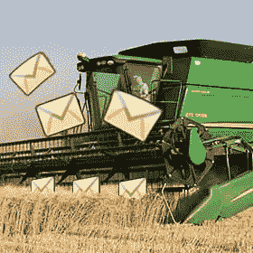

# 如何通过电子邮件混淆阻止垃圾邮件收割

> 原文：<https://www.sitepoint.com/stop-spam-harvesting-email-obfuscation/>

我发现“mailto:”链接的那一天真是太棒了。我可以在网页上公布我的地址，任何人只需点击一下就可以给我发电子邮件。这是在网络更加天真的时代——在垃圾邮件收集器接管之前。今天使用“mailto:”你的第一条伟哥信息会在 30 秒后出现。那么，如何发布电子邮件地址而不引起垃圾邮件发送者不必要的注意呢？

最显而易见的解决方法是在你的 HTML 中使用机器可读的电子邮件，例如“bob(at)bobsdomain . com”。虽然这对垃圾邮件发送者来说很难，但对你的用户来说也很难。



另一种选择是使用 JavaScript 生成电子邮件地址，可能还需要一点字符串连接或编码(例如

```
 <p>contact 
<script type="text/javascript">
document.write('<a href="mai'+"lto"+"bob"+'@'+'bobsdomain.com">bob@'+"bobsdomain.com</a>");
</script>
</p> 
```

这将阻止大多数垃圾邮件发送者，但任何禁用 JavaScript 的人将看不到您的地址。(我也不推荐使用 document.write。)

更好的解决方案是使用多种技术的组合来阻止垃圾邮件发送者，而不会给用户带来困难。第一步是在我们的 HTML 中使用一个人类可读但防收割机的电子邮件地址。我们还会将此链接到联系页面，例如

```
 <p>Contact <a href="contact.html" class="email">bob (at) bobsdomain dot com</a></p> 
```

请注意，我们已经包含了一个“电子邮件”类，因此我们的链接可以被识别。下一步是编写一个 JavaScript 函数，它会在您的页面中搜索混淆的电子邮件，并将它们转换成真正的“mailto:”链接。我们将创建一个“email.js”文件，并将其包含在我们的 HTML:

```
 <script type="text/javascript" src="email.js"></script> 
```

所需的代码很短，所以我们不需要 JavaScript 库:

**email . js 的内容:**

```
 function EmailUnobsfuscate() {

	// find all links in HTML
	var link = document.getElementsByTagName && document.getElementsByTagName("a");
	var email, e;

	// examine all links
	for (e = 0; link && e < link.length; e++) {

		// does the link have use a class named "email"
		if ((" "+link[e].className+" ").indexOf(" email ") >= 0) {

			// get the obfuscated email address
			email = link[e].firstChild.nodeValue.toLowerCase() || "";

			// transform into real email address
			email = email.replace(/dot/ig, ".");
			email = email.replace(/(at)/ig, "@");
			email = email.replace(/s/g, "");

			// is email valid?
			if (/^[^@]+@[a-z0-9]+([_.-]{0,1}[a-z0-9]+)*([.]{1}[a-z0-9]+)+$/.test(email)) {

				// change into a real mailto link
				link[e].href = "mailto:" + email;
				link[e].firstChild.nodeValue = email;

			}
		}
	}
} 
```

代码的解释:

1.  第 4 行获取 HTML 页面中的每个
2.  第 11 行检查“email”类的链接。
3.  第 14 行从节点的文本内容中抓取混淆的电子邮件。
4.  第 17 行到第 19 行使用正则表达式将它转换成一个真实的电子邮件地址:“dot”变成了一个“.”、“(at)”更改为“@”，并删除所有空格。
5.  第 22 行检查生成的电子邮件地址是否有效。
6.  第 25 行和第 26 行修改 DOM 节点，使其成为真正的“mailto:”链接。

最后，我们需要通过在 email.js 的底部添加一行来确保函数在页面加载时运行:

```
 window.onload = EmailUnobsfuscate; 
```

结果是:

*   我们的原始 HTML 页面不包含“mailto:”链接，不会轻易被垃圾邮件发送者获取。
*   大多数用户(启用了 JavaScript 的用户)将会看到一个标准的电子邮件地址和“mailto:”链接。
*   任何没有运行 JavaScript 的人都会看到可读的“bob(at)bobsdomain . com”地址。

本文的目的是展示概念而不是真正的代码。虽然这个例子可行，但我建议您:

*   使用您自己的模糊电子邮件格式，例如“bob {@} bobsdomain -dot- com”。垃圾邮件发送者可以像您一样轻松地阅读这篇文章并转换编码电子邮件！
*   使用不同的链接标识符类——“email”有点显而易见！
*   使用 JavaScript 库，比如 jQuery，来缩短函数。您还应该确保它能够处理电子邮件地址文本周围的空白或其他 DOM 节点(上面的代码中没有处理)。
*   用更健壮的事件处理程序替换 window.onload。

祝你好运。

## 分享这篇文章