# 在远程数据库中存储移动位置，第 2 部分

> 原文：<https://www.sitepoint.com/storing-mobile-positions-remote-database-part-2/>

## 介绍

在本系列的前一篇文章中，我们考虑了应用程序的架构，并从设计存储移动位置的数据库开始。

在第二部分中，我们将设计客户端部分，并添加管理本地移动应用程序和数据库之间通信的代码。

## 什么是方法

在开始设计和开发我们的移动应用程序之前，我们应该参观一下，并解释一下 Wakanda 用来管理对 Wakanda 服务器的 Ajax 调用的一些重要部分，这就是 Wakanda Ajax 框架，或 WAF。

WAF 是一个客户端和服务器端的 JavaScript 框架，允许使用 **REST/JSON** 或 **JSON-RPC** 服务进行通信(本文中没有用到)。WAF 架构可以由下图表示:

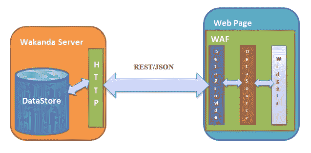

### WAF 的服务器端部分

这可以被认为是负责处理从客户端 WAF 到服务器(HTTP Wakanda 服务器)的 HTTP 调用并将它们转换成数据库查询的部分。它是上一篇文章中看到的 MVC 架构中的控制器。

### 注意:

服务器端 WAF 包含许多其他可以使用的 JavaScript APIs，如文件和文件夹 API、SystemWorker、SharedWorker、NET 模块等。

### WAF 的客户端部分

它由 web 浏览器自动加载，包含许多由 Wakanda 工程师开发或集成到 Wakanda WAF 中的 API，如 jQuery、jQueryUI、Raphael 等等。将在我们的应用程序中使用并出现在上图中的三个部分是:

### 数据提供者

这是使用 XMLHttpRequest 对象通过 HTTP 向服务器发送 Rest/JSON 请求，直接自动与服务器通信的部分。它为服务器端数据存储中的每个数据类提供一个代理对象。ds 对象表示数据存储的公共部分，因此在客户端，我们可以使用该对象直接查询数据存储。例如:

```
// get all entities from the Position dataClass
ds.Position.all();

// get the longitude of the position with key equal to 1

ds.Position(1).longitude;
```

有关 DataProvider API 以及如何使用它来查询数据存储的更多细节，请看一下[这个文档](http://doc.wakanda.org/Dataprovider/Introduction.200-608064.en.html)。

### 数据源

这是一组 API，可以自动管理小部件中表示的数据。使用数据源在页面中使用数据的优点是，小部件中表示的数据独立于小部件，并且有自己的事件管理系统。因此，当数据被修改时，会触发一个事件。Datasource 还让您能够查询小部件中表示的实体集合。

有关数据源 API 的更多详细信息，请参见本文档。

### 小工具

小部件是 Wakanda 的 HTML5、CSS3 和基于 JavaScript 的界面元素。Wakanda 有三种类型的小部件:桌面、平板和移动。小部件可以直接从 Datasource 对象加载数据。

有关小部件 API 的更多细节，请参见[本文档](http://doc.wakanda.org/Widgets-API/Widgets-API.10%20-744727.en.html)。

## 开发移动应用程序:

在开始开发移动应用程序之前，我应该注意到开发是使用特定的 Wakanda 版本和 Wakanda Studio 扩展的社区版本完成的:

*   **机器:** Windows 7，64xbits，6 Go。

*   **瓦坎达版本/build:** 4.132351。(*应使用相同的构建*

### 1.在页面中创建位置数据源

在右侧面板的底部，右键单击“Position”数据存储类并选择**创建数据源**:

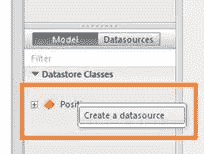

### 2.设计用户界面

在客户端移动页面中，我们将通过添加小部件和修改它们的一些样式属性来设计用户界面。具体来说，是将位置发送到后端数据库的按钮和文本字段。

正如我在本文的[中所解释的，切换到智能手机页面以获得更多关于 Wakanda 中页面路由的细节。看看](https://www.sitepoint.com/cut-mobile-app-dev-time-with-phonegap-wakanda-studio-extension/)[这个 doc](http://doc.wakanda.org/home2.en.html#/Architecture-of-Wakanda-Applications/Page/Routing-Pages.300-1025560.en.html) 。

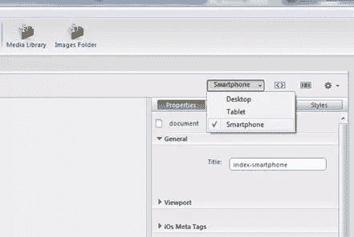

接下来，使用“样式”面板修改主页的背景色。移动页面包含两个只读的 textField 小部件，以及一个将地理位置发送到后端 Wakanda 服务器的按钮。应该将**经度**和**纬度**属性设置为两个 textFields 小部件的源，如下图所示:

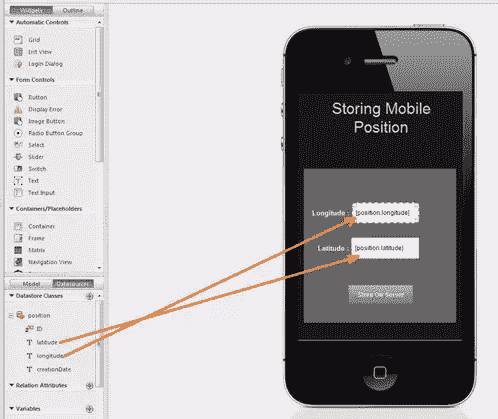

### 3.编码按钮事件

然后，我们将向按钮添加一个 onClick 事件。通过这个事件，我们将使用 PhoneGap 地理定位 API 获得移动位置，并使用 WAF 数据源 API 将其发送到服务器。因此，要向“存储在服务器中”按钮添加 onClick 事件，请转到右侧面板，选择 Events 选项卡，然后单击 onClick 图标。添加:

```
button2.click = function button2_click(event) {

    // Get the current position from the mobile using the geolocation API
    navigator.geolocation.getCurrentPosition(Success, Error);

    function Success(position) {

        // Create a new position datasource entity
        sources.position.addNewElement()

        // Set the entity longitude and latitude
        sources.position.longitude = position.coords.longitude;
        sources.position.latitude = position.coords.latitude;

        // Set the creation Date as the current date
        sources.position.creationDate = new Date();

        // Save the entity in the remote Wakanda server
        sources.position.save({
            onSuccess: function (e) {
                alert("saved");
            },

            onError: function (err) {
                alert(err.message);
            }

        });

    }

    function Error(err) {
        alert(err.message);
    }

};
```

### 4.解释代码

第一行代码使用地理定位 Phonegap API 来获取手机的当前位置。两个回调函数作为参数传递给`getCurrentPosition()`方法。第一个在操作成功时执行，第二个在出现错误时执行:

```
navigator.geolocation.getCurrentPosition(Success, Error);
```

在**成功**函数中，当移动设备的位置被检索时，首先我们使用方法 **newEntity()** 创建一个新的空实体，它是 WAF 的一部分:

```
sources.position.addNewElement();
```

接下来，我们使用检索到的位置经度和纬度以及 creationDate 属性的当前日期实例化新实体:

```
// set the longitude and latitude to the datasource

sources.position.longitude = position.coords.longitude;
sources.position.latitude = position.coords.latitude;

sources.position.creationDate = new Date();
```

接下来，我们应该使用 save()方法将创建的实体保存在远程数据存储中。这个方法是异步执行的，所以我们使用 PhoneGap API 中使用的两个回调函数:getCurrentPosition()，onSuccess 参数“event”包含新保存的实体，onError 参数“Error”包含保存失败的原因:

```
sources.position.save({

    onSuccess: function (e) {
        alert("saved");
    },

    onError: function (err) {
        alert(err.message);
    }

});
```

### 5.使用 Ripple 测试 Web 项目:

在打包 web 应用程序并进行本地化之前，我们应该测试 web 部件是否正常工作。如果它作为 web 应用程序正常工作，它应该在 PhoneGap web 容器中工作。为此，我们将为 Google Chrome 使用一个名为 [Ripple](https://chrome.google.com/webstore/detail/ripple-emulator-beta/geelfhphabne%20jhdalkjhgipohgpdnoc) 的移动 web 模拟器扩展，它可以模拟本地移动功能。

首先，在谷歌 Chrome 上安装插件，点击“运行文件”按钮，从瓦坎达工作室运行智能手机页面:

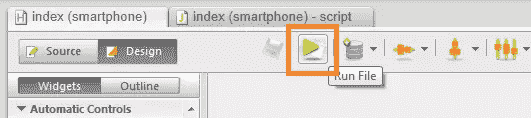

现在我们可以启用 Ripple 插件了。

点击页面右侧的波纹图标，然后点击“启用”按钮:

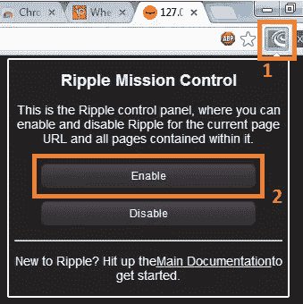

选择 Apache Cordova 2.0.0 作为平台:

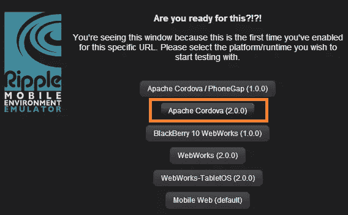

在左侧菜单中，选择 iPhone 4/4S 作为设备:

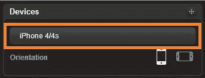

然后进入右侧菜单，点击地理定位，并在地图中导航以修改当前移动位置:

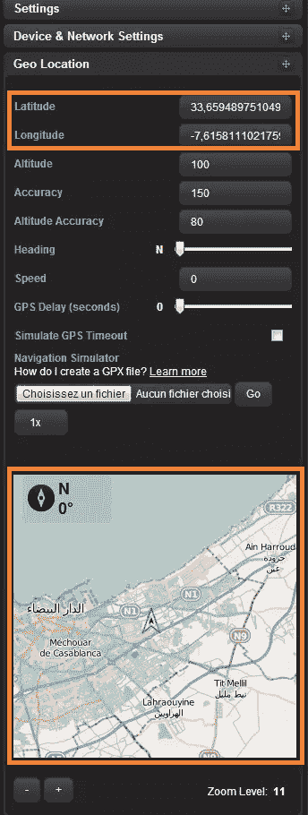

准备好 Ripple 模拟器后，我们现在应该通过单击服务器上的**Store**按钮将位置发送到远程服务器来测试应用程序。新位置应出现在文本字段中，如果操作成功，将显示一条警告消息:

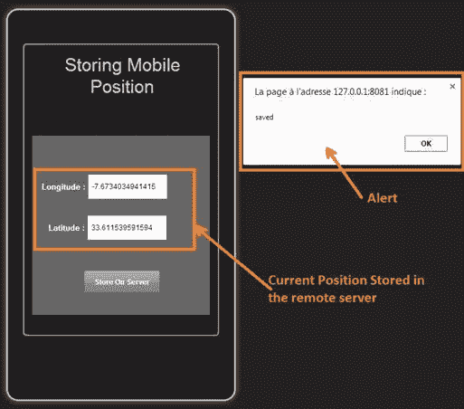

为确保位置正确存储在瓦坎达服务器数据存储中，请进入瓦坎达工作室，点击**数据浏览器**图标，查看数据存储中的全部数据:

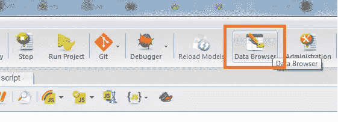

将打开一个新页面，显示数据网格中的所有位置数据类实体:

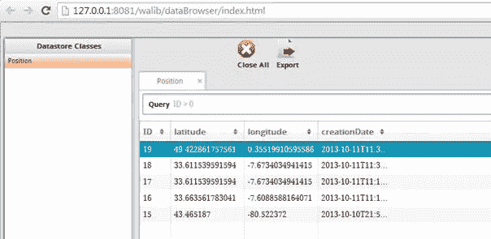

参考我的文章[使用 PhoneGap Wakanda Studio 扩展缩短移动应用程序开发时间](https://www.sitepoint.com/cut-mobile-app-dev-time-with-phonegap-wakanda-studio-extension/)来了解打包过程的完整分步描述。不要忘记选中“设置首选项”复选框，以允许应用程序使用 PhoneGap 的地理位置 API。

### 注意:

我已经在 android 模拟器上对应用程序进行了本地测试，所以我在我的机器的 IP 地址中添加了 IP 地址和端口，而不是回送 IP: 127.0.0.1，因为使用回送 IP 可能会导致 Android 模拟器中的端口冲突。

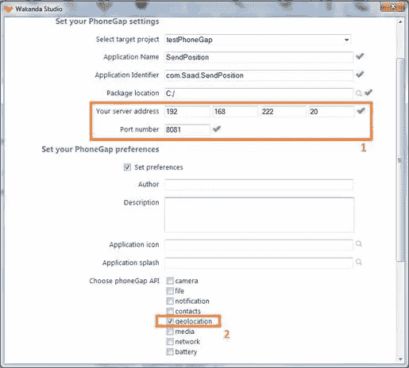

如果您需要在设备上测试应用程序，请输入设备可以访问的正确公共 IP 地址，并确保防火墙不会阻止对给定端口的访问。

完成所有强制设置后，单击 package 按钮获取。应该发送到 [PhoneGap build 网站](https://build.phonegap.com/)并获取。apk 文件。整个过程在[以前的一篇文章](https://www.sitepoint.com/cut-mobile-app-dev-time-with-phonegap-wakanda-studio-extension/)中有解释。

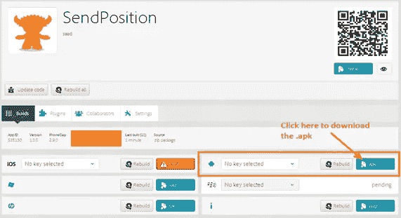

### 注意事项:

使用 PhoneGap 扩展后，不要忘记重启 Wakanda 服务器。必须重新启动才能激活添加到项目中的引导文件。

你可以拉开拉链。zip 文件，并在 ripple 中测试 index.html 页面，然后将您的应用程序上传到 PhoneGap Build 网站，它应该可以正常工作。

[在这里](http://developer.android.com/tools/building/building-cmdline.html)您将了解如何安装。在 Android 模拟器中使用 adb 命令的 apk 文件。

现在，该应用程序已安装在仿真器中，我们可以将其作为原生 Android 应用程序进行测试:

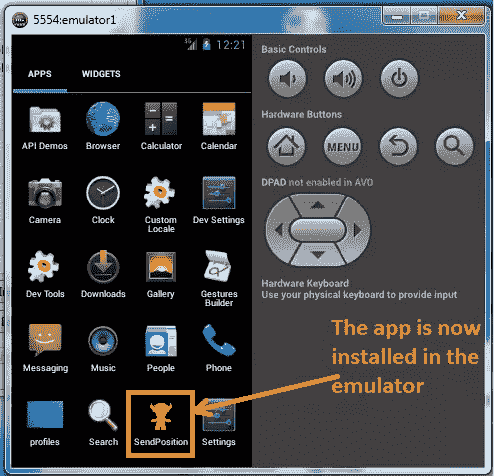

通过点击 Android 模拟器中的应用图标，我们可以启动它并开始我们的测试:

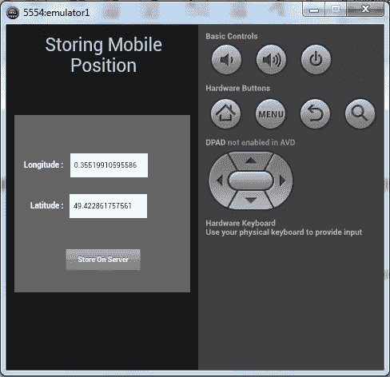

## 结论

在本文中，我们看到了如何使用 Wakanda Studio 开发移动 web 应用程序，如何使用 WAF 编写向服务器发送数据的函数，以及如何在 Android 模拟器上打包和测试应用程序。许多想法和移动应用程序可以使用相同的流程开发，并部署在 IOS、Android 或任何其他移动操作系统上。

我们已经完成了这个系列教程，在这里我们已经了解了使用 Wakanda 和 PhoneGap 开发移动应用程序的整个过程。我希望这将帮助其他开发人员使用相同的工具创建一个移动应用程序。

## 资源

*   获取 PhoneGap 扩展:[https://www . Dropbox . com/s/XT 6 zwelglx 789 I 4/PhoneGap _ extension . zip](https://www.dropbox.com/s/xt6zwelglx789i4/PhoneGap_Extension.zip)

*   瓦坎达解决方案也可以在 GitHub 上找到:[https://github.com/saadmos/SendMobilePosition](https://github.com/saadmos/SendMobilePosition)

## 分享这篇文章