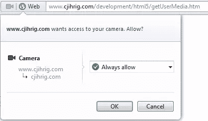

# 用 JavaScript 将您的网络摄像头传输到浏览器

> 原文：<https://www.sitepoint.com/stream-your-webcam-to-a-browser-in-javascript/>

Opera Software [最近发布了旗舰网络浏览器的第 12 版](https://www.sitepoint.com/whats-new-in-opera-12/ "What's New in Opera 12")。随着最新版本的发布，Opera 成为 T2 第一个开始支持 T4 W3C 多媒体流 API T5 的主流浏览器。Stream API 也称为 getUserMedia API，允许用户的摄像头和麦克风输入以流的形式传输到浏览器窗口。一旦被传递到浏览器，该流通常被用作<视频>元素的“src”属性。因为流 API 仍然是一个广泛不受支持的草案，它很可能会随着时间的推移而改变。这篇文章涵盖了流 API 的基础知识。随着草案变得更加稳定和得到广泛支持，这一职位将会扩大。

## 检测支架

目前，Opera 是唯一支持 Stream API 的浏览器。因此，在尝试使用该 API 之前，检测它是否受支持是绝对必要的。以下函数通过检查 navigator 对象的 getUserMedia()方法是否存在来检测流支持。

```
function isStreamSupported() {
  if (navigator.getUserMedia)
    return true;
  else
    return false;
}
```

## getUserMedia()方法

流 API 是通过 navigator.getUserMedia()方法访问的。然而，在访问任何多媒体流之前，用户必须明确授予浏览器权限。当调用 getUserMedia()时，Opera 使用下面的对话框来接收用户的同意。



getUserMedia()的语法如下所示。该方法采用两个强制参数和一个可选的第三个参数。第一个参数“constraints”是一个指定浏览器请求哪些媒体流(即视频和/或音频)的对象。第二个参数“successCallback”是一个回调函数，如果 getUserMedia()成功，就会执行该函数。产生的媒体流对象作为其唯一的参数传递给“successCallback”。可选的第三个参数“errorCallback”是在 getUserMedia()失败时执行的回调函数。例如，如果用户不同意让浏览器访问多媒体流，就会发生失败。

```
navigator.getUserMedia( constraints, successCallback[, errorCallback] )
```

## 流向一个<video>元素</video>

下面的例子展示了如何使用 getUserMedia()将摄像机流直接发送到 HTML <video>元素。该示例提供了用于控制多媒体流的播放、暂停和停止按钮。请注意,“constraints”变量导致浏览器请求音频和视频流。如果你用的是 Opera，这个例子也是在线直播[这里是](http://www.cjihrig.com/development/html5/getUserMedia.htm "getUserMedia Example")。</video>

```
<!DOCTYPE html>
<html lang="en">
<head>
  <title>getUserMedia Example</title>
  <meta charset="UTF-8"/>
  <script>
    window.addEventListener("load", function() {
      var camera = document.getElementById("camera");
      var play = document.getElementById("play");
      var pause = document.getElementById("pause");
      var stop = document.getElementById("stop");
      var constraints = {audio:true, video:true};

      function success(stream) {
        camera.src = stream;
        camera.play();
        disableButtons(true, false, false);
      }

      function failure(error) {
        alert(JSON.stringify(error));
      }

      function disableButtons(disPlay, disPause, disStop) {
        play.disabled = disPlay;
        pause.disabled = disPause;
        stop.disabled = disStop;
      }

      disableButtons(true, true, true);

      if (navigator.getUserMedia)
        navigator.getUserMedia(constraints, success, failure);
      else
        alert("Your browser does not support getUserMedia()");

      play.addEventListener("click", function() {
        disableButtons(true, false, false);
        camera.play();
      }, false);

      pause.addEventListener("click", function() {
        disableButtons(false, true, false);
        camera.pause();
      }, false);

      stop.addEventListener("click", function() {
        disableButtons(true, true, true);
        camera.pause();
        camera.src = "";
      }, false);
    }, false);
  </script>
</head>
<body>
  <button id="play">Play</button>
  <button id="pause">Pause</button>
  <button id="stop">Stop</button>
  <br />
  <video id="camera"></video>
</body>
</html>
```

## 分享这篇文章