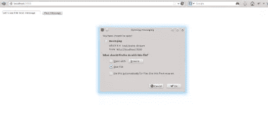

# 使用 Rails 4 进行流式传输

> 原文：<https://www.sitepoint.com/streaming-with-rails-4/>

## 什么是流媒体？

从 3.2 开始，流就出现在 Rails 中，但它仅限于[模板流](http://apidock.com/rails/ActionController/Streaming)。Rails 4 提供了更加成熟的实时流功能。本质上，这意味着 Rails 现在能够本地处理 I/O 对象，并实时向客户端发送数据。

`Streaming`和`Live`是在`ActionController`下编写的两个不同的模块。默认情况下会包含`Streaming`，而`Live`需要在控制器子类中明确定义。

主要的流 api 使用 Ruby 的`Fiber`类(在 1.9.2+中可用)。`Fiber`提供了 ruby 中类似线程的并发的构建块。`Fiber`被调用的线程可以被程序员随意暂停和恢复，而不是天生被抢占。

### 模板流

流式处理颠倒了常规的 Rails 呈现布局和模板的过程。默认情况下，Rails 首先呈现模板，然后呈现布局。它运行的第一个方法是`yield`，并加载模板。然后，渲染资源和布局。

考虑一个查询密集型视图，比如多个类的系统范围的时间线，如下所示:

```
class TimelineController
  def index
    @users = User.all
    @tickets = Ticket.all
    @attachments = Attachment.all
  end
end
```

在这种情况下，流媒体似乎是一个很好的选择。在典型的 Rails 场景中，这个页面的加载时间要比平常长，因为它必须首先检索所有数据。

让我们添加流:

```
class TimelineController
  def index
    @users = User.all
    @tickets = Ticket.all
    @attachments = Attachment.all

    render stream: true
  end
end
```

Rails 方法`render stream: true`将延迟加载查询，并允许它们在呈现资产和布局之后运行。流式只适用于模板，不适用于任何其他形式(比如 json 或 xml)。这增加了一项巧妙的技术，让应用程序根据页面和内容的类型来区分模板的优先级。

### 在它们之间传递东西

流式处理改变了呈现模板和布局的方法。这带来了一个逻辑问题:利用实例变量的模板。

由于呈现模板时数据库调用尚未发生，因此引用实例变量将失败。

因此，为了加载像`title`或`meta`这样的属性，我们需要使用`content_for`而不是常规的`yield`方法。然而，`yield`仍然对身体起作用。

以前，我们的方法是这样的:

```
<%= yield :title %>
```

它现在看起来像这样:

```
<%= content_for :title, "My Awesome Title" %>
```

### 使用实时 API 上线

`Live`是 ActionController 类中包含的一个特殊模块。它使 Rails 能够显式地打开和关闭流。让我们创建一个简单的应用程序，看看如何包含它并从外部访问它。

我们正在研究实时流和并发的概念，而 WEBrick 在这方面做得不好。因此，我们将使用 [Puma](http://puma.io) 来处理应用程序中的并发性和线程。

将 Puma 添加到 Gemfile 和 bundle 中。

```
gem "puma"
```

```
:~/testapp$ bundle install
```

Puma 与 Rails 集成得很好，所以只要你运行“rails s ”(如果你已经在运行它，需要重启服务器), Puma 就会在与 WEBrick 相同的端口号上启动。

```
:~/testapp$ rails s
=> Booting Puma
=> Rails 4.0.0 application starting in development on http://0.0.0.0:3000
=> Run `rails server -h` for more startup options
=> Ctrl-C to shutdown server
Puma 2.3.0 starting...
* Min threads: 0, max threads: 16
* Environment: development
* Listening on tcp://0.0.0.0:3000
```

让我们快速生成一个发送消息的控制器。

```
:~/testapp$ rails g controller messaging
```

还要添加将消息输出到标准输出的基本方法。

```
class MessagingController < ApplicationController
  include ActionController::Live

  def send_message
    response.headers['Content-Type'] = 'text/event-stream'
    10.times {
      response.stream.write "This is a test Messagen"
      sleep 1
    }
    response.stream.close
  end
end
```

以及 **routes.rb** 中的一条路线

```
get 'messaging' => 'messaging#send_message'
```

我们可以通过 curl 访问这个方法，如下所示:

```
~/testapp$ curl -i http://localhost:3000/messaging
HTTP/1.1 200 OK
X-Frame-Options: SAMEORIGIN
X-XSS-Protection: 1; mode=block
X-Content-Type-Options: nosniff
X-UA-Compatible: chrome=1
Content-Type: text/event-stream
Cache-Control: no-cache
Set-Cookie: request_method=GET; path=/
X-Request-Id: 68c6b7c7-4f5f-46cc-9923-95778033eee7
X-Runtime: 0.846080
Transfer-Encoding: chunked

This is a test message
This is a test message
This is a test message
This is a test message
```

当我们调用方法`send_message`时，Puma 启动一个新线程，并在这个线程中为单个客户端处理数据流。默认的 Puma 配置允许 16 个并发线程，这意味着 16 个客户端。当然，这是可以增加的，但是不能没有一些内存开销。

让我们构建一个表单，看看是否可以向视图发送一些数据:

```
def index
  end

  def send_message
    response.headers['Content-Type'] = 'text/event-stream'
    10.times {
      response.stream.write "#{params[:message]}n"
      sleep 1
    }
    response.stream.close
  end
```

创建一个将数据发送到流的表单。

```
<%= form_tag messaging_path, :method => 'get' do %>

    <%= text_field_tag :message, params[:message] %>
    <%= submit_tag "Post Message" %>

<% end %>
```

和打电话的路线。

```
root 'messaging#index'
  get  'messaging' => 'messaging#send_message', :as => 'messaging'
```

一旦您键入消息并按下“Post Message ”,浏览器就会收到流响应，作为一个可下载的文本文件，其中包含记录了 10 次的消息。



然而，在这里，流不知道将数据发送到哪里或者以什么格式发送。因此，它会写入服务器上的文本文件。

你也可以通过 [curl](http://curl.haxx.se/) 发送参数来检查。

```
:~/testapp$ curl -i http://localhost:3000/messaging?message="awesome"

HTTP/1.1 200 OK
X-Frame-Options: SAMEORIGIN
X-XSS-Protection: 1; mode=block
X-Content-Type-Options: nosniff
X-UA-Compatible: chrome=1
Content-Type: text/event-stream
Cache-Control: no-cache
Set-Cookie: request_method=GET; path=/
X-Request-Id: 382bbf75-7d32-47c4-a767-576ec59cc364
X-Runtime: 0.055470
Transfer-Encoding: chunked

awesome
awesome
```

## 服务器端事件(SSEs)

HTML5 引入了一种叫做服务器端事件(SSEs)的方法。SSE 是浏览器中可用的一种方法，每当服务器发送数据时，它都会识别并触发一个事件。

您可以结合使用 SSE 和 Live API 来实现全双工通信。

默认情况下，Rails 通过在数据可用时将流写入客户端来提供单向通信过程。但是，如果我们可以添加 SSE，我们就可以启用事件和响应，从而使之成为双向的。

一个简单的 SSE 如下所示:

```
require 'json'

module ServerSide
  class SSE
    def initialize io
      @io = io
    end

    def write object, options = {}
      options.each do |k,v|
        @io.write "#{k}: #{v}n"
      end
      @io.write "data: #{object}nn"
    end

    def close
      @io.close
    end
  end
end
```

这个模块将 I/O 流对象分配给一个散列，并将其转换成一个键-值对，以便于读取、存储和以 JSON 格式发回。

现在，您可以将流对象包装在 SSE 类中。首先，在你的控制器中包含你的`SSE`模块。现在，连接的打开和关闭由`SSE`模块处理。此外，如果没有显式终止，循环将无限继续下去，连接将永远打开，所以我们添加了`ensure`子句。

```
require 'server_side/sse'

class MessagingController < ApplicationController
  include ActionController::Live

  def index
  end

  def stream
    response.headers['Content-Type'] = 'text/event-stream'
    sse = ServerSide::SSE.new(response.stream)
    begin
      loop do
        sse.write({ :message => "#{params[:message]}" })
        sleep 1
      end
    rescue IOError
    ensure
      sse.close
    end
  end
end
```

响应看起来是这样的:

```
:~/testapp$ curl -i http://localhost:3000/messaging?message="awesome"
HTTP/1.1 200 OK
X-Frame-Options: SAMEORIGIN
X-XSS-Protection: 1; mode=block
X-Content-Type-Options: nosniff
X-UA-Compatible: chrome=1
Content-Type: text/event-stream
Cache-Control: no-cache
Set-Cookie: request_method=GET; path=/
X-Request-Id: b922a2eb-9358-429b-b1bb-015421ab8526
X-Runtime: 0.067414
Transfer-Encoding: chunked

data: {:message=>"awesome"}

data: {:message=>"awesome"}
```

## 逮到你了

有几个陷阱(总是有……)

1.  所有的溪流都必须关闭，否则它们将永远开放。
2.  你必须确保你的代码是线程安全的，因为当方法被调用时，控制器总是产生一个新的线程。
3.  在第一次提交响应后，不能在`write`或`close`中重写报头。

## 结论

这是许多人期待的功能，因为它将显著提高 Rails 应用程序(模板流)的性能，并对 node.js (Live)构成强大的竞争。

已经有人对这些差异进行了基准测试，但我觉得这只是开始，还需要时间(阅读后续版本)来让特性变得成熟。就目前而言，在 Rails 中获得这些特性是一个良好的开端，令人兴奋。

## 分享这篇文章