# 类固醇条纹:11 种方法增压你的网上商店

> 原文：<https://www.sitepoint.com/stripe-on-steroids-11-ways-to-supercharge-your-online-store/>

最近，一些新业务以[条纹](https://stripe.com/)为起点蓬勃发展。许多公司已经决定在这个流行的支付网关上建立一些东西。尽管该公司仍处于“蹒跚学步”阶段——成为 Stripe [的服务的第一行代码是在 2009 年](https://stripe.com/about/press)左右输入的——许多初创公司和在线企业已经注意到使用他们的 API 进行构建是多么容易。

这有两个主要原因:Stripe 有一个易于集成的 API，其他网关如 PayPal 有问题，多亏了这个 API 才得以解决。

这里收集了基于 Stripe 的 11 个应用和服务，都值得关注。如果你还有我错过的，请在评论中告诉我。

## 发票生成器

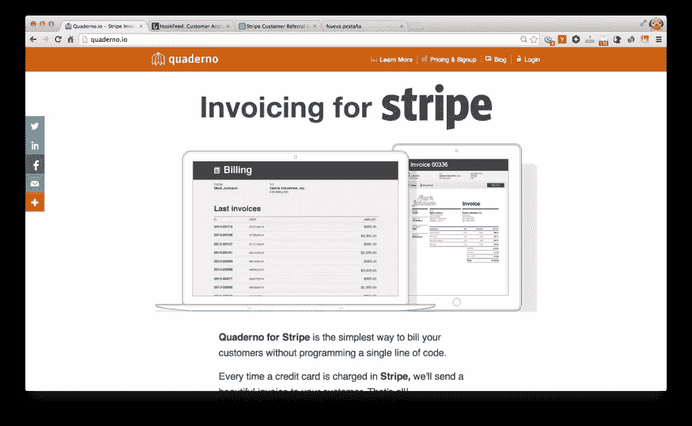

我的公司在 [Quaderno.io](http://www.quaderno.io) 提供的解决方案有一个特定的目标:根据你在 Stripe 账户上的任何费用创建和管理发票。Stripe 到目前为止还没有开发出这样的内部解决方案，所以 Quaderno 为您省去处理您销售的任何商品的发票的所有麻烦。只需同步您的 Stripe 和 Quaderno 帐户，只需点击两次，无需代码，您就可以迅速将发票交付给您的客户。此外，如果你的业务是在欧盟，这个解决方案[也将处理增值税噩梦](http://quaderno.io/stripe-vat-invoicing/)。

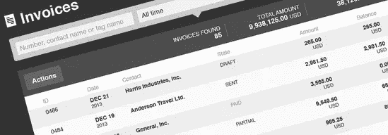

### 笔记本

**价格**:从$24/月起。

**免费试用？没有免费试用，但保证 60 天退款**

## 客户分析

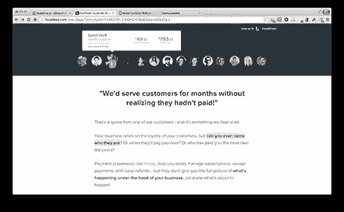

想象一下 KISSmetrics 和 Stripe 有了孩子。这是我能想到的对 Hookfeed 的最好描述，这是一个给你洞察力的工具，不是笼统地，而是具体地关于你的每一个客户。

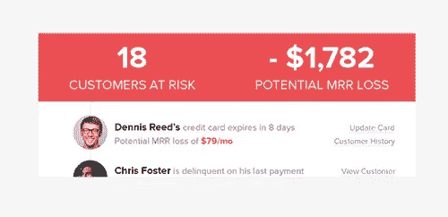

除了为您提供其他更通用的指标，例如当前月收入，这个工具真的非常非常有用！—有助于确定什么样的客户最有利可图。换句话说，通过准确了解特定类型客户的盈利能力，你将能够专注于未来的商业决策，为那些对你更有价值的客户创造价值。

### [钩进](http://www.hookfeed.com)

**价格:**释放你的前 25 个客户，然后价格从$10/月开始。

**免费试用？**是的，如果你的顾客不超过 25 人，它将保持免费。

## 客户推荐计划

如果有像 ReferralCandy 或 Ambassador 这样的不可知的推荐平台，那么是时候为 Stripe 专门创建一个了。ReferralPop 通过提供一个解决方案来实现这一点，使将推荐系统集成到您的应用程序变得非常简单。另一个涵盖类似解决方案的工具是[Referral saascottch](http://www.referralsaasquatch.com/)，它不仅为 Stripe 做好了准备，也为 Recurly 和 Braintree 等其他流行的支付网关做好了准备。

### [引用弹出](http://referralpop.com/)

**价格**:$49/月
**免费试用？是的，为期 14 天的试用，没有任何承诺。**

## 失败付款的管理

信用卡过期、卡失效、技术问题——这些都不应该成为不向你的客户收取信用卡费用的理由。对你的一些客户来说，直接借记和支票支付可能仍然是这种情况，但他们中的大多数人会发现使用信用卡支付更容易。

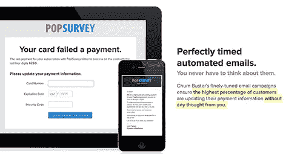

像 [ChurnBuster](http://www.churnbuster.io) 或[击昏](http://www.bestunning.net) monitor 这样的工具可以提醒你在计费过程中可能发生的任何事件。

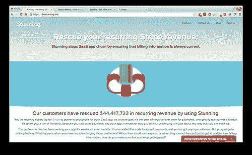

### ChurnBuster

价格:50 美元/月，这应该能帮你在 LTV 每月节省 1200 美元左右。

**免费试用？** 1 个月免费试用。

### [惊艳](http://bestunning.net)

价格:50 美元/月，但是如果你和[联系的话，还有更低的价格。](https://bestunning.net/#pricing)

**免费试用？**是的，15 天试用期。

## 分析服务

不只是一家，而是三家企业已经承担了为 Stripe API 返回的数据赋予某种形状的任务。基于您的条纹费用计算的每月经常性收入？没问题。基于未收到费用的流失率？轻松点。

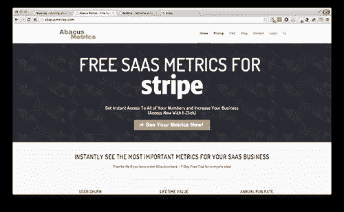

### [Abacusmetrics](http://www.abacusmetrics.com)

**价格:**免费！如果您的用户/客户不超过 50 人。

**免费试用？**只要你的订户少于 50 人，就永远免费。

这些是像 [Baremetrics](http://baremetrics.io) 、[大副](http://firstofficer.io)或 [AbacusMetrics](http://www.abacusmetrics.com) 这样的解决方案所针对的一些计算。它们使通过支付网关从您的财务数据中获取信息变得更加容易。一种不弄脏手就能钻研数字的简单方法。

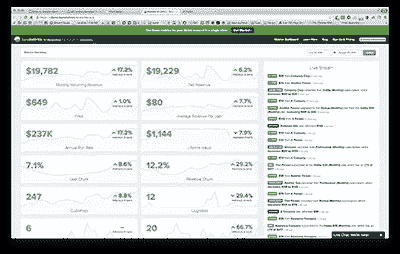

### [Baremetrics](http://www.baremetrics.io)

**价格:**$39/月，最低方案。

**免费试用？** 60 天退款保证，够你用吗？

### 第一副驾驶

**价格:**最便宜的是$29/月。

**免费试用？**两个月退款保证。

## 上传一个文件，用 Stripe 卖

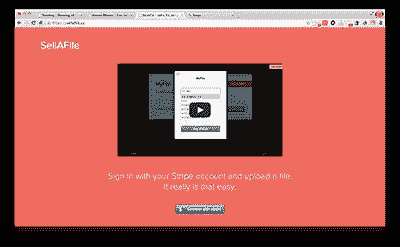

顾名思义， [**SellAFile**](http://www.sellafile.co) 让卖文件变得简单易行:上传你一直在做并想卖给别人的文件——即 PSD 模板，电子书，插件等。—这个工具会给你一个链接，发送给你的买家。

### [塞拉文件](http://sellafile.co)

**价格:**每笔交易收取 2%。

**免费试用？**没有。

## 将 Stripe 与其他应用程序连接

由于 Zapier 或 Torpio 等服务，Stripe 还可以与市场上一些最受欢迎的应用程序合作。如果你只是在寻找一个快速的方法来将一个给定的应用程序连接到 Stripe，首先尝试 Zapier。另一方面，如果你需要开发一些更适合你需求的东西(使用 webhooks 并构建你的定制脚本),请查看 [Torpio](http://torpio.com) 。

### [托皮奥+条纹](https://torpio.com/services/stripe/)

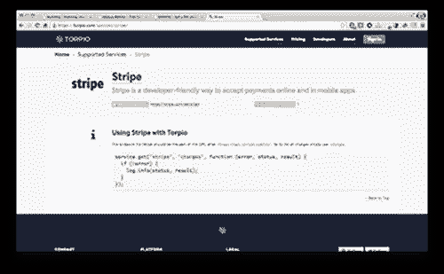

价格:免费，如果你不设置超过 5 个脚本和使用少于 1000 运行/月。

免费试用？见上文。

### [扎皮尔+条纹](https://zapier.com/zapbook/stripe/)

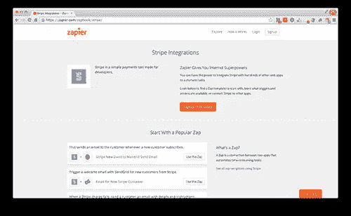

价格:和 Torpio 一样，如果你设置的脚本不超过 5 个，它是免费的。但它被限制在 100 次“zaps”或运行。

**免费试用？**在一定限额内免费。

## 你最喜欢的条纹增强是什么？

尽管是如此年轻的服务，但已经有大量有用的应用程序建立在 Stripe 的 API 之上。你最喜欢的基于条带的服务是什么？

## 分享这篇文章