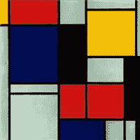
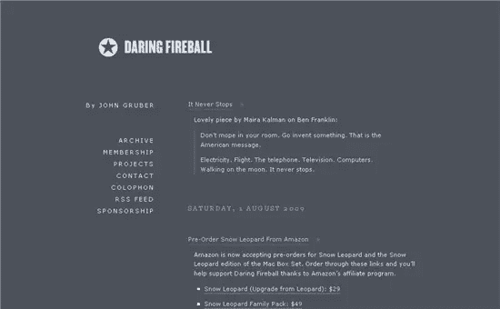
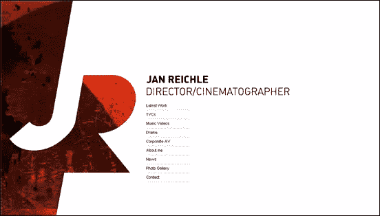
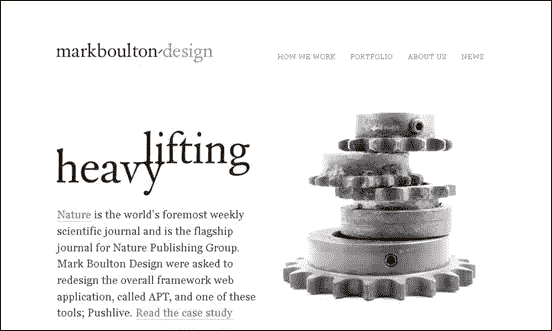
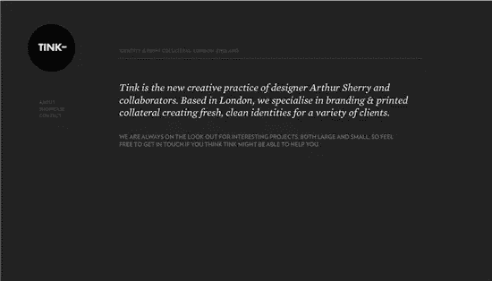
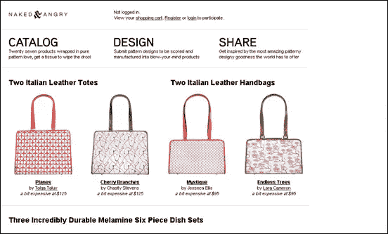
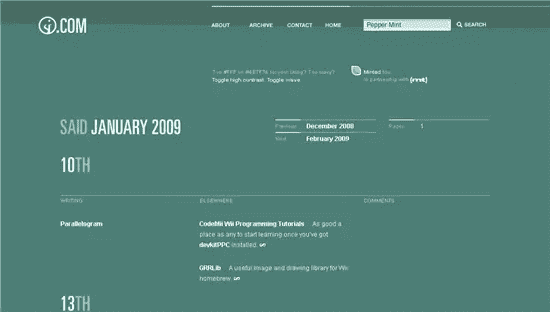
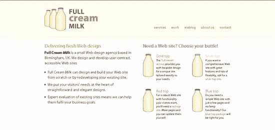
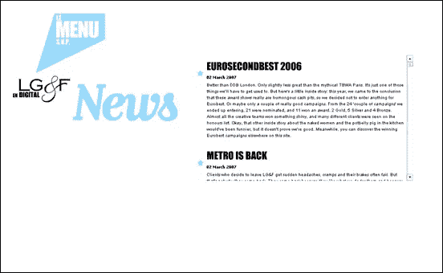
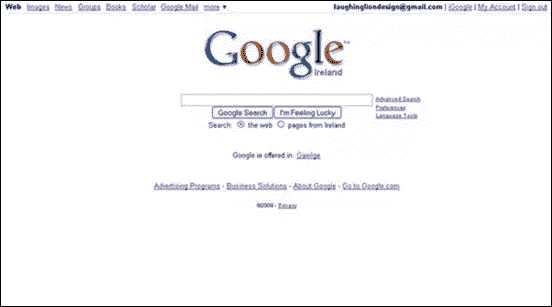

# 瘦到骨子里:极简主义网页设计

> 原文：<https://www.sitepoint.com/stripped-to-the-bone-minimalist-web-design/>

完美的实现，不是当没有更多可以添加的时候，而是当没有什么可以拿走的时候*——安托万·德·圣埃克苏佩里*

 ******极简主义**是一场艺术运动，诞生于二十世纪，它描述了艺术、音乐、文学、设计和建筑的各种形式，在这里作品被简化为最基本的东西。

在网页设计中，极简主义是指使用最少量的图像、颜色、形状、价值和线条。该网站被剥离到传达信息所需的基本要素。极简主义网页设计通常依靠字体和简单的形状来进行交流。你不会在这些网站上找到厚重的纹理和大量的图像，虽然设计可以被认为是“简单的”，但在这种风格下不一定容易实现一个有吸引力的设计。“内容为王”这句口头禅适用于所有类型的网站，极简主义当然也适用于这一理念。由于页面上很少有分散注意力的东西，访问者的注意力会被直接吸引到内容上。

这里有九个极简主义网页设计的例子，可以给你带来浏览的乐趣和灵感。

[大胆的火球](http://daringfireball.net/)

Jan Reichle 是一名艺术总监兼电影摄影师。

[马克·博尔顿设计](http://www.markboultondesign.com/)

叮当伦敦

[赤裸的&愤怒的](http://www.nakedandangry.com/)是一个电子商务网站，它保持了最少的绒毛。

肖恩·因曼(sIFR 名人)表明极简主义并不意味着缺乏色彩。

全脂牛奶确实使用了一些意象，但是很简单，在整个网站上重复出现。

[LG&F](http://www.lgf.be/loader.cfm)T2

最后，你可能以前见过这些人。他们是一个崭露头角的团体——与搜索网页有关。

极简主义显然不是每个人都喜欢的。我个人觉得这些网站很吸引人，因为它们不杂乱，导航简单。

你觉得这种风格的网页设计怎么样？有没有看到过自己真正喜欢的极简设计网站？**** 

## ****分享这篇文章****