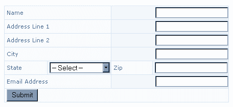
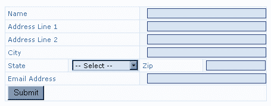

# 使用 CSS 文章样式化 Web 窗体

> 原文：<https://www.sitepoint.com/style-web-forms-css-4/>

我还为较小的单元格创建了特殊的类(在我的表单中，这些类包含州的选择菜单和邮政编码字段)。我将这些命名为'`.smalllabelcell`'和'`.smallfieldcell`'，这使得我们可以分别处理这些细胞。

在样式表中，添加以下内容:

```
.labelcell {    

  font: 11px Verdana, Geneva, Arial, Helvetica, sans-serif;    

  color: #3670A7;    

  background-color: transparent;    

  width: 220px;    

}    

.fieldcell {    

  background-color: #F2F7FB;    

  color: #000000;    

  text-align: right;    

  margin-right: 0px;    

  padding-right: 0px;    

}    

.smalllabelcell {    

  font: 11px Verdana, Geneva, Arial, Helvetica, sans-serif;    

  background-color: transparent;    

  color: #3670A7;    

  width: 100px;    

}    

.smallfieldcell {    

  background-color: #F2F7FB;    

  color: #000000;    

  text-align: right;    

}
```

您最终应该会得到如下所示的结果:



现在，您可以在这些单元格中设置表单域的样式。因为我们已经向 td 应用了一个类，所以我们可以简单地选择样式化该类所应用的 td 中的所有输入标签。将以下内容添加到样式表中:

```
.fieldcell input {    

  width: 200px;    

  font: 11px Verdana, Geneva, Arial, Helvetica, sans-serif;    

  background-color: #D7E5F2;    

  color: #102132;    

  border: 1px solid #284279;    

  margin-right: 0px;    

}    

.smallfieldcell input {    

  width: 100px;    

  font: 11px Verdana, Geneva, Arial, Helvetica, sans-serif;    

  background-color: #D7E5F2;    

  color: #102132;    

  border: 1px solid #284279;    

}    

.smallfieldcell select {    

  font: 11px Verdana, Geneva, Arial, Helvetica, sans-serif;    

  background-color: #D7E5F2;    

  color: #102132;    

  border: 1px solid #284279;    

} 
```



为我们的提交按钮添加一个特殊的类就完成了这项工作:

```
.button {    

  font: 11px Verdana, Geneva, Arial, Helvetica, sans-serif;    

  background-color: #D7E5F2;    

  color: #102132;    

  margin-left: 12px;    

  margin-top: 3px;    

  margin-bottom: 2px;    

} 

GA_googleFillSlot("Articles_6_300x250");

```

在本文中，我们探索了使用 CSS 改变 html 表单外观的一些方法。我们现在知道如何:

*   设置 html 元素的样式，包括表单、输入、选择和文本区域
*   为表单元素创建类
*   使用上述的组合来创建两个非常不同的形式

这些技术应该在现代的、相对符合标准的浏览器中工作良好。但是，请注意，使用 CSS 样式的表单字段的呈现是 Netscape 4。*会表现得很奇怪。

*如果您在表单中大量使用 CSS，您可能希望使用@import 方法附加一个单独的“表单样式”样式表。这将使您能够隐藏会导致 it 问题的 Netscape 4 风格。要阅读更多关于@import 方法的内容，请参见[http://www.mako4css.com/csstwo.htm](http://www.mako4css.com/csstwo.htm)。

**Go to page:** [1](/style-web-forms-css) | [2](/style-web-forms-css-2/) | [3](/style-web-forms-css-3/) | [4](/style-web-forms-css-4/)

## 分享这篇文章