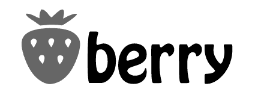
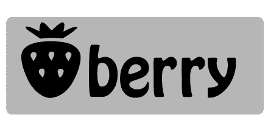

# 设计中微妙的对比

> 原文：<https://www.sitepoint.com/subtle-contrast-in-design/>

 在之前的帖子中，我已经写了使用[对比创造醒目设计](https://www.sitepoint.com/principles-of-design-contrast/)和[粗体字体](https://www.sitepoint.com/focus-on-typography-part-1-contrast)的重要性。设计中的对比概念是避免使用相似的元素，而是让它们看起来非常不同。这就是吸引眼球的地方。然而，当然有些时候你可能需要降低元素和/或背景之间的对比。

这里有一些简单的技巧，可以在保持趣味性的同时减少元素之间的对比。我用一个**简单的**，虚构的 logo 来演示。

1.这是最初的高对比度标志。

2.在这里，我改变了顶部的文本和下面的符号的值。这是两个如何降低元素和背景之间对比度的例子。视觉冲击仍然存在，但我已经降低了整体对比度。

3.另一种方法是在元素周围画一条线或边框。在下面的示例中，文本上有一个三像素的中灰色描边。这个中间“步骤”使黑色文本和白色背景之间的过渡变得柔和。

4.在这个例子中，我使用了白色背景上的白色文本，如果没有某种边框、线条或光晕，这些文本显然是不可见的。两个元素上的浅灰色阴影提供了前景文本和背景之间的柔和过渡，但仍然允许符号和文本非常好地突出。

5.降低对比度的另一个简单方法是在背景中使用与前景元素没有太大差异的值或颜色。

6.微妙的对比并不意味着缺乏色彩。在这里，白色符号和黑色文本之间有强烈的对比，但暖色背景色调与前景元素形成对比，同时仍然显得醒目。

这些基本技术不仅仅适用于标志，它们也可以应用于网页、平面和印刷设计。如果你坐在办公室或公交车上，你可能会看起来有点疯狂，但当你看网站和杂志时，真正眯起眼睛是一个很好的方式来了解设计中的“对比”元素。

## 分享这篇文章