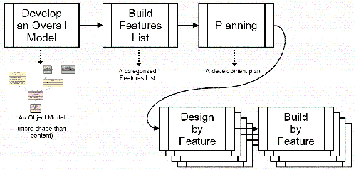
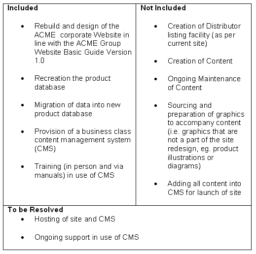
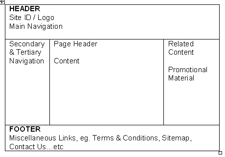

# 成功的 Web 开发方法文章

> 原文：<https://www.sitepoint.com/successful-development/>

商业网站开发已经有 10 多年的历史了。作为一个行业，当你考虑到其他已经存在了几个世纪的行业时，这个行业还是相当年轻的。但作为一个行业，相对年轻并不是做得不好的借口。

想想每天为客户重建的网站的数量，你可能会同意仍然有很多低质量的工作在做，这影响到我们所有人:这意味着客户更加谨慎，对 Web 开发人员的信任度更低。任何玷污我们行业的事情都会玷污我们每个人。

已经尝试过的、可信的和标准化的 Web 开发方法将大大有助于避免我们一再看到的错误。我们需要一种网络方法。然而，找到一种似乎适合 Web 开发的方法并不容易；让它在现实世界中发挥作用更加困难。

作为一个 20 人团队的开发经理，在令人兴奋的网络时代，这正是我面临的困境。这篇文章探讨了由于我们缺乏合适的方法而产生的问题，以及我们作为一个团队如何试图解决这些问题。结果是成功地采用了现有的 Web 开发方法。

##### 症状

许多因素结合在一起迫使 Web 开发团队改变我们做事的方式。

首先，项目不断地超时。没有具体的原因。每个项目似乎都有自己的特殊问题。在某些情况下，客户改变了主意。在其他情况下，我们的团队对客户需求的解释不同于客户自己的解释。对其他人来说，这只是简单地低估了完成项目所需的工作量。不管什么原因，最终的结果都是一样的:除非客户愿意支付更多的费用，否则超时的项目就会超出预算。每一个迟交的项目也会影响新的项目。

这种情况发生得越频繁，事情就变得越糟糕，直到我们遇到这样的情况，几乎每个项目都变得高风险，遭受范围蔓延，产生员工士气低落，并被期望有不切实际的期限。

答案非常简单:我们需要一种更好的做事方式——一种在预算内按时交付满足客户需求的项目的成熟方式。解决方案还需要符合我们的组织文化。

我们需要一种网络方法。

##### 采用、改编或建立你自己的

一旦决定寻找更好的做事方式，我们意识到我们有三条路可以选择:

*   采用现有的方法
*   改编自现有方法
*   建立我们自己的方法

开发团队在这个问题上意见不一。一些成员认为我们应该自己弥补；其他人说我们应该避免重新发明轮子。很明显，我们必须做一些研究，找出对我们来说最好的道路。

当时，还没有公认的 Web 方法(尽管从最近的研究来看，情况似乎没有太大变化)。因此，为了采用或适应，我们别无选择，只能查看现有的软件开发方法。

##### 评定标准

当我们开始寻找方法时，我们认为知道我们在寻找什么是很重要的。第一步是决定我们评估他们的标准。

***复杂度***

解决方案必须不仅仅是一个简单的指南，但在天平的另一端，如果它太大，就没有办法工作。我们需要一些表面上容易理解的东西——因为工作人员和客户都必须能够掌握它——但有足够的深度给开发人员他们需要的指导。

***大小***

很难让人们在最好的情况下阅读文档，所以解释方法论的厚文档不太可能有效。很有可能，如果我们有一份 100 页的指南，结尾有 10 页的摘要，大多数人只会使用摘要。

***成本***

任何花钱的事都必须有正当理由；需要的钱越少越好。

 **我们不能在方法论上犯错误。如果第一种方法不奏效，我很难说服人们去尝试第二种方法。

 **解决方案必须切实可行，而不是基于理论。必须有现实世界中的项目成功应用的例子，不止一次！

##### 评估的方法

[***理性统一过程***](http://www-306.ibm.com/software/awdtools/rup/)

我们听取了 RUP 代表的两次发言。第一次是一个小时的会议，第二次是更详细的两个小时的陈述。这两次，我在演讲后都比之前更困惑。我还和一些曾与 RUP 共事过的朋友聊了聊，他们对这个过程给予了积极的评价。

RUP 的范围极其广泛。它几乎涵盖了整个 SDLC 的所有内容，这既是它的优势，也是它的弱点。我最近参加了一个会议，参加了菲利普·克鲁琴的一个环节，他是研究 RUP 的主要权威之一。他的观点是，当人们试图使用 RUP 时，出现的主要问题是他们试图使用它的全部。这也是我从使用过 RUP 的朋友那里听到的建议。它庞大而复杂，关键是只使用您的项目需要的那些方面。这很有意义，因为项目经常变化，同样的方法不会在所有情况下都有效。

然而，鉴于我们团队的背景，RUP 提出了一些问题:

*   RUP 庞大、复杂、老练，而我们的团队却不是！我们的一些团队成员还在学习 SDLC，尝试引入像 RUP 这样复杂的东西需要大量的额外培训。
*   即使 RUP 是全面的，我们也必须在决定将哪些元素应用于我们的项目之前对其进行深入审查。然后，我们需要随着时间的推移不断尝试和完善这个过程。
*   与使用 RUP 所需的工具(如 rational rose，requisite pro…等)相关的成本很高。

总体而言，实施 RUP 或 RUP 的缩小版似乎是一个潜在的复杂、困难、耗时和昂贵的过程，而且失败的风险很高。

[***过程导师***](http://www.processmentor.com)

 *我们还收到了来自过程指导代表的演示。这个过程本身比 RUP 更紧凑，因此更容易让人理解。本质上，它是一个包含一系列步骤、表格和模板的网站，可以用来运行一个项目。与 RUP 相比，我们更喜欢 Process Mentor，因为它不那么令人难以招架，但它仍然不太正确。没有什么突出的主要问题，就像 RUP 发生的那样，但是不管怎样，Process Mentor 都不像是正确的方法。

***内部方法论***

 *我们的团队包括一些有经验的开发人员，他们以前在 IBM GSA 等重量级公司工作时就使用过“自制”流程。我们让每个开发人员谈论他们的经验，解释什么有效，他们喜欢什么，以及他们会再次使用什么。有许多听起来很有用的技术，但是，当所有的都说了又做了，总的感觉是我们不能从另一个组织“借用”这些内部方法中的一个。

##### 为什么传统方法不适用

不缺少愿意兜售他们的过程和相关工具的供应商，但是在许多演示之后，我们并没有感觉到任何明智。似乎没有什么能满足我们的需求。原因各不相同，但根本的问题是没有一种方法考虑到 Web 开发中的工作方式。

与传统的软件开发相比，Web 开发的时间框架通常更短，员工的经验水平变化很大，客户通常对什么是可能的理解很差，技术变化很快，一切都归结到一个用户界面(浏览器)。这并不是说这些元素在传统软件开发中不存在；然而，这些限制在 Web 开发中更加明显。

传统方法的另一个问题是它们没有考虑到软件开发的“软”方面。最近一项关于成功软件团队中最重要因素的研究(来自 2005 年 3 月的[Cutter Journal](http://www.cutter.com))将信任列为 17 个因素中的第一位，技术专长排在最后。在 RUP 或过程导师的任何介绍或文献中，都没有提到信任；其他显然对成功有巨大影响的软技能也是如此。

简而言之，我们既不能采用也不能适应传统的方法。这给我们留下了一个不值得羡慕的任务，那就是尝试创造我们自己的。

##### 变得敏捷

我们正要开始定义我们自己的过程，这时我遇到了一个轻量级的方法，现在被称为“敏捷”运动。这种情况下的方法是特性驱动开发(FDD)；其他一些流行的敏捷方法是 XP、Scrum、Crystal 和 DSDM。(敏捷方法和 FDD 的细节超出了本文的范围，但是如果你有兴趣阅读更多，请访问 http://www.agile.org 的[和 http://www.featuredrivendevelopment.com 的](http://www.agile.org)[的](http://www.featuredrivendevelopment.com)

很明显，FDD 比我们见过的任何东西都更适合 Web 开发，所以我们决定进一步研究，看看我们是否可以采用或至少使它适应 Web 开发。没过多久，团队就同意尝试 FDD。然而，我们很快意识到这不是一个银弹。

##### FDD 概述

FDD 是由 Jeff Deluca 创建的敏捷开发方法，目的是:

启用并执行及时的可重复的工作软件交付，向项目内外的所有关键角色提供高度准确和有意义的信息。

有关详细信息，请查看 [FDD 概述演示。pdf 文档](http://www.nebulon.com/articles/fdd/download/fddoverview.pdf)。

简而言之，FDD 由 5 个清晰定义的过程组成，可以用 5 页纸概括。FDD 的核心是特性的概念，它是明确定义的客户价值的功能。构成 FDD 的过程是围绕着将项目的每个元素定义为一个特性，然后以迭代的方式设计和构建每个特性而构建的。

下图显示了 FDD 的高级结构。

***流程 1:开发整体模型***

 *这是一个最初的项目范围的活动，领域和开发成员在一个经验丰富的对象建模师的指导下，扮演首席架构师的角色。

过程 1 包括项目团队创建业务领域的对象模型——一个形状多于内容的模型。模型没有完全定义所有的属性和方法，因为这一步更多的是正确地捕捉对象模型中业务领域的形状，而不是捕捉每一个细节。

这是一个高度协作的过程，每个人都必须一起工作来创建整体模型。这需要一个迭代的方法。首先，领域专家解释业务领域的一部分。项目团队被分成几个小组(最好每个小组有 3 个人),对领域的这一部分进行建模。然后，各组展示他们的模型，并就使用哪个达成共识。然后对域的每个部分重复这个过程，直到覆盖了所有部分。最终结果是整个领域的整体模型。

***流程二:建立功能列表***

 *这是项目范围内的初始活动，旨在确定支持项目需求所需的所有功能。

创建功能列表是参与建模过程的首席程序员的任务。客户和利益相关者不需要成为这个过程的一部分，因为他们已经在过程 1 中做出了贡献。现在是时候在特性列表中捕获项目了。这不需要协作:在这个阶段让一群人参与进来不会有什么成效或建设性。

这个过程的关键在于使用业务领域的语言来定义项目。这意味着客户将能够理解和重视每一个特性，但是它也在整个项目团队中实施了一个共同的语言，并且减少了误解或假设的风险。

沟通不畅是软件和 Web 开发中大多数问题的基础。我们选择的语言对我们交流的效率有着重要的影响。FDD 中有许多技术有助于提供有意义的交流。其中最强大的功能被封装在过程 2 中:使用领域的语言，即使用客户的语言，用特性定义整个项目。这听起来简单明了，但不应该被低估。这一步带来的关注是难以置信的，并在许多方面影响着项目。

在 FDD 中，一切都被描述为一个特性，而这个特性又被定义为:

*<动作><结果>由/为/到一个<对象>*

例如:

计算销售总额为收银员计算销售总额

一个特征还根据大小来定义(例如，超过 2 小时的工作但少于 2 周的工作)。如果一个功能需要超过 2 周的工作，它应该被分解成单独的功能。

将一切都定义为一个特性可以避免客户以一种方式引用一个概念，程序员以另一种方式引用它，项目经理必须不断地解释这两者时出现的问题。如果项目经理没有得到完全正确的解释，就会出现错误:程序员认为他们在构建一个东西，而客户期望的是另一个。使用相同的语言并不意味着问题消失了，但它大大降低了混淆的风险。

***流程三:策划***

 *过程 3 是产生开发计划的最初的项目范围的活动。

该过程扩展了过程 2 提供的好处。它为项目经理提供了一种以对客户和程序员都有意义的方式规划开发阶段的方法。它是与开发经理和首席程序员一起完成的，他们特别关注构建功能的顺序，平衡团队内部的负载，并提供交付早期结果的策略以让客户满意。

***流程四:按特征设计***

 *流程 4 涉及每个功能的活动，以产生功能设计包。这个过程分为三个步骤:走查、设计和检查。

在本演练中，程序员在开始详细设计之前熟悉他们将要构建的内容，在开始构建之前会对详细设计进行检查。对设计的检查允许在为该特性编写一行代码之前发现并消除缺陷。

在构建之前设计并检查设计似乎是常识，但是这一步经常被忽略。在许多其他行业中，在完全定义、设计和规划之前就构建某些东西的想法会被认为是疏忽的，然而这在 Web 开发中一直都在发生。许多程序员，尤其是 Web 开发人员的第一反应是打开他们最喜欢的编辑器，开始编码。这种方法给任何项目带来的风险都是巨大的。然而，反过来也是有问题的:试图预先设计一切往往会导致“分析瘫痪”。

在敏捷方法的倡导者中，到底应该预先进行多少设计是一个激烈争论的话题。FDD 采用的方法清楚地表明了过程 1 和过程 4 之间的区别。正如我们所看到的，过程 1 包括生命周期早期的设计，但它不是详细的设计。细节留给流程 4。将详细的设计放在这个较晚的阶段可以确保在正确的时间考虑它:在编写代码之前。它还将设计分解成有意义的块，一个功能一个功能。这意味着程序员不会觉得他们把所有的时间都花在设计上而没有时间编码；在设计完成和检查之后，程序员可以立即开始编码。

***流程五:按特征构建***

 *过程 5 涉及每个特性的活动，以产生一个完整的客户价值函数(特性)。

过程 5 也被分解为三个步骤:代码、代码检查和升级到构建。与过程 4 一样，协作和利益检查的思想得到了加强。流程 5 的独特之处在于最后一步，“升级到构建”。

对于要“升级到构建”的代码，它必须完成。这其中的关键是“完成”的定义。直到没有其他事情要做时，一个特征才算完成。项目经理测试一个特性是否真正完成的方法就是简单地询问工作是否完成了。如果程序员回答“是”，项目经理接着会问，“没有其他要做的了吗？”。这个问题经常引起不同的反应。这并不是说程序员很难相处或者容易让人误解，只是如果有机会，许多程序员会继续编写代码，不断地调整、优化或者试图改进它。如果有时间这样做，这不是问题，但如果有一个紧迫的期限，项目经理需要集中程序员完成项目。这个过程是确保专注的好方法。

这个过程的另一个好处是帮助项目经理清楚地看到项目已经完成了多少，以及每个程序员的工作效率如何。根据 Gerald Weinberg(质量软件管理第一卷)的说法，程序员之间的生产率差异可能高达 20 比 1。问题是如何评估生产率。即使特性的大小可能在 2 小时到 2 周的工作范围内，一旦考虑到特性大小的差异，项目经理不需要很长时间就可以评估每个程序员实际上完成了多少工作。

##### 将 FDD 应用于 Web 开发

实现一种新的做事方式比听起来要困难得多。人们不喜欢改变，即使那些说他们愿意尝试新事物的人也能很快改变主意，回到旧的做事方式。正因为如此，我们知道，作为一个开发团队，我们在尝试自己应用 FDD 的时候只能走这么远。迟早，它会影响到项目经理，最终影响到客户。我们决定最好让每个人都参与进来，以增加我们的机会。

下一步是关于内部政治和让关键决策者站在一边。由于 FDD 易于理解，人们不难看出，如果我们使用这种方法，我们会过得更好。在此基础上，我们获得了开办培训班的资金。参加课程的是所有受新方法影响的群体的代表:开发人员、业务分析师、项目经理、设计人员和测试人员。

课程结束时，每个人都兴致勃勃。特别是，FDD 的以下方面为我们所遭受的症状提供了解决方案:

*   出色的报告和规划
*   纪律严明
*   以客户为中心
*   通过以下方式降低风险:
    *   小块设计和构建的迭代
    *   要求的明确性
    *   更好地理解要构建的系统
    *   没有回旋的余地，因为假设会更少

我们也意识到，FDD 不能完全解决我们的问题。FDD 很好地涵盖了开发，但是它没有解决收集需求、接口设计或测试的任务。我们对应用 FDD 的担心是:

*   对技术领先的高度依赖
*   它不涉及用户界面的设计和构建
*   与大型项目相比，它在小型项目中的作用较小
*   它没有涵盖测试和部署

捍卫民主阵线不是银弹！最终，我们将不得不根据我们的情况和需求来调整流程。

##### 管理过渡

下一步是研究如何将 FDD 实际应用到我们的工作中。有许多项目正在生产，我们不能中途简单地改变我们的方法。我们也不能期望所有的新项目都开始使用新的方法，因为不是团队中的每个人都接受过培训。我们将不得不采取分阶段的方法来实施这一方法。

我们决定从多个角度解决这个问题。首先，我们会慢慢地将 FDD 的一些关键方面引入到新的项目中:

*   使用特性定义项目(以客户为中心)
*   基于特征的计划开发
*   实施新的团队结构、设计和代码审查
*   召开每周项目状态会议

其次，我们将运行一个内部测试项目。我们的内部网需要重新开发，我们认为这将是一个尝试 FDD 的好机会，也是一个尝试解决如何处理未涉及的接口和测试领域的机会。第三，尽管这不是计划中的，一个已经通过培训的开发人员和项目经理决定在他们的下一个纸商项目中使用 FDD。

内部网项目进行得不顺利有很多原因，但没有一个原因与 FDD 有关。该项目遭遇了许多内部项目面临的相同问题:它缺乏认同和专门的利益相关者。即使我们经历了一个相当全面的需求收集过程，这个项目仍然缺乏清晰的目的。应用什么样的开发过程并不重要，那个项目注定是困难的。但是它确实表明，当有明确的需求开始时，FDD 工作得最好。

另一方面，纸商项目进行得非常顺利。开发人员是我们最好的开发人员之一，他在领域建模方面做得非常出色，项目经理能够轻松地跟踪项目。不过，该团队经历了一些挑战。在定义整体模型时，FDD 使用了一种被称为颜色建模的建模技术(正如在《用 UML 用颜色进行 Java 建模》一书中所解释的)。

通常，建模不是与客户合作完成的；在 FDD 中，它确实涉及到客户，因此，客户需要了解这项技术。这并不意味着他们需要成为 UML 专家，但是他们至少需要知道正在发生什么。向客户解释这一点是唯一真正的挑战。对于大多数客户来说，我们预计这将是相当直接的，一旦他们理解了，他们实际上会发现这很有趣！

由于这个项目有一个只有一个开发人员、一个设计人员和一个项目经理的小型项目团队，所以进行得很顺利。没有必要创建工作包，将特性分配给个人，跟踪每个人的进展，等等。在捍卫民主阵线后培训讲习班上出现的一个问题是该进程对首席建筑师的依赖。这个项目只有一个开发人员，他扮演首席架构师、首席程序员和开发人员。这是有风险的:如果他不擅长他的工作，这个项目就会有大麻烦。然而，所有小项目都是这样:如果你没有一个像样的程序员，你就有麻烦了！

总的来说，我们在许多层面上看到了项目进展的显著改善，其中一些是相当出乎意料的。目标是找到一种更有效地交付项目的方法，但是我们发现这对士气的影响要积极得多。我们决定改进工作方式这个简单的事实产生了积极的影响。车队更开心了，因为我们正在解决问题。新的方法也有助于将不同的学科(特别是开发和项目管理)结合在一起，这些学科以前并不总是紧密合作的。有一种明显的专注感和方向感。

在项目方面，也有所改善。尽管大多数项目仍然有问题，但是问题减少了，也更容易管理。更容易了解每个项目的进展情况，以及实际完成了多少工作。例如，问一个程序员他们如何进行数据库优化会导致许多回答中的一个，其中一些不一定回答客户问的问题:什么时候会完成？这并不是说程序员刻意回避回答问题，只是有时候问题很难回答:通常，不容易说什么时候某件事会结束。

这是特性驱动方法的一个主要优点。当一个项目根据“特性”来定义时，客户提出的问题中的一些复杂性就被消除了。一个功能应该不需要超过两周的工作，所以当被问及开发人员需要多长时间来完成一个功能(假设它已经开始！)，开发者应该用 1 天到 2 周之间的数字来回答。这种方法实际上有助于开发人员管理自己，避免通过告诉项目经理他们想听到的而不是事实来取悦他们。

不幸的是，我们无法监测引入 FDD 的长期影响。在培训的 6 个月内，网络公司崩溃了，我们看到许多人被迫裁员。

##### 小型团队的 FDD

对敏捷方法的一个主要批评是它们不能扩展。对于 Web 开发来说，通常更重要的是看一种方法是否可以缩小规模并仍然保持其优势。众所周知，任何方法的影响都会随着团队规模的减小而减小，FDD 也不例外。然而，我已经能够成功地将 FDD 应用到小型团队和项目中，例如，一个使用 4 名员工(项目经理、开发人员和设计人员)3 周完成的项目。FDD 可以缩小规模，并且仍然为 Web 开发过程提供价值。

FDD 在小项目中最有价值的两个方面是:

1.  在特性中定义项目
2.  通过特征跟踪项目

这看起来非常简单，但是正是这种简单使得 FDD 如此有效。未能预先将项目定义为特性，客户和团队可能从第一天起就在不同的页面上。通常，这个问题只有在工作交付后才会暴露出来。对于小项目来说，纠正这样的错误并不是一项大任务，但是，在一个小项目上额外工作几天可能意味着相当大比例的额外工作，并且可能很快蚕食利润空间。

像生活中的大多数事情一样，良好的开端是使 Web 项目顺利进行的最佳方式。使用简单的技术，用客户的语言在特性中定义项目，将会对小型和大型项目产生很大的影响。

##### 用于网络开发的 FDD

自从 2000 年第一次将 FDD 应用于 Web 开发以来，我一直致力于改进这个过程，并提出了一种在几十个 Web 项目中有效工作的方法，这些项目的规模从 2 周到 6 个月不等。这种改进的方法使用了 FDD 的核心，但是引入了新的元素来管理一些 FDD 没有涉及的领域。下面是 FDD 如何成功应用于 Web 开发的高层次概述。

***项目概述***

 *虽然在 FDD 的 5 个过程中没有明确说明，但每个 FDD 项目都有明确的目的是很重要的。这只需要一个简单的陈述来定义项目是什么，以及它应该实现什么。

***组织宗旨***

 *这似乎是一个项目中多余的元素。组织的目的应该是明确的，但是，虽然对客户来说可能是显而易见的，但对开发人员来说可能不明显。写一段解释为什么这个组织存在是重要的一步。当然，这往往说起来容易做起来难；对于较小的客户，目的并不总是很明确，这个问题有时会让人看起来很茫然！尽管如此，这还是值得一问的，因为这方面的知识对于下一步制定项目目标非常有帮助。

***项目目的***

 *再一次，这是一个非常简单的陈述，但是定义一个项目的目的似乎要困难得多。大多数客户都有许多想法、愿望、期望和欲望，这些都包含在他们所谓的“网站”中。在现实中，工作必须被定义为一个项目，有一个明确的目的，每个人都理解并同意。目的应该是一个清晰、简明、可衡量的项目预期实现的业务成果的陈述。

***项目目标***

 *项目的具体目标必须明确界定。一系列要点是好的；考虑这一点并获得客户的同意是项目概述的这一部分最重要的方面。

考虑这个例子，它提出了可能为 ACME(一家汽车零部件制造商)确定的目标:

「重建的目标如下:

*   统一 ACME 的全球企业形象。
*   建立一个以商业为导向的网站，展示简单、敏锐、专业、先进和自信的风格，并且把用户友好放在第一位。
*   确保网站的设计符合 ACME 集团网站基本指南 1.0 版。
*   利用网站作为定位工具，将 ACMO 定位为技术驱动型、全球领先的汽车零部件供应商。
*   为 ACME 提供使用内容管理系统(CMS)在内部更新网站的能力。

"

***项目范围***

 *理解和定义项目的范围是一项具有挑战性的任务。再说一遍，客户通常希望包含所有内容，并期望为他们完成所有事情。我不是在说客户的坏话——任何熟悉范围蔓延概念的人都会理解我的观点。

关键是了解网站的内容和内容。我推荐使用一种多年前定义的技术，它简单地陈述了什么是流行的，什么是不流行的，以及什么是可以考虑的。这是一个让客户理解项目中所有元素的好工具。以下是我们虚构的 ACME auto parts 业务可能出现的情况:

***目标市场***

 *同样，这是一个重要的考虑因素。许多网站的建设没有适当考虑目标受众。说一个网站是针对客户的顾客是不够的。我们需要了解该客户群的人口统计数据，如果我们必须瞄准该客户群的一部分，我们需要知道是哪一部分。

事实上，大多数网站都有许多需要解决的目标市场。事实证明，更实用的方法是从一级、二级和三级目标市场的角度来考虑。

***内容***

 *传统软件项目和 Web 开发项目的主要区别在于内容的性质。大多数 Web 项目需要大量的内容。网站可以是一个应用程序或超文本系统(如内容页面)。大多数项目是两者的结合，在这种情况下，两个方面都必须解决。对于包含大量内容的项目，信息架构和设计成为项目成功的重要因素。

***信息架构***

 *最简单的形式，信息架构可以被认为是一个网站地图。IA 是内容的逻辑结构，以适应网站的目的。虽然这看起来是一个简单的任务，但是这个过程的重要性不应该被低估。

一个结构良好的网站对人们来说更容易使用，也更容易维护。一个架构糟糕的网站的好例子是用户很快转向搜索工具来找到他们想要的信息。

***信息设计***

 *大多数人现在理解了站点地图的概念，并且许多人能够把一个合理的站点地图放在一起。下一个层次要复杂得多，那就是查看页面上信息的设计:信息设计。当前的趋势是带有页眉和页脚的三栏布局:

***功能***

 *这就是特性发挥作用的地方，也是网站的“应用”方面被定义的地方。关键是将项目分成可以用客户的语言记录的大块工作，并确保每个“大块”的总工作量在 2 小时到 2 周之间。

ACME 站点可能需要的功能(每个功能需要不超过 2 周的工作时间)包括:

*   订阅设施
*   分销商搜索
*   产品搜索
*   反馈表

***项目管理***

 *FDD 不可或缺的一部分是每周报告，我已经将它用于较小的项目。在一个更大的 FDD 项目中，报告将提供已经开始、还没有开始、正在进行、已经完成和已经延迟的特性的细节。由此可以得出准确的“完成百分比”数字。

在小型项目中，并不总是需要达到这种详细程度。但是，跟踪进度并定期向客户报告是很重要的。我建议用以下两种方法来做这件事。

***日裹***

 *每日总结是每天和你的团队开会。这是敏捷过程中的一个常见任务。例如，在 Scrum 框架中，它被称为每日 Scrum 或每日站立会议。

在这个简短的会议中，每个人都陈述了他们前一天做了什么和今天计划做什么。本次会议的目标是:

*   确保没有人掉队
*   确保每个人都知道团队的其他成员在做什么
*   确保迅速提出并克服任何障碍或问题
*   帮助促进团队内部的协作

从项目管理的角度来看，包装是一个非常有效的工具，可以让开发人员保持在正确的轨道上。当人们承诺做某事，并且他们知道明天，他们会在其他人面前被问及这件事是否已经完成时，责任就产生了。这种总结当然会让团队成员对他们的承诺和不遵守的行为三思而行！此外，包装具有很强的社会性，这对团队合作有很大的影响。

***进度报告***

 *这里的关键是每周向客户提供进度更新。这有许多原因，第一个原因是提供必要的规程，允许项目经理在高层次上评审项目。进度报告不需要复杂或全面；它只需要说明已经做了什么，以及是否有任何问题需要解决。我使用下面的模板，它被证明是非常有效的。

*成就*

过去一周完成了什么？这一部分有助于产生进步感和满足感。

依赖关系
这种技巧对帮助完成任务很有价值。通常，依赖性是客户端必须交付的东西。把这写下来，你就清楚了谁该对延误负责。

*假设*

我再怎么强调清楚地陈述你所做的任何假设的重要性也不为过。如果不公开声明，它们通常会引发重大问题。例如，开发人员可能假设所提供的数据是易于导入的表格、定界格式；客户可能会以 Word 文件的形式提交，或者更糟:以 Quark 或 Pagemaker 等图形格式提交。记录所有假设！

*问题*

每个项目都有问题，这些问题需要记录在书面的问题报告中。

*决议*

希望随着项目的进展，出现的问题能够得到解决。记录这些决议是一种很好的方式，这样，如果在跟踪过程中出现问题，您可以随时回到进度报告中记录的决议。特别是，这有助于那些习惯改变主意的客户。

***项目网站***

 *这是所有 FDD 项目的一大部分，在那些项目中，被称为 KMS(知识管理系统)。项目的所有信息——所有文档、会议记录、进度报告等——都应该保存在一个在线位置，项目团队和客户都可以随时访问。通过将所有信息放在一个中央存储库中，这有助于确保一致性。

##### 结论

仍然没有灵丹妙药！

将 FDD 用于 Web 开发对解决 Web 开发中出现的许多问题大有帮助，但它不是一个完整的答案。诸如需求收集、可视化设计、测试和部署之类的领域并没有包括在内，尽管每个项目都需要它们。但是，鉴于缺乏可行的网络方法，拥有一些有效的，尽管不完整的东西，是向前迈出的一大步。************************* 

## ***分享这篇文章***