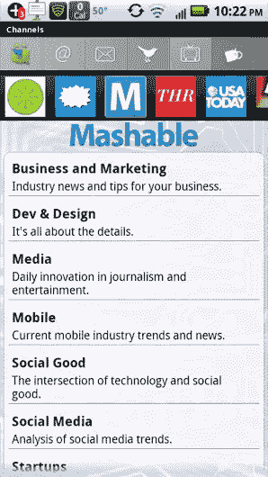
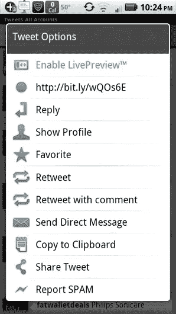
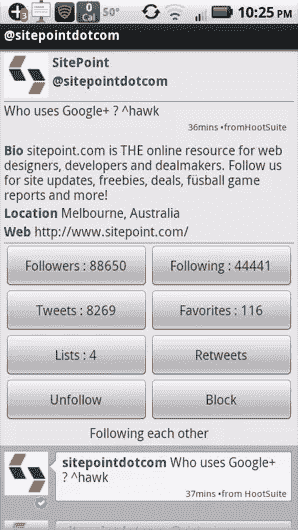
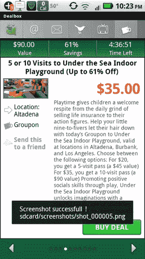

# 使用 UberSocial 增强您的 Twitter 体验

> 原文：<https://www.sitepoint.com/supercharge-your-twitter-experience-with-ubersocial/>

虽然有许多 Android 的 Twitter 应用程序，但大多数都只是专注于:流媒体推文，提供对 Twitter 列表的访问，以及在 Android 环境中出现提及和直接消息时提供提醒。Twitter 官方应用和 Tweet Deck(也属于 Twitter)目前占据 Twitter 市场份额的制高点。

然而，对于超级用户和那些寻求将创新提升到一个新水平的应用程序的人来说，UberSocial(以前称为 Twidroid)提供了许多对 Twitter 客户端至关重要的功能，同时还提供了一些开箱即用的功能，这些功能有助于使 Uber social 成为初学者和高级 Twitter 用户的全面应用程序。

## 独特和显著的特点

Ubersocial 与众不同的地方在于:干净的界面，快速的性能，有用的通知偏好，以及已读和未读推文的清晰轮廓。此外，一些独特的功能包括:来自 Living Social 和 Groupon 的每日交易集成，带有网站链接的推文实时预览窗格，简化的用户统计数据，专门搜索特定位置推文的面板，以及来自媒体渠道的频道，让你不必筛选绒毛就可以看到顶级新闻。

* * *

 

* * *

在评论 Ubersocial 时，一个立即打动我的功能是“实时预览”窗格，它允许用户选择任何带有链接的推文，并在原始推文旁边实时查看该网页。当你在纵向模式下拿着手机时，网站会出现在推文详细信息的下方，但是当你在横向模式下拿着你的设备时，Ubersocial 会将推文移到一边，让界面更好地利用空间。

此外，预览窗格支持 Flash 和浏览器功能，这意味着如果链接包含视频或音频，它应该可以播放。在撰写本文时，这个特性是 Ubersocial 独有的，因此是一个杀手级的特性，让 Ubersocial 比竞争对手的 Twitter 客户端更有优势。

除了能够在应用程序中查看网页之外，Ubersocial 还为用户提供了一个强大的个人资料界面，允许成员从一个简单的面板上查看:关注者、跟随、推文和列表内容，只要按下用户名，就可以访问该面板，每当你选择一条单独的推文时，就会出现用户名。当查看关注者列表、用户列表或列表时，Ubersocial 使用相同的实时预览功能，因此您可以在滚动列表时查看原始用户的简历。此外，如果有任何东西引起你的注意，只需轻轻一点，你就可以查看所选信息的更多细节。

## 紧跟潮流

对于那些只是喜欢使用 Twitter 来查看头条新闻的用户来说，Ubersocial 有一个频道功能，可以让你根据渠道查看趋势新闻主题的列表——一些关键的策展人是 Mashable、USA Today、Holywood Reporter 和许多其他人——然后可以只查看用户最相关的推文。Ubersocial 没有将窗格限制为向记者展示来自媒体的信息，而是列出了与某个主题最相关的推文，让你可以更好地过滤典型的推文洪流，并让你找到有见地的推文。对于喜欢与他人互动的用户来说，这个功能还可以让你找到对你来说最重要的推文，这些推文更容易回复。

* * *

 

* * *

## 交易和偷窃

虽然 Ubersocial 与更有效地访问你的 Twitter 账户密切相关，但它为用户提供了将来自热门每日交易网站的许多交易整齐地显示在自己的窗格中的能力，称为 DealBox。在很大程度上，该功能目前似乎只支持 Groupon 和 Living Social，但总体来说实现得很好。通过允许实时 GPS 更新，你甚至可以根据你的位置改变交易，尽管如果需要，该应用程序也支持手动设置特定位置。

在我的测试中，我确实很难正确更新交易的位置，但这个问题很可能是由于我的手机，所以总里程数会有所不同。在 DealBox 的位置设置中，默认情况下，应用程序设置为使用 Skyhook wireless 作为主要位置提供商。Skyhook 是一家为应用开发者提供定位功能的公司。虽然该应用程序的其他部分工作得相当好，但如果你更喜欢使用 GPS 或运营商的网络进行定位服务，可以通过进入“设置”并进入“位置和地理标记标签”来更改设置

## 结论

总的来说，Ubertwitter 是一个很棒的应用，是任何 twitter 用户的必备。虽然我个人认为 DealBox 功能有点多余，因为我已经在手机上安装了 Groupon 和 LivingSocial 应用程序，所以我可以在没有纸质优惠券的情况下兑换交易，但该功能并没有转移 Twitter 的关注点，也可以通过定制布局来隐藏。通过在像 Twitter 网站一样光滑的界面中为超级用户打包工具，Ubersocial 已经成功地为任何 Twitter 用户创建了一个全面的应用程序。

## 分享这篇文章