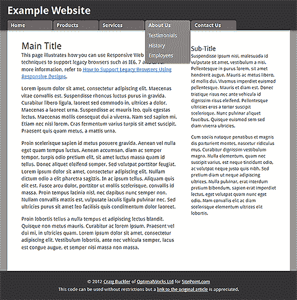
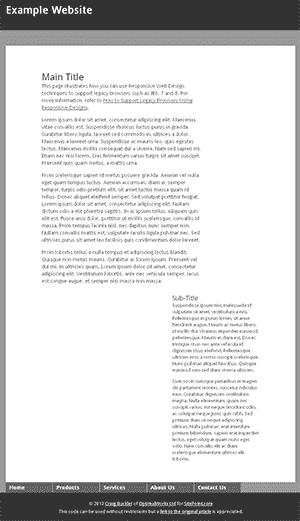
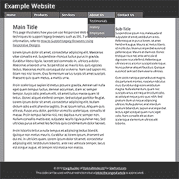

# 如何使用响应式 Web 设计来支持旧浏览器

> 原文：<https://www.sitepoint.com/support-old-browsers-responsive-web-design/>

在我之前的文章中，[Internet Explorer 开发真的是浪费时间吗？](https://www.sitepoint.com/is-internet-explorer-development-really-a-waste-of-time/)，我暗示过不需要大量的开发工作就可以支持旧的浏览器。在本教程中，我们将创建一个简单的网页，它可以在所有现代浏览器中工作，也可以在 IE8、IE7、IE6 以及可能更早的版本中工作。

在我们开始之前，请注意，我们的目标不是像素的完美或相同的功能。那是不可能的，所以不要费心了。然而，我们不会花任何时间去测试、修复或破解 IE 漏洞，这个页面仍然可以工作。

## 目标

这是我们将尝试在现代浏览器中创建的设计:

[ *点击任意缩略图查看全尺寸截图……*](https://blogs.sitepointstatic.cimg/tech/736-legacy-rwd-objective-big.png)

它永远不会赢得任何奖项，但包含典型的组件，如页眉、页脚、内容、侧栏和下拉 CSS 菜单。请注意，标题和菜单固定在浏览器窗口的顶部。

[](https://blogs.sitepointstatic.cimg/tech/736-legacy-rwd-ie6-big.png) 假设我们使用标准的 HTML5 和 CSS 编码这个页面。IE9 和 10 将如我们预期的那样工作，但是，即使这是一个简单的设计，IE6 也无法正确地呈现页面。布局中断是因为浮动元素触发了 IE6 的双边界错误。菜单出现在错误的位置(`display: fixed`不被支持)，并且不可用，因为 IE6 不允许:悬停或:聚焦在链接以外的元素上。

虽然我们都遇到过更糟糕的问题，但这个网站已经从根本上崩溃了。

IE7 的表现更好，但其奇怪的边距处理导致标题被裁剪。

我们可以用有条件的 CSS 或特定于 IE7 的黑客来解决这个问题，但是生命太短暂了，不适合这种无聊的事情！

[ ](https://blogs.sitepointstatic.cimg/tech/736-legacy-rwd-ie8-big.png) IE8 可以接受。它们的布局和菜单像我们预期的那样工作，我们只缺少一些 CSS3 效果，比如圆角和阴影。我相信坚持使用这款浏览器的 XP 用户会非常高兴。

## 对问题的回应

让我们考虑一下响应式网页设计。RWD 使用媒体查询来根据浏览器的宽度或高度应用样式。例如，如果页面宽度为 600 像素或更大，此`link`将应用 mystyles.css 中的定义:

```
 <link rel="stylesheet" media="screen and (min-width:600px)" href="mystyles.css" /> 
```

RWD 通常用于支持移动浏览器。您的桌面设计针对小屏幕设备进行了简化，例如，布局被线性化为一列，依赖于悬停效果的功能适合触摸。

不幸的是，一些移动浏览器没有实现媒体查询。这意味着我们不能依赖于使用桌面设计，然后在检测到小屏幕时简化它。但是我们可以改变它，也就是说，我们从基本的移动设计开始，只有当浏览器支持媒体查询并且屏幕尺寸变得足够大时，才应用桌面布局效果。

这被称为*“移动优先”*，已经成为开发人员实现响应式站点的最佳实践技术。

猜猜还有哪些浏览器不支持媒体查询？为什么我们不能使用更简单的移动布局来支持 IE6、IE7、IE8 和任何其他传统浏览器呢？线性化布局将立即解决大多数 IE 特有的问题。

## 解决方案

让我们 [**看看支持 IE6+、移动设备和所有现代浏览器的演示页面……**](https://blogs.sitepointstatic.com/examples/tech/responsive-legacy/index.html)

该页面使用两个样式表:

1.  [**simple.css**](https://blogs.sitepointstatic.com/examples/tech/responsive-legacy/simple.css) —我们基本的移动/传统浏览器布局
2.  [**complex.css**](https://blogs.sitepointstatic.com/examples/tech/responsive-legacy/complex.css) —覆盖桌面布局的简单样式

总是加载较简单的样式:

```
 <link rel="stylesheet" media="all" href="simple.css" /> 
```

然后，如果屏幕宽度超过 800 像素，我们使用媒体查询来加载复杂布局。IE6、7 和 8 将忽略声明:

```
 <link rel="stylesheet" media="screen and (min-width:801px)" href="complex.css" title="complex layout" /> 
```

神奇之处就在这里:我们使用一个条件样式表来加载支持桌面布局的旧版本 IE 中的复杂样式:

```
 <!--[if (IE 8)]>
<link rel="stylesheet" media="screen" href="complex.css" title="complex layout" />
<![endif]--> 
```

在这种情况下，我只乐意支持 IE8。布局不会有响应，但是由于 IE8 不能在移动设备上运行，我们知道这一定是一个拥有相当大显示屏的桌面用户。如果我准备好接受 IE7 的边界怪癖，我可以在条件注释中使用`if (IE 8)|(IE 7)`。

除了 HTML5 垫片，这就是我们所需要的一切…

```
 <!--[if lt IE 9]>
<script src="http://html5shiv.googlecode.com/svn/trunk/html5.js"></script>
<![endif]--> 
```

结果: [**我们的演示页面处处管用！**](https://blogs.sitepointstatic.com/examples/tech/responsive-legacy/index.html) 打开你的 IE6 或 IE7 旧版本，你会看到这个设计…

[](https://blogs.sitepointstatic.cimg/tech/736-legacy-rwd-ie6fix-big.png)

它没那么漂亮，但比以前好用多了。

如果您已经支持移动设备，这种技术不需要额外的开发。如果没有响应式设计，你将需要一个简单的移动样式表，但对于你将支持的大量移动和遗留浏览器来说，这是最小的努力。

简单。或者肯定比修复旧的 IE 漏洞或说服数百万用户升级浏览器更容易。

如果你喜欢读这篇文章，你会爱上[可学的](https://learnable.com/)；向大师们学习新技能和技术的地方。会员可以即时访问 SitePoint 的所有电子书和互动在线课程，如[移动网页设计速成班](https://learnable.com/courses/a-crash-course-in-mobile-web-design-195)。

## 分享这篇文章