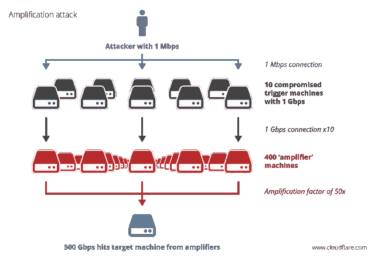

# 在网络盗版时代生存

> 原文：<https://www.sitepoint.com/surviving-age-internet-pirates/>

DDoS(分布式拒绝服务)攻击已经存在多年，但最近它们变得更加高调，攻击更大的目标。现在这已经不仅仅是黑客组织的领域了——敲诈更经常是游戏的名称。

想象一下这样一个场景:你运行一个网站，能够在一天中的每个小时产生大量的金钱。有一天，你的网站遭到 DDoS 攻击，你收到一条消息，说除非你支付赎金，否则你的网站将无限期关闭。

你是做什么的？一方面，你不想屈服于勒索，付钱给坏人，但另一方面，你真的不想失去你的网站和它的收入。

## 警示故事

最近就发生了这样一次攻击，Code Spaces 瘫痪了，七年来，Code Spaces 一直为一个令人印象深刻的客户群提供源代码库和项目管理服务。

根据 Code Spaces 的声明，在该网站遭受 DDoS 攻击后，一名入侵者设法进入了其亚马逊网络服务控制面板。攻击者取得了控制权，并联系了 Code Spaces 的工作人员，提出一旦他们收到一大笔钱，就归还对面板的控制权。代码空间试图重新获得控制权，攻击者的回应是随机删除面板条目。

该公司的大部分数据、备份、机器配置和异地备份在重新获得控制权时要么被部分删除，要么被完全删除。在 12 小时内，攻击者造成的破坏足以让代码空间永远停业。损失不仅仅是经济上的，还有人力上的——当公司倒闭时，大概有六个人失去了工作。

澄清一下，AWS 服务器实际上从未遭到黑客攻击，Code Spaces 的数据库也没有被盗。似乎发生的事情是，攻击者找到了访问控制面板的方法，但没有访问私钥的权限。

这次袭击是可以预防的吗？目前还不清楚 Code Spaces 采取了什么步骤来重新获得控制权，只知道在团队被封锁期间造成了重大损害。显而易见的是，整个基础设施只依赖一种服务不是一个好主意。

Code Spaces 不相信攻击是由前任或现任员工实施的，因此 2FA(双因素身份验证)也可能阻止了攻击。他们也没有灾难/事故响应计划。如果他们行动迅速并及早通知 AWS，他们很有可能会挽救局面——以及公司。

## 攻击类型

有许多不同类型的 DDoS 攻击，但有些比其他更常见。最常见的有:

*   **CP 连接攻击**–这些攻击试图使用所有可用的连接，并连接到负载平衡器、应用服务器和防火墙等基础设施设备。
*   **容量攻击**–这些攻击消耗目标网络内和/或网络与互联网其余部分之间的带宽。
*   **碎片攻击**–这些攻击会向目标网络/受害者发送大量 UCP 或 TCP 碎片，使其无法重组数据流，从而显著降低性能。
*   **应用程序攻击**–即使没有庞大的僵尸网络，这些攻击也是有效的，只需要几台攻击机器就可以实施攻击，因为它们试图淹没应用程序或服务的特定部分。
*   **基于 NTP 的攻击**正变得越来越常见，它可以通过使用 NTP 协议请求大量回复，以与碎片攻击几乎相同的方式放大流量请求。

## 阻止 DDoS 攻击

[https://digitalattackmap.com/embed#anim=1&color=0&country=ALL&time=16304&view=map](https://digitalattackmap.com/embed#anim=1&color=0&country=ALL&time=16304&view=map)

*上图显示了实时发生的全球 DDoS 攻击——攻击以虚线显示，显示了攻击流量的来源国和目的地国。*

可悲的是，代码空间远不是一个孤立的案例，DDoS 攻击极难检测和防范。根据 Prolexic 委托的最新 *[季度全球 DDoS 攻击报告](https://www.prolexic.com/knowledge-center-dos-and-ddos-attack-reports.html "Quarterly attack report")* 显示，与 2013 年同期相比，2014 年的攻击数量增长了 22%。

如今，大多数攻击都使用僵尸网络。它们是最有效的攻击形式，它们完全分散了攻击，而且执行起来相对简单。大多数僵尸网络招募 Windows 电脑作为僵尸程序，但在 2012 年，[闪回僵尸网络](https://www.cnet.com/uk/news/more-than-600000-macs-infected-with-flashback-botnet/ "flashback botnet")感染了 60 多万台 MAC 电脑。

如上图所示，僵尸网络可以像放大器一样增加攻击的效果

不是每个网络攻击者都会拥有僵尸网络，但是你可以以每小时 200 美元的价格租用它们。理想的一对夫妇下午的工作勒索网站所有者的现金。

完美的解决方案是消除僵尸网络，但由于恶意软件作者变得越来越老练，我们无法赢得打击网络犯罪的斗争，这看起来不太可能。

## 预防是关键

避免攻击的一个简单方法就是购买更多的带宽，但这不足以阻止大规模的攻击。在可能的情况下，最好将许多服务器分散在多个数据中心，并使用良好的负载平衡，这可以通过云服务来提供，如 Rackspace 提供的[。](https://www.rackspace.co.uk/cloud/load-balancers "cloud based load balancing")

一些公司提供的商业服务可以帮助降低风险，并在客户受到攻击时快速清理。同样，这是通过拥有一个大规模的网络来实现的，可以肯定的是，对于许多较小的企业或个人来说，这些服务的价格可能过高。

[CDNs(内容交付网络)](https://small-business-cdn-review.toptenreviews.com/ "content delivery network reviews")也可用于以分布式方式向客户发送文件，这也有助于防范 DDoS 攻击。

## 保护您的网络

尽可能地限制您的网络，以帮助防止攻击。确保路由器配置正确，丢弃垃圾信息包，如果你不需要运行某些协议，如 ICMP，那么停止它们。您还应该有一个高质量的硬件防火墙，并确保所有连接的机器都运行安全软件，并为操作系统和其他第三方软件(如 Office、Adobe 产品和 Java)应用所有最新的软件补丁。

由于许多现代网站使用动态资源，这使得降低风险更加困难。当攻击发生时，这通常会导致数据库故障，即使攻击的规模相对较小。尽可能考虑使用缓存服务器来提供静态内容。

部署一个[监控系统](https://mashable.com/2008/08/25/free-and-cheap-website-monitoring-services/ "web monitoring services")也是一个好主意，因为 DDoS 攻击往往会随着攻击的深入而逐渐恶化。你越早得到警告并采取行动，你的机会就越大。首先应该安装监视器来记录网络中的“正常流量”。然后应该设置警报，以便如果检测到带宽和网络流量增加，IT 管理员可以得到通知并尝试减轻攻击。

如果要避免全面的攻击，早期检测是关键，即使这样，如果没有比攻击者更大的带宽，也很难有所作为。最糟糕的是，目前，单个 DDoS 攻击的规模也在增加。

## 制定事故响应计划

为了能够快速响应任何威胁，尤其是数据丢失[，事件响应计划](https://searchdisasterrecovery.techtarget.com/tip/Ten-things-that-must-be-included-in-IT-disaster-recovery-plans "IT disaster recovery plans")对于企业的生存至关重要。虽然许多公司不采用计划，但它们并不难编写和实施，但却是让系统快速恢复正常的关键部分。

**文件应包括:**

*   紧急响应计划:这应该包括需要立即做的事情，以便将计划付诸实施。如果需要授权才能启动计划，则应首先在此列出联系信息和程序。
*   **人员**:应提供重要联系人列表，如使用的 IT 支持公司和关键联系人。此外，指定至少一个人处理备份和恢复也很重要，这样系统可以在最短的停机时间内重新上线。如果公司雇佣了 DDoS 保护服务，那么这些服务以及关键内部 IT 员工和负责实施业务连续性计划的人员的姓名也应在列表中。
*   文档:这应该列出在哪里可以找到任何给定情况下的所有相关文档。请记住，事件响应计划也将涵盖火灾和盗窃等事件，因此，所有信息，即使是保存在异地的信息，都可以在所有可能发生的情况下访问，这一点非常重要。
*   **备份和恢复程序**:这应该包括如何备份数据，数据存储在哪里，谁负责，以及必须遵守哪些与 PCI DSS 相关的规则。
*   **替代停机技术**:如果发生停机，收入损失通常会更严重，因为员工无法像往常一样在机器前工作。考虑到这一点，做好准备让工作尽可能远离网络是一个好主意。这可能意味着员工在系统恢复时在家工作，或者为关键人员设置备份系统。
*   **政策和程序**:为了防止人们像无头鸡一样到处乱跑，根据他们的角色为他们建立一步一步的程序是很重要的。例如，IT 人员应该通知支持公司和供应商，并且文档中应该包含明确的说明和联系方式，使他们能够快速自信地这样做。

员工了解计划以及他们的特定角色要求他们做什么是很重要的。随着公司内部新实践的出现，定期重新审视该计划以确保其始终是最新的，这一点也很重要。

## 社区能做什么？

除了尽可能地锁定我们自己的网络，在防火墙级别阻止那些不需要路由流量的端口，以及监控带宽和文件之外，普通人能做的事情并不多。然而，作为一个社区，通过教育反击是最容易的。自从 Anonymous 和 LulzSec 开始更经常地出现在新闻中，尤其是当它们攻击 PayPal 等大型目标时，DDoS 攻击在公众意识中的地位要高得多。

自从美国联邦调查局和其他国际执法机构起诉了这些组织的许多领导人后，这些黑客组织现在几乎都死了。但这意味着更多的人意识到了这种攻击的存在。

互联网社区有责任保持警惕，并尽其所能教育人们了解恶意软件。每天大约有 80，000 人陷入网络钓鱼骗局，这对有知识的人来说似乎非常明显。

我们可以告诉我们的客户——毕竟，了解他们的利润可能会受到影响的商业客户很可能会倾听——如何保护自己。我们可以告诉家人和朋友，并确保我们参与讨论。社交媒体是一个很好的渠道，有在线资源提醒人们注意常见的骗局，如[恶作剧杀手](https://www.hoax-slayer.com/ "hoax slayer")和 [Snopes](https://www.snopes.com/ "Snopes") ，这有助于促进教育。

## 结论

从长远来看，在单个机器和网络级别提供良好的保护对于解决这个问题至关重要。预防、网络保护和强大的事件响应计划有助于保护您的安全。但问题比这更广泛:除非更广泛的社区意识到危险，否则他们将继续感染恶意软件，被僵尸网络招募，DDoS 攻击将继续损害企业。

您是否准备了事故响应计划？你应对网络威胁的经历教会了你什么？

## 分享这篇文章