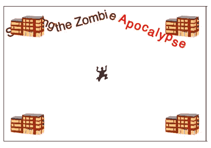
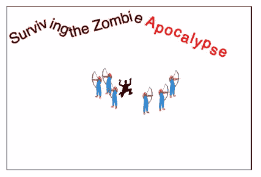
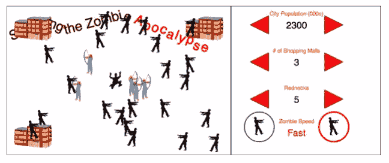
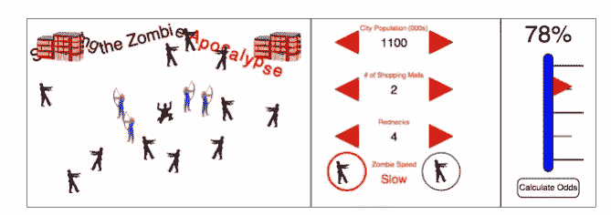

# 幸存的僵尸启示录:动态 SVG 和路径动画

> 原文：<https://www.sitepoint.com/surviving-the-zombie-apocalypse-dynamic-svg-and-path-animation/>

虽然 SVG 已经存在了一段时间，但它作为 HTML5 的一部分被采用给了它新的生命。为了庆祝这一事实，本系列演练通过构建一个几乎完全由 SVG 和 JavaScript 创建的僵尸末日生存预测器，探索了如果死者也获得新生会发生什么。

在这个系列的第三部中，在这个预测器中心尖叫的人类被四面八方的危险所包围。JavaScript 第一次被用于操纵核心 DOM 和 SVG DOM，添加了几十个新的僵尸，然后使用“transform”属性翻转它们。

在本系列的最后一部分中，JavaScript 将再次被使用，这一次是以购物中心和乡下人的形式给人类一点希望。够了吗？请继续关注，直到最后，JavaScript 还被用来计算人类的生存几率，然后通过嗅探浏览器的实际 SVG 功能并采取相应行动来设置预测表。

注意:本演练建立在本系列第 3 部分的完整代码之上，可以在[http://justinwhitney.com/zombies/zombies_part3.htm](http://justinwhitney.com/zombies/zombies_part3.htm)的源代码中找到。

## 添加更多 SVG 元素

本系列的第 3 部分展示了如何将控制面板画布的六个增量/减量控件中的一个制作成动画:更多僵尸控件。那根本不行。人口控制也需要更少的僵尸。但是在此之前，需要添加其他 SVG 图像。人类需要一些保护。

从购物中心开始。为了简单起见，假设这个城市最多有四个购物中心，它们将被放置在四个角落。因为需要跟踪商场数量，所以在

```
<script>

var malls = new Array();

…
```

newMall 代码将根据数组中商场的数量为新的 SVG 元素设置 x，y 坐标，并针对商场图像本身的 100×100 尺寸进行调整。代码的其余部分基本上与 newZombie 代码相同，只是新的 SVG 元素将被推送到数组中用于跟踪目的:

```
function newMall(){

  if (malls.length < 4) {

    var svg = document.createElementNS("https://www.w3.org/2000/svg","image");

    svg.setAttributeNS('https://www.w3.org/1999/xlink','href','building.svg');

    svg.setAttribute('width','471');

    svg.setAttribute('height','303');

    var scale = .21;

    var x = 0;

    var y = 0;

    var thisMall = malls.length;

    if (thisMall == 0 || thisMall == 2) {

      x = 20;

    } else {

      x = 480;

    }

    if (thisMall == 0 || thisMall == 1) {

      y = 10;

    } else {

      y = 300;

    }

    malls.push(svg);

    svg.setAttribute('transform','translate(' + (x) + ', ' + (y) + ') scale(' + scale + ', ' + scale + ')');

    document.getElementById('cityBox').appendChild(svg);

  }

}
```

最后，将鼠标事件添加到 mall increment 按钮，这是 ID 为“mallMore”的<path>元素:</path>

```
<path id="mallMore" d="M 300 150 l -50 -25 l 0 50 l 50 -25" stroke="black" stroke-width="1" fill="red" onmouseup="newMall();" />
```

结果是，商场已经饱和(没有僵尸)，应该如图 1 所示。



**图一。动态添加 SVG 商城<图片>元素**

虽然僵尸乡巴佬是最糟糕的(尤其是痛苦崇拜僵尸乡巴佬家庭)，但一个健康的乡巴佬，用弓和箭武装起来，可以帮助一个人在真正的行走或奔跑的死亡冲击中幸存下来。将它们动态添加到城市看起来就像添加僵尸或商场一样。但在这种情况下，乡下人将被安置在安全区内。额外的奖励是，它们将被翻转成面向外。

```
function newRedneck(){

  var svg = document.createElementNS("https://www.w3.org/2000/svg","image");

  svg.setAttributeNS('https://www.w3.org/1999/xlink','href','redneck.svg');

  svg.setAttribute('width','375');

  svg.setAttribute('height','950');

  scale = .07;

  var cityWidth = 600;

  var cityHeight = 400;

  var safezoneWidth = 200;

  var safezoneHeight = 200;

  var safezoneX = Math.round((cityWidth - safezoneWidth) / 2, 0);

  var safezoneY = Math.round((cityHeight - safezoneHeight) / 2, 0);

  var x = Math.floor(Math.random()*(safezoneWidth)) + safezoneX;

  var y = Math.floor(Math.random()*(safezoneHeight-100)) + safezoneY;
&nbsp;
  flip = (x > (cityWidth / 2)) ? 1 : -1; //flip rednecks left of center

  svg.setAttribute('transform','translate(' + (x) + ', ' + (y) + ') scale(' + (flip * scale) + ', ' + scale + ')');

  document.getElementById('cityBox').appendChild(svg);

}
```

将对该函数的调用添加到 ID 为“redneckMore”的<path>元素中:</path>

```
<path id="redneckMore" d="M 300 250 l -50 -25 l 0 50 l 50 -25" stroke="black" stroke-width="1" fill="red" onmouseup="newRedneck();" />
```

一个快速的测试应该产生一个安全地躺在一群乡下人中间的尖叫的人，如图 2 所示。



**图二。动态添加僵尸防御团队**

有了这三个要素，这个城市(图 3)现在有了生命，或者没有。

**图 3。JavaScript 和 SVG 的未来愿景**

## 完成控制面板

到目前为止，一切顺利。但是要完成控制面板，需要做三件事:

*   应启用减量按钮
*   文本应该更新
*   参数应该有上限和下限

一次完成所有三个目标的最好方法是添加第四个函数来处理所有按钮响应和对三个创建函数的调用。这个脚本将被称为 tickSVG。

就控制 SVG 数量而言，newMall 例程是朝着正确方向迈出的一步，因此可以将其作为一个模型。首先，为僵尸和乡巴佬添加全局数组:

```
<script>

  var zombies = new Array();

  var malls = new Array();

  var rednecks = new Array();

…
```

接下来，每个创建函数都需要返回新的 SVG 元素，而不是直接向 DOM 添加元素。因此，对于这三个函数中的每一个，都以下面的语句结束:

```
//document.getElementById('cityBox').appendChild(svg);

return svg;
```

此外，在 newMall 中，删除以下行:

```
malls.push(svg);
```

tickSVG 函数本身将根据按钮传递的参数管理 SVG 群体。首先，该函数用新的总数更新相关的<text>元素。第二，根据最大和最小限制以及当前的数组大小，tickSVG 要么创建一个新的元素，要么从数组堆栈中取出顶部的元素，这取决于按下了哪个按钮。最后，它要么将新的元素推送到数组上并将其添加到 DOM 中，就像最初在 newMall 例程中所做的那样，要么将其从数组中弹出并从 DOM 中移除(注意 removeChild 方法的使用)。</text>

```
function tickSVG(textName, increment, min, max) {

  var textElement = document.getElementById(textName);

  var currentValue = parseInt(textElement.textContent);

  currentValue += increment;

  if ( (currentValue <= max) && (currentValue >= min) ) {

    textElement.textContent = currentValue;

    isMore = (increment == Math.abs(increment));

    switch (textName) {

      case 'zombieText':

        var svgArray = zombies;

        var newSVG = (isMore ? newZombie() : svgArray[svgArray.length - 1]);

        break;

      case 'redneckText':

        var svgArray = rednecks;

        var newSVG = (isMore ? newRedneck() : svgArray[svgArray.length - 1]);

        break;

      case 'mallText':

        var svgArray = malls;

        var newSVG = (isMore ? newMall() : svgArray[svgArray.length - 1]);

        break;

    }

    if (isMore) {

      svgArray.push(newSVG);

      document.getElementById('cityBox').appendChild(newSVG);

    } else {

      document.getElementById('cityBox').removeChild(newSVG);

      svgArray.pop(svgArray.length - 1);

    }

  }

}
```

最后，所有的按钮都需要新的 onmouseup 调用。找到以下每个路径，替换现有的 onmouseup 调用或添加新的路径。这些对 tickSVG 的调用包括对前面步骤中创建的<text>元素的引用，以及一些任意的最大值和最小值，只有 malls 例外，它被设计为最多四个。</text>

```
<path id="zombieLess" d="M 50 50 l 50 -25 l 0 50 l -50 -25" stroke="black" stroke-width="1" fill="red" onmouseup="tickSVG('zombieText',-100,0,3000);" />

<path id="zombieMore" d="M 300 50 l -50 -25 l 0 50 l 50 -25" stroke="black" stroke-width="1" fill="red" onmouseup="tickSVG('zombieText',100,0,3000);" />

<path id="mallLess" d="M 50 150 l 50 -25 l 0 50 l -50 -25" stroke="black" stroke-width="1" fill="red" onmouseup="tickSVG('mallText',-1,0,4);" />

<path id="mallMore" d="M 300 150 l -50 -25 l 0 50 l 50 -25" stroke="black" stroke-width="1" fill="red" onmouseup="tickSVG('mallText',1,0,4);" />

<path id="redneckLess" d="M 50 250 l 50 -25 l 0 50 l -50 -25" stroke="black" stroke-width="1" fill="red" onmouseup="tickSVG('redneckText',-1,0,10);" />

<path id="redneckMore" d="M 300 250 l -50 -25 l 0 50 l 50 -25" stroke="black" stroke-width="1" fill="red" onmouseup="tickSVG('redneckText',1,0,10);" />
```

完整修订的代码链接在本演练的末尾。如果工作正常，页面应该如图 4 所示。



**图 4。完全实现的控制面板，又名天启临近**

## 几率有多大？

僵尸启示录生存预测器还需要一块才能完成。赔率计算器需要移动。至少，它需要一些 DOM 操作 JavaScript 来更新顶部的 0%和箭头的位置。但是对于兼容的浏览器，JavaScript 可以通过使箭头沿着动态生成的路径移动，给本系列第 2 部分中介绍的动画技术添加一些额外的特殊调料。

但首先，一些计算。在

```
<script>

  var zombies = new Array();

  var malls = new Array();

  var rednecks = new Array();

  var currentOdds = 0;

…
```

接下来，创建一个名为 calcOdds 的新函数。在使用严格的方法进行详尽的研究后，以下公式被精心制作来预测一个人在僵尸末日中的生存:

```
function calcOdds() {

  var zombieCount = parseInt(document.getElementById('zombieText').textContent);

  if (zombieCount == 0) {

    currentOdds = 100;

  } else {

    var redneckCount = parseInt(document.getElementById('redneckText').textContent);

    var mallCount = parseInt(document.getElementById('mallText').textContent);

    var speed = document.getElementById('speedText').textContent;

    var threat = Math.round((zombieCount * (speed == 'Slow' ? 2 : 18)) / 180);

    var protection = Math.round(((mallCount * 10) + (redneckCount * 5)) / 60 * 100);

    currentOdds = Math.round((100 + protection - threat) / 2);

  }

  if (currentOdds > 100) currentOdds = 100;

  if (currentOdds < 0) currentOdds = 0;

}
```

请注意，与本演练开头的<text>元素一样，可以通过访问其 textContent 属性来访问该元素的文本值。除此之外，DOM 看起来和 HTML 一样。要测试该计算，请找到 ID 为“oddsButton”的 group ( <g>)元素。正如在[第 1 部分](https://www.sitepoint.com/surviving-the-zombie-apocalypse-with-html5-and-svg/)中所解释的，按钮由两个不同的元素组成，一个<矩形>和一个<文本>元素。幸运的是，通过将它们分组，父< g >元素允许样式和鼠标事件作为一个整体与按钮相关联。现在，暂时添加一个 onmouseup 事件来测试 calcOdds:</g></text>

```
<g id="oddsButton" style="cursor: pointer;" onmouseup="calcOdds(); alert(currentOdds);">
```

如果这有效，是时候进行下一步了:移动指针。创建一个名为 movePointer 的新函数:

```
function movePointer() {

  calcOdds();

  document.getElementById('oddsText').textContent = currentOdds + '%';

  var newY = -2 * currentOdds; //relative Y coordinate

  newY += 300; //actual Y coordinate

  document.getElementById('oddsPointer').setAttribute('points',

    "150," + newY + " 100," + (newY - 25) + " 100," + (newY + 25));

}
```

是的，新的计算可以一步完成。分了是有原因的，很快就会揭晓。这里值得注意的是最后一行，setAttribute 函数。记住 oddsPointer 是作为一个<polygon>元素创建的，它通过使用绝对坐标定义一个“points”属性来工作。像大多数其他属性一样，可以通过 DOM 获取元素并使用 setAttribute 来访问 points，然后指定哪个属性(“points”)和新值。在这种情况下，新值是由三对坐标组成的文本字符串。在本例中，指针被硬编码为 50×50 空间中的向右三角形。其中心的 Y 坐标范围可以从仪表底部的 300 到顶部的 100，分别对应于 0 到 100 的赔率。此处分解的公式“newY = 300-(2 * current odds)”应该将三角形的右顶点精确地放置在本系列第 2 部分中创建的 tics 所标记的刻度上。</polygon>

要查看它的运行情况，请将 oddsButton onmouseup 事件替换为对新函数的调用:

```
<g id="oddsButton" style="cursor: pointer;" onmouseup="movePointer();">
```

用一些僵尸、商场和乡巴佬来填充城市，甚至可以切换到快速僵尸，然后点击计算赔率。指针应该跳转到一个对一个人在天启中生存的极其精确的预测，如图 5 所示。



**图 5。成品:救生工具**

## 额外功能:动态路径动画

因为本演练侧重于 JavaScript 和 DOM，所以这里有一个更好的技巧来为指针移动添加一些动画。正如在第 2 部分中所描述的，SVG 可以通过添加一个<动画情感>元素到 SVG 元素中，然后引用一个路径来制作动画(在兼容的浏览器中)。

更进一步，JavaScript 可以动态改变路径的坐标，使屏幕上的任何元素可以随时随地移动。

要将语言付诸行动，请找到 oddsPointer 多边形。需要做出两项改变。首先，定义一个 ID 为“oddsPath”的简单路径。然后在一个<animatemotion>元素中引用该路径，该元素本身嵌套在 oddsPointer 中。注意，<polygon>元素正在从自结束变为冗长，所以一定要仔细检查语法。</polygon></animatemotion>

```
<g id="oddsMeter" stroke="#000000" stroke-width="2">

  <path d="M100 100 h75 m-75 100 h75 m-75 100 h75" stroke-width="3" />

  <path d="M100 150 h50 m-50 100 h50" />

  <path id="oddsPath" d="M 0 0 L 0 -200" />

  <polygon id="oddsPointer" points="150,300 100,275 100,325" fill="#FF0000" stroke-width="1">

    <animateMotion dur="2s" begin="oddsButton.click">

      <mpath xlink:href="#oddsPath" />

    </animateMotion>

  </polygon>

  <rect x="90" y="75" rx="15" ry="10" width="20" height="250" fill="#0000FF" />

</g>
```

这里的问题是关于<path>元素的。请记住，动画路径并不定义实际坐标，而是定义动画的相对运动。如果这个<path>被绘制在屏幕上，它将从画布的左上角开始，一直向上。但它告诉指针要做的是从当前位置(M 0 0)开始，从那里向上 200 px(l0-200)。</path></path>

请注意，动画被设置为在单击 oddsButton 时开始，就像在“begin”属性中设置的那样。但是如果现在点击这个按钮，指针会跳到正确的位置，然后向上浮动。与前面的动画示例不同，这里需要区分识别和不识别 SVG 动画的浏览器。一般来说，最好使用 document . implementation . has feature 来检查浏览器中的功能实现。在这种情况下，要寻找的特性是 SVG 1.1 规范中的动画。添加一个名为 supportsAnimation()的函数:

```
function supportsAnimation() {

  return document.implementation.hasFeature("https://www.w3.org/TR/SVG11/feature#Animation", "1.1");

}
```

这是可以在[https://www.w3.org/TR/SVG11/feature](https://www.w3.org/TR/SVG11/feature)找到的几个可用特征字符串之一。

接下来，再添加一个全局变量，这个变量用来跟踪路径的“L”值，这样指针总是从先前停止的地方开始，而不是重置到原来的位置。

```
<script>

  var zombies = new Array();

  var malls = new Array();

  var rednecks = new Array();

  var currentOdds = 0;

  var previousL = 0;
```

鉴于之前对动画路径如何工作的描述，这可能有点令人困惑。但是请记住，JavaScript 将改变<path>的属性，而不是<polygon>的属性。移动也不会改变<polygon>的点属性，所以使用这种方法这些点将保持不变。因此，如果<path>总是从 M 0 0 开始，那么<polygon>在移动前将总是返回到那个坐标，导致动画制作前出现难看的跳跃。因此，每次都需要改变路径的“M”值，以使运动保持相对性。</polygon></path></polygon></polygon></path>

回到 movePointer 函数并添加嗅探器。现在，混乱的“纽维”之谜变得清晰了。根据浏览器功能，动画路径的“d”属性将在动画开始时及时更改，或者将设置多边形的点属性:

```
function movePointer() {

  calcOdds();

  document.getElementById('oddsText').textContent = currentOdds + '%';

  var newY = -2 * currentOdds; //relative Y coordinate

  if (supportsAnimation()) {

    document.getElementById('oddsPath').setAttribute('d','M 0 ' + previousL + ' L 0 ' + newY);

      previousL = newY;

  } else {

    newY += 300; //actual Y coordinate

    document.getElementById('oddsPointer').setAttribute('points',

     "150," + newY + " 100," + (newY - 25) + " 100," + (newY + 25));

  }

}
```

至此，这个僵尸末日生存预测器就完成了！现在就在[http://justinwhitney.com/zombies/zombies_part4.htm](http://justinwhitney.com/zombies/zombies_part4.htm)试用一下，或者查看这个演练最终版本的页面源代码。本页使用的所有资产(由 http://openclipart.org 的[提供)可以在 http://justinwhitney.com/zombies/zombiesAssets.zip](http://openclipart.org)的[找到。](http://justinwhitney.com/zombies/zombiesAssets.zip)

## 包扎

虽然在僵尸末日中幸存的几率可能会有所不同，但被抓到的几率相当低。但是正如疾控中心所知([http://www.cdc.gov/phpr/zombies.htm](http://www.cdc.gov/phpr/zombies.htm))，为僵尸做好准备的公司也为许多其他事情做好了准备。我希望这一系列的演练已经阐明了如何使用 SVG 实现可视化的动态、可伸缩的 Web 应用程序。

这里学到的技能可以用于很多很多其他的应用。比如为小行星做准备。

因为小行星末日肯定会发生。

本文是来自 Internet Explorer 团队的 HTML5 技术系列的一部分。通过三个月的免费 BrowserStack 跨浏览器测试@ [尝试本文中的概念。IE](http://modern.IE)

## 分享这篇文章