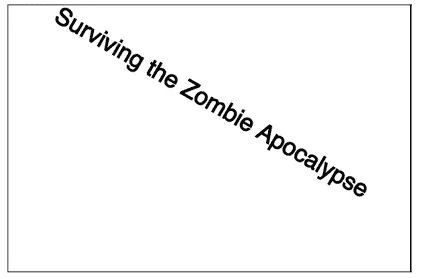
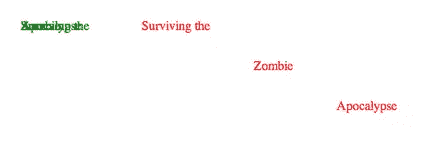
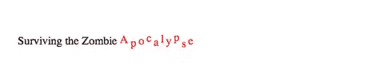
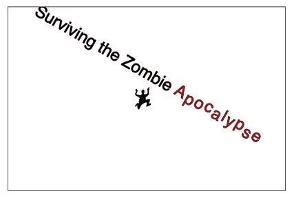
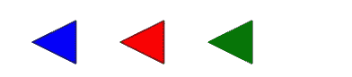
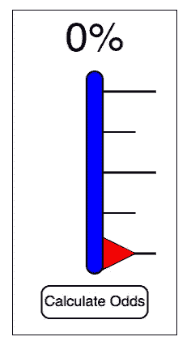
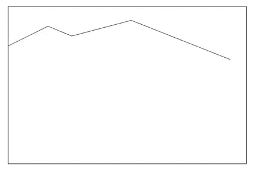
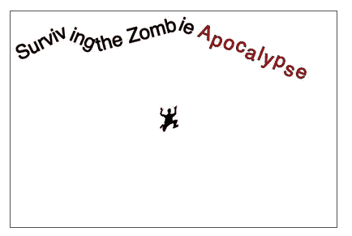

# 从僵尸启示录中幸存:文本、路径和动画

> 原文：<https://www.sitepoint.com/surviving-the-zombie-apocalypse-text-paths-and-basic-animation/>

本系列的第一篇文章介绍了 SVG 的基础知识，这是 HTML5 中一个被忽视、不被重视的方面。虽然不同的浏览器以不同的方式实现 SVG，但前面的演练描述了如何创建文本、合并 SVG 图像以及以所有浏览器都能识别的方式构建基本形状，如圆形、多边形和路径。

结果很可能是世界上第一个 SVG 驱动的[僵尸末日生存预测器](http://justinwhitney.com/zombies/zombies_part1.htm)的开始。到目前为止，这个页面很漂亮，但是完全没有功能。为了使页面更上一层楼，本演练深入探讨了路径及其各种用途，演示了如何构建预测表，并涉及了一些基本的动画来为页面添加这一点额外的内容(供理解它的浏览器使用)。

## 文本元素(续)

仔细看看 SVG 文本。在第 1 部分中，<text>元素在页面标题的<svg>块中使用。它与 HTML 文本共享相同的样式属性，但是该示例没有使用“style”属性来枚举它们，而是使用单个元素来实现最大的跨浏览器兼容性。</svg></text>

```
<svg id="cityBox" width="600" height="400">

  <text x="300" y="50" font-family="sans-serif" font-size="36" 
    text-anchor="middle" stroke="#000000" fill="#000000">
    Surviving the Zombie Apocalypse

  </text>

</svg>
```

这个例子应该可以在每个浏览器中正确显示，但是它甚至没有触及 SVG 文本与普通文本的区别。

### 转换属性

首先，考虑“转换”属性。以前，该属性用于将 SVG 图像缩小到适当的大小，因此:

```
<image id="human" x="2750" y="1750" width="343" height="483" 
  transform="scale(.10,.10)" xlink:href="human.svg" />
```

但是，该属性也可以应用于<text>元素。例如，使用“旋转”变换会给标题添加一点倾斜:</text>

```
<text x="300" y="50" font-family="sans-serif" font-size="36" 
  text-anchor="middle" stroke="#000000" fill="#000000" transform="rotate(30 100,100)">
```

这表示，“在坐标 100，100 处，将文本旋转 30 度(顺时针)。”结果应该如图 1 所示。



**图一。应用了 transform="rotate "的 SVG 文本标题**

转换属性包括其他几个可能的值:

*   translate:将文本垂直或水平移动指定的量
*   缩放:按指定的垂直和水平比例缩放文本
*   skewX:将文本沿 x 轴倾斜指定的角度
*   skewY:将文本沿 y 轴倾斜指定的角度
*   矩阵:允许自定义转换定义

这些变换也适用于其他 SVG 对象，如 scale 变换所示。也可以通过按所需的转换顺序列出它们来嵌套转换。例如，请注意图 2 中以下代码的结果。位置相同、变换相同但应用相反的两个单词:

```
<text x="100" y="100" text-anchor="middle" transform="rotate(30 100,100) 
  skewX(50) scale(2)">Zombie</text>

<text x="100" y="100" text-anchor="middle" transform="scale(2) 
  skewX(50) rotate(30 100,100)">Apocalypse</text>
```


**图二。SVG 文本上嵌套转换的结果**

有关更多信息，请阅读 W3 规范中的[转换属性](https://www.w3.org/TR/SVG/coords.html#TransformAttribute)。

### tspan 元素

在前面的例子中，创建了两个单独的<text>元素，以便可以将转换应用于每个单词。然而，在具有通用样式和转换的<text>元素中，嵌套的<tspan>元素可以用来定义单独的属性，比如位置和颜色。</tspan></text></text>

此外，位置既可以绝对定义(x，y)，也可以相对定义(dx，dy)。结合<tspan>，这设置了一些有趣的文本技巧。注意在下面的例子中使用了绝对和相对坐标，如图 3 所示。</tspan>

```
<text x="50" y="50" text-anchor="left" fill="green">

  <tspan>Surviving the</tspan>

  <tspan x="50" y="50">Zombie</tspan>

  <tspan x="50" y="50">Apocalypse</tspan>

</text>

<text x="200" y="50" text-anchor="left" fill="red">

  <tspan>Surviving the</tspan>

  <tspan dx="50" dy="50">Zombie</tspan>

  <tspan dx="50" dy="50">Apocalypse</tspan>

</text>
```



**图 3。将绝对和相对坐标应用到< tspan >元素**

原点坐标支持的一个巧妙技巧是指定多个坐标，然后应用于每个字母。虽然使用绝对坐标可以做到这一点，但是使用相对坐标更容易，特别是在应用于单个<tspan>元素时，如图 4 所示。(在下面的示例中，还应用了“字母间距”属性，以便给字母一点喘息的空间。)</tspan>

```
<text x="300" y="50" text-anchor="middle">

  <tspan>Surviving the Zombie</tspan>

  <tspan dy="-2 5 -3 -4 6 -5 3 -5 9 -4" letter-spacing="3" fill="red">Apocalypse</tspan>

</text>
```



**图 4。多个相对 Y 位置应用于一个< tspan >元素**

回到本系列第 1 部分中创建的原始“cityBox”元素，对整个文本应用“rotate”变换，对最后一个单词应用多个相对 Y 坐标。如图 5 所示，即使在添加僵尸之前，受惊的小人类也有东西可逃了。

```
<svg id="cityBox" width="600" height="400">

  <text x="300" y="50" font-family="sans-serif" font-size="36" 
    text-anchor="middle" stroke="#000000" fill="#000000" transform="rotate(30 100,100)">

      Surviving the Zombie

    <tspan dy="-2 5 -3 -4 6 -5 3 -5 9 -4" letter-spacing="3" fill="red">Apocalypse</tspan>

  </text>

  <image id="human" x="2750" y="1750" width="343" height="483" transform="scale(.10,.10)" 
    xlink:href="human.svg" />

</svg>
```



**图 5。快跑小人类！快跑！**

## 动画元素或 SMIL 简介

在平静地离开标题之前，还有一个更有趣的技巧可以应用于它以获得戏剧性的效果:元素<animate>。然而，这一个不是跨浏览器兼容的。</animate>

像 SVG 一样，同步多媒体集成语言(SMIL)已经存在了一段时间，1998 年，1.0 版成为 W3C 的推荐标准。它本质上为文本和媒体提供动画标记。因为开发 SMIL 的同一个工作组也致力于 SVG 的各个方面，后者包含了 SMIL 规范中定义的某些特性。

迄今为止，并不是所有的浏览器都能通过 SMIL 规范识别 SVG 动画。然而，那些不这样做的人只会忽视它，而不是打破它。所以把动画看作是对一部分用户的一种很好的款待。(请参见“[我可以使用…](http://caniuse.com/#feat=svg-smil) ”以获得识别 SMIL 动画的浏览器和版本的完整列表。)

构成 SVG 动画的基本元素包括<animate>、<set>、<animatemotion>和<animatetransform>。许多浏览器仍然识别<animatecolor>，尽管这个元素已经被弃用，取而代之的是<animate>。</animate></animatecolor></animatetransform></animatemotion></set></animate>

要使用 SMIL 动画，该元素应该嵌套在正在制作动画的 SVG 元素中。在本例中，标题文本的笔画颜色将被动画化(attributeName)。它被设置为加载后 2 秒开始，持续 10 秒(dur)，并从黑色变为红色。然后，通过设置 fill="freeze "(不要与填充颜色混淆)，将动画设置为在其结束状态冻结。

```
<text x="300" y="50" font-family="sans-serif" font-size="36" text-anchor="middle" 
  stroke="#000000" fill="#000000" transform="rotate(30 100,100)">

    Surviving the Zombie

  <tspan dy="-2 5 -3 -4 6 -5 3 -5 9 -4" letter-spacing="3" fill="red">Apocalypse</tspan>

  <animate attributeName="stroke" begin="2s" dur="10s" from="black" to="red" fill="freeze" />

</text>
```

如果在兼容的浏览器中查看，这将导致缓慢、微妙的效果，暗示文本出血。(跳到本演练末尾列出的示例页进行演示。)

## 路径元素

构建僵尸启示录生存预测器的第 1 部分涵盖了创建<path>元素的基础知识。虽然不同类型的形状有不同的元素，比如<polygon>和<rect>，但是<path>元素可以用来创建这些相同的形状。上次没有提到，Closepath (Z)命令通过自动绘制最后一条腿来简化闭合的形状，如图 6 所示:</path></rect></polygon></path>

```
<polygon points="50,50 100,25 100,75" stroke="black" stroke-width="1" fill="blue" />

<path d="M 150 50 L 200 25 L 200 75 L 150 50" stroke="black" stroke-width="1" fill="red" />

<path d="M 250 50 L 300 25 L 300 75 Z" stroke="black" stroke-width="1" fill="green" />
```



**图 6。使用 Closepath 命令**的<多边形>vs<路径>vs<路径>

但是路径还可以做更多的事情，从创建简单的线条到为文本设置基线，再到为动画定义运动路径。

### 创建直线

如前面的代码片段所示，一条线只包含 Moveto (M)或起点和 Lineto (L)或连接点。下面创建了三条连续的线条，线条宽度各不相同:

```
<path d="M 100 100 L 175 100" style="stroke: black; stroke-width: 1;" />

<path d="M 100 150 L 175 150" style="stroke: black; stroke-width: 2;" />

<path d="M 100 200 L 175 200" style="stroke: black; stroke-width: 3;" />
```

这些使用绝对坐标来定义线节点的精确位置。然而，通过对 Lineto 使用小写字母“l ”,也可以在更有意义的地方使用相对坐标。下面的示例创建了一组与上面的示例相同的线条(另外，请注意“style”属性是如何被单个属性替换的，以便可以为整个组设置描边颜色):

```
<g stroke="black">

  <path d="M 100 100 l 75 0" stroke-width="1" />

  <path d="M 100 150 l 75 0" stroke-width="2" />

  <path d="M 100 200 l 75 0" stroke-width="3" />

</g>
```

在这种情况下，例如，“l 75 0”不是定义一条直线到坐标“175，100”，而是说“向右画一条 75 点的直线。”

如果您正在绘制多条相同样式的线条，可以通过建立第一个原点，然后在同一个<path>元素中添加新的相对原点，以同样的方式使用相对移动到(m)。这样一来，</path>

```
<g stroke="black" stroke-width="2">

  <path d="M 100 100 l 75 0" />

  <path d="M 100 150 l 75 0" />

  <path d="M 100 200 l 75 0" />

</g>
```

与相同

```
<path d="M 100 100 l 75 0 m -75 50 l 75 0 m -75 50 l 75 0" stroke="black" stroke-width="2" />
```

当你画垂直线或水平线时，事情变得更加简单。水平线到(H 或 H)和垂直线到(V 或 V)命令将坐标减少到一维，可以是绝对的(H 或 V)或相对的(H 或 V)。下面绘制了与前面的示例相同的三行代码(也请注意，删除了命令和数字之间多余的空格):

```
<path d="M100 100 h75 m-75 50 h75 m-75 50 h75" stroke="black" stroke-width="2" />
```

除了所有的直线之外，路径还可以产生曲线。事实上，<path>元素包括多个实现曲线的命令:</path>

*   二次贝塞尔曲线(Q):通过指定控制点和终点来绘制曲线
*   平滑二次贝塞尔曲线 to (T):平滑地将二次曲线延续到新的点
*   Curveto (C):通过指定一个端点和两个控制点来绘制三次贝塞尔曲线
*   平滑曲线到(S):平滑地将三次曲线延续到新点
*   椭圆弧(A):通过描述两个椭圆及其交点来绘制弧

由于弯曲的路径并不是逃离僵尸所必需的，所以这里就不做介绍了。更多信息，请参见 W3C 关于<路径>曲线命令的[规范。](https://www.w3.org/TR/SVG/paths.html#PathDataCurveCommands)

### 创建预测仪表窗格

有了基础知识，这个生存预测器需要的是一个实际的仪表。因此，在添加任何新元素之前，请在前面的演练中创建的两个窗格中添加第三个窗格。首先，将以前的 id 样式从“#controlPanelBox”更改为类样式。svgBox”。现在，窗格将会有边框以便于查看。

```
.svgBox {

  border: 1px solid #000000;

  float: left;

}
```

还要确保将该类添加到 controlPanelBox <svg>元素中:</svg>

```
<svg id="controlPanelBox" width="400" height="400">

Create a new element of the same class to serve as the container for the prediction meter:

<svg id="meterBox" width="200" height="400">

</svg>
```

这种仪表将是非常基本的，由一些简单的形状组成，如温度计刻度和一个指针，最终将根据预测算法重新定位。它还将包括一个按钮，该按钮将在本系列的最后一篇文章中进行交互。现在，添加一个文本标签和一些组来包含其他元素:

```
<text id="oddsText" x="100" y="50" font-size="50" 
  font-family="sans-serif" text-anchor="middle">0%</text>

<g id="oddsMeter">

</g>

<g id="oddsButton" >

</g>
```

oddsText 元素稍后将通过 JavaScript 进行操作，以反映完全科学的计算，但同时它将保持静态。

对于 SVG 对象，订单计数。由于 tics 将在堆栈的底部，现在画出它们。在本演练之前，这些行可能如下所示:

```
<path d="M 100 100 L 175 100" stroke="#000000" stroke-width="3" />

<path d="M 100 150 L 150 150" stroke="#000000" stroke-width="2" />

<path d="M 100 200 L 175 200" stroke="#000000" stroke-width="3" />

<path d="M 100 250 L 150 250" stroke="#000000" stroke-width="2" />

<path d="M 100 300 L 175 300" stroke="#000000" stroke-width="3" />
```

但是，通过将笔画信息提取到组元素中，以及使用相对移动和水平线，可以减少此代码:

```
<g id="oddsMeter" stroke="#000000" stroke-width="2">

  <path d="M100 100 h75 m-75 100 h75 m-75 100 h75" stroke-width="3" />

  <path d="M100 150 h50 m-50 100 h50" />

</g>
```

在 tics 下方 oddsMeter 组内，绘制一个类似于控制面板中使用的三角形。只是这一次，因为它是单个对象，不需要复制，所以使用<polygon>元素:</polygon>

```
<polygon id="oddsPointer" points="150,300 100,275 100,325" fill="#FF0000" stroke-width="1" />
```

该元素包含在 oddsMeter 组中，因此指定一个新的笔画宽度来覆盖该组的笔画宽度属性。

最后，在同一组的底部添加一个圆角矩形，这将使它出现在堆栈的顶部。<rect>元素还没有在预测器中使用，但是它的属性是不言自明的。注意创建圆角的半径-x (rx)和半径-y (ry)指令:</rect>

```
<rect x="90" y="75" rx="15" ry="10" width="20" height="250" fill="#0000FF" />
```

在计量器下面，加上计算生存几率的按钮。这个按钮由两个 SVG 元素组成，<text>和<rect>，它们的顺序是文本出现在一个白色填充的矩形上。这里要考虑的重要一点是，在后期添加交互性的时候，需要把它作为一个整体添加到按钮上，这也是为什么要把这两个元素分组命名的原因。否则，向文本或文本后面的矩形添加事件处理程序可能会产生令人不满意的用户交互。将它们分组还提供了一种添加光标的简单机制:</rect></text>

```
<g id="oddsButton" style="cursor: pointer;">

  <rect x="35" y="340" rx="10" ry="10" width="130" height="40" fill="#FFFFFF" stroke="#000000" 
    stroke-width="2" />

  <text x="100" y="365" font-family="sans-serif" font-size="18" 
    text-anchor="middle">Calculate Odds</text>

</g>
```

完成后的预测仪表面板应该如图 7 所示。



图 7。僵尸启示录生存预测仪

### 创建文本基线

如前所述，路径也可以为<text>元素提供基线。要看到这一点，请回到“city box”SVG 元素中的标题，当前看起来如图 5 所示。我们不会应用“旋转”变换，而是将该文本的基线固定为一个基本路径。</text>

首先在“city box”SVG 窗格的顶部添加一条弯曲的路径。继续，现在包括一个黑色的中风(中风的重量将默认为 1)。由于这不是一条直线，可以看作是一个潜在的多边形，设置填充为“无”。将其命名为“titlePath”，这将在下一步中引用。默认情况下，如果路径不够长，不足以作为整个文本的基线，任何剩余的文本都将被截断，因此该路径在末尾被赋予一个超长的分支:“l250 100”。

```
<path id="titlePath" d="M0 100 l100 -50 l60 25 l150 -40 l250 100" stroke="#000000" fill="none" />
```

没有附加元素的路径应该如图 8 所示。



**图 8。标题文本的路径**

要将文本锚定到路径，请将文本内容和任何<tspan>元素嵌套在一个<textpath>元素中，该元素本身嵌套在<text>元素中。然后，<textpath>元素指定一个引用路径的 xlink。(当你在做的时候，去掉变换，把路径的描边颜色切换到“无”来使它不可见。)</textpath></text></textpath></tspan>

```
<svg id="cityBox" width="600" height="400">

  <path id="titlePath" d="M0 100 l100 -50 l60 25 l150 -40 l250 100" stroke="none" fill="none" />

  <text x="300" y="50" font-family="sans-serif" font-size="36" text-anchor="middle" 
    stroke="#000000" fill="#000000">

    <textPath xlink:href="#titlePath">

    Surviving the Zombie

    <tspan dy="-2 5 -3 -4 6 -5 3 -5 9 -4" letter-spacing="3" fill="red">Apocalypse</tspan>

    </textPath>

    <animate attributeName="stroke" begin="2s" dur="10s" from="black" to="red" fill="freeze" />

  </text>

  <image id="human" x="2750" y="1750" width="343" height="483" transform="scale(.10,.10)" 
    xlink:href="human.svg" />

</svg>
```

不幸的是，这是浏览器差异戳他们丑陋，腐烂的头。有些浏览器忽略“x”属性，根据“文本锚”属性将文本定位到基线。其他浏览器忽略“文本锚”属性，根据“x”属性将文本定位到基线。因此，要找到一个对两者都有效的修复方法，请将 text-anchor 改为“左”,将 x 改为“15 ”:

```
<text x="15" y="50" font-family="sans-serif" font-size="36" 
  text-anchor="left" stroke="#000000" fill="#000000">
```

通用结果应该如图 9 所示。



**图 9。标题设置为基线路径**

### 创建动画路径

虽然<path>元素的全部潜力还没有被挖掘出来，也不会出现在本演练中，但是它可以用来增加更多的活力。类似于路径可以为文本提供基线，它也可以为动画提供基线。这里需要注意的是，这属于 SVG/SMIL 动画的范畴，所以它不能完全跨浏览器兼容。再一次，对于识别它的浏览器来说，这是一个额外的奖励，因为对于不识别它的浏览器来说，它不会破坏任何东西。</path>

在第 1 部分中，控制面板窗格包括一个僵尸速度开关，如图 10 所示:

```
<g id="speedGroup">

  <circle id="slowCircle" cx="75" cy="325" r="40" stroke="red" fill="white" stroke-width="4" />

  <image id="slowZombie" x="375" y="1875" width="175" height="304" transform="scale(.16,.16)"
    xlink:href="zombie.svg" />

  <text id="speedLabel" font-size="15" font-family="sans-serif" text-anchor="middle" fill="red" 
    x="175" y="315">Zombie Speed</text>

  <text id="speedText" font-size="25" font-family="sans-serif" text-anchor="middle" fill="red" 
    x="175" y="350">Slow</text>

  <circle id="fastCircle" cx="275" cy="325" r="40" stroke="black" fill="white" 
    stroke-width="2" />

  <image id="fastZombie" x="1630" y="1875" width="175" height="304" transform="scale(.16,.16)" 
    xlink:href="zombie.svg" />

</g>
```


**图 10。僵尸速度**

如果那些僵尸真的在动，那就更有趣了。为此，将添加两组新元素:不可见路径和<animatemotion>元素，它类似于标题中使用的<animate>元素。</animate></animatemotion>

在让僵尸行走之前，了解动画路径是如何工作的是很有帮助的，因为它不一定是直观的。将<path>元素用于动画和将<path>元素用于文本基线之间的关键区别在于，路径并不定义其目标元素在页面上的实际位置，而是定义其相对移动。</path></path>

为了探究这一点，创建一个尺寸为 400 乘 400 的类“svgBox”的空<svg>元素。添加一个简单的圆和一条路径:</svg>

```
<svg width="400" height="400">

  <circle cx="100" cy="100" r="50" fill="red" />

  <path id="testPath" d="M 100 100 L 300 50" stroke="#000000" fill="none" />

</svg>
```

在本例中，目标是将红色圆圈从 100，100 移动到 300，50。因此，一条路径从 100，100 开始，到 300，50 结束。要添加动作，打开<circle>元素并在其中添加<animatemotion>元素，持续时间(dur)为两秒。然后在其中添加一个<mpath>元素，指定路径名作为它的 xlink 引用:</mpath></animatemotion></circle>

```
<svg width="400" height="400">

  <circle cx="100" cy="100" r="50" fill="red">

    <animateMotion dur="2s">

      <mpath xlink:href="#testPath" />

    </animateMotion>

  </circle>

  <path id="testPath" d="M 100 100 L 300 50" stroke="#000000" fill="none" />

</svg>
```

当页面被加载时(在一个动画友好的浏览器中)，有趣的事情发生了。该圆不是沿着从 100，100 到 300，50 的路径移动，而是向下跳到 200，200，然后移动到 400，150，这使它从<svg>容器中出来一半。发生这种情况是因为如何解释<path>元素的指令。不管它是绝对的还是相对的，路径的初始 Moveto 指令被应用为正在被动画化的元素的相对位置。所以在这种情况下，第一个</path></svg>

页面加载时发生的事情是，原点为 100，100 的圆在移动开始之前，根据路径的“M”值移动了+100，+100。

这很容易处理。对于动画中使用的路径，只需从 0，0 开始，唯一的缺点是路径的开发和调试变得有点棘手，因为，如本例所示，它可能会延伸到<svg>元素之外:</svg>

```
<path id="testPath" d="M 0 0 L 200 -50" stroke="#000000" fill="none" />
```

现在，圆相对于其起始原点按预期移动。事实上，因为动画路径定义了相对移动，圆可以完全移动到不同的原点，并且在新的位置仍然以相同的方式移动，而不必修改任何<path>值。</path>

现在，僵尸。首先，创建将要使用的路径。这里的目标是让僵尸在他们潜在的<circle>元素的范围内移动。由于路径需要从 0，0 开始，并将包括细微的线条变化，因此优化移动的最简单方法是继续并实现动画，然后通过试错进行调整。</circle>

在以下修改后的僵尸速度切换代码中，添加了两条具有大致相同点数的路径。这里的关键区别是<animatemotion>元素的持续时间:行尸走肉僵尸需要四秒钟完成路径，而世界大战 Z 僵尸需要半秒钟。此外，还添加了一个“不定”的“重复计数”属性来创建一个无限循环。</animatemotion>

```
<g id="speedGroup">

  <path id="slowPath" d="M 0 0 L 12 0 L -9 0 L 8 -3 L -8 3 L 0 0" fill="none" stroke="none" />

  <path id="fastPath" d="M 0 0 L -3 3 L 4 -2 L -2 0 L 3 1 L -1 -3 L 0 0" fill="none" 
   stroke="none" />

  <circle id="slowCircle" cx="75" cy="325" r="40" stroke="red" fill="white" stroke-width="4" />

  <image id="slowZombie" x="375" y="1875" width="175" height="304" transform="scale(.16,.16)" 
    xlink:href="zombie.svg" >

    <animateMotion dur="4s" repeatCount="indefinite" >

      <mpath xlink:href="#slowPath"/>

    </animateMotion>

  </image>

  <text id="speedLabel" font-size="15" font-family="sans-serif" text-anchor="middle" fill="red" 
    x="175" y="315">Zombie Speed</text>

  <text id="speedText" font-size="25" font-family="sans-serif" text-anchor="middle" fill="red" 
    x="175" y="350">Slow</text>

  <circle id="fastCircle" cx="275" cy="325" r="40" stroke="black" fill="white" 
    stroke-width="2" />

  <image id="fastZombie" x="1630" y="1875" width="175" height="304" transform="scale(.16,.16)" 
  xlink:href="zombie.svg" >

  <animateMotion dur=".5s" repeatCount="indefinite" >

    <mpath xlink:href="#fastPath"/>

  </animateMotion>

  </image>

</g>
```

结果:僵尸速度开关给用户提供了关于按钮功能和它们可能产生的影响的额外视觉信息。混乱与愤怒。罗梅罗对斯奈德。就在这一页上。

## 下一步是什么

在这一点上，僵尸启示录生存预测的所有基本视觉效果都到位了，再加上一些附加功能。<text>元素已经被更深入地探索，而<path>元素也得到很多人的喜爱。更新的预测器不仅使用它来画线和完成用户界面，还为僵尸图标的标题和动画路径提供基线。</path></text>

但是还有相当多的工作要做。本系列的最后一部分将所有的用户交互联系起来。它探索了一些与<svg>元素交互的不同方法，包括直接向元素本身添加事件处理程序，以及添加对 JavaScript 函数的调用。所述 JavaScript 还用于通过改变文本内容、修改 SVG 属性和向页面添加全新的 SVG 元素来操纵 SVG DOM。到目前为止的代码可以在<a href="http://justinwhitney.com/zombies/zombies_part2.htm">这里</a>看到。</svg>

本文是来自 Internet Explorer 团队的 HTML5 技术系列的一部分。通过 3 个月的免费 BrowserStack 跨浏览器测试@ [尝试本文中的概念。IE](http://www.modern.ie/)

## 分享这篇文章