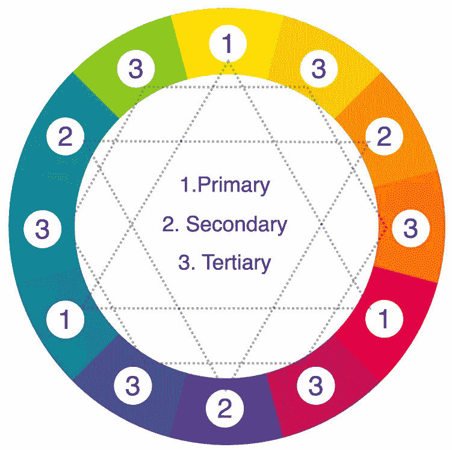

# 什么是 SVG？SVG 文件指南

> 咦: [https://wwwsitepoint .. .com/SVG-101-what-is-SVG/. t1㎡型](https://www.sitepoint.com/svg-101-what-is-svg/)

## What is SVG？

SVG(可缩放矢量图形)是一种图像文件格式，它结合了有关形状、线条、曲线、文本和颜色的信息来构建图像。

虽然大多数常见的图像格式(如 JPG、PNG 和 GIF)将其图像数据记录为特定的像素排列，但 SVG 文件更像是创建给定绘图的“书面说明”或“配方”。这意味着 SVG(就像一个好的食谱)可以在不损失图像质量和不增加文件大小的情况下放大。

SVG 代码是一种基于文本的人类可读语言，本质上类似于 HTML 或 XML。

### SVG 文件看起来像什么？

在几乎任何现代网络浏览器中打开[一个非常简单的 SVG 文件](https://gistcdn.githack.com/alexmwalker/80d98a20cb44a035d3abe37db6e68a01/raw/703181b578aaa090e28d8b85b847f5b397781939/yellow.svg),您会看到类似这样的内容:


在文本编辑器中打开同一个 SVG 文件，您会看到如下内容:

```
<svg width="200" height="200" xmlns="http://www.w3.org/2000/svg">
<circle cx="100" cy="100" r="80" stroke-width="4" stroke="#000" fill="yellow" >
</svg>
```

如示例所示，SVG 文档只不过是描述形状、线条、曲线、颜色和文本的纯文本文件。它们可以被人类阅读和编辑，并通过 CSS 或 JavaScript 进行操作。这为 SVG 提供了传统 PNG、GIF 或 JPG 图像格式无法比拟的灵活性和多功能性。

### 如何制作或编辑 SVG 文件？

虽然简单的 SVG 图像——如上例——可以用任何基本的文本编辑器创建，但大多数 SVG 是用现代矢量图形应用程序创建的。流行的 SVG 编辑器包括:

*   [图](https://www.figma.com/)
*   [Adobe Illustrator](https://www.adobe.com/products/illustrator.html)
*   四四方方的 SVG (不贵)
*   [SVG 编辑器](https://svg-editor.com)(免费)

这里是一个典型的 SVG 图像的例子。这个图片只有 60KB，可以在任何网络环境下使用。作为一个向量，我们可以肯定它会立即缩放以满足任何视口或元素宽度的需求。


早在 20 世纪 90 年代，SVG 可能是“丑小鸭”格式，后来变成了天鹅。最初在 2000 年代的大部分时间里支持不力，被忽视，但自 2010 年代中期以来，情况发生了变化。所有现代的网络浏览器现在都能完美地呈现 SVG，所有严肃的绘图应用程序都提供了 SVG 导出选项。

虽然 jpg 和 png 等传统光栅图形仍然是摄影图像的首选，但 SVG 是唯一适合满足当今 web 开发在可伸缩性、响应性、交互性、可编程性、性能和可访问性方面需求的图形。

#### SVG 和 HTML5 的 Canvas 相比如何？

这两种技术非常不同，但是这个问题经常出现是可以理解的。我们已经在 [SVG 和 Canvas](https://www.sitepoint.com/canvas-vs-svg/) 中分析了各自的目的、优点和缺点，因此您每次都能理解并做出正确的选择。

## SVG 的优势在哪里？

SVG 的优势在于它可以解决现代 web 开发中许多最棘手的问题。让我们浏览一下其中的一些。

#### 1.可扩展性和响应能力

仔细想想，无论你是在标准名片上还是在 20 英尺高的巨型建筑标牌上描绘耐克标志，它们的形状、路径和文字都是一样的。只有测量单位发生了变化。SVG 允许您构建图像，您可以确保无论在任何尺寸下都看起来清晰明了。

相比之下，像 GIF、JPG 和 PNG 这样基于像素的格式就像是在玩乐高。如果你想要更多的尺寸和细节，唯一的解决办法就是增加更多的砖块。

尽管各种响应图像技术已被证明对像素图形很有价值，但它们永远无法真正与 SVG 的无限伸缩能力相抗衡。

#### 2.可编程性和交互性

由于 SVG 图像由单独的组件组成——形状、线条、曲线和文本——我们总是可以自由地使用脚本和行为来定位这些组件。所有种类的动画和交互都可以通过 CSS 和/或 JavaScript 添加到内嵌 SVG 图形中。在 JPG 或 PNG 中没有针对图像元素的等效方法。

#### 3.易接近

由于 SVG 文件是基于文本的，因此与像素图像中的内容相比，SVG 文件中包含的信息更容易搜索和索引。这是否意味着 SVG 本质上是可访问的？不会。准备不充分的 SVG 并不比标签不好的 PNG 更有用。

然而，SVG 图表数据比等效的 JPG 图表更容易提取到屏幕阅读器、搜索引擎和其他文本消费服务中。

#### 4.表演

影响 web 性能的一个最重要的方面是网页上使用的文件的大小。如果准备充分，大型复杂的图像可以使用相对较小的 SVG 文件显示。

## SVG 的最佳用途是什么？

SVG 有很多实际的用例。让我们探索其中最重要的。

### 插图和图表

任何适合使用钢笔和铅笔制作的传统图形都应该可以完美地转换成 SVG 格式。常见到 SVG 被用来为 [3d 打印机](https://www.creativefabrica.com/subscriptions/graphics/3d-svg/)、 [Etsy 艺术品](https://www.etsy.com/au/market/svg)、 [t 恤设计](https://designbundles.net/beginners-svg-t-shirt-making-bundle)、[刺绣图案](https://svges.com)，甚至[婚礼策划抵押品](https://domesticheights.com/6-free-cricut-wedding-invitations-svg-templates/)。


### 徽标和图标

徽标和图标在任何尺寸下都必须清晰锐利——无论是按钮大小还是广告牌大小——这使它们成为 SVG 的理想候选对象。此外，SVG 图标更容易访问，也更容易定位。


### 动画片

您可以创建吸引人的动画，包括使用 SVG 图形的酷炫线条画效果。事实上，SVG 代码可以与 CSS 动画、JavaScript 库及其内置的 SMIL 动画功能进行交互。


### 交互性(图表、图形、信息图、地图)

SVG 可用于绘制数据，并根据用户动作或其他事件动态更新数据。参见[互动 SVG 信息图](https://tympanus.net/Tutorials/InteractiveSVG/)和 [SVG 互动路线图](http://codepen.io/dudleystorey/pen/zKBVPm)。

<object data="https://gistcdn.githack.com/alexmwalker/3cd5ef0ee6e444961112b5e78dd07c0f/raw/5510d2339f0d49bd3132702728899b27b9c16a3a/color-circle-interactive.svg" width="100%" height="600"></object>

### 特技

使用 SVG 可以实现许多现场效果，包括[形状变形](https://codepen.io/collection/nGoLEj/)或[有机粘性效果](https://tympanus.net/Development/CreativeGooeyEffects/)。

### 构建界面和应用程序

SVG 使您能够制作复杂的界面组件，这些组件可以与 HTML5、基于 web 的应用程序和富互联网应用程序(RIA)集成。

### 摘要

那么，现在你知道什么是 SVG，以及为什么它们对 Web 来说很棒。下一步，我建议您阅读一下 [Craig 的文章，这篇文章介绍了使用 CSS 和 SVG](https://www.sitepoint.com/css-with-svg/) 的各种方法，以及在网页中包含和操作 SVG 的方法。或者如果你想深入研究，可以看看克里斯·科伊尔的《T2 实用 SVG》一书。

## 分享这篇文章