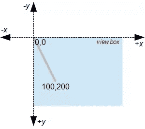
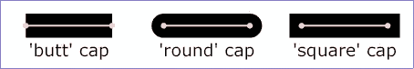
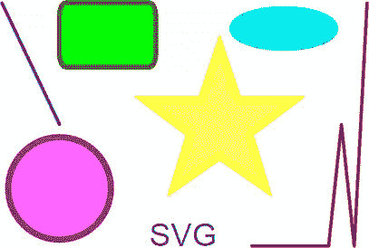

# 可缩放矢量图形:绘图基础

> 原文：<https://www.sitepoint.com/svg-drawing-basics/>

在这篇文章中，你将发现在 [SVG](https://www.sitepoint.com/svg-101-what-is-svg/) 图像中使用的基本概念、文档结构和绘图元素。

如果您对 SVGs 完全陌生，首先阅读以下文章可能会有所帮助:

*   [可缩放矢量图形:概述](https://www.sitepoint.com/svg-scalable-vector-graphics-overview/)
*   [考虑 SVG 而不是 Canvas 的 7 个理由](https://www.sitepoint.com/7-reasons-to-consider-svgs-instead-of-canvas/)

## SVG 坐标网格

SVG 是在你给它的任何坐标空间中定义的。这个空间不一定与像素、厘米、英寸或其他绝对单位相关，因为 SVG 可以缩放到任何维度。

SVG 的`viewBox`属性决定了图像使用的坐标。以下 SVG 在缩放到相同大小时看起来是一样的:

*   一条从`0,0`到`200,100`的`viewBox`，一条从`0,0`到`100,50`的线
*   一条从`0,0`到`300,150`的`viewBox`，一条从`0,0`到`150,75`的线
*   从`0,0`到`30,15`的一个`viewBox`，有一条从`0,0`到`15,7.5`的线(可以是一个单位的分数)



与数学图形不同，SVG 坐标系从左上角(通常是`0,0`)开始，x 轴指向右侧，y 轴指向下方。因此，`100,200`处的点代表左手边右边的 100 个单位和上边下面的 200 个单位。

当一个 SVG 被渲染时，它可以被赋予`width`和`height`属性或者在 CSS 中被分配维度。图像将在两个方向上被拉伸或压缩，以填充分配给它的空间。然而，SVG 可以声明它的长宽比可以保留，以确保尺寸缩放一致。

## SVG XML 文档

SVG 图像是一种遵循严格约定(结束标记、引用属性等)的 XML 文档。当 1999 年首次开发 SVG 时，文件需要在根`<svg>`元素上方的文档顶部有 XML 声明和 DOCTYPE:

```
<?xml version="1.0" encoding="UTF-8" standalone="no"?>
<!DOCTYPE svg PUBLIC "-//W3C//DTD SVG 1.1//EN" "https://www.w3.org/Graphics/SVG/1.1/DTD/svg11.dtd">
<svg xmlns="https://www.w3.org/2000/svg">

  <!-- image data -->

</svg> 
```

您可能仍然会遇到这种格式，但是更常见的是`.svg`文件使用单个根元素:

```
<svg xmlns="https://www.w3.org/2000/svg">

  <!-- image data -->

</svg> 
```

`xmlns`属性是必需的。当 SVG 被直接嵌入到 HTML 中时，大多数浏览器都允许省略它，尽管这可能会导致一些问题，如果您以后想要处理图像的话:

```
<svg>

  <!-- image data -->

</svg> 
```

许多可选属性可以应用于根元素，但是最常用的是:

*   [查看框](https://www.w3.org/TR/SVG/coords.html#ViewBoxAttribute)设置尺寸。

    矩形坐标区域被指定为`"minX minY width height"`。例如，`viewBox="0 0 600 400"`是一个`600`乘`400`宽度的框，左上角坐标在`0,0`。记住这是一个抽象的空间；它与像素无关，你的绘图元素也不受这些坐标的限制。

*   [preserveAspectRatio](https://www.w3.org/TR/SVG11/coords.html#PreserveAspectRatioAttribute) 定义如何缩放视图框。

    有很多选择。例如，`preserveAspectRatio="xMidYMid meet"`确保 SVG 视图框的中间与视口(包含 SVG 的浏览器窗口或 HTML 元素)的中间对齐，并且图像适合可用空间，同时保持其纵横比。

*   [`height`和`width`](https://www.w3.org/TR/SVG11/struct.html#SVGElementWidthAttribute) 设置固有图像尺寸。

    例如，设置`width="300" height="200"`将使用默认的`300`乘`200`像素的图像，除非它是使用 CSS 调整大小的。如果在没有设置`viewBox`的情况下设置了宽度和高度，则 SVG 单元的数量被假定为该尺寸，即`viewBox="0 0 300 200"`。

根`<svg>`元素后面可以跟一个可选的标题和描述，使用`title`和`desc`元素定义。基本文件:

```
<svg xmlns="https://www.w3.org/2000/svg" viewBox="0 0 600 400" preserveAspectRatio="xMidYMid meet">
  <title>My First Scalable Vector Graphic</title>
  <desc>An experimental SVG from SitePoint.com</desc>

  <!-- drawing elements to go here -->

</svg> 
```

## 分组元素

任何元素集合(线条、圆形、矩形、文本等)。)可以使用`<g>...</g>`标签进行分组。本质上，它类似于将图形对象分组到图形包中，以便它们可以作为单个项目进行操作。

例如，您可以定义一个根组节点，以便可以通过 JavaScript 或 CSS 操作整个图像:

```
<g id="main">
  <!-- drawing elements to go here -->
</g> 
```

一个组可以有任意数量的内部组，并根据需要进行嵌套。

## 线

使用 [`line`元素](https://developer.mozilla.org/SVG/Element/line)在两点之间画一条单线:

```
<line x1="10" y1="10" x2="100" y2="200"
stroke="#999" stroke-width="5" stroke-linecap="round" /> 
```

`stroke-linecap`属性定义行尾效果，并接受值`butt`(默认)、`round`、`square`或`inherit`:



图片来源:

## 多叉线

[折线](https://developer.mozilla.org/SVG/Element/polyline)定义一组相连的直线段:

```
<polyline points="580,10 560,390 540,200 520,390 400,390"
stroke="#c00" stroke-width="5" stroke-linecap="round"
stroke-linejoin="round" fill="none" /> 
```

`stroke-linejoin`属性定义了连线效果，并接受`miter`(默认)、`round`、`bevel`或`inherit`的值:


图片来源:

## 多边形

[多边形](https://developer.mozilla.org/SVG/Element/polygon)类似于折线，除了生成的形状总是闭合的:

```
<polygon points="350,75 379,161 469,161 397,215 423,301 350,250 277,301 303,215 231,161 321,161"
stroke="#ff0" stroke-width="10" fill="#ff6" /> 
```

## 长方形

使用 [`rect`元素](https://developer.mozilla.org/SVG/Element/rect)定义方形或圆角矩形:

```
<rect x="100" y="10" width="150" height="100" rx="10" ry="20"
stroke="#060" stroke-width="8" fill="#0f0" /> 
```

`x`和`y`属性定义了左上角。`rx`和`ry`指定水平和垂直圆角。

## 环

[圆](https://developer.mozilla.org/SVG/Element/circle)使用中心点和半径定义:

```
<circle cx="100" cy="300" r="80"
stroke="#909" stroke-width="10" fill="#f6f" /> 
```

## 省略

[椭圆](https://developer.mozilla.org/SVG/Element/ellipse)由一个中心点和两个半径值定义:

```
<ellipse cx="450" cy="50" rx="80" ry="30"
stroke="#0cc" stroke-width="10" fill="#0ff" /> 
```

## 文本

可以使用 [`text`元素](https://developer.mozilla.org/Web/SVG/Element/text)添加基本文本:

```
<text x="240" y="390" font-family="sans-serif" font-size="50" fill="#00f">SVG</text> 
```

虽然 [`text-anchor`](https://developer.mozilla.org/Web/SVG/Attribute/text-anchor) 和 [`dominant-baseline`](https://developer.mozilla.org/Web/SVG/Attribute/dominant-baseline) 属性提供了对位置的更多控制，但是`x`和`y`属性定义了字符串中第一个字符的左下角坐标。

## 小路

最后，还有一个 [`path`元素](https://developer.mozilla.org/Web/SVG/Element/path)，它有能力模仿上面的任何基本元素。更多细节请参考“T3 如何在 SVG 中创建复杂路径”。

## 结果呢

我们最终的 SVG 文档包含以下元素:

```
<svg xmlns="https://www.w3.org/2000/svg" viewBox="0 0 600 400" preserveAspectRatio="xMidYMid meet">
  <title>My First Scalable Vector Graphic</title>
  <desc>An experimental SVG from SitePoint.com</desc>
  <g id="main">
    <line x1="10" y1="10" x2="100" y2="200" stroke="#00c" stroke-width="5" stroke-linecap="round" />

    <polyline points="580,10 560,390 540,200 520,390 400,390" stroke="#c00" stroke-width="5" stroke-linecap="round" stroke-linejoin="round" fill="none" />

    <polygon points="350,75 379,161 469,161 397,215 423,301 350,250 277,301 303,215 231,161 321,161" stroke="#ff0" stroke-width="10" fill="#ffc" />

    <rect x="100" y="10" width="150" height="100" rx="10" ry="20" stroke="#060" stroke-width="8" fill="#0f0" />

    <circle cx="100" cy="300" r="80" stroke="#909" stroke-width="10" fill="#f6f" />

    <ellipse cx="450" cy="50" rx="80" ry="30" stroke="#0cc" stroke-width="10" fill="#0ff" />

    <text x="240" y="390" font-family="sans-serif" font-size="50" fill="#00f">SVG</text>
  </g>
</svg> 
```

上面的代码呈现如下:



你可以[在这里](https://editor.sitepoint.com/wp-content/uploads/2012/05/1606174609image.svg)下载 SVG 文件。

这是一个简单的例子，但是在优化、缩小和 gzipping 之前，文件小于一千字节*。上面一个等效的压缩 PNG 几乎是它的五倍大，并且不能在不损失质量的情况下通过`274`分辨率缩放到它的原生`407`之上。*

你很少需要手动绘制 SVG，因为使用图形包更容易，如 [Illustrator](https://www.adobe.com/uk/products/illustrator.html) 、 [Inkscape](https://inkscape.org/) 、 [SVG-edit](https://svg-edit.github.io/svgedit/dist/editor/index.html) 或[方法绘制](http://editor.method.ac/)。然而，理解基本 SVG 元素的工作原理可能有助于优化图像，或者在服务器上或用 JavaScript 生成令人惊叹的图像。

更多资源:

*   [SVG 元素引用](https://developer.mozilla.org/SVG/Element)
*   [SVG 属性引用](https://developer.mozilla.org/SVG/Attribute)
*   [如何在 SVG 中创建复杂路径](https://www.sitepoint.com/svg-path-element/)
*   [SVGOMG！缩小工具](https://jakearchibald.github.io/svgomg/)

## 分享这篇文章