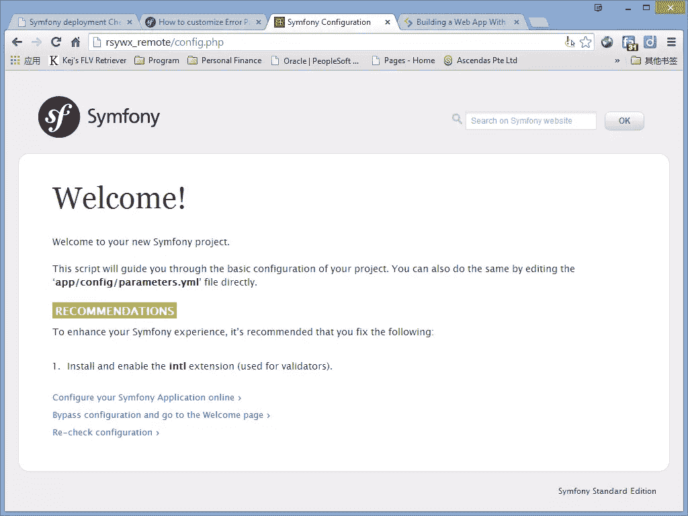

# Symfony 2 开发和部署清单

> 原文：<https://www.sitepoint.com/symfony-2-checklist-development-deployment/>

在 Sitepoint 上发布的我的[用 Symfony 2](https://www.sitepoint.com/series/building-a-personal-web-app-head-to-toe-with-symfony-2/) 系列从头到尾构建一个个人 web 应用程序中，我已经介绍了使用 Symfony 2 开发 Web 应用程序的引导、开发和最终确定(关于一些高级技术)的一些基础知识。然而，由于本系列的篇幅限制，我们没有过多地讨论“最后”步骤:将 Symfony 2 应用程序部署到生产环境中。

当我们做开发时，很可能我们处于一个“根”的角色；但在生产环境中，我们可能会被剥夺这种特权。此外，设置可能有所不同。更糟糕的是，有时我们无法像在自己的机器上那样更改这些设置。

因此，在我们自己的服务器上进行任何真正的开发之前，检查我们的生产服务器的“兼容性”是非常重要的。这将避免这样的可怕情况:Symfony 依赖的库丢失，一些应用程序依赖的全局设置不可更改，等等。

测试我们生产服务器的“兼容性”应该是我们一开始就要做的事情。在部署过程中，还有一些其他方面需要解决，例如各种错误消息的模板等。

在接下来的部分中，我们将假设您没有对生产服务器的完全控制权。如果您这样做了，大多数兼容性问题可能都不适用，因为您应该能够很容易地自己解决这些问题。

### 生产服务器上的空 Symfony 框架

请按照我关于 Symfony 2 的第一篇文章中的说明，在生产服务器上建立一个空的 Symfony 框架。

这对于测试服务器是否启用了 cURL 也很有用，不仅安装在服务器上，而且作为 PHP 扩展，确保我们可以获取外部资源。在我的特殊情况下，这是非常重要的-composer.org 在我的国家被封锁，我需要使用一个代理来获取和安装 Symfony 框架。

这个空框架稍后可以被签入版本控制。

### 配置文件

Symfony 2 带有一个位于`web`目录中的`config.php`文件。这是测试大多数“准备就绪”问题的脚本。要访问该页面，我们需要稍微调整一下:

```
<?php

if (!isset($_SERVER['HTTP_HOST'])) {
    exit('This script cannot be run from the CLI. Run it from a browser.');
}

if (!in_array(@$_SERVER['REMOTE_ADDR'], array(
    '127.0.0.1',
    '::1',
))) {
    header('HTTP/1.0 403 Forbidden');
    exit('This script is only accessible from localhost.');
}
...
```

该文件只能从本地浏览器调用。我们需要注释掉第二个`if`块，这样我们就可以远程访问它。

我的服务器配置正确，没有任何严重问题:



该文件测试了我在下表中总结的就绪性问题。实际的测试是在`app/SymfonyRequirements.php`中完成的，所以我们也可以看看那个文件。

| 设置/模块 | 要求 | 认真 | 行动 |
| --- | --- | --- | --- |
| PHP 版本 | 

> = 5 . 3 . 3
> 
> 

 | 5.3.16 是必需的，但不能是 | 升级至最新版本。建议至少使用 PHP 5.4.8 及以上版本。 |
| 供应商库 | 安装者`composer.phar` | 需要 | 使用`composer.phar`更新 |
| `cache`，`logs`目录 | 可写的 | 需要 | 通过发布`chmod`来授予权限。正常情况下，特权应该是`755`或者`777`。 |
| 时区 | 类似于`'Asia/Shanghai'`或者你的时区 | 需要 | 更改`php.ini`。 |
| `json_encode`、`session_start`、`ctype_alpha`、`token_get_all`、`simplexml_import_dom` | 使能够 | 需要 | 启用各自的 PHP 库。大多数 PHP 服务器都启用了这些功能。 |
| 美国动力会议 | 启用/禁用 | 如果使用 APC，则启用 | 如果您使用另一个缓存/加速器，请启用 APC 或禁用 APC。 |
| xdebug | 各种设置 | 必需，推荐 | 相应地更改`xdebug`设置。 |
| `DomDocument`、`mb_strlen`、`icony`、`utf8_decode`、`intl`等 | 各种模块 | 被推荐的 | 如果您愿意，可以启用。 |
| 加速器 | 各种设置 | 被推荐的 | 根据您的要求安装和启用。 |
| `<?`短开标签，`magic_quotes_gpc`，`register_globals`，`session.auto_start` | 有缺陷的 | 被推荐的 | 建议按照建议去做。PHP 最新版本默认禁用了其中一些。 |
| PDO | 数据库驱动程序 | 被推荐的 | 请安装并启用它。如果你正在使用教义 ORM，这是强制性的。 |

“ **Required** 的严重性级别意味着我们必须更改服务器设置以满足要求。否则，Symfony 2 不会运行，因此不应该是我们应用程序开发的正确选择。一个“**推荐的**”条目可以被安全地忽略，但是我建议我们尽可能地满足这些推荐。在我的例子中(如上所示)，我的生产服务器只有一个警告。这为进一步发展奠定了坚实可靠的基础。

### 使用 git 同步文件

在开发过程中，您可能希望使用版本控制将本地更改同步到远程站点，而不是将文件复制到生产服务器。

在这种情况下，一个合适的`.gitignore`(或者其他版本控制系统中的等效物)将变得很方便。以下节选自我的`.gitignore`文件，供参考:

```
# Composer vendor
vendor/*
!public/assets/js/vendor
!public/assets/js/vendor/*
!public/assets/css/vendor
!public/assets/css/vendor/*
composer.phar
composer.lock

# Symfony
app/cache/*
app/logs/*

# Logs
error.log
access.log

# Netbeans
nbproject
.nbproject
.nbproject/*
nbproject/*
nbproject/private/
build/
nbbuild/
dist/
nbdist/
nbactions.xml
nb-configuration.xml
```

这从来都不是一个详尽的或适合所有用途的列表。例如，如果您使用 PhpStorm 而不是 Netbeans，您可以删除`Netbeans`部分，并替换为适合 PhpStorm 的过滤器:

```
# IntelliJ - PhpStorm and PyCharm  .idea .idea/  .idea/*
*.iml
*.ipr
*.iws 
```

或者把它们都留在里面，这样你就可以自动适应可能使用其他 ide 的其他开发人员。建议始终包括前 3 个部分(`Composer`、`Symfony`、`Logs`)。

### 清除缓存

Symfony 应用程序第一次在远程服务器上运行时，它会在`app/cache/prod`目录中创建我们应用程序的编译版本。当我们的文件，尤其是我们的控制器和路由更新时，我们需要刷新缓存，否则输出可能不正确，并经常导致 500 个错误。

为了清除缓存，我通常会 SSH 到我的生产服务器，并在`app`目录下执行一个`rm -rf cache`命令。`console cache:clear`或`console cache:warmup`命令可能不是最干净的方式。

### 远程开发模式

谨慎使用，仅在绝对必要时使用！

在某些情况下，本地运行的站点在部署到生产服务器时可能会崩溃。造成这种情况的原因可能很复杂，并且与编码过程本身无关。在这些情况下，我们可以考虑启用远程`dev`模式。

为此，我们采用类似的方法，通过注释`app_dev.php`中的以下代码块来禁用`localhost`检查:

```
// This check prevents access to debug front controllers that are deployed by accident to production servers.  // Feel free to remove this, extend it, or make something more sophisticated.  if  (isset($_SERVER['HTTP_CLIENT_IP'])  || isset($_SERVER['HTTP_X_FORWARDED_FOR'])  ||  !in_array(@$_SERVER['REMOTE_ADDR'], array('127.0.0.1',  'fe80::1',  '::1'))  )  { header('HTTP/1.0 403 Forbidden');  exit('You are not allowed to access this file. Check '.basename(__FILE__).' for more information.');  } 
```

然后，我们可以使用类似于:`http://rsywx_remote/app_dev.php`的内容访问域和页面。当出现问题时，这种`dev`模式显示更多有用的调试信息，可以帮助我们找到一些根深蒂固的问题。为了在调试期间增加安全性，添加一个检查，只允许从您自己的 IP 访问上述文件-这将为其他人关闭开发模式。大多数问题都与数据库设置(错误的数据库和/或凭证)、错误的 API URIs(本地和远程 URIs 可能不同)、过时的缓存、缺少本地使用但远程未启用的库等有关。

当问题解决后，请记住取消注释这些行以恢复完全访问控制。普通用户只能使用`app.php`作为我们应用的入口。

### 自定义错误页面

Symfony 2 的默认 Twig 模板引擎确实提供了一些错误页面(404、500 等)。但是这些页面的设计通常不适合我们的应用程序。官方网站有关于如何做到这一点的详细解释。我们可以根据自己的布局和主题开发自己的错误页面。

我们可以自定义错误页面，并将它们放在`app/Resources/TwigBundle/views/Exception`下。对于 404 错误，这些文件可以命名为`error404.html.twig`；对于 403 错误，可以命名为`error403.html.twig`，等等；对于一般用途，也可以命名为`error.html.twig`。

需要注意的是，在 Symfony 2 中，错误信息页面不支持 Twig 模板扩展。这意味着我们不能从为其他页面设计的现有布局中扩展错误页面。我们必须从头开始设计错误页面。对于一个严肃的网站来说，这有点不方便，但仍然值得一做。

### 结论

在本文中，我们讨论了一些与 Symfony 部署相关的主题:服务器就绪、版本控制、远程`dev`模式、缓存更新、错误页面定制等。

部署通常是我们开发的最后一步。我真的希望这篇文章能帮助您避免一些常见的缺陷，并使您的部署过程更加顺利。

如果你觉得这篇文章有趣或有用，请重新分享，如果你有反馈，请在下面留下评论，非常感谢！

## 分享这篇文章