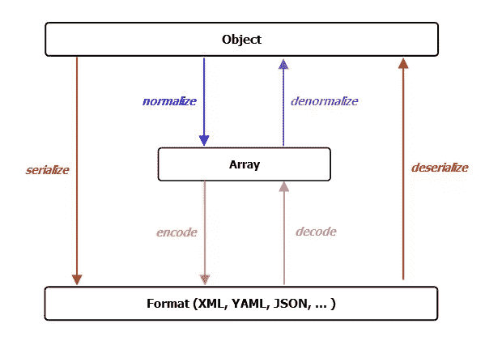

# Drupal 8 中的 Symfony

> 原文：<https://www.sitepoint.com/symfony-drupal-8/>

如果你是一个 Drupaler，你必须意识到 Drupal 8 正在路上。你可能不知道的是，它包括一些重要的 Symfony 组件。使用 Drupal 8.x 将会给 Drupalers 一个机会成为巨大的学习曲线的一部分，并会诱使他们更多地了解 Symfony。在本文中，我们将讨论添加到 Drupal 8 中的 Symfony 组件，包括一些第三方库。

在我们进入真正的文章之前，让我们先简单介绍一下 [Symfony](http://symfony.com/) 。它是一个基于 PHP 的 web 应用程序框架，遵循 MVC 架构。此外，它是一个在 MIT 许可下发布的开源项目。请确保您不会将其与 Symfony CMS 混淆。如果你想更详细地探索 *Symfony 框架*，请查看它的[维基页面](http://en.wikipedia.org/wiki/Symfony)或任何之前关于它的 [SitePoint 文章](https://www.sitepoint.com/?s=symfony)。

现在让我们了解一下正在 Drupal 8 中实现的 Symfony 组件。

## Drupal 8.x 中的 Symfony 组件

以下是将在很大程度上增强 Drupal 8 核心的 Symfony 组件:

*   [**HttpKernel**](https://github.com/symfony/HttpKernel) 和[**http foundation**](https://github.com/symfony/HttpFoundation)——这些负责在`EventDispatcher`的帮助下简化将请求转换为响应的过程。Drupal 8 迁移到 Symfony 是由 *Web 服务和内容核心计划(WSCCI)* 推动的，目的是将 Drupal 从一个*一流的 CMS* 转变为一个*一流的 REST 服务器**，在其上运行一流的 CMS。这一举措旨在允许 Drupal 使用 web 服务来提供其内容，同时降低复杂性；考虑到这是一个长期的愿景，Drupal 将会是更加灵活、健壮和易于维护的 CMS。*

**   [**event dispatcher**](https://github.com/symfony/EventDispatcher)–以简单有效的方式实现[中介模式](http://en.wikipedia.org/wiki/Mediator_pattern)(使用封装)，尤其是在代码继承不可行的情况下，使应用程序高度可扩展。在您倾向于维护和/或重构由大量类组成的程序的情况下，它更有效，因为它使得类之间的通信非常简单和容易。

    *   [**类加载器**](https://github.com/symfony/ClassLoader)–提供自动加载类并缓存其位置的工具。PHP 使用[自动加载机制](http://php.net/manual/en/language.oop5.autoload.php)来委托加载一个文件，该文件定义了当你引用一个还没有被要求或包含的类时的类。Symfony 配有自动加载器，如`PSR-0 Class Loader`和`MapClassLoader`。实现`ClassLoader`组件将使 Drupal 模块开发人员无忧无虑，尤其是在实现`module_load_include`和其他依赖项的时候。此外，它允许开发人员在运行时轻松调用类。

    *   **–它解析 YAML 字符串并将其转换成 PHP 数组，反之亦然。这种格式是专门为保存与配置相关的信息而设计的，同时具有 XML 文件的表现力和 INI 文件的可读性。它作为 [Drupal 的 CMI](https://groups.drupal.org/build-systems-change-management/cmi) (配置管理计划)的一个组成部分，允许我们的模块最初定义它们的默认配置设置，并允许站点构建者在接到指示时覆盖相同的 as-and-as。由 YAML 支持的 Drupal 8 的 CMI 概念是对 Drupal 模块贡献的[特性的替代，就跨环境迁移和部署而言，Drupal 模块](https://drupal.org/project/features)被证明是一个健壮的概念。**

    ***   [**路由**](https://github.com/symfony/Routing)–允许我们加载所有路由，并转储特定于这些路由的 URL 匹配器或生成器。这也意味着它将一个 HTTP 请求映射到一组配置变量。就 Drupal 8 和更高版本而言，我们在一个 YAML 配置文件中定义了模块的路由，每个路由都被设置为触发一个在模块的类中定义的特定动作。

    *   [**dependency injection**](https://github.com/symfony/DependencyInjection)——主要用于标准化和集中我们的应用程序中对象的构造方式。Symfony 的 DependencyInjection 组件已经合并到 Drupal 8 中，目的是以这样一种方式编写代码，即类可以在任何适用和需要的地方重用和单元测试。

    *   [**树枝**](http://twig.sensiolabs.org)——Drupal 8 采用了[树枝](https://drupal.org/node/1499460)模板引擎。这让主题者很感兴趣，只要他们还在做 Drupal 主题，他们可能就再也不会想到其他选项了。Twig 是由*杨奇煜·普朗特*开发的，他也开发了 [Symfony 项目](https://drupal.org/project/symfony)，并为集成到 Drupal 8 进行了微调。

    *   [**进程**](https://github.com/symfony/Process)–使用命令行界面帮助执行子进程中的命令。Drupal 8 将使用它来处理所有命令行性质的活动。

    *   [**串行化器**](https://github.com/symfony/Serializer)–用于将对象转换成特定格式(如 XML、YAML、JSON 等)。)反之亦然。为了更好地理解它，让我们看看下面的模式，一个*序列化器*组件遵循这个模式:

    此外，我们可以使用它来完成许多工作，从配置到应该由 REST 端点交付的节点和实体创建。

    *   [**验证器**](https://github.com/symfony/Validator)——帮助 Drupal 验证值。例如:验证表单提交、验证 Drupal 中的实体等。为了完成它的工作，它使用了*原则注释*(在*开箱即用的第三方组件*一节中讨论)。

    *   [**翻译**](https://github.com/symfony/Translation)–提供一套标准的工具来加载翻译文件，生成翻译后的字符串作为输出，并使用生成的结果。*** 

 ***## 现成的第三方组件

我们浏览了 Drupal 8 中包含的 Symfony 组件。在这一节中，我们将了解已经在 Drupal 8 中实现的与 Symfony 无关的第三方 PHP 组件。它们是:

*   [**Asset IC**](https://github.com/kriswallsmith/assetic)—*资产管理框架*。Drupal 中的资产由 CSS 文件、JavaScript 文件、图像、其他媒体文件、元数据等组成。这些资产包含可以加载和转储的可过滤内容。为了操作资产，您需要应用适当的过滤器。要了解过滤器，在什么情况下可以使用，如何使用过滤器，构建，转储等等，我们建议您阅读 Assetic Github 页面。

*   [**Composer**](https://www.sitepoint.com/php-dependency-management-with-composer/)——一个专门为*管理 PHP 中的依赖关系*而设计和开发的工具，允许我们声明项目需要的依赖库并为我们安装它们。虽然它处理包和库，但它不是包管理器。Composer 是 Drupal 8 的福音，原因如下:

    *   非常有效地处理项目依赖于多个库的情况。

    *   处理库中存在嵌套依赖概念的情况。比如说；你的项目依赖于一个库(比如说， *lib1* )，换句话说， *lib1* 依赖于某个其他的库(比如说， *lib2* )。

    *   除非明确告知目标版本，否则 Composer 有责任选择需要安装的软件包或库的版本。

*   [**主义**](http://www.doctrine-project.org/)——一套用于数据库记录的工具。Drupal 8 使用了它的一部分，称为*注释*，向 Drupal 公开额外的元数据。人们已经努力以一种非常简单和方便的方式来呈现这种复杂的功能，尤其是在定义自定义实体类型时。如果你想进一步探索教义应该如何与 Drupal 8 一起使用，我们建议你访问[文档页面](https://drupal.org/node/1817778)。

*   [**easy RDF**](http://www.easyrdf.org)——一个已经与 Drupal 8 一起使用的 PHP 库，以便于使用和生成 RDF。在 EasyRDF 的帮助下，Drupal 8 增加了以简单方便的方式在标记中生成元数据的能力。你也可以访问 [EasyRDF 官方网站](http://www.easyrdf.org/)来了解更多。

*   这是一个 PHP HTTP 客户端和框架，帮助 Drupal 8 使用基于 REST 的 web 服务调用来发出 web 请求。这使得 Drupal 8 web 门户在处理不同种类的 web 服务方面更加高效。为了更深入地探索这一现象，我们推荐[阅读我们之前关于它的文章](https://www.sitepoint.com/guzzle-php-http-client/)。

*   [**PHPUnit**](https://www.sitepoint.com/getting-started-with-phpunit/)——在 Drupal 8 中用于标准化整个核心的单元测试，以及帮助开发人员编写最高质量的代码。PHPUnit 确保用 Drupal 8 编写的任何代码以及其中包含的任何定制模块都符合行业标准，并在整个生命周期中按预期工作。你可以通过这里的[来关注 PHPUnit 并入 Drupal 8 的当前状态。](https://drupal.org/node/1901670)

*   [**PSR-3 日志**](https://www.sitepoint.com/logging-with-psr-3-to-improve-reusability/)——一个由整个 PHP 应用程序共享的公共日志系统。Drupal 7 和更老的版本使用`watchdog()`来实现这个目的。将 Drupal 日志记录从 watchdog()切换到 PSR 3 日志记录框架，使得 Drupal 8 在通用日志记录方面更加健壮和可伸缩。您可以在[将看门狗切换到 PSR-3 日志框架](https://drupal.org/node/1289536)来跟踪该组件的当前状态。

## 结论

一些 Symfony 组件的引入简化了 Drupal 8 的使用。此外，包含一些非 Symfony 组件增加了 Drupal 8 在质量、可伸缩性和性能方面的价值，使它更加健壮和可维护。

## 分享这篇文章***