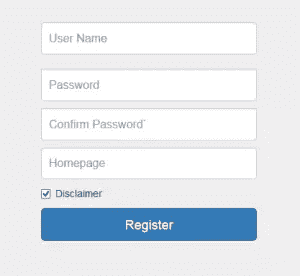
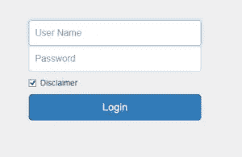

# Symfony2 注册和登录

> 原文：<https://www.sitepoint.com/symfony2-registration-login/>

在第 1 部分的[中，我们讨论了在我们的应用程序中设置安全系统的基础(数据库和`security.yml`设置)。我们还介绍了预注册阶段，在这个阶段，用户通过应用程序验证他们的邀请状态。](https://www.sitepoint.com/symfony2-pre-registration-invite-system/)


在这篇文章中，我们将讨论注册，登录和登录后的行动。

## 表单、数据库等等

注册是通过表格完成的。用户将输入电子邮件、用户名、密码、确认密码等信息，并在某些情况下接受免责声明。

我们还知道一个用户对象最终将被保存在`user`表中。

在这个持续过程中，我们必须意识到:

1.  一些表单输入将用于填充用户对象(如`username`、`password`)；
2.  一些用户属性将由应用程序设置(如`created`，用户注册时存储的日期/时间字段)；
3.  一些表单输入仅仅是为了验证而被丢弃(比如重新输入密码，检查免责声明)。

我们必须有一种方法来创建一个表单和底层表之间的“链接”，并指定上述要求。

在 Symfony 中，我们通过声明一个与实体相关联的特殊表单类型类来实现这一点。在这种情况下，一个`RegistrationType`管理显示哪些字段，哪些字段被映射(到一个字段)等等。

该类(`RegistrationType`)在`src/AppBundle/Form/Type/RegistrationType.php`中定义:

```
class RegistrationType extends AbstractType
{

    public function buildForm(FormBuilderInterface $builder, array $options)
    {
        $builder->add('username', 'text', ['label'=>'User Name'])
                ->add('password', 'password',['label'=>'Password'])
                ->add('confirm', 'password', ['mapped' => false,'label'=>'Re-type password'])
                ->add('homepage', 'text',['label'=>'Homepage'])
                ->add('email', 'hidden', ['label'=>'email'])
                ->add('save', 'submit', ['label'=>'Register'])
        ;
    }

    public function getName()
    {
        return 'registration';
    }

    public function setDefaultOptions(OptionsResolverInterface $resolver)
    {
        $resolver->setDefaults([
            'data_class' => 'AppBundle\Entity\User',
        ]);
    }

}
```

我们有几个`->add()`调用来添加一个要显示的表单字段，并映射到底层的表字段；或者是要显示但不映射到基础表字段的表单字段。任何未添加的表字段都不会显示，因此不会由用户填充。

让我们来看一些例子:

```
add('username', 'text', ['label'=>'User Name'])
```

这将添加一个文本类型的表单字段，映射到标签为“用户名”的表字段`username`。

```
add('confirm', 'password', ['mapped' => false,'label'=>'Re-type password'])
```

这将添加一个密码类型的表单字段，但不会映射到表字段，并且有一个标签“重新键入密码”。

```
add('email', 'hidden', ['label'=>'email'])
```

这将添加一个隐藏的表单字段，映射到表字段`email`。这里的标签设置是无用的，但有它在那里没有坏处。

一旦定义了`RegistrationType`，我们就可以进入真正的注册了(在预注册通过之后):

```
$registration = new User();

$form         = $this->createForm(new RegistrationType(), $registration, ['action' => $this->generateUrl('create'), 'method' => 'POST']);

return $this->render('AppBundle:Default:register2.html.twig', ['form' => $form->createView(), 'email' => $email]);
```

我们创建了一个新的用户实例，然后使用`createForm`创建一个表单(添加了动作和方法属性),并在与用户对象(`$registration`)相关联的`RegistrationType`中声明了约束和表现。

最后，我们显示注册表单。

## 在视图样板中渲染表单

呈现的注册表单如下所示:



呈现表单的代码如下:

```
<form class="form-signin" name='register_form' id='register_form' method='post' action='{{path('create')}}'>
	{{ form_widget(form.username, {'attr': {'class': 'form-control', 'placeholder':'User Name'}}) }}<br>

    {{ form_widget(form.password, {'attr': {'class': 'form-control', 'placeholder':'Password'}}) }}

    {{ form_widget(form.confirm, {'attr': {'class': 'form-control', 'placeholder':'Confirm Password'}}) }}

    {{ form_widget(form.homepage, {'attr': {'class': 'form-control', 'placeholder':'个人主页'}}) }}

    {{ form_widget(form.email, {'attr': {'value': email}}) }}

    <div class="checkbox">
        <label>
            <input type="checkbox" value="remember-me" required checked>Disclaimer
        </label>
    </div>
    <button class="btn btn-lg btn-primary btn-block" type="submit">Register</button>
</form>
```

我不得不承认，显示由上述过程创建的表单不是一件容易的工作。幸运的是，Twig 为我们提供了一些帮助函数来定制这个呈现的表单。

```
{{ form_widget(form.password, {'attr': {'class': 'form-control', 'placeholder':'Password'}}) }}
```

使用`form_widget`助手，传入的第一个参数是表单字段(`password`)。更重要的部分是第二个参数，它进一步定义了呈现的 HTML5 元素。在上面的代码中，我们指定`password`的`<input>`元素应该有一个 CSS 类`form-control`(这是一个引导表单类)和一个占位符。

请注意，我们没有指定该表单字段应该是哪种类型——它应该是一个密码字段，因为我们要输入密码。`form_widget`足够聪明(或者更准确地说，`$form = $this->createForm(...)`足够聪明)，可以根据各自在`RegistrationType`声明中的定义创建表单元素。

## 创建用户

当用户点击“注册”按钮时，信息将被进一步处理，如果一切顺利，用户将被创建。

```
public function createAction(Request $req)
    {
        $em   = $this->getDoctrine()->getManager();
        $form = $this->createForm(new RegistrationType(), new User());
        $form->handleRequest($req);

        $user= new User();
        $user= $form->getData();

        $user->setCreated(new \DateTime());
        $user->setRoles('ROLE_USER');
        $user->setGravatar('http://www.gravatar.com/avatar/'.md5(trim($req->get('email'))));
        $user->setActive(true);

        $pwd=$user->getPassword();
        $encoder=$this->container->get('security.password_encoder');
        $pwd=$encoder->encodePassword($user, $pwd);
        $user->setPassword($pwd);

        $em->persist($user);
        $em->flush();

        $url = $this->generateUrl('login');
        return $this->redirect($url);
    }

}
```

在这段代码中，我们将做许多与从表单输入实际创建用户相关的事情。

1.  将再次调用`$this->createForm`来生成基于`RegistrationType`的表单。
2.  表单对象将处理用户输入。
3.  我们创建一个空的`User`对象，通过使用`$form->getData()`，我们神奇地将表单输入分配给对象属性。
4.  我们开始分配那些没有被用户填充的属性:创建日期、角色、gravatar 等。
5.  用户只能以纯文本格式输入密码，应用程序负责对密码进行哈希处理。这就是这两行代码正在做的事情。

```
$encoder = $this->container->get('security.password_encoder');
$pwd = $encoder->encodePassword($user, $pwd);
```

注意，在这两行中，我们甚至没有告诉代码我们实际使用的是哪种编码方法。Symfony 只是从应用程序配置中查找`encoder`，并对纯文本进行哈希处理。

**注意:**您过时的 PHP 安装可能不包括`bcrypt`。如果是这种情况，请使用 composer 安装`ircmaxell/password-compat`库。

**注意:** Symfony 2 表单输入处理和数据库操作是安全的，因为它处理所有必要的转义以防止恶意输入和 SQL 注入。因此，我们可以将输入分配给相应的字段。

### 登录和登录后

当我们按照上面的规定进行用户管理时，登录过程很简单。我们已经定义了两条与登录相关的路由:

```
login:
    path: /login
    defaults: { _controller: AppBundle:Security:login}    

login_check:
    path: /login_check
```

接下来，我们将创建一个模板来显示一个基本的登录表单:

```
<form class="form-signin" method='post' action='{{path('login_check')}}'>
	
    <div class='red'>{{ error.message }}</div><br>
    
    <label for="inputName" class="sr-only">User Name</label>
    <input type="text" id="inputName" name='_username' class="form-control" placeholder="User Name" required autofocus>
    <label for="inputPassword" class="sr-only">Password</label>
    <input type="password" id="inputPassword" name="_password" class="form-control" placeholder="Password" required>
    <div class="checkbox">
    	<label>
        	<input type="checkbox" value="remember-me" required checked>Disclaimer
        </label>
    </div>
    <button class="btn btn-lg btn-primary btn-block" type="submit">Login</button>
</form>
```

只有两件事需要注意:

1.  该登录表单的动作必须指向`{{path('login_check'}}`，或者`/login_check`。我们不需要实现这个控制器。Symfony 的安全系统会为我们做到这一点，默认就足够了。
2.  在我们的例子中，我们使用用户名+密码作为凭证。因此，表单中的两个输入必须命名为“`_username`”和“`_password`”。这是 Symfony 的安全系统要求的。

我们可能还会注意到，由于我们没有使用“表单类型”将登录信息链接到底层的用户对象(就像我们在注册时所做的那样)，相反，我们将此留给了安全接口，我们自己构建了表单小部件。

就是这样。用户现在可以输入用户名和密码并登录。



成功登录后，我们需要注意一些事情:

1.  在控制器中，我们可以使用`$this->getUser()`来获取当前用户的信息(一个以`User`对象形式的`user`记录)。
2.  在 Twig 中，我们可以使用某些辅助函数来访问用户对象。

正如我们在第 1 部分中看到的，`is_granted('ROLE_ADMIN')`用于确定当前用户是否在 ADMIN 组中。

非常有趣的是，Symfony 的安全控制界面并没有提供一种直观的方式来允许应用程序进行一些登录后的操作。没有**没有**这样的事情:

```
after_login:
	path: /login_after
```

在我们的应用程序中，我们确实需要在用户登录后做一些事情。我们需要更新用户的上次登录日期和时间(`logged`字段)。为了完成这个简单的任务，我们需要稍微调整一下我们的应用程序。

首先，我们在`service.yml`中注册一个服务(针对“成功登录事件之后”):

```
services:
    security.authentication.success_handler:
        class: AppBundle\Handler\AuthenticationSuccessHandler
        arguments: [@security.http_utils, @service_container, {}]
        tags:
            - { name: 'monolog.logger', channel: 'security'}
```

接下来我们创建一个`src/AppBundle/Handler/AuthenticationHandler.php`文件:

```
class AuthenticationSuccessHandler extends DefaultAuthenticationSuccessHandler
{
    protected $container;

    public function __construct(HttpUtils $httpUtils, \Symfony\Component\DependencyInjection\ContainerInterface $cont, array $options)
    {
        parent::__construct($httpUtils, $options);
        $this->container=$cont;
    }

    public function onAuthenticationSuccess(\Symfony\Component\HttpFoundation\Request $request, \Symfony\Component\Security\Core\Authentication\Token\TokenInterface $token)
    {
        $user=$token->getUser();
        $user->setLogged(new \DateTime());

        $em=$this->container->get('doctrine.orm.entity_manager');

        $em->persist($user);
        $em->flush();

        return $this->httpUtils->createRedirectResponse($request, $this->determineTargetUrl($request));
    }
}
```

在我们的例子中，要成为一个好的“登录后”处理程序，有三件事是最重要的。

1.  我们必须获得对用户对象的访问权，以便更新用户的上次登录时间。
2.  我们必须获得对实体管理器的访问权，以便登录时间可以持久化到表中。
3.  我们必须访问 HTTP 请求，以便在上次登录时间更新后，应用程序仍然能够将我们重定向到“目标”URI。

所有这些都是通过传递给`onAuthenticationSuccess`处理程序的构造函数的参数来完成的:

```
arguments: [@security.http_utils, @service_container, {}]
```

1.  用户对象本身可以通过`$token->getUser()`在`onAuthenticationSuccess`方法中访问。
2.  数据库实体管理器可由传入(`@service_container`)并作为`$em = $this->container->get('doctrine.orm.entity_manager');`检索的服务容器访问。
3.  重定向由`$this->httpUtils->createRedirectResponse`完成，它将引用`@security.http_utils`的参数。

请注意，调用`determineTargetUrl`方法是为了基于`$request`创建重定向 URI。通常，我们可能会访问各种 URIs:索引页面，或某个帖子的特定链接。我们可以看看这个方法在 Symfony 2 源码(`project_root/vendor/symfony/symfony/src/Symfony/Component/Security/Http/Authentication/AuthenticationSuccessHandler.php`)中的实现:

```
protected function determineTargetUrl(Request $request)
    {
        if ($this->options['always_use_default_target_path']) {
            return $this->options['default_target_path'];
        }

        if ($targetUrl = $request->get($this->options['target_path_parameter'], null, true)) {
            return $targetUrl;
        }

        if (null !== $this->providerKey && $targetUrl = $request->getSession()->get('_security.'.$this->providerKey.'.target_path')) {
            $request->getSession()->remove('_security.'.$this->providerKey.'.target_path');

            return $targetUrl;
        }

        if ($this->options['use_referer'] && ($targetUrl = $request->headers->get('Referer')) && $targetUrl !== $this->httpUtils->generateUri($request, $this->options['login_path'])) {
            return $targetUrl;
        }

        return $this->options['default_target_path'];
    } 
}
```

它解释了最终如何确定目标 URI(通常是触发登录的 URI)的逻辑。

### 结论

我们刚刚成功地介绍了 Symfony2 应用程序开发的两个重要方面:

1.  注册(和邀请)
2.  登录(和登录后)

网站最近的一个趋势是使用社交网络凭证来简化注册/登录过程。然而，对于某些应用程序来说，纯粹的内部注册/登录仍然至关重要。而且了解这个注册/登录过程的整个流程，有助于我们了解 Symfony2 的安全体系。

如果你想看更多相关的内容，比如验证，或者只是对本教程有意见或反馈，请告诉我们！

## 分享这篇文章