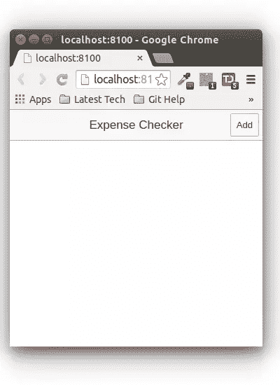
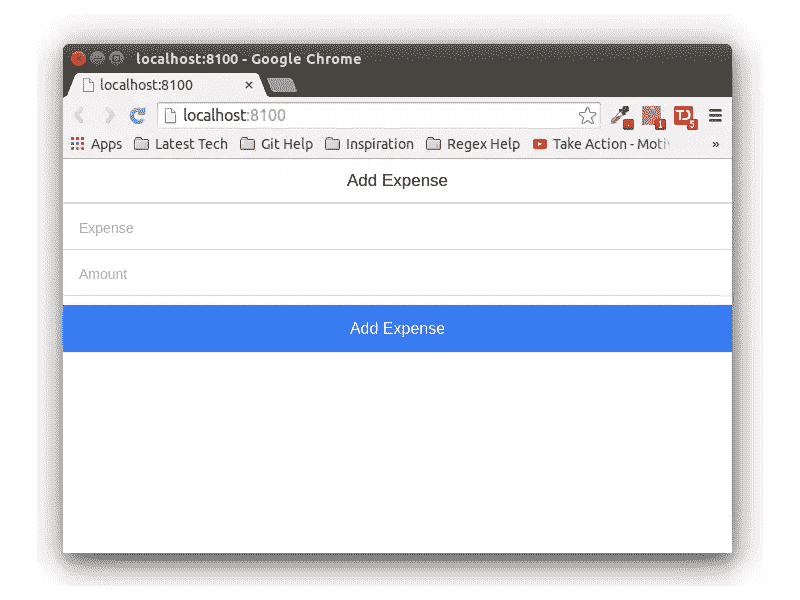
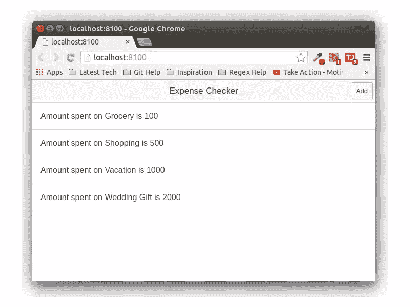

# 将离线应用程序数据与 PouchDB 同步

> 原文：<https://www.sitepoint.com/synchronizing-offline-app-data-with-pouchdb/>

可以在线和离线工作的应用程序对移动用户来说是一个优势。例如，乘飞机旅行的人通常没有互联网连接。使用设计良好的应用程序，他们仍然可以在离线模式下工作，并将离线数据与应用服务器同步。

## 这是如何工作的？

当应用程序离线时，使用 HTML 5 [本地存储](https://developer.mozilla.org/en/docs/Web/API/Window/localStorage)和[会话存储](https://developer.mozilla.org/en-US/docs/Web/API/Window/sessionStorage)对象将数据存储在浏览器或 WebView 中。当应用程序在线时，其编程逻辑会将更改同步到中央数据库。

## PouchDb

PouchDb 是一个开源的 JavaScript 数据库，灵感来自于 [CouchDb](http://couchdb.apache.org/) ，它帮助开发者构建可以在离线和在线模式下工作的应用。

## ‘我们是什么’；将建立

我们将使用 [IONIC 框架](http://ionicframework.com/)来创建一个费用记录移动应用程序，在后端使用 PouchDB。

本教程的源代码可以在 [GitHub](https://github.com/sitepoint-editors/IONIC_PouchDb) 上获得。

## 入门指南

首先使用节点包管理器(npm)安装 IONIC。

```
npm install -g cordova ionic
```

一旦 IONIC 安装完毕，创建一个名为`iPouch`的空白项目。

```
ionic start iPouch blank
```

导航到项目目录并安装所需的依赖项。

```
cd iPouch
npm install
```

在终端中运行以下命令，在 web 浏览器中启动应用程序

```
ionic serve
```

[下载](http://pouchdb.com/)并将 PouchDB JavaScript 添加到 *iPouch/www/js* 文件夹中。

在 *iPouchDb/www/index.html* 页面中添加对`pouchdb-4.0.x.min.js`脚本的引用。

```
<script src="js/pouchdb-4.0.0.min.js"></script>
```

(用当前版本号替换`x`)

## 设置 CouchDb

使用您选择的平台包管理器来安装 CouchDb。

```
sudo apt-get install couchdb // For Ubuntu
brew install couchdb  //  For MAC
```

并使用`couchdb`命令启动 couchdb。

为了允许从 PouchDb 到 CouchDb 的[跨域请求](https://en.wikipedia.org/wiki/Same-origin_policy)，我们需要安装`add-cors-to-couchdb`。

```
npm install -g add-cors-to-couchdb
```

安装后，通过运行以下命令启用 CORS:

```
add-cors-to-couchdb
```

治疗床数据库应该在端口 5984 上运行。试试浏览 [http://localhost:5984/](http://localhost:5984/) 。

## 添加 PouchDb 服务

让我们首先为我们的应用程序创建一个控制器。将名为 *controller.js* 的文件添加到 *iPouch/js* 文件夹中。在 index.html 的*中添加控制器的参考:*

```
<script type="text/javascript" src="js/controller.js"></script>
```

在 *controller.js* 里面定义了一个叫做`starter.controllers`的模块。

```
angular.module('starter.controllers', ['ionic'])
```

定义一个名为`HomeCtrl`的控制器。

```
.controller('HomeCtrl', ['$scope', function($scope) {

}])
```

创建一个 AngularJS 工厂服务，该服务将返回 PouchDb 对象。

```
.factory('pouchdb', function() {
  return new PouchDB('myApp');
});
```

将`pouchdb`服务注入到`HomeCtrl`中，并为本地邮袋数据库和远程治疗床数据库创建新的邮袋数据库。

```
.controller('HomeCtrl', ['$scope','pouchdb', function($scope,pouchdb) {

    var dbLocal = new PouchDB('dbname');

    var dbRemote = new PouchDB('http://localhost:5984/dbname');
}])
```

这里是目前为止完整的 *controller.js* 文件。

```
angular.module('starter.controllers', ['ionic'])

.controller('HomeCtrl', ['$scope','pouchdb', function($scope,pouchdb) {

    var dbLocal = new PouchDB('dbname');

    var dbRemote = new PouchDB('http://localhost:5984/dbname');
}])

.factory('pouchdb', function() {
  return new PouchDB('myApp');
});
```

通过在 *app.js* 中注入模块，将 starter.controllers 模块添加到应用程序中。

```
angular.module('starter', ['ionic','starter.controllers'])
```

## 添加费用跟踪功能

让我们开始创建一个添加费用项目和金额的用户界面。打开 *www/index.html* ，更改现有的正文内容，如下所示:

```
<body ng-app="starter" ng-controller="HomeCtrl">
    <ion-pane>

        <ion-header-bar class="bar-stable">
            <h1 class="title">Expense Checker</h1>
            <button class="button" ng-click="openModal()">Add</button>
        </ion-header-bar>

    </ion-pane>
</body>
```

这里我们创建了一个主页，在屏幕的右侧有一个标题按钮。我们在按钮上添加了一个点击事件，它将打开一个模态窗口。保存更改，您应该能够查看主屏幕。



我们将使用[离子模态](http://ionicframework.com/docs/api/controller/ionicModal/)来显示模态弹出。将下面的模板代码添加到*index.html*页面的`ion-pane`结束标记之后。

```
<script id="my-modal.html" type="text/ng-template"> <ion-modal-view>
        <ion-header-bar>
            <h1 class="title">Add Expense</h1>
        </ion-header-bar>
        <ion-content>

            <div class="list">
                <label class="item item-input">
                    <input type="text" ng-model="item.expense" placeholder="Expense">
                </label>
                <label class="item item-input">
                    <input type="number" ng-model="item.amount" placeholder="Amount">
                </label>
                <button ng-click="add()" class="button button-full button-positive">
                    Add Expense
                </button>

            </div>
        </ion-content>
    </ion-modal-view> </script>
```

要显示模态，将`$ionicModal`注入控制器。

```
.controller('HomeCtrl',['$scope','pouchdb','$ionicModal',function($scope,pouchdb,$ionicModal)
```

初始化`HomeCtrl`控制器内的模态弹出。

```
$ionicModal.fromTemplateUrl('my-modal.html', {
    scope: $scope,
    animation: 'slide-in-up'
}).then(function(modal) {
    $scope.modal = modal;
});
```

在`HomeCtrl`中添加两个函数来显示和关闭模态弹出窗口。

```
$scope.openModal = function() {
    $scope.modal.show();
};

$scope.closeModal = function() {
    $scope.modal.hide();
};

$scope.$on('$destroy', function() {
        $scope.modal.remove();
});
```

在上面的代码中，我有一个额外的`destroy`事件调用来清理模态弹出窗口。以下是弹出窗口的外观:



定义`add`函数将数据添加到 pouchdb。

```
$scope.add = function(){
    // Code would be here !!
};
```

我们将利用 [db.put()](http://pouchdb.com/api.html#create_document) API 在 pouchdb 中创建新文档。首先创建一个要保存的项目对象。

```
var timeStamp = String(new Date().getTime());

var item = {
        "_id": timeStamp,
        "expense": $scope.item.expense,
        "amount": $scope.item.amount
};
```

一旦我们有了 item 对象，我们将把它发送到 pouchdb。成功后，我们会将该项目添加到`items`数组中，该数组稍后会填充显示。

```
dbLocal.put(
    item
).then(function (response) {
    $scope.items.push(item);   // Add to items array
    $scope.closeModal();      // Close the modal
}).catch(function (err) {
    console.log(err);
});
```

一旦添加了数据，我们将使用 [db.allDocs](http://pouchdb.com/api.html#fetch_document) API 来获取添加到 pouchdb 中的文档。在 Home 控制器中添加以下代码，以从 pouchdb 获取所有文档。

```
dbLocal.allDocs({
    include_docs: true
}).then(function(result) {
   console.log(result)
}).catch(function(err) {
    console.log(err);
});
```

我们将遍历结果并将 item 对象推入一个 items 数组。在主控制器中定义一个项目数组。

```
$scope.item = {};
$scope.items = [];
```

遍历收到的结果，创建一个 item 对象并将其插入数组列表。将`dbLocal.allDocs`更新为:

```
dbLocal.allDocs({
    include_docs: true
}).then(function (result) {
    console.log('re    var dbLocal = new s is',result.rows);
    for(var i=0;i<result.rows.length;i++){
        var obj = {
            "_id": result.rows[i].doc.id,
            "expense": result.rows[i].doc.expense,
            "amount": result.rows[i].doc.amount
        }
        $scope.items.push(obj);
        $scope.$apply();
    }
    console.log($scope.items);
}).catch(function (err) {
    console.log(err);
});
```

`$scope.$apply()`是更新绑定。为了显示`items`的内容，我们将使用 AngularJS `ngRepeat`指令。在`index.html`中添加以下代码来显示`ul`元素。

```
 <ion-view title="iPouch">
      <ion-content>
        <ul class="list">
            <li ng-repeat="i in items" class="item">
              Amount spent on {{i.expense}} is {{i.amount}}
            </li>
        </ul>
      </ion-content>
</ion-view>
```

保存以上更改，并尝试使用该应用程序添加新费用。添加后，您应该能够在屏幕上查看数据，如下所示:



## 脱机时同步数据

您可能已经注意到，我们在家庭控制器中定义了两个数据库，`dbLocal`和`dbRemote`。我们将数据保存在`dbLocal`数据库中，这是 pouchdb 数据库。一旦我们在本地数据库中有了数据，我们就可以将数据复制到远程服务器。这样，当应用程序脱机时，数据保存在本地数据库中，而当应用程序联机时，数据复制到远程服务器。

我们将利用 [replicate](http://pouchdb.com/guides/replication.html) API 在线时将数据复制到远程。添加以下代码行，将数据复制到 remote。

```
dbLocal.replicate.to(dbRemote,{live:true},function(err){
        console.log(err);
});
```

我们已经指定了`live : true`选项来允许实时复制。保存以上更改并添加新项目。使用浏览器中的远程 url 可以看到复制到远程治疗床数据库的项目。

```
http://localhost:5984/dbname
```

## 结论

在本教程中，我们学习了如何创建一个具有 pouchdb 后端的 IONIC 应用程序。我们看到了离线时如何在本地存储数据，在线时如何将数据复制到服务器。

阅读 [pouchdb 文档](http://pouchdb.com/guides/),详细了解应用程序可用的更多特性。

请在下面的评论中告诉我你的想法、建议或修改。

## 分享这篇文章