# 选项卡式导航:示例和脚本

> 原文：<https://www.sitepoint.com/tabbed-navigation-examples-scripts/>

多年来，选项卡式导航一直是网页设计的主流。它经常被设计者使用，因为它是一种干净和有组织的方式来提供网站不同部分的链接。由于它在离线世界中的使用，大多数人倾向于用一个标签代表一个站点的一部分。

什么是选项卡式导航？

选项卡式导航是一组按钮，其中的选项卡通常(但不总是)水平运行。最简单的是,“打开的”标签与它所附着的部分的背景颜色相匹配，而所有其他“关闭的”标签是不同的颜色——通常比“打开的”标签更亮或更暗。

[日本新闻聚合器](http://nihongoup.com/aggregator/)

[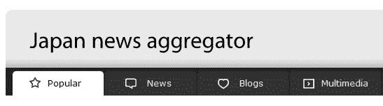](https://www.sitepoint.com/wp-content/uploads/2010/09/JapanNEws.png)

标签的样式各不相同，从方形角标签(如 [23 和 Me](https://www.23andme.com/) 所示)到更精致的圆角(带有斜面、笔画和内部标签)，如在[滤色器色彩疗法](http://color.philter.co.jp/)网站上。

*23 和我标签*

[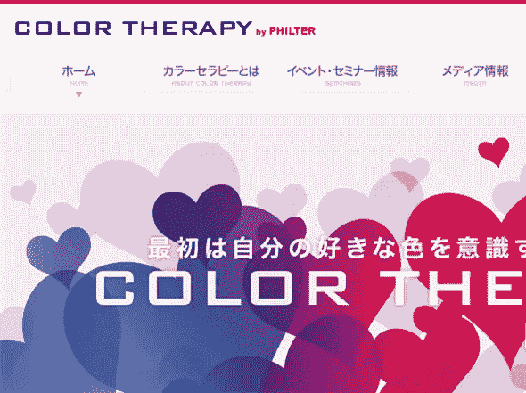](https://www.sitepoint.com/wp-content/uploads/2010/09/ColorTherapy.png)

*滤镜色彩疗法*

下面是更多选项卡式导航的例子:

UCSAA 使用了一组彩色的垂直标签。

[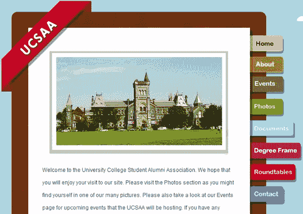](https://www.sitepoint.com/wp-content/uploads/2010/09/UCSAA.png)

伯特·蒂默曼的网站有一些纹理和箭头形状的标签。

[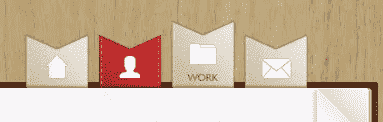](https://www.sitepoint.com/wp-content/uploads/2010/09/BertTimmermans.png)

Vyniknite 在其主要内容区域使用大标签。

[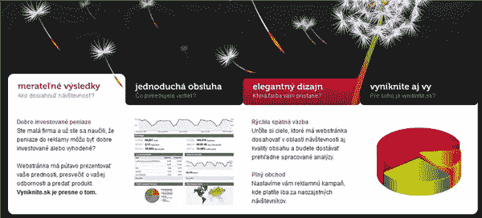](https://www.sitepoint.com/wp-content/uploads/2010/09/vynykite.png)

[多么可爱的名字](http://www.whatalovelyname.com/)在方形标签上使用了一个变体。

科莫多媒体有一个选项卡式侧边栏导航。

[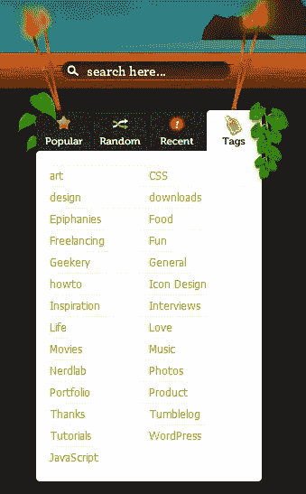](https://www.sitepoint.com/wp-content/uploads/2010/09/komodo.png)

[Veer 的](http://www.veer.com)选项卡式导航通过使用不同颜色的选项卡和阴影来传达深度感。

[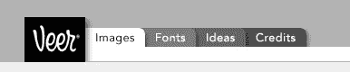](https://www.sitepoint.com/wp-content/uploads/2010/09/Veer.png)

[Threadless Kids](http://www.threadlesskids.com) 使用翻转标签，也可以改变每个部分的图像

[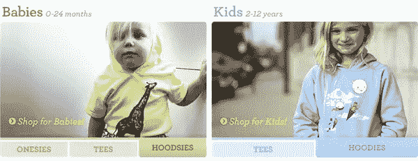](https://www.sitepoint.com/wp-content/uploads/2010/09/ThreadlessKids.png)

**选项卡式导航脚本**

有大量的 javascript 解决方案可用于创建选项卡式导航。这里有一些从简单到稍微复杂和复杂的例子。

是一个非常好的基于 jQuery 的幻灯片，使用了垂直标签。您可以在容器中放置任何类型的内容，并使用选项卡进行导航。有一个免费的“轻”版本，以及商业专业版。

[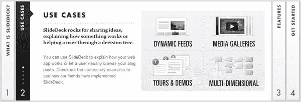](https://www.sitepoint.com/wp-content/uploads/2010/09/Slidedeck.png)

[Coda slider](http://www.ndoherty.biz/demos/coda-slider/1.1.1/#1) 是另一个免费的 jQuery slider，顶部有标签导航。

[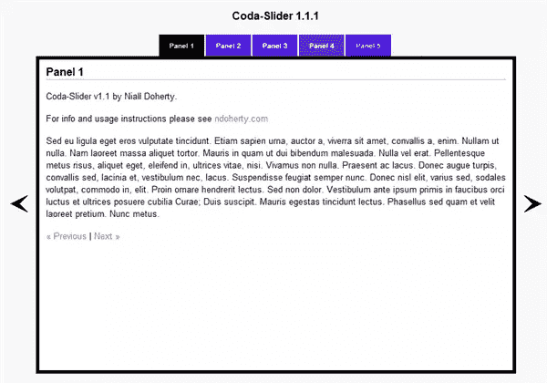](https://www.sitepoint.com/wp-content/uploads/2010/09/CodaSlider.png)

ID Tabs 是一个用 jQuery 创建的简单的选项卡式菜单系统。

[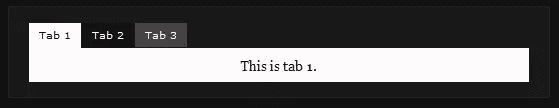](https://www.sitepoint.com/wp-content/uploads/2010/09/IDTabs.png)

D [htmlxTabbar](http://dhtmlx.com/docs/products/dhtmlxTabbar/index.shtml) 是一个 javascript **控件**，用于创建动态选项卡式导航界面，有免费版和专业版。

[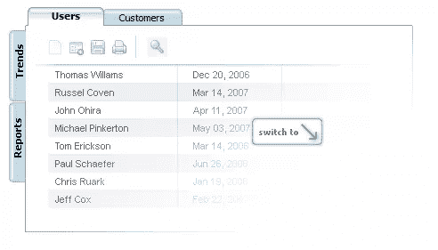](https://www.sitepoint.com/wp-content/uploads/2010/09/dhtmlTabber.png)

你喜欢选项卡式导航吗？你在自己的网站上使用它吗？你有没有看到一些你想分享的好例子？

## 分享这篇文章