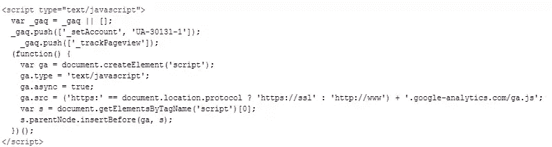
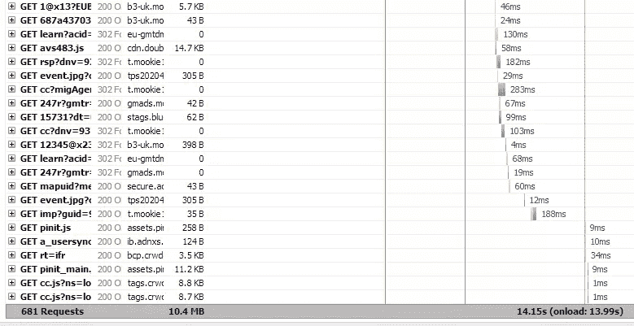
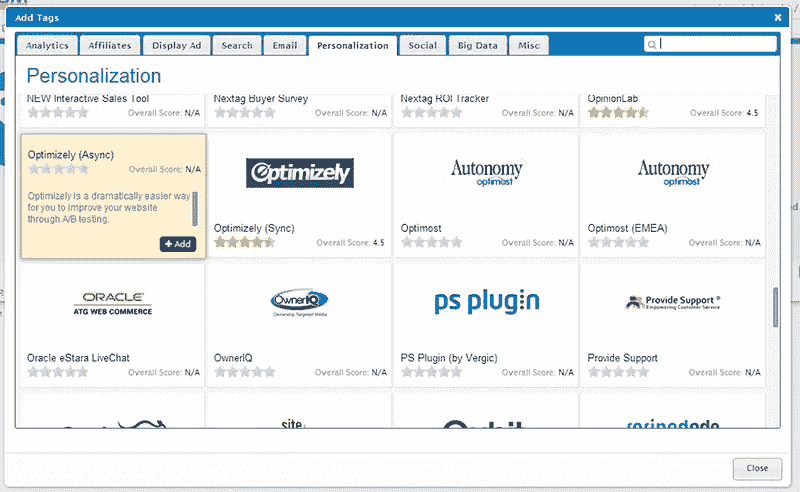
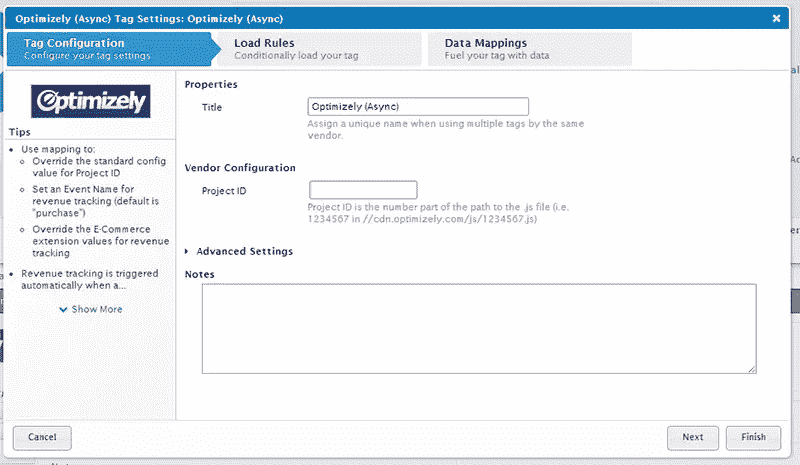
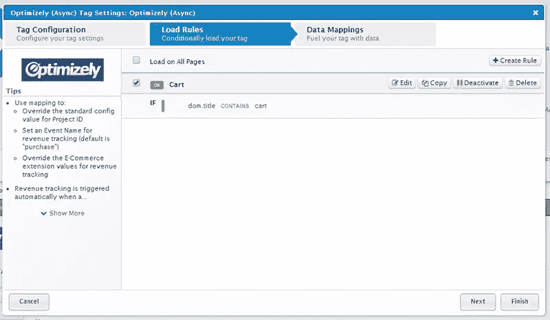
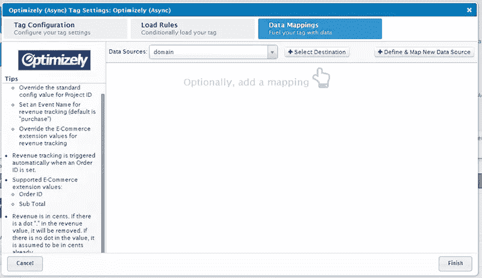
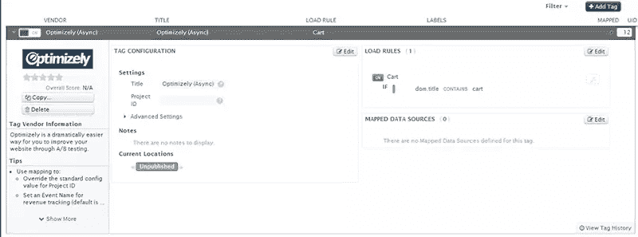

# 标签管理:给开发商和营销商的关系带来和平

> 原文：<https://www.sitepoint.com/tag-management-bringing-peace-developer-marketer-relations/>

*本文由 [Tealium](http://tealium.com/) 赞助。感谢您对使 SitePoint 成为可能的赞助商的支持！*

你知道所有这些数字营销工具，可以让你跟踪你的流量，运行 A/B 测试，并执行各种其他任务关键型服务？？所有这些都有称为“标签”的代码片段，每个都从自己的服务器加载。

这些标签不仅会大大增加网站的加载时间，管理数十个这样的标签也是一件非常棘手的事情。另外，这些标签中的每一个都必须由开发人员来实现，而开发人员可能已经负担过重了。

过去，个人标签只是交易的一部分。不过，现在有了更好的选择:标签管理越来越受营销人员的欢迎。它允许他们自己实现标记，而不需要在他们想尝试新事物的任何时候包括开发人员。标签管理还可以减少页面加载时间，这通常会对业务指标产生积极的影响。

在这篇文章中，我将探讨标签管理如何帮助您的日常业务，以及您如何从中受益。让我们先来仔细看看标签。

## 什么是标签？

标签更像是一个营销术语——开发人员可能知道它们是代码片段。不管你怎么称呼它们，这些都是你需要添加到你的站点上的小代码，以便使用一系列的工具。

还是有点模糊？让我给你举几个例子。谷歌分析在你的网站上使用一个标签来跟踪访问者的行为。在广告界，Google Adwords 和 AdRoll 使用标签来衡量转化率。用 Optimizely 对你的页面进行 A/B 测试？还有一个标签。

脸书是标签之王，因为它使用不同的代码进行转换跟踪，重新定位，喜欢，分享等等。看到它是如何快速增加的了吗？

## 标签一直往下

标签管理的市场领导者 Tealium 发现，一个普通网站上使用的标签数量惊人地达到 15-50 个。每个标签都必须独立加载。那肯定会引起问题。

一开始，你的网站上有 15-50 个标签似乎有点多。这基本上意味着你使用 15-50 种不同的服务。不过，累积起来很快。

对于访问者分析，你可能正在运行谷歌分析，还有 1 到 2 个专门的跟踪工具。这里你可以想到一个电子商务跟踪工具，比如 KISSMetrics，或者如果你是一个出版商，可以想到 Parsely。为同一目的运行两个工具并不罕见，因为每个工具都有其独特的功能，您不希望您的企业只依赖一个。

你很可能有 1 或 2 个 A/B 测试工具在运行，比如 Optimizely 和可视化网站优化器。用 CrazyEgg 和 ClickTale 追踪热图。用 Adwords 和 AdRoll 重定向。使用 Taboola 和 Outbrain 进行内容分发。

然后是广告管理，你可以有不同的区域和不同的提供商。所以你需要你的双击，搜索，地图，BuySellAds，网站搜索等等。代码已插入。

我们已经有 16 个标签了，没什么特别的。我想你明白我的意思，你很容易被几十个标签捆住。尽管它们可能已经尽可能的优化了，但是仍然有很多标签。

想知道当你的网站上有 50 个甚至 100 个这样的标签泛滥时，你的网站会发生什么？

看起来很像这样。您在这里看到的只是加载的外部脚本总数的 15%。

现在，让我们来看看成绩以及加载时间和加载的请求总数。

可以肯定地说，拥有太多独立加载的标签会导致网站加载缓慢，供应商工具使用效率低下，开发人员脾气暴躁，用户沮丧。

而这只是表现。修改这些标签呢？如果你想用新的广告活动、目标列表或不同页面的对比测试来更新你的标签，该怎么办？

这将花费你大量的金钱，甚至更多的耐心，因为大多数改变只能由你已经负担过重的开发人员来执行。你可能不是唯一一个想改变网站的人。如果营销人员想尝试多种不同的覆盖方式来增加销售额，该怎么办？或者销售部门正在推动布局变化以改善交叉销售？你将很难争辩你的改变是优先考虑的，即使从长远来看它有很大的潜力。

这意味着您只需等待开发团队找到时间进行更改，或者等待您的请求通过管道完成，从规范到测试再到现场。

## 解决办法？标签管理！

现在，您已经看到了标签在野外运行的问题，所以让我们来看一个解决方案。这就是标签管理的用武之地。一个有效的标签管理工具只需要在你的站点代码中包含一个标签。其余的标签将添加到工具的管理部分。

实施标签管理后，您可以:

*   轻松添加、修改或删除标签，无需接触网站。
*   仅依赖一个提供商会增加加载时间。
*   带你的开发团队出去喝杯咖啡，而不是看着他们在两个小任务之间喝一杯浓缩咖啡。

我之前提到过 [Tealium](http://tealium.com/) ，因为他们是标签管理解决方案的领导者。Tealium 有一个管理标签的完美工具，叫做 Tealium IQ。除了常规标签管理之外，它还有一些附加功能:

*   实时标签管理允许您在几分钟内调整您的标签。

*   通过让访问者和客户决定哪些标签不应该加载来保护他们的隐私。

*   多个优质内容分发网络，确保您的标签 100%加载。

*   使用站点扫描来确保所有标签都正确加载。

*   收集访问者的原始数据，用于未来的活动。

*   关于如何添加新标签的清晰说明消除了弄乱代码的风险。

*   Tealium IQ 的市场中有 700 多个标签供您选择。

Tealium 多年来一直在做标签管理，但他认识到你还没有。我真的很喜欢他们的支持方法:大量的文档，写得清楚，组织得有逻辑。如果这还不够，他们通过他们的 [Tealium 大学](http://tealium.com/education/tealium-university/)项目提供培训课程，在美国各地举办多项活动。当一家公司花这么大力气来确保他们的产品发挥出最大潜力时，这是件好事。

## 玩的时间到了

如果没有标签管理，在你真正开始玩一个很酷的新应用程序之前，可能需要一段时间。

首先，您需要了解该工具是如何实现的。然后您需要找到合适的代码片段发送给团队的开发人员，并指定在哪里以及如何包含它。做完这些之后，争夺优先权的斗争就开始了。一旦你最终让它在开发线上排队，等待就开始了，只有在它实现后，接下来才是大量的测试。在你经历了这一切之后，你需要再次让自己振作起来，开始使用这个工具——在经历了这一切之后，让我们希望等待是值得的！

现在让我们看看给 Tealium IQ 添加一个新标签有多简单，以及之后你可以多快地更改它。我将使用 Optimizely 向您展示这一点，这是一个众所周知的 A/B 测试工具。

A/B 测试是一个很好的例子，说明了为什么你需要根据实时数据快速、频繁地编辑你的站点。

Optimizely 建议您将他们的标签添加到您网站的所有页面中，以确保它在您运行项目时总是被加载。这也意味着当没有为该页面运行项目时，会加载代码。最好避免加载无用的代码，但是大多数厂商还是建议你这么做。

没有 Tealium 的智商。你只需选择你想加载代码的页面，完成后禁用它。让我们看看这有多简单。

首先去 Tealium.com，那里有 30 天的免费试用期。

注册后，请前往“标签”部分。在这里你会发现一个绿色的小按钮叫做“添加标签”。这是魔法开始的地方。搜索 Optimizely，然后点击“添加”。

输入标签的标题和项目 ID。然后点击“下一步”来指定需要编码的页面。

在这种情况下，我选择只在购物车中包含代码。再次点击“下一步”。

数据映射允许非常高级的精确定位，但是我们现在跳过这个。只要点击“完成”就大功告成了。

就这样，在大约一分钟的时间里，您已经成功地将 Optimizely 标签添加到您的购物车页面。

如果您完成了添加标签，您可以选择右上角的“保存/发布”按钮，将其部署到您的开发或生产站点上。

如果你愿意，你可以添加任意多的标签，网站上的代码保持不变。因此，如果您想在不同的页面上运行不同的测试，只需添加新的标签并选择相关的页面。

这里有一些让你的开发团队高兴的事情:谷歌最近决定为谷歌分析升级他们的跟踪代码。他们的新代码叫做通用分析。

正如我在[这篇关于升级](https://www.sitepoint.com/upgrading-universal-analytics-guide/)的文章中所写的，大多数网站都在网站中实现了他们的分析代码。升级可能是一场真正的噩梦。

不是和 Tealium。只需用新标签替换旧标签，就大功告成了。如果你想让你的开发团队开心，告诉他们不必在你的网站上到处寻找分析代码，他们会给你买*咖啡！*

对大多数供应商来说就是这么简单。想象一下，当你发现一个新工具可以使用时，你可以马上试用它，这有多棒。

## 开发者也会喜欢它的

如果你需要更多的弹药来说服你的开发团队实现标签管理，这个怎么样？他们可以获取当前在网站上运行的标签，并在将来使用 Tealium 管理它们。这意味着他们不再需要跟踪代码更新——这一切都可以通过 Tealium 来处理。仅此一项就能节省大量时间。

在设置新工具时，开发人员也将享受与非技术人员相同的好处。由于这些都是标准化的，他们可以确信任何新工具都被正确地实现了，所以他们不必先费力地阅读文档。又一个省时器！

## 结论

标签管理真的是营销人员的梦想。它提供了极大的灵活性，极大地缩短了实施时间并减少了加载时间。有了 Tealium，您和您的开发团队就有了一个很好的工具，可以继续进行更重要的争论，例如乒乓球桌该轮到谁了。

## 分享这篇文章