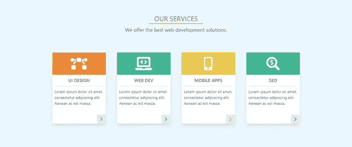
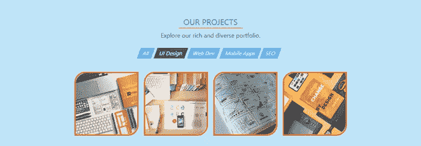
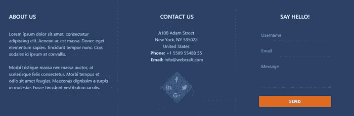

# 如何用顺风 CSS 构建独特漂亮的网站

> 原文：<https://www.sitepoint.com/tailwind-unique-beautiful-websites/>

当考虑为一个新项目使用什么样的 CSS 框架时，像 Bootstrap 和 Foundation 这样的选项很容易出现在脑海中。它们很容易使用，因为它们有现成的、预先设计好的组件，开发人员可以马上轻松使用。这种方法适用于相对简单、具有共同外观和感觉的网站。但是，一旦我们开始构建更复杂的、具有特定需求的独特网站，就会出现一些问题。

在某些时候，我们需要定制某些组件，创建新的组件，并确保最终的代码库是统一的，并且在更改后易于维护。

像 Bootstrap 和 Foundation 这样的框架很难满足上述需求，它们给了我们一堆自以为是的，在很多情况下是不需要的风格。因此，我们必须不断地解决特殊性问题，同时试图覆盖默认样式。这听起来不像是一个有趣的工作，不是吗？

现成的解决方案易于实现，但是不够灵活，并且受限于某些界限。另一方面，不用 CSS 框架来设计网站的样式是强大而灵活的，但是不容易管理和维护。那么，有什么解决办法呢？

一如既往，解决办法是遵循黄金分割。我们需要在具体和抽象之间找到并运用恰当的平衡。低级别的 CSS 框架提供了这样一种平衡。有几个这样的框架，在本教程中，我们将探索最流行的一个， [Tailwind CSS](https://tailwindcss.com/) 。

## 什么是顺风？

> Tailwind 不仅仅是一个 CSS 框架，它还是一个创建设计系统的引擎。— *[顺风网](https://tailwindcss.com/)*

Tailwind 是低级实用程序类的集合。它们可以像乐高积木一样被用来建造任何种类的组件。该集合涵盖了最重要的 CSS 属性，但它可以通过多种方式轻松扩展。有了顺风，定制不再令人头疼。该框架有很好的文档，详细地涵盖了每个类的实用程序，并展示了它可以被定制的方式。支持所有现代浏览器和 IE11+。

## 为什么要使用实用优先的框架？

像 Tailwind 这样的底层、实用优先的 CSS 框架有很多好处。让我们探索其中最重要的:

*   您可以更好地控制元素的外观。使用实用程序类，我们可以更容易地更改和微调元素的外观。
*   在大型项目中很容易管理和维护，因为您只维护 HTML 文件，而不是大型 CSS 代码库。
*   更容易建立独特的、定制的网站设计，而不会与不需要的风格发生冲突。
*   它是高度可定制和可扩展的，这给了我们无限的灵活性。
*   它有一个移动优先的方法和响应设计模式的简单实现。
*   有能力将常见的、重复的模式提取到定制的、可重用的组件中——在大多数情况下无需编写一行定制的 CSS。
*   它有不言自明的类。我们可以通过读取类来想象样式元素的样子。

最后，正如顺风的创造者[所说](https://github.com/tailwindcss/docs/blob/master/source/docs/utility-first.blade.md):

> 当你第一次看到它的时候，你几乎不可能认为这是一个好主意——你必须实际尝试一下。

所以，我们来试试吧！

## 顺风入门

为了演示 Tailwind 的定制特性，我们需要通过 npm 安装它:

```
npm install tailwindcss 
```

下一步是创建一个`styles.css`文件，其中我们使用了`@tailwind`指令来包含框架样式:

```
@tailwind base;

@tailwind components;

@tailwind utilities; 
```

之后，我们运行`npx tailwind init`命令，这将创建一个最小的`tailwind.config.js`文件，我们将在开发过程中在其中放置我们的定制选项。生成的文件包含以下内容:

```
module.exports = {
  theme: {},
  variants: {},
  plugins: [],
} 
```

下一步是构建样式以便使用它们:

```
npx tailwind build styles.css -o output.css 
```

最后，我们在我们的 HTML 中链接生成的`output.css`文件和[字体牛逼的](https://fontawesome.com/):

```
 <link rel="stylesheet" type="text/css" href="output.css">
  <link rel="stylesheet" href="https://cdnjs.cloudflare.com/ajax/libs/font-awesome/5.9.0/css/all.min.css"> 
```

现在，我们准备开始创作。

## 构建单页网站模板

在本教程的其余部分，我们将使用 Tailwind 实用程序类的强大功能和灵活性来构建一个单页网站模板。

[在这里你可以看到模板在运行](https://codeknack.github.io/tailwind-template/)。

我不打算解释每一个实用程序(这会很无聊和令人厌倦)，所以我建议你使用[顺风备忘单](https://nerdcave.com/tailwind-cheat-sheet)作为快速参考。它包含所有可用的实用程序及其效果，以及到文档的直接链接。

我们将一部分一部分地构建模板。它们是页眉、服务、项目、团队和页脚。

我们首先将所有切片包装在一个容器中:

```
<div class="container mx-auto">
  <!-- Put the sections here -->
</div> 
```

### 页眉(徽标、导航)

第一部分——标题——将在左侧包含一个徽标，在右侧包含导航链接。下面是它的样子:


现在，让我们来探索它背后的代码。

```
<div class="flex justify-between items-center py-4 bg-blue-900">
  <div class="flex-shrink-0 ml-10 cursor-pointer">
    <i class="fas fa-drafting-compass fa-2x text-orange-500"></i>
    <span class="ml-1 text-3xl text-blue-200 font-semibold">WebCraft</span>
  </div>
  <i class="fas fa-bars fa-2x visible md:invisible mr-10 md:mr-0 text-blue-200 cursor-pointer"></i>
  <ul class="hidden md:flex overflow-x-hidden mr-10 font-semibold">
    <li class="mr-6 p-1 border-b-2 border-orange-500">
      <a class="text-blue-200 cursor-default" href="#">Home</a>
    </li>
    <li class="mr-6 p-1">
      <a class="text-white hover:text-blue-300" href="#">Services</a>
    </li>
    <li class="mr-6 p-1">
      <a class="text-white hover:text-blue-300" href="#">Projects</a>
    </li>
    <li class="mr-6 p-1">
      <a class="text-white hover:text-blue-300" href="#">Team</a>
    </li>
    <li class="mr-6 p-1">
      <a class="text-white hover:text-blue-300" href="#">About</a>
    </li>
    <li class="mr-6 p-1">
      <a class="text-white hover:text-blue-300" href="#">Contacts</a>
    </li>
  </ul>
</div> 
```

正如你所看到的，正如我上面提到的，这些类是不言自明的。我们将只探索亮点。

首先，我们创建一个 flex 容器，并将其项目水平和垂直居中。我们还添加了一些顶部和底部的填充，Tailwind 在一个单独的`py`工具中合并了这些填充。正如你可能猜到的，也有一个左右的`px`变体。我们将看到这种类型的简写在许多其他实用程序中被广泛使用。作为背景色，我们使用顺风公司调色板中最深的蓝色(`bg-blue-900`)。调色板包含几种颜色，每种颜色的阴影从 100 到 900。比如`blue-100`、`blue-200`、`blue-300`等。

在 Tailwind 中，我们通过指定属性，后跟颜色和阴影数，将颜色应用于属性。比如`text-white`、`bg-gray-800`、`border-red-500`。很简单。

对于左侧的徽标，我们使用了一个`div`元素，我们将其设置为不收缩(`flex-shrink-0`，并通过应用 margin-left 属性(`ml-10`)将其从边缘移开一点。接下来我们使用一个字体很棒的图标，它的类与 Tailwind 的类完美融合。我们用其中一个把图标变成橙色。对于标志的文字部分，我们使用大的，浅蓝色，半加粗的文字，稍微向右偏移。

在中间，我们添加了一个仅在手机上可见的图标。这里我们使用一个响应断点前缀(`md`)。与 Bootstrap 和 Foundation 一样，Tailwind 也遵循移动优先的方法。这意味着当我们使用不带前缀的实用程序(`visible`)时，它们适用于从最小到最大的设备。如果我们希望不同的设备有不同的样式，我们需要使用断点前缀。因此，在我们的例子中，图标将在小型设备上可见，而在中型及以上设备上不可见(`md:invisible`)。

在右边，我们放置导航链接。我们对 **Home** 链接采用不同的样式，显示它是活动链接。我们还从边缘移动导航，并将其设置为溢出时隐藏(`overflow-x-hidden`)。导航将在移动设备上隐藏(`hidden`)，在中型及以上设备上设置为灵活(`md:flex`)。

您可以[在文档](https://tailwindcss.com/docs/responsive-design)中了解更多关于响应的信息。

### 服务

现在让我们创建下一个部分，服务。下面是它的样子:



这是代码:

```
<div class="w-full p-6 bg-blue-100">
  <div class="w-48 mx-auto pt-6 border-b-2 border-orange-500 text-center text-2xl text-blue-700">OUR SERVICES</div>
  <div class="p-2 text-center text-lg text-gray-700">We offer the best web development solutions.</div>
  <div class="flex justify-center flex-wrap p-10">
    <div class="relative w-48 h-64 m-5 bg-white shadow-lg">
      <div class="flex items-center w-48 h-20 bg-orange-500">
        <i class="fas fa-bezier-curve fa-3x mx-auto text-white"></i>
      </div>
      <p class="mx-2 py-2 border-b-2 text-center text-gray-700 font-semibold uppercase">UI Design</p>
      <p class="p-2 text-sm text-gray-700">Lorem ipsum dolor sit amet, consectetur adipiscing elit. Aenean ac est massa.</p>
      <div class="absolute right-0 bottom-0 w-8 h-8 bg-gray-300 hover:bg-orange-300 text-center cursor-pointer">
        <i class="fas fa-chevron-right mt-2 text-orange-500"></i>
      </div>
    </div>
    ...
  </div>
</div> 
```

我们创建一个浅蓝色背景的部分。然后我们添加一个带下划线的标题和副标题。

接下来，我们为服务项目使用一个 flex 容器。我们使用`flex-wrap`使项目在调整大小时换行。我们为每张卡片设置尺寸，并添加一些空间和阴影。每张卡片都有一个带主题图标、标题和描述的彩色部分。我们还在右下角放了一个带图标的按钮。

这里我们使用一个伪类变量(悬停、焦点等。).它们的用法与响应断点相同。我们使用伪类前缀，后跟一个冒号和属性名(`hover:bg-orange-300`)。

您可以在文档中了解更多关于伪类变体的信息。

为了简洁起见，我只展示了第一张卡的代码。其他的也差不多。你只需要改变颜色、图标和标题。参考 GitHub repo 上的[最终 HTML 文件。](https://github.com/codeknack/tailwind-template/blob/master/index.html)

### 项目

让我们转到下一部分，项目。这是最后的样子:



这是代码:

```
<div class="section bg-blue-200">
  <div class="section-title">OUR PROJECTS</div>
  <div class="section-subtitle">Explore our rich and diverse portfolio.</div>

  <nav class="flex justify-center flex-wrap mt-4 mb-8 text-white">
    <div class="h-8 mr-2 px-3 py-1 bg-blue-400 hover:bg-blue-600 text-center cursor-pointer -skewx-20">All</div>
    <div class="h-8 mr-2 px-3 py-1 bg-blue-800 text-center -skewx-20">UI Design</div>
    <div class="h-8 mr-2 px-3 py-1 bg-blue-400 hover:bg-blue-600 text-center cursor-pointer -skewx-20">Web Dev</div>
    <div class="h-8 mr-2 px-3 py-1 bg-blue-400 hover:bg-blue-600 text-center cursor-pointer -skewx-20">Mobile Apps</div>
    <div class="h-8 mr-2 px-3 py-1 bg-blue-400 hover:bg-blue-600 text-center cursor-pointer -skewx-20">SEO</div>
  </nav>

  <div class="flex justify-center flex-wrap">
    <div class="w-48 h-48 m-2 hover:-mt-1 border-4 border-orange-600 rounded-tl-2xl rounded-br-2xl cursor-pointer hover:shadow-lg">
      
    </div>
    ...
  </div>
</div> 
```

首先，你可能注意到我在这里使用了`section`类。他们不是顺风来的。我创造了它们，现在就向你展示。

因为所有三个中间部分将共享同一个基本外观和感觉——这导致代码重复——现在是开始考虑组件的时候了。Tailwind 提供的一个很棒的特性是能够轻松地提取和创建任何类型的定制组件。因此，这里我们将提取一个定制的`section`组件。

以下是方法。打开`styles.css`并在`components`声明后添加以下类:

```
...
@tailwind components;

.section {
  @apply w-full p-6;
}

.section-title {
  @apply w-48 mx-auto pt-6 border-b-2 border-orange-500 text-center text-2xl text-blue-700;
}

.section-subtitle {
  @apply p-2 text-center text-lg text-gray-700;
}
... 
```

正如你所看到的，为了创建一个组件类，我们使用了`@apply`指令，后面跟着必要的实用程序。这里是关于提取组件的更多信息。

现在，为了使用新的类，我们需要重新构建样式:

```
npx tailwind build styles.css -o output.css 
```

现在，我们只为每个元素使用一个类，而不是一长串的实用程序。如您所见，定制类可以安全地与常规实用程序(`section bg-blue-200`)结合使用。

让我们转到导航按钮。我们把它们放在一个 flex 容器中，并把它们设计成好看的矩形。但是我们想通过应用一点倾斜效果使它们更有活力和时尚。问题是顺风不能提供这样的效用。所以，是时候学习如何创建我们自己的实用程序了。超级简单。

再次打开`styles.css`，并在`utilities`声明之后添加所需的类:

```
...
@tailwind utilities;

.-skewx-20 {
  transform: skewX(-20deg);
}
... 
```

我们想要的是水平倾斜矩形。为此，我们需要带有负值的`skewX()`。在 Tailwind 中，通过在实用程序名称前加上减号来创建具有负值的实用程序。

我们可以在重新构建样式后立即看到新实用程序的效果。

这里有更多关于[添加新工具](https://tailwindcss.com/docs/adding-new-utilities)的信息。

现在，我们为项目卡创建另一个 flex 容器。我们想要使它们的左上角和右下角变圆，但是`rounded`工具提供的圆度小于我们需要的。所以，这次我们将学习如何定制默认的顺风主题。

打开`tailwind.config.js`，在`theme.extend`键后增加`borderRadius`选项；

```
theme: {
    extend: {
      borderRadius: {
        xl: '1rem',
        '2xl': '2rem',
        '3xl': '3rem'
      }
    }
  }, 
```

这里我们使用`extend`键，因为我们不想覆盖其他选项，我们想包含额外的选项。在我们重新构建样式之后，我们可以看到我们的新选项是如何生效的。

要了解主题定制的更多信息，请访问文档。

我们还想做一件 Tailwind 默认不提供的事情。我们希望卡片在悬停时上升一点。所以我们需要在悬停上添加一个微妙的负边距。但是要让它工作，我们需要启用`margin`实用程序的`hover`变体。

为此，我们将以下内容放入`tailwind.config.js`:

```
 variants: {
    margin: ['responsive', 'hover']
  }, 
```

这里重要的是，我们必须始终提供我们想要启用的变体的完整列表，而不仅仅是新的。

[在文档](https://tailwindcss.com/docs/configuring-variants)中了解有关配置变量的更多信息。

现在，让我们重新构建样式，看看结果。

### 组

在这个阶段，你已经对 Tailwind 的工作原理有了很好的了解，构建团队部分将会非常熟悉。下面是它的样子:


代码如下:

```
 <div class="section bg-blue-100">
      <div class="section-title">OUR TEAM</div>
      <div class="section-subtitle">Meet our skilled professionals.</div>

      <div class="flex justify-center flex-wrap">
        <div class="w-48 m-4 py-2 bg-white shadow-lg">
          
          <p class="mx-2 mt-2 text-center text-lg text-gray-700 font-semibold">Jessica Thompson</p>
          <p class="text-center text-gray-600">UI Artisan</p>
          <div class="flex justify-center items-center mt-2">
            <i class="fab fa-facebook-square fa-2x mx-1 text-blue-500 hover:text-orange-500 cursor-pointer"></i>
            <i class="fab fa-twitter-square fa-2x mx-1 text-blue-500 hover:text-orange-500 cursor-pointer"></i>
            <i class="fab fa-google-plus-square fa-2x mx-1 text-blue-500 hover:text-orange-500 cursor-pointer"></i>
          </div>
        </div>
        ...
      </div>
    </div> 
```

在这里，我们创建了一组档案卡。它们的代码是高度重复的，所以我们将它提取到一个可重用的卡组件中。我们已经知道如何去做。

我们创建卡类并将它们放在`styles.css`文件中:

```
...
.card {
  @apply w-48 m-4 py-2 bg-white shadow-lg;
}

.card-image {
  @apply w-24 h-24 mx-auto rounded-full;
}

.card-title {
  @apply mx-2 mt-2 text-center text-lg text-gray-700 font-semibold;
}

.card-subtitle {
  @apply text-center text-gray-600;
}

.card-icons {
  @apply flex justify-center items-center mt-2;
}

.card-icon {
  @apply mx-1 text-blue-500 cursor-pointer;
}

.card-icon:hover {
  @apply text-orange-500;
}
... 
```

现在，让我们重新构建样式并使用文件中的`card`类。我们将实用程序与类交换，结果我们得到了一个更短的代码版本。

```
<div class="section bg-blue-100">
  <div class="section-title">OUR TEAM</div>
  <div class="section-subtitle">Meet our skilled professionals.</div>

  <div class="flex justify-center flex-wrap">
    <div class="card">
      
      <p class="card-title">Jessica Thompson</p>
      <p class="card-subtitle">UI Artisan</p>
      <div class="card-icons">
        <i class="fab fa-facebook-square fa-2x card-icon"></i>
        <i class="fab fa-twitter-square fa-2x card-icon"></i>
        <i class="fab fa-google-plus-square fa-2x card-icon"></i>
      </div>
    </div>
    ...
  </div>
</div> 
```

### 页脚(关于，联系人)

现在我们来看看最后的页脚部分。这将包含三列，如下所示:



代码如下:

```
 <div class="w-full bg-blue-900">
      <div class="flex flex-wrap text-center text-white">

        <!-- ABOUT COLUMN -->

        <div class="w-full md:w-1/3 p-5 border-r border-blue-800 md:text-left">
          <div class="my-6 ml-3 text-xl font-semibold">ABOUT US</div>
          <p class="p-3 text-gray-400">Lorem ipsum dolor sit amet, consectetur adipiscing elit. Aenean ac est massa. Donec eget elementum sapien, tincidunt tempor nunc. Cras sodales id ipsum at convallis.</p>
          <p class="p-3 text-gray-400">Morbi tristique massa nec massa auctor, at scelerisque felis consectetur. Morbi tempus et odio sit amet feugiat. Maecenas dignissim a turpis in molestie. Fusce tincidunt vestibulum iaculis.</p>
        </div>

        <!-- CONTACTS COLUMN -->

        <div class="w-full md:w-1/3 p-5 border-r border-blue-800">
          <div class="my-6 text-xl font-semibold">CONTACT US</div>
          <p class="mt-8 text-gray-400">
            A108 Adam Street <br>
            New York, NY 535022 <br>
            United States <br>
            <strong>Phone:</strong> +1 5589 55488 55 <br>
            <strong>Email:</strong> info@webcraft.com
          </p>
          <div class="relative w-20 h-20 mx-auto my-12 bg-blue-300 rotate-45">
            <div class="flex justify-center items-center absolute left-0 top-0 w-10 h-10 hover:-ml-1 hover:-mt-1 bg-blue-800 cursor-pointer">
              <i class="fab fa-facebook-f fa-lg text-blue-500 -rotate-45"></i>
            </div>
            <div class="flex justify-center items-center absolute top-0 right-0 w-10 h-10 hover:-mt-1 hover:-mr-1 bg-blue-800 cursor-pointer">
              <i class="fab fa-twitter fa-lg text-blue-500 -rotate-45"></i>
            </div>
            <div class="flex justify-center items-center absolute right-0 bottom-0 w-10 h-10 hover:-mr-1 hover:-mb-1 bg-blue-800 cursor-pointer">
              <i class="fab fa-google-plus-g fa-lg text-blue-500 -rotate-45"></i>
            </div>
            <div class="flex justify-center items-center absolute bottom-0 left-0 w-10 h-10 hover:-mb-1 hover:-ml-1 bg-blue-800 cursor-pointer">
              <i class="fab fa-linkedin-in fa-lg text-blue-500 -rotate-45"></i>
            </div>
          </div>
        </div>

        <!-- FORM COLUMN -->

        <div class="w-full md:w-1/3 p-5">
          <div class="mt-6 text-xl font-semibold">SAY HELLO!</div>
          <form class="w-4/5 mx-auto mt-2 px-6 pt-6 pb-4 rounded">
            <div class="flex items-center mb-4">
              <input class="w-full h-10 p-2 border-b border-blue-800 bg-blue-900 text-white" type="text" placeholder="Username">
            </div>
            <div class="flex items-center mb-4">
              <input class="w-full h-10 p-2 border-b border-blue-800 bg-blue-900 text-white" type="text" placeholder="Email">
            </div>
            <div class="mb-6">
              <textarea class="w-full h-24 px-2 pt-2 border-b-2 border-blue-800 bg-blue-900 text-white" placeholder="Message"></textarea>
            </div>
            <div class="flex justify-between items-center">
              <button class="w-full py-2 px-4 rounded bg-orange-600 hover:bg-orange-700 text-white font-bold" type="button">SEND</button>
            </div>
          </form>
        </div>

      </div>
    </div> 
```

在这里，我们创建了一个三列响应网格。为此，我们使用 Flexbox 实用程序和 width 实用程序及其响应变体。通过使用`w-full md:w-1/3`类，我们强制在 mobile 上堆叠列，在 medium 和 beyond 上堆叠成一行。

在第一列中，文本将在中间和更远处左对齐(`md:text-left`)。

在第二列中，我们放了一些联系信息和一个社交共享小部件。让我们看看如何创建它。

我们使用一个正方形的 flex 容器，在每个角上均匀放置四个小正方形。我们将所有方块旋转 45 度。在每个小方块内，我们放置一个社交图标，旋转-45 度，使其与容器对齐。悬停时，每个小方块会向大方块外移动一点。

正如我们所看到的，我们需要为循环操作再创建两个实用程序。因此，我们再次打开`styles.css`并添加必要的类:

```
...
.rotate-45 {
  transform: rotate(45deg);
}
.-rotate-45 {
  transform: rotate(-45deg);
}
... 
```

现在，重新构建样式并查看结果。

在最后一个专栏中，我们有一个微妙的联系形式。

## 最后的考虑

你肯定已经注意到最终的文件大小相当大。别担心，这个可以修好。有关详细信息，请参见文档的[控制文件大小部分。](https://tailwindcss.com/docs/controlling-file-size)

我故意在模板中留下更多代码重复的地方。您已经知道如何处理这个问题，将它提取到组件中作为增强将是一个很好的练习。

## 结论

如您所见，Tailwind 为您提供了一个简单的工作流程，没有限制选项或灵活性。Tailwind 提供的实用优先方法已被 GitHub、Heroku、Kickstarter、Twitch、Segment 等大型公司成功实施。

对我个人来说，在与来自 Bootstrap、Foundation、Semantic UI、UIkit 和布尔玛等框架的风格进行了数小时的“战斗”之后，使用 Tailwind 实用程序就像在万里无云的天空中自由飞翔一样。

## 分享这篇文章