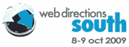

# 参加 Web 方向测验并赢取大奖！

> 原文：<https://www.sitepoint.com/take-the-web-directions-quiz-and-win/>

*Web Directions South*大会今年 10 月将在悉尼再次举行，届时将有[几位 SitePoint 作者和我们自己的技术总监 Kevin Yank 出席。](https://www.sitepoint.com/web-directions-south-discount-tickets-for-sitepoint-readers/) SitePoint 是媒体赞助商，我们将为一名幸运的 SitePoint 读者提供免费参加的机会！

## 如何取胜

为了让事情变得有趣，我们制作了一个 [**有趣的小测验**](https://www.sitepoint.com/quiz/webdirections/wds09/) 来测试你对会议的了解——所有这些问题的答案都可以在 webdirections.org[网站](http://webdirections.org/)上找到。

8 月 31 日前参加小测验**(很短，保证！)并告诉我们为什么你应该参加，你将有机会赢得一张免费的*南方网络指南的门票。*你必须自己寻找去悉尼的路，但是只要省下 995 美元(全票价),突然之间，东西就变得实惠多了！获胜者将于 9 月 1 日(T5)星期二在本博客和我们的论坛**公布。****

当然，如果你没有成功，你总是可以利用独家的 **SitePoint 折扣代码**——当你注册时输入 **SITEPOINT** 并获得常规票价 100 美元的折扣。

祝你在寻找答案的过程中好运，希望 10 月份能在悉尼见到你！

## 分享这篇文章