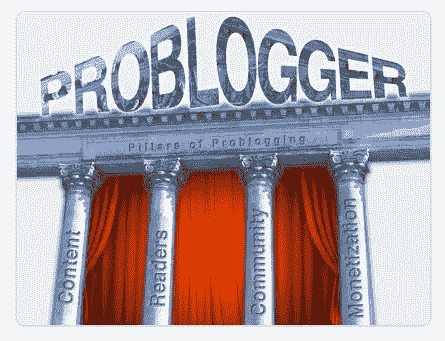

# 让你的博客更上一层楼！

> 原文：<https://www.sitepoint.com/take-your-blog-to-the-next-level/>

你是博主吗？或许你正在考虑成为其中一员？嗯，我们有一些好消息要和你分享…

我们在 [Learnable](https://learnable.com/?a=sitepoint) 的朋友正在提供一系列博客课程的折扣，这些课程将把你的博客提升到一个全新的水平。下面来自 learnable.com 的帖子解释了你如何利用这个很酷的提议。

***
[博客](http://en.wikipedia.org/wiki/Blog)——这个词在 15 年前还不存在。令人惊讶的是，他们现在是如此融入我们的生活！你还能在哪里:

*   *找到名片背面画的日常漫画！*
*   *立即向全世界公布你的想法*
*   以很少或没有启动成本建立信息业务。

近 10 年来，博客写手 Darren Rowse 和 Chris Garrett 一直是帮助人们在博客上取得更大成功的领导者。幸运的是，他们在 ProBlogger 学院系列中分享了他们的见解。

仅一周，我们提供 10 美元的折扣(相当于 33%的折扣！)本系列所有三门课！**所以对待你** **r 博客要有点爱心，**用这些行业领先的见解:

**[创作黑仔内容](https://learnable.com/courses/creating-killer-content-209?a=sitepoint)** **出售**售价 19.95 美元(4.5 小时的视频)

*   找到你的语气和你写博客是为了谁/为了什么
*   集思广益，研究创造辉煌的想法
*   成为多媒体内容生成机器
*   完善构建内容的艺术

**[提升你的博客流量](https://learnable.com/courses/boost-your-blog-traffic-213?a=sitepoint)** **特价**19.95 美元！(4.5 小时的视频)

*   与你现有的读者建立忠诚度
*   通过广告吸引流量
*   整合你的内容(以及如何重新利用它)
*   使用社交网络来增加你的流量

**[打造粘性博客社区](https://learnable.com/courses/building-a-sticky-blog-community-251?a=sitepoint)** **特价**19.95 美元！(1.5 小时的视频)

*   获取订阅并留住订户
*   认识到社区的“阴暗面”(垃圾邮件、黑客等)
*   理解“社区”背后的理论
*   利用工具，如线程评论和论坛软件

购买所有三个并节省大量的 30 美元的这个惊人的系列视频课程。这些折扣将于 7 月 19 日消失，现在就抓住它们吧！

## 分享这篇文章