# 乘坐 Android Auto

> 原文：<https://www.sitepoint.com/taking-a-ride-with-android-auto/>

谷歌一直很忙，正在为 Android 家族开发一个更令人兴奋的新功能。Android Auto 有望成为下一件大事，进一步简化您与手机的连接。

## Android Auto 是什么？

Auto 是谷歌的车载平视显示器(HUD)软件。这是你所知道的令人敬畏的 Android 操作系统，只是以一种新的和修改过的形式。Android Auto 允许司机在不接触手机的情况下与他们的消息、音乐、通知、导航和其他元素进行交互。


Auto 通过 USB 电缆将设备连接到汽车 HUD 来工作。一旦与 Android Auto companion 应用程序连接，手机将切换到自动模式，将自动操作系统广播到 HUD 上。你的手机就像一个控制器，你所有的互动，比如信息和音乐都在手机上执行。HUD 只是提供了一个易于使用和适合驾驶的定制界面。

Android Auto 为您的汽车提供量身定制的体验。开箱即用，您将能够访问导航，您的电话簿，主页按钮，音乐和各种汽车选项。这些都是由汽车方向盘上的硬件按钮或通过屏幕底部的菜单触发的。


## 哪里可以找到 Android Auto？

Android Auto 仍处于早期阶段，但有几家制造商是[开放汽车联盟](http://www.openautoalliance.net/#about)的成员，他们提供专用的 Android Auto 系统或混合系统，Auto 是他们车载媒体系统的一部分。有了这个选项，你可以选择运行 Android Auto 或者使用制造商系统。

汽车并不局限于新车，你可以从第三方音响系统提供商那里购买售后单元。先锋提供了一系列支持 Android Auto 的 hud，有些甚至支持 Auto 和 Car Play(苹果的竞争对手汽车系统)。它们并不便宜，但几乎任何汽车都有可能安装这些售后单元。

## 启动并运行自动桌面主机

谷歌最近发布了 Android Auto Desktop Head Unit，让开发者在没有真正的主机的情况下测试他们的应用程序。这个模拟器需要一些设置，但这是一个简单的方法来确保你的应用程序自动工作。

**注意**:你需要一部 Android 5.0 或更新版本的手机来启动 HUD。

### 下载主机

从下载 Android Studio 中的桌面主机开始。打开 *SDK 管理器*，切换到 *SDK 工具*标签，找到 *Android Auto 桌面主机模拟器。*安装此程序，然后重新启动 Android Studio。

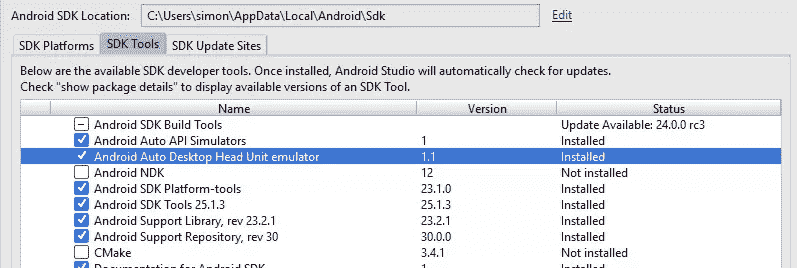

### 通过手机运行模拟器

要使用主机，您需要通过 USB 将手机连接到电脑。一旦连接，通过点击七次“构建版本”来启用开发者选项。然后在开发者选项部分启用 USB 调试。

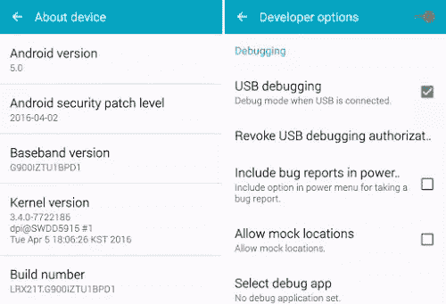

### 设置 Android Auto 应用程序和模拟器

将[安卓汽车伴侣应用](https://play.google.com/store/apps/details?id=com.google.android.projection.gearhead&hl=en)安装到您的手机上。打开应用程序，设置完成后，您将进入开始屏幕。

你还需要解锁此应用内的开发者选项才能继续。通过点击“Android Auto”文本 10 次来完成此操作。现在右边的溢出菜单会有一个新的选项，叫做*启动头单元服务器*，点击这个启动虚拟服务器。

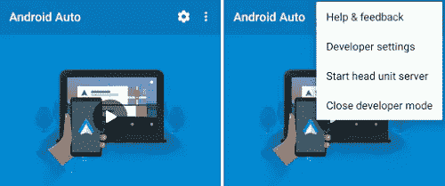

### 端口转发

您需要使用 Android Studio 中安装的 Android Developer Bridge (ADB)进行移植。运行以下命令，记住这需要在每次断开电话时运行。

```
adb forward tcp:5277 tcp:5277 
```

### 启动显示单元

现在设置好了，你需要找到*桌面主机*可执行文件。这是主应用程序，将运行模拟器，并与您的手机连接。

它会在你的*/ANDROID _ SDK _ FOLDER/extras/Google/auto*文件夹里。运行应用程序，模拟器应该会出现。按照初学者的步骤，模拟器将准备就绪。尝试一些默认的应用程序，你甚至可以和模拟器对话。

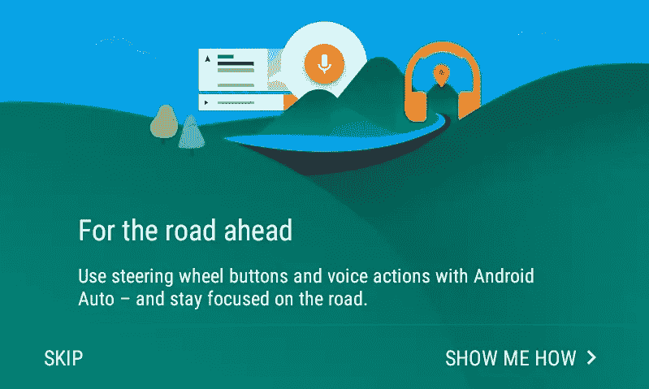

### 认真对待安全

由于用户将在驾驶时与 Android Auto 进行交互，谷歌非常重视安全，与国家公路交通安全管理局(NHTSA)和美国交通部等政府部门合作。开放汽车联盟的每个成员(与谷歌合作实施)都与国际标准组织(ISO)和汽车工程师协会(SAE)合作。欲了解更多信息，请访问[开放汽车联盟网站(底部有常见问题解答部分)](http://www.openautoalliance.net/#faqs)。

谷歌定制了 Android 体验，以确保将干扰保持在最低限度，用户只能访问他们需要的内容。

例如:

当你的手机连接到 Android Auto 时，你不能触摸它。你可以双击多任务切换器按钮，切换到另一个应用程序，但 home 键和 back 键不会让你退出 Android Auto。这是为了阻止人们玩手机。

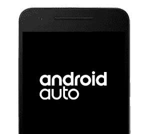

当与 Auto 交互时，例如选择一首音乐曲目，UI 不会让您深入超过 6 步。Auto 的核心原则之一是易用性，谷歌对你可以滚动、点击和互动多长时间做出了严格限制，否则你将无法继续下去。[系统概述抽屉文档提供了更直观的概述](http://www.google.com/design/spec-auto/system-overview/drawer.html)，这是最终用户看到的样子。

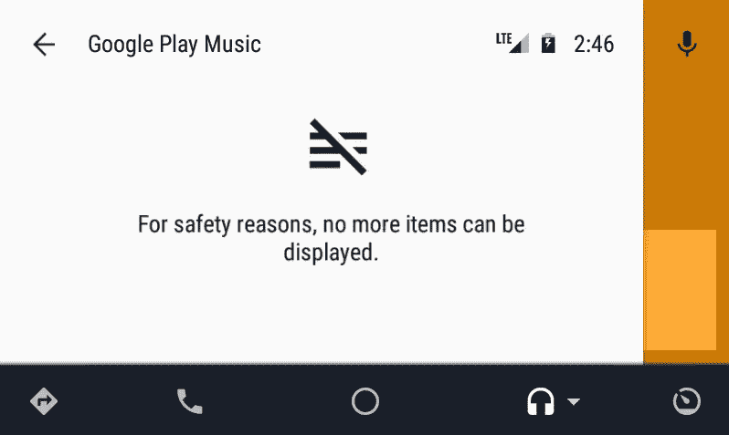

## 限制和注意事项

### 仅消息和音频

Android Auto 仍是新产品，谷歌正忙于更新以提供更多功能。谷歌已经开放了第三方应用程序来处理消息和音频服务。将来会有一天，应用程序会进一步访问 Auto，但目前这些是开发者可以访问的关键领域。

### 你需要安卓 5.0 和配套应用

需要安卓 5.0(棒棒糖)才能配合 Auto 使用。如果你有一个旧版本，那么你就不走运了。Android Auto companion 应用程序是必需的，它用于将您汽车中的 HUD 直接连接到您的手机(它充当一面镜子，让 HUD 使用您的手机)。

### 无法逃离 USB

在撰写本文时，你必须通过 USB 将手机直接连接到汽车上。虽然这不是问题，但很遗憾蓝牙不被支持。由于大多数手机都有 BT 4.0(低能耗)，汽车的 HUD 通常支持蓝牙，所以如果能进入你的汽车，触摸 HUD 上的开始按钮，它就会自动配置。

### 谷歌语音的乐趣

所有消息回复和一些其他关键功能都是通过谷歌语音控制的。如果你想听到一个消息，你需要让自动播放给你。然后你可以回复并发送你的信息。这是一个很好的系统，但你必须习惯类似机器人的声音，即谷歌文本到语音。

## Android Auto 如何工作

### 通过触摸或硬件进行互动

Android Auto 支持触摸屏事件，就像你的手机一样，但真正的力量来自于它与汽车物理硬件(如方向盘)的集成。

汽车车载屏幕上的触摸交互很好，但使用物理按键与 Auto 交互更好，因为它可以最大限度地减少手离开方向盘的时间，让你专注于驾驶。

几家汽车制造商支持 Android Auto ,这个名单还在不断扩大。第一家制造商是[现代及其 2015 款索纳塔](https://www.hyundaiusa.com/android-auto/)，许多其他制造商如奥迪、福特、日产和本田都全力支持(通过方向盘上的控制)2016 /计划 2017 款车型

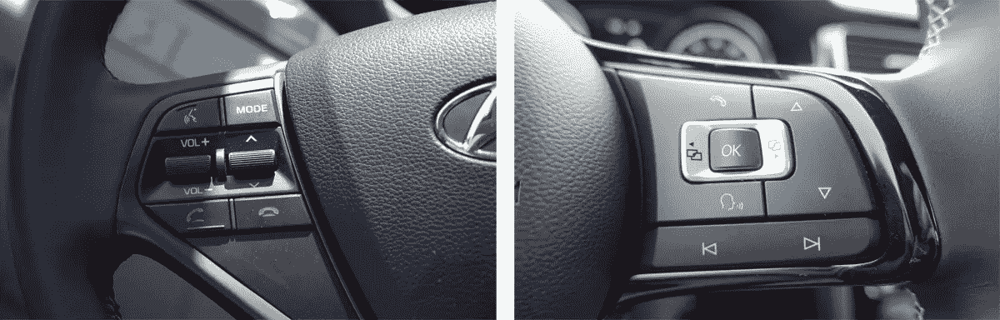
*左边现代索纳塔控制键，右边大众高尔夫-R 控制键，[androidauthority.com](http://androidauthority.com)图片走马观花*

方向盘控制会有所不同，但一般来说，它们会有你需要的主要按钮，如激活谷歌语音，跳过曲目和调节音量。如果没有专用按钮，你可以像平常一样与 HUD 进行交互，例如按下谷歌语音按钮来触发'[需求层](https://www.google.com/design/spec-auto/system-overview/demand-layer.html)'，在这种状态下谷歌语音会监听你的输入)

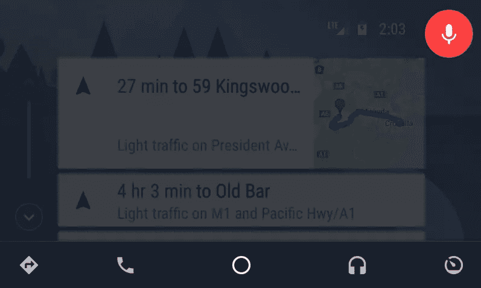

您可以使用底部的导航菜单按钮来访问重要项目，如通过谷歌地图或您的电话簿导航。

## Android Auto 的设计与开发

Android Auto 有自己的视觉设计和结构，最小化的布局，专注于简单的交互，减少了司机的分心。

### 通过简单的中央界面实现交互性

Auto 的核心原则是通过简单性提供交互性。司机应该专注于驾驶，而不是摆弄复杂的设置或华而不实的用户界面。

*概览屏幕*是汽车的主屏幕。它显示了一系列有用的、定制的 Google Now 卡片和适当的通知。底部导航栏中的圆形图标会将您带回此屏幕。

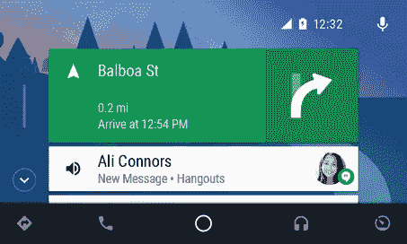

这些通知中的每一个都可以被部分定制，例如定义图像、主标题、副标题和相关联的图标。在[主屏幕概述文档](https://www.google.com/design/spec-auto/system-overview/home-screen.html#home-screen-active-audio)中有关于这些卡的更多信息。

### 排版、对比和功能

自动体验的一部分是，它减少了开发人员为让他们的通知和操作生效而需要花费的精力。与 Android Wear 非常相似，Auto 使用一些模板来自动创建通知、滚动区域和动作。

对设计的严格控制有两个方面:

1.  削减可用的功能，以便只执行重要的操作。
2.  遵守法律和安全规定(因为它的使用可能有潜在的危险)。

因此，你只能做几个选择，比如为你的品牌选择一个[原色、二色和强调色，以及选择几个字体大小。](https://www.google.com/design/spec-auto/colors-branding/expressing-your-brand.html)

### 白天模式和夜晚模式

昼夜模式让你的应用程序根据时间切换视觉风格，让你巧妙地定制用户界面，以适应昏暗或明亮的灯光。目前的 Android 版本不支持这一点，但 Android (N)预计将提供自动启用夜间模式的能力。支持夜间模式([)的应用程序，比如那些使用最新支持库](http://android-developers.blogspot.com.au/2016/02/android-support-library-232.html)的应用程序，将能够利用这一点。

Android Auto 已经利用了日夜模式。您的汽车应用程序的用户界面可以根据一天中的时间进行定制，提供一组辅助颜色供您使用。

#### 白天模式

在白天模式下，你的应用应该使用**浅色**配色方案，深色文本用在浅色背景上。这是为了让一切都变得明亮，容易看到。这些是你的应用将用于其品牌的默认颜色。

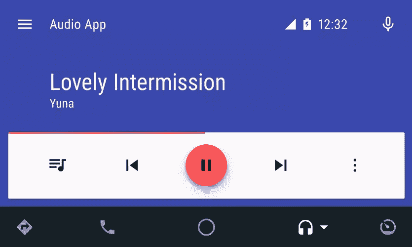

#### 夜间模式

在夜间模式下，你的应用应该使用**深色**的配色方案，深色背景上使用浅色文本。这是为了让一切更放松，不分散你的注意力。Auto 提供了定义自定义深色的能力，但是如果你不提供任何颜色，应用程序将使用它的默认颜色。

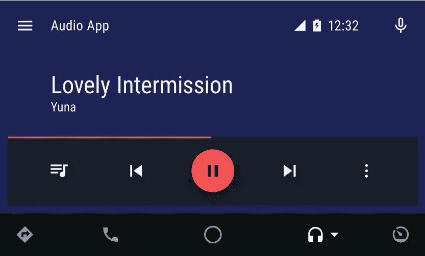

## 开发者功能

目前，开发者可以用他们的汽车应用取代两个核心组件，即[消息](http://developer.android.com/training/auto/messaging/index.html)和[媒体](http://developer.android.com/training/auto/audio/index.html)应用，让用户选择他们喜欢的应用。

如果用户有一个为 Android Auto 扩展的应用程序，那么它将出现在可能的选项列表中。如果用户的手机上有不止一个音乐播放器，Auto 会询问使用哪一个。

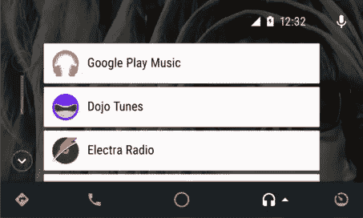

## 发布 Android 自动就绪应用程序

发布 Android Auto 应用程序与普通应用程序一样。谷歌必须在发布到 Play Store 之前审查每个应用程序。自动兼容的应用程序可以从 Play Store 下载到用户的手机上，或者直接通过 Android Auto companion 应用程序下载，安装后可供 Android Auto 使用。

与 Android Wear 一样，Android Auto 可以从配套应用程序本身访问一组兼容的应用程序。

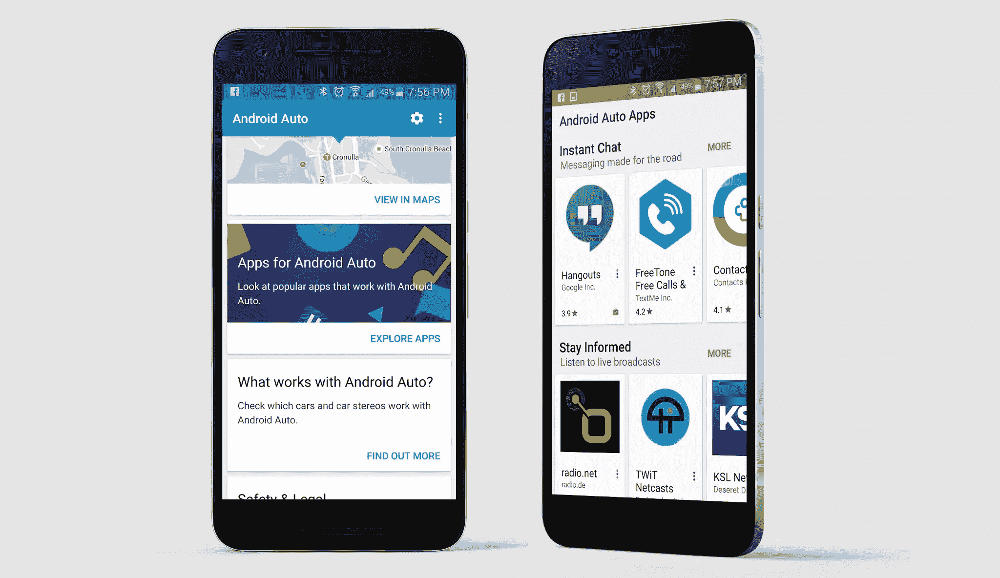

### 广泛的审查过程

发布你的应用时，谷歌会进行一系列测试，看看你的[应用是否适合 Play Store](https://developer.android.com/distribute/essentials/quality/core.html) ，如果不符合标准，就会被拒绝。这是为了保持高质量，并确保用户有一致和可靠的体验。

Android Auto 采取了额外的步骤，要求你的应用在获得批准之前通过[汽车应用质量测试](https://developer.android.com/distribute/essentials/quality/auto.html)和[汽车应用开发规范](https://developer.android.com/training/auto/index.html)。审查过程将比传统应用程序慢，因为如果你的应用程序分散了司机的注意力或引起混乱，那么**结果可能是致命的**。

遵循 [Android 汽车设计和开发指南](https://www.google.com/design/spec-auto/designing-for-android-auto/designing-for-cars.html)的一个原因是，如果你构建了一个强大的、经过深思熟虑和设计的汽车应用，谷歌可能会展示它。

## 道路机器人

Android 不再仅仅是一个手机平台。Android 应用程序正变得无处不在，潜在客户可能最终会在他们的手机、手表、电视或开车时使用你的应用程序。对于开发者来说，这是一个令人兴奋的时刻，随着越来越多的制造商注册使用 Android Auto，汽车将会变得更加普及。有可能为各种各样的应用程序打开一个新的市场。

你试过 Auto 吗？我很想听听你们的经历。

## 分享这篇文章