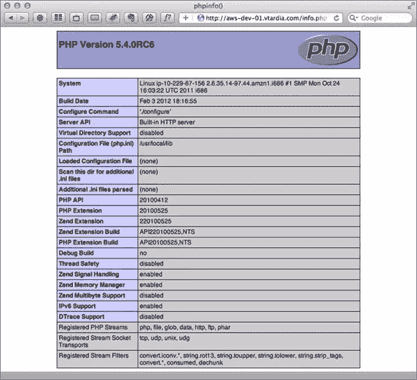
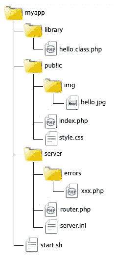

# 利用 PHP 内置的服务器

> 原文：<https://www.sitepoint.com/taking-advantage-of-phps-built-in-server/>

新的 PHP 5.4 版本的一个更酷的特性是一个专门为开发和测试设计的内置 web 服务器。现在，您可以编写和测试您的代码，而不必有一个完整的 LAMP 配置——只需从命令行启动一个内置的服务器，测试您的代码，然后在完成后关闭它。

服务器本身也有其他创造性的用途。例如，您可以在 CD ROMs 或 USB 棒上分发便携式 web 应用程序，甚至作为桌面应用程序，所有这些都是用 PHP 创建的，不需要 GTK 或其他图形库。

有些人可能会指出，PHP 最初是设计用于 web 的语言，而 Python 和 Ruby 等其他语言则不是，所以对其他人来说，提供一个基本的服务器环境来帮助启动 web 开发更有意义。他们会争辩说 PHP 不需要内置服务器。此外，今天大多数系统都已经安装了个人网络服务器，或者只需几个命令或点击就可以安装。

事实上，PHP 手册强调新的内置服务器仅用于开发，并建议不要在生产中使用。除了一条指令(对发送到控制台的日志输出进行着色)之外，没有其他特殊的 INI 指令，文档的基调似乎是“我们现在也有 web 服务器了，不要再打扰我们了。”

尽管如此，服务器还是在 5.4 版本中发布了它，我认为它对于开发和测试都是一个有价值的工具。例如，在我的机器上，我使用 OSX 预装的 Apache，它的定制配置适合我的开发风格，但有时我想尝试一些新的 webapp。有了 PHP 的内置服务器，我可以直接从我的下载或临时目录中测试应用程序，然后只有在真正需要的时候才把它移到我的常规环境中。

嗯，一开始并不那么简单，因为许多应用程序都是用 Apache 编写的，并利用了`.htaccess`文件和`mod_rewrite`。但是我很确定外面有人(也许是你们中的一个，为什么不呢？)将为这个特性编写一个适配器，我想成为第一个测试它的人。

在本文中，我将解释新的内置服务器的一些基本用途，并向您展示如何构建一个可移植的个人开发服务器，用于快速测试您的应用程序。我相信你和我一样急于开始，所以让我们开始吧！

## 使用内置服务器

您需要安装 PHP 5.4 或更高版本才能使用内置服务器。要验证您的 PHP 版本，请在终端中调用`php -v`。然后，您可以通过运行`php -h`并查找特定于服务器的`-S`和`-t`选项来确定服务器在您的构建中是否可用。

您可以通过在当前目录中创建一个基本的`index.php`文件来测试服务器，该文件包含对`phpinfo()`的调用，然后像这样启动服务器:

```
[ec2-user@ip-10-229-67-156 ~]$ php -S <localhost or your public IP>:8080
PHP 5.4.0RC7 Development Server started at Fri Feb 26 18:49:29 2012
Listening on <YourIP>:8080
Document root is /home/ec2-user
Press Ctrl-C to quit.
```

在您的浏览器中，您现在应该能够看到内置服务器提供的内容。



对于每次客户端访问，都会在控制台窗口中写入一个新的日志行:

```
[Sun Feb 26 18:55:30 2012] 80.180.55.37:36318 [200]: /
[Sun Feb 26 18:56:23 2012] 80.180.55.37:36584 [200]: /
```

回头看看 PHP 的命令行选项，`-S`用于指定服务器将绑定到的地址。它的值可以是:

*   `localhost`–只能在本地机器上访问服务器
*   `0.0.0.0`-可从机器的任何接口(有线或无线)访问服务器
*   您的任何公共或私人 IP 地址-服务器只能在特定的地址访问

`-t`允许您告诉服务器将另一个目录作为其文档根目录。例如:

```
[ec2-user@ip-10-229-67-156 ~]$ php -S <localhost or your public IP>:8090 -t /home/ec2-user/public
```

或者，您也可以提供特定 PHP 文件的名称，比如一个`index.php`或一个定制的`router.php`文件。

```
[ec2-user@ip-10-229-67-156 ~]$ php -S >localhost or your public IP>:8080 -t /home/ec2-user/public public/index.php
```

这种路由器脚本的输出将由服务器解析和执行。下面是一个基本的例子:

```
<?php
$extensions = array("php", "jpg", "jpeg", "gif", "css");

$path = parse_url($_SERVER["REQUEST_URI"], PHP_URL_PATH);
$ext = pathinfo($path, PATHINFO_EXTENSION);
if (in_array($ext, $extensions)) {
    // let the server handle the request as-is
    return false;  
}

echo "<p>Welcome to PHP</p>";
```

如果脚本返回 false，那么请求的 URI 将由服务器处理，服务器将按原样输出请求的资源或输出 404 错误。如果脚本返回其他内容，那么输出将被传递给客户端。

虽然这种方法给了我们更多的控制，但是有一些事情你应该知道。首先，PHP 服务器只返回一个最小的 HTTP 头集:

```
Connection: closed
Content-Type: text/html
Host: aws-dev-01.vtardia.com
X-Powered-By: PHP/5.4.0RC7
```

将此与 Apache 返回的一组典型 HTTP 头进行比较:

```
Accept-Ranges: bytes
Connection: Keep-Alive
Content-Length: 631
Content-Type: text/html
Date: Sat, 04 Feb 2012 18:24:42 GMT
Etag: "bbb99-277-4ace8c5470a40"
Keep-Alive: timeout=15, max=100
Last-Modified: Wed, 14 Sep 2011 15:54:09 GMT
Server: Apache/2.2.21 (Unix) DAV/2
```

如果您的应用程序使用服务器头，那么它们必须在开发/测试环境(内置服务器)和生产环境(Apache/IIS/Nginx)中保持一致。

第二，PHP 服务器有一个不同的 SAPI(服务器 API ),所以无论`index.php`是来自内置服务器还是生产服务器，您都可以有条件地执行路由。当您使用内置服务器时,`php_sapi_name()`将返回“cli-server”。

```
<?php
if (php_sapi_name() == "cli-server") {
    // running under built-in server so
    // route static assets and return false
    $extensions = array("php", "jpg", "jpeg", "gif", "css");
    $path = parse_url($_SERVER["REQUEST_URI"], PHP_URL_PATH);
    $ext = pathinfo($path, PATHINFO_EXTENSION);
    if (in_array($ext, $extensions)) {
        return false;  
    }
}
```

内置服务器有一个特殊的 INI 指令；`cli_server.color`指令在控制台输出中打开彩色日志输出。创建一个名为`cli-server.ini`的空文本文件，并插入这一行:

```
cli_server.color = on
```

您可以在新的自定义 INI 文件中为您的服务器创建一个独特的配置环境，任何未指定的指令都将采用默认值。这里我们只指定了`cli_server.color directive`。

终止之前运行的进程，并再次启动，但这次使用`-c`指定新文件。

```
[ec2-user@ip-10-229-67-156 ~]$ php -S <localhost or your public IP>:8080 -c cli-server.ini
```

如果你的终端支持彩色，你应该会看到彩色的输出线。200 种状态显示为绿色，404 种状态显示为橙色，请求脚本中的错误显示为红色。

## 构建自定义服务器

现在，您已经了解了 PHP 内置 web 服务器的所有知识，让我们利用这些知识来做一些很酷的事情。让我们设计一个定制的便携式服务器吧！

我将从应用程序的以下示例目录结构开始:



`library`目录包含应用程序的代码，`public`目录将是我们的文档根目录，并将包含`index.php`和一些示例静态文件。本教程的重点是`server`目录，因此应用程序将由一个简单的 HelloWorld 脚本和一些静态内容(一个图像和一个 CSS 文件)组成。

目标是能够用一个命令从应用程序目录中启动服务器，我们的服务器将处理路由、头和 HTTP 错误。

```
[ec2-user@ip-10-229-67-156 myapp]$  ./start.sh
```

我们开始考察启动脚本，这是一个简单的 shell 脚本:
[shell]#！/bin/bash

INIFILE = " $(pwd)/server/server . ini "
DOCROOT = " $(pwd)/public "
ROUTER = " $(pwd)/server/ROUTER . PHP "
HOST = 0 . 0 . 0 . 0
PORT = 8080

PHP=$(哪个 php)
if [ $？！= 0 ] ;然后
回显“找不到 PHP”
出口 1
fi

$ PHP-S $ HOST:$ PORT-c $ INIFILE-t $ DOCROOT $ ROUTER[/shell]
she bang 后面的行是可定义的设置。我假设脚本是从应用程序目录启动的，所以`INIFILE`、`DOCROOT`和`ROUTER`路径都是从那里使用`pwd`计算出来的。然后使用`which`命令的输出来识别 PHP 的路径。如果在用户的`$PATH`中没有找到 PHP，该命令将返回一个非零值，脚本将出错退出。

这里的方法已经足够好了，但是根据您的需要，您可能需要更加健壮。另一种方法是为用户提供一个选项，从命令行覆盖任何已定义的设置，例如:
【shell】if[！-z $ INIFILE]；然后
INIFILE = " $(pwd)/server/server . ini "
fi[/shell]
继续，`errors`目录包含 HTTP 错误消息的文件。这里有一个 403 消息的例子；虽然我只使用了 HTML，但是这个脚本将使用`include`包含在路由器中，所以你可以添加任何你想要的 PHP。

```
<!doctype html>  
<html lang="en">
 <head>
  <meta charset="utf-8">
  <title>403</title>  
 </head>
 <body>
  <h1>403: Forbidden</h1>
  <p>Sorry, the requested resource is not accessible.</p>
 </body>  
</html>
```

然后是完成所有工作的`router.php`文件。该文件的目标是获取和管理所有请求，并仅当它们是现有文件时才将其传递给服务器。所有错误页面都通过包含模板在内部进行管理。

```
<?php
// Set timezone
date_default_timezone_set("UTC");

// Directory that contains error pages
define("ERRORS", dirname(__FILE__) . "/errors");

// Default index file
define("DIRECTORY_INDEX", "index.php");

// Optional array of authorized client IPs for a bit of security
$config["hostsAllowed"] = array();

function logAccess($status = 200) {
    file_put_contents("php://stdout", sprintf("[%s] %s:%s [%s]: %sn",
        date("D M j H:i:s Y"), $_SERVER["REMOTE_ADDR"],
        $_SERVER["REMOTE_PORT"], $status, $_SERVER["REQUEST_URI"]));
}

// Parse allowed host list
if (!empty($config['hostsAllowed'])) {
    if (!in_array($_SERVER['REMOTE_ADDR'], $config['hostsAllowed'])) {
        logAccess(403);
        http_response_code(403);
        include ERRORS . '/403.php';
        exit;
    }
}

// if requesting a directory then serve the default index
$path = parse_url($_SERVER["REQUEST_URI"], PHP_URL_PATH);
$ext = pathinfo($path, PATHINFO_EXTENSION);
if (empty($ext)) {
    $path = rtrim($path, "/") . "/" . DIRECTORY_INDEX;
}

// If the file exists then return false and let the server handle it
if (file_exists($_SERVER["DOCUMENT_ROOT"] . $path)) {
    return false;
}

// default behavior
logAccess(404);
http_response_code(404);
include ERRORS . "/404.php";
```

在第一行中，我定义了一些全局设置，比如目录索引文件和错误模板目录。`date_default_timezone_set()`的参数必须与您系统的参数相匹配，否则您会发现脚本的日志条目与服务器的日志条目不一致。我还添加了一个可选的允许客户端 IP 列表来提高安全性。

需要使用`logAccess()`函数，因为当路由器脚本处理请求时，会绕过服务器默认日志。该函数只接受状态代码参数，并对输出进行格式化，以与服务器的输出完全匹配。

我们的第一个解析任务是安全检查:如果上面定义了一个主机列表，而客户机不在这个列表中，我们将提供一个错误消息并关闭脚本。我们需要输出一个不同于 200 的状态码，以防出错，而`header()`函数在这种情况下不起作用，所以要使用的正确函数是新的`http_response_code()`。

如果客户端被允许继续，我们接下来要做的就是提取请求的路径及其扩展。在扩展名为空的情况下，用户请求一个目录，因此我们使用默认的目录索引文件构建完整的路径。

最后，如果请求的路径对应于一个现有的文件，脚本返回 false 并让服务器处理它。如果没有，则执行默认行为，显示 404 错误页面。

## 摘要

仅此而已。正如您所看到的，PHP 服务器简单易用。我们的定制快速服务器是非常基本的，代码可以优化和封装成一个更复杂和功能齐全的类。像往常一样，你可以从 GitHub 下载源代码来玩。编码快乐！

<small>图片 via [尤金·库兹曼诺克](http://www.shutterstock.com/gallery-259513p1.html)/[Shutterstock](http:/www.shutterstock.com)</small>

## 分享这篇文章