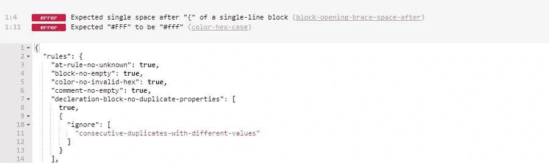

# 用 Stylelint 将 CSS 林挺带到一个新的高度

> 原文：<https://www.sitepoint.com/taking-css-linting-next-level-stylelint/>

随着前端开发的成熟，解决代码质量的工具的使用已经大幅增长。

这在 JavaScript 生态系统中可能最为明显。使用 JavaScript linter 现在是前端开发人员期望的标准，以确保他们的代码结构良好且一致。事实上，在我最近的工具调查中，[绝大多数开发人员声称他们 lint 他们的 JavaScript](https://ashleynolan.co.uk/blog/frontend-tooling-survey-2016-results#js-linters) 。

当谈到编写 CSS 时，使用代码质量工具的动力稍微慢了一些，同一调查中的大多数开发人员表示他们[选择不在他们的工作流程](https://ashleynolan.co.uk/blog/frontend-tooling-survey-2016-results#css-linting)中使用 CSS linter。



今天我想解决这个问题，特别关注一个提高了林挺样式表标准的工具: [stylelint](https://stylelint.io/) 。

首先值得注意的是，尽管我在整篇文章中都引用了 CSS，但这些引用可以与预处理语言(如 Sass)互换。Stylelint 可以评估 Sass 和 Less 文件以及普通 CSS，我们将在本文后面更详细地讨论这一点。

## CSS 林挺(非常)简史

当 CSS 林挺首次作为一个概念被引入时，它是相当两极分化的。在 2011 年 [CSS Lint](http://csslint.net/) 推出后不久，我记得读过 Matt Wilcox 写的一篇名为 [CSS Lint 有害](https://2002-2012.mattwilcox.net/archive/entry/id/1054/)的文章，该文章批评了它的一些规则的固执己见的本质——社区中的许多人都有这种情绪。

回过头来看，CSS Lint 很像第一个可用的 JavaScript 林挺工具，例如[JSLint](http://www.jslint.com/)——固执己见，不太灵活。然而，尽管像 [JSHint](http://jshint.com/) 和 [ESLint](https://eslint.org/) 这样的工具出现并推动了 JavaScript 林挺向前发展，但 CSS 林挺领域的替代品并不存在。

直到 stylelint 出现。

## 为什么是 Stylelint？

我认为 stylelint 现在是林挺你的 CSS 的最佳工具，有几个原因。

首先，它完全不固执己见。这意味着您可以启用尽可能多或尽可能少的规则，它的许多规则为您提供了根据您的偏好进行配置的选项。

此外，它有大量的可用规则——[超过 150 条实际上是](https://stylelint.io/user-guide/rules/),不包括[语言特定的规则](https://github.com/kristerkari/stylelint-scss)用于预处理程序特定的语法。花一点时间浏览这些对于建立一套适合你写作风格的规则是非常宝贵的。

它也非常灵活，理解 CSS 和类似 CSS 的语法，如 SCSS 和更少。因此，无论您想要 lint 预处理程序代码还是普通 CSS，stylelint 都能满足您的需求。

最后，也许也是最重要的，它的文档非常优秀。想看看有哪些规则？查看包含所有可用规则的详细[文档。关于如何贡献你可能喜欢的新规则的一些建议怎么样？他们有很棒的](https://stylelint.io/user-guide/rules/)[开发者指南](https://stylelint.io/developer-guide/)来帮助你。

## Stylelint 能做什么？

在用任何语言进行开发时，添加林挺步骤的价值在于提高您正在编写的代码的一致性，并减少代码中的错误数量。

当将此应用于 CSS 时，stylelint 可以帮助您解决许多问题。

### 句法误差

语法错误不是主观错误，一旦突出显示就应该非常清楚。

考虑下面的例子:

```
.element {
  color: #EA12AE1;
  disply: block;
}
```

上面的代码显示了两种不同的语法错误。第一个错误是无效的十六进制颜色。第二个是声明`display`属性时的错别字。

这些都是非常基本的语法错误，stylelint 可以使用诸如 [`color-no-invalid-hex`](https://stylelint.io/user-guide/rules/color-no-invalid-hex/) 和 [`property-no-unknown`](https://stylelint.io/user-guide/rules/property-no-unknown/) 之类的规则来发现这些错误，让您不必手动查找错误。

### 格式和一致性

在 CSS 中，代码风格偏好可能非常主观。我喜欢的写 CSS 的方式可能不是你喜欢的写 CSS 的方式。因此，重要的是 CSS linter 能够适应你的偏好，而不是试图强加一套规则给你。

考虑以下风格:

```
.listing {
  display: block;
}

.listing-item
{
  color:blue;
}

.listing-img{
  width : 100%}

.listing-text { font-size: block; }

.listing-icon {
  background-size: 0,
    0; }
```

上面所有的规则集都包含有效的 CSS，但是它们在风格上明显不一致。每个声明中空格的使用是不同的，每个块的格式也略有不同。

这个例子展示了格式化 CSS 的几种可能的方法。但实际上有数百种微妙的变化。在整个样式表(或多个文件)中，这样的不一致会妨碍代码的可读性和可维护性。

当一个项目由多个开发人员共同完成时，这种不一致性会变得更加明显，因为每个人可能更喜欢以稍微不同的方式编写他们的风格。在这种情况下，聚在一起商定一套大家都要遵守的格式规则总是有益的。

Stylelint 允许您定制一组规则来匹配您或您的团队喜欢的样式格式。无论您有什么偏好，stylelint 都可以检查这些规则是否在您的项目中得到一致的应用。

### 减少风格上的重复

无论是样式表中选择器或属性的重复，重复调试都是一件痛苦的事情。

看看下面的 CSS:

```
/* Property duplication */
a {
  display: block;
  color: orange;
  font-size: 1.2rem;
  display: inline; /* duplicate */
}

/* Selector duplication (1)
   Same selector, at different points in stylesheet */
.foo {}
.bar {}
.foo {}

/* Selector duplication (2)
   The same group of selectors, simply ordered differently */
.foo, .bar {}
.bar, .foo {}
```

Stylelint 有几个规则可以帮助发现代码中的这种重复，比如可以捕捉重复属性的 [`declaration-block-no-duplicate-properties`](https://stylelint.io/user-guide/rules/declaration-block-no-duplicate-properties/) 规则。

还可以将其配置为忽略有意的重复，例如当定义了相同的属性来提供回退值时:

```
.example {
  font-size: 14px;
  font-size: 1.2rem; /* will override the above if browser supports rem */
}
```

### 最佳实践检查

CSS 中的最佳实践在某种程度上是主观的，但是 stylelint 为您提供了完全的灵活性来检查这些“错误”。

属于这一类的一个普遍接受的最佳实践是，在编写预处理器代码时，当超过某个选择器嵌套深度时，抛出一个错误。这有助于确保您的风格的特异性水平保持在合理的水平，并且不会失控。

不同的开发人员和不同的用例意味着什么被认为是“可接受的”可能会因项目而异。例如，您可能有一个遗留样式表，您希望确保嵌套深度不会变得更糟。 [`max-nesting-depth`](https://stylelint.io/user-guide/rules/max-nesting-depth/) 规则允许您定义自己可接受的嵌套深度进行检查，这意味着该规则对于任何使用预处理器的项目都是有用的。

### 限制语言功能

stylelint 允许您访问的最后一组检查是他们在规则指南中所说的“限制语言特性”。在使用样式表时，这些可以用来实施您自己的特性规则。

一个常见的例子是，如果您使用类似于 [Autoprefixer](https://github.com/postcss/autoprefixer) 的工具来自动为您的样式添加供应商前缀。在这种情况下，如果供应商前缀是由开发人员手动添加的，则抛出一个警告或错误会很有用，因为这将有助于使您的代码清除不必要的前缀，这些前缀将在工具随后在无前缀的样式上运行时添加。Stylelint 可以用它的[‘value-no-vendor-prefix’规则](https://stylelint.io/user-guide/rules/value-no-vendor-prefix/)来帮你解决这个问题，它就是这么做的。

其他规则的例子包括从[不允许命名颜色](https://stylelint.io/user-guide/rules/color-named/)或[指定数字的最大精度](https://stylelint.io/user-guide/rules/number-max-precision/)，到如果你愿意的话能够[将某些属性](https://stylelint.io/user-guide/rules/declaration-property-unit-blacklist/)列入黑名单。

这些规则本质上更加固执己见，但是你可以随意使用它们。这意味着您的项目的林挺规则是根据您和您的团队喜欢如何编写您的风格而定制的。

## 使用 Stylelint

我们已经介绍了 stylelint 的功能，但是它的设置和使用有多简单呢？

和它的规则集一样，stylelint 非常灵活。有[个可用插件](https://stylelint.io/user-guide/complementary-tools/#build-tool-plugins)可以轻松集成到您喜欢使用的任何构建工具中，还有用于 Atom、Sublime Text 和 Visual Studio 代码的[编辑器插件](https://stylelint.io/user-guide/complementary-tools/#editor-plugins)。

在建立自己的规则集方面，有多种方法可以做到。最简单的方法是在您的项目根目录下创建一个`.stylelintrc`文件，您可以在其中开始构建自己的规则，例如:

```
{
  "rules": {
    'block-closing-brace-newline-before': 'always-multi-line',
    'block-closing-brace-space-before': 'always-single-line',
    'color-no-invalid-hex': true,
    'comment-no-empty': true,
    'unit-case': 'lower',
    'unit-no-unknown': true,
    // etc...
  }
}
```

当你运行 stylelint 任务时——例如作为你的 [Gulp](https://www.sitepoint.com/introduction-gulp-js/) 或 [webpack](https://www.sitepoint.com/bundle-static-site-webpack/) 构建的一部分——它将获取上述配置并使用那些规则来 lint 你的样式。

与 ESLint 等 JavaScript 林挺工具类似，您也可以使用现有配置作为起点，并添加自己的规则。Stylelint 有一个[推荐的基本配置](https://github.com/stylelint/stylelint-config-recommended)，您可以对其进行扩展，或者您可以选择从基于诸如 [SUIT CSS](https://github.com/suitcss/stylelint-config-suitcss) 之类的方法论的更加固执己见的规则集中进行扩展。

我的建议是花一点时间浏览可用的规则，并创建一个您和您的团队都满意的配置。一旦证明是有用的，您可以采取额外的步骤，将您的配置作为可安装的 [npm 模块](https://www.sitepoint.com/beginners-guide-node-package-manager/)可用——就像上面提到的可扩展规则集——这样您就可以在所有项目中同步安装和保持您的 stylelint 配置。

## 林挺预处理器代码

正如我前面提到的，stylelint 可以像处理 CSS 一样简单。

这取决于如何使用 stylelint。如果你正在使用一个构建工具的插件，比如 Gulp 或 webpack，你可以为 stylelint 的`syntax`选项传递一个值。[这个选项](https://github.com/stylelint/stylelint/blob/master/docs/user-guide/node-api.md#syntax)将`less`或`scss`作为值，这取决于您希望 lint 的语法。

例如，要指定您想要 lint 您的`.scss`文件，您可以将以下对象作为 stylelint 选项传入:

```
{
  syntax: 'scss'
}
```

如果您想了解更多关于如何使用 stylelint 来 lint 预处理程序代码的信息，在其文档中有一个很棒的章节专门解释这一点。

## 往前走，棉绒！

如你所见， [stylelint](https://stylelint.io/) 在相对较短的时间内为 CSS 林挺带来了长足的进步。它的灵活性和广泛的规则意味着您可以设置一个尽可能详细或尽可能自由的配置，帮助您保持您的风格更加一致、可维护和无错误。

我希望更多的开发者选择使用这样一个优秀的工具；所以试着开着它转一圈。你的样式表会为此感谢你的。

## 分享这篇文章