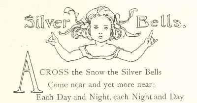
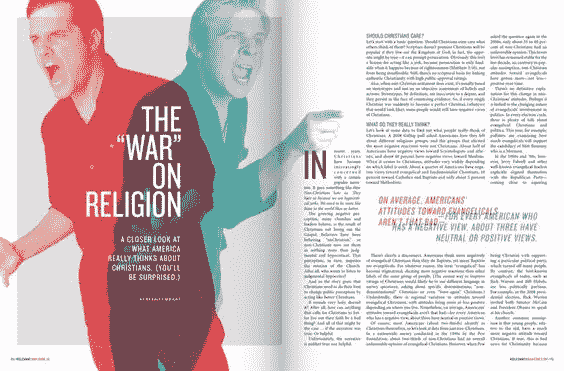
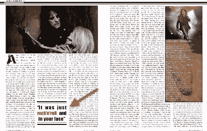

# 消除引用中的双重麻烦

> 原文：<https://www.sitepoint.com/taking-double-trouble-pull-quotes/>

印刷是一项非常古老的技术。

这个世界已经经历了上百年的实验，因此，我们今天在网上使用的几乎所有的印刷术语和技术最初都是为纸张发明的。

但是，正如我们所知，印刷和数字有不同的优势和劣势。大多数打印技术都是为了让眼睛更容易浏览打印的页面。



Drop cap – Silver bells

另一方面，我们的数字内容需要更加灵活，减少对单一格式或呈现风格的依赖。这也是一件很酷的事情，允许用户自由调整和翻译文本，覆盖字体和转换文本到语音。

但有时我们需要留意经典印刷技术如何转化为数字技术。

接受“首字下沉”。虽然肯定有装饰的成分，但它总是用来在视觉上标志一个新部分的开始。

但是在网上，我们已经开始把大字体和大写字母与叫喊联系起来。幸运的是，我们的屏幕读者足够聪明，知道不要在上面这首诗的开头喊出巨大的 A？

## 引用语

“引用”是另一个印刷发明，已经很好地转化为数字世界。



Creative use of pull quotes: The War on Religion

这是一种设计用来隔离和突出正文中特别有趣的句子的装置。这是一个“诱饵”,旨在吸引浏览者进入内容。

尤其是《滚石》杂志，长期以来一直以强有力和创造性的方式使用引用语。

尽管有用，但除了视觉布局之外，引用语没有什么价值。尽管它是由“真实内容”构建的，但在许多方面，它只不过是一个“页面装饰”——就像一个花哨的首字下沉。

这很好，但是我们的标记通常是这样的:

```
<p>You couldn't come out there wimpy, you had to come 
out there strong. It was just rock'n'roll and in your face, 
but, like you said, the drunk edge gave it a real power.</p>
<p class="pullquote">"It was just rock'n'roll and in your face"</p>
```



Alice Cooper in Rolling Stone

上面的标记在上面的视觉网络杂志布局中完全有意义——但是如果你通过文本到语音转换听它，你会听到一个随机的句子在没有明显原因的情况下重复。

更重要的是，有时重复的句子可能会出现在离原来位置 3 或 4 段的地方，这让听者更加困惑。

当我们将这些引用添加到标记中时，我们实际上改变了作者作品的原始内容。这些引语通常是由副编辑选择的，而不是作者，他们选择这些引语是为了在当前的**版面上看起来更好。**

这意味着我们正在发送一个有点临时的“风格突发奇想”,它会被谷歌永久索引，并由新闻阅读器和任何其他使用 RSS 的设备显示。

如果下一代《滚石》杂志的布局决定甚至不使用引用语，会发生什么？

*问题*，就是发生了什么。

正如医生的希波克拉底誓言所说的'*不伤害*'，我认为我们应该采用类似的方法来展示我们的内容:

> *不要做任何污染自己原创内容的事情*。

将你的内容的一部分折叠起来，是对原有内容的一种微小的改变和轻微的污染。

## 那么我们能做什么呢？

在这种情况下，至少有两种解决方案是有意义的。我不想在这里深究技术细节(下面的链接给出了更全面的解释)，但让我们谈谈基本的方法和原因。

### JavaScript 引用

Roger Johansson 提出了我遇到的第一个解决方案，Chris Coyier 后来对其进行了改进。它涉及到[将引用的文本包装在< span class="pullquote" >中，并使用 JavaScript 创建一个新的 pullquote 页面元素](https://css-tricks.com/better-pull-quotes/)。

这仍然是一个非常合理的方法。它是干净的，易于实现。关掉 JavaScript，引用就没了。不利的一面是，我认为网络机器人永远不会解析 JavaScript 的假设可能不像几年前那样清晰了。

这当然不是什么大问题。

### 数据属性引用

早在 2011 年，Instagram 的 [Maykel Loomans 开发了这个方法](https://go.sitepoint.com/t/y-l-dihrykl-jdiybjikt-u/)，我仍然喜欢这个方法。它使用 CSS 生成的内容将您的引用呈现到一个`.before`伪元素中。

CSS 的关键部分是:

```
.has-pullquote{  
content: attr(data-pullquote);  
...}
```

CSS 的其余部分只是样式和位置。

Maykel 的 HTML 是这样的:

```
<p class="has-pullquote" data-pullquote="
It was just rock'n'roll and in your face"> You couldn't come 
out there wimpy, you had to come out there strong.  It was just 
rock'n'roll and in your face, but, like you said, the drunk edge 
gave it a real power.
</p>
```

像所有 CSS 生成的内容一样，这个引用文本不像“真实文本”一样被 web 浏览器处理。你可以看到它，但你不能选择或复制它，屏幕阅读器和网络蜘蛛对它视而不见。把 CSS 剥开就没了。

我喜欢这种方法，部分原因是它不依赖于 JavaScript。这感觉像是一个表示问题，所以应该放在 CSS 中。

它也会透明地降解。未来任何决定不包含引用的 CSS 布局——有意或无意——都会忽略数据属性。

我认为这是一个很好的解决方案。

*原载于 [SitePoint 设计简讯](https://www.sitepoint.com/newsletter/)* 。

## 分享本文