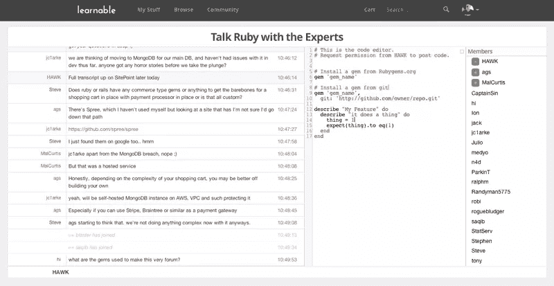

# 与专家谈论 Ruby:文字记录

> 原文：<https://www.sitepoint.com/talk-ruby-expertsthe-transcript/>

今天是我主持的一段时间以来最令人兴奋的与专家对话之一，但它与主题(鲁比)或专家(我们自己的马尔·柯蒂斯和阿莱士·史密斯)无关。这是因为我们使用了实时代码窗口。如果你还没有机会去看它的运行，这里有一个截图。

时间像往常一样飞逝而过，出现了一些重大问题。如果你因为不知道会议已经开始而错过了今天的会议，请务必在这里注册接收未来会议的电子邮件提醒。下周不容错过——我们谈论的是**基金会**(Zurb)——我们用来建立新的 SitePoint 和可学习网站的响应框架。该聊天将于太平洋标准时间 11 月 27 日星期三下午 12:30 开始，或者您可以在[这里](http://www.timeanddate.com/worldclock/fixedtime.html?msg=Talk+Foundation+with+the+Experts&iso=20131128T0730&p1=152&ah=1 "Time zone converter")找到您那里的时间。

现在，对于那些对我们今天早上谈论的内容感兴趣的人，你们可以在这里阅读完整的文字记录。尽情享受吧！

**[21:01] <MalCurtis> Ruby is a dynamic programming language with a very readable and expressive syntax**
**[21:02] <MalCurtis> Ruby was made popular by the framework Rails (Ruby on Rails)**
**[21:02] <MalCurtis> Oh, and part of its charm is having a great community of open source projects**
**[21:03] <MalCurtis> pretty much anything you want is available as a gem (Ruby’s way of packaging code)**
**[21:03] <MalCurtis> So… does anybody have any questions?**
[21:03] <ParkinT> And the Ruby ‘Make’ utility, Rake, contains many useful tasks
[21:03] <HAWK> Go for it Banago…
[21:04] <jack> hello, how framework work? and what is the relation between framework and programming language?
[21:04] <hi> is it better to use gems or to download a repo?
[21:05] <Banago> I’m a PHP developer basically. I nowadays use a PHP framework called Laravel which is very similar to Rails in style. Also PHP has now packages which is the same things as Gems for Ruby. My question would by what would be a good reason for me to learn Ruby (+ Rails) with the tools I’ve got at my disposal now on the PHP world?
**[21:05] <MalCurtis> Rails, the framework, is written in Ruby, so it runs ruby code**
[21:05] <TRParkin> @hi, better to use gems. Downloading repo is not used how you would think
**[21:05] <MalCurtis> You write your own ruby code, but use the classes and structure that Rails has provided for you**
[21:05] <ParkinT> Rails is also very ‘opinionated’
**[21:05] <MalCurtis> hi, often a repo IS a gem**
[21:05] <ParkinT> Meaning, it has ideas about how things should work and those “Defaults” are strongly recommended
**[21:06] <MalCurtis> For example, using the tool bundler, you can install a gem from a git repo by passing it as an option**
[21:06] <TRParkin> Banago, I did PHP for years before learning Ruby/Rails. PHP seems nice to use and easy…until you realize how pleasant writing ruby code is
[21:06] <TRParkin> Ruby is a fun and intuitive language, much more enjoyable than PHP imo
[21:07] <Banago> PHP is now very enjoyable with Laravel – I mean it.
**[21:07] <MalCurtis> What ruby provides is an incredibly large community of open source projects**
**[21:07] <hi> tool builder?**
[21:07] <ParkinT> I *do* believe Ruby is easier IF you are a native speaker of the English language. Because it ‘expresses’ itself much like English sentences.
**[21:07] <MalCurtis> It’s also slightly more capable that PHP in that it has a full REPL console, so you can start a console and run code**
**[21:08] <MalCurtis> PHP has come a long way with these new frameworks, but it can still be a nightmare to manage dependencies etc**
***[21:08] <ags> @Banago speed of development and the culture of rigorous testing in a much more expressive language than PHP would be a good reason to look into Ruby / Rails***
[21:08] <TRParkin> @Banago, sounds like you are happy where you’re at, which is good to hear. But a quick look at Laravel looks like you are well positioned to pick up Rails quickly but Ruby is much different than PHP
[21:09] <TRParkin> everything in ruby is an object, for example. Even numbers (integers). Where as PHP is a more traditional language. This difference gives you some incredible power in Ruby.
[21:09] <ParkinT> In comparison between languages – in order to be fair – realize the relative AGE of each. PHP is far older than Ruby.
[21:09] <TRParkin> @Banago, so you may not gain much from Rails vs Laravel (I still think you’d prefer Rails) but Ruby vs PHP would be your major difference and where you’d see a big difference
**[21:09] <MalCurtis> yea, ‘everything is an object’ is great from day one**
[21:10] <Banago> MalCurtis PHP has now Composer for dependencies which is really cool. TRParkin yep, I think I can pick up the framework really easy. I don’t know much about the language per se :)
**[21:10] <MalCurtis> Dealing with strings for example**
[21:10] <TRParkin> Very true ParkinT
[21:10] <Banago> I like the “Everything is an Object” thing
**[21:10] <MalCurtis> substr(“some string”, 1, 2) vs “some string”.substr(1,2)**
**[21:10] <MalCurtis> ^ that may not be the actual method names!**
***[21:10] <ags> Yeah, the features of the language allow you to build much nicer abstractions that aren’t really possible with PHP***
***[21:11] <ags> for example, blocks enabling tools like RSpec to have the english-like DSL they do***
[21:11] <ParkinT> Speaking of strings. I like the fact that you can reference an index “from the end” using minus.
[21:11] <Banago> @ags, can you elaborate on that?
[21:11] <Randyman5775> I’ll display my total ignorance of Ruby — Does it require a file loaded to the server like PHP?
**[21:11] <MalCurtis> Banago, yep – composer is great. One of the problems I have with PHP is that there’s no real style convention, so libraries are often very different and not intuitive to pick up**
[21:11] <ParkinT> For example “Ruby Language”[5] returns “L” and Ruby Language”[-5] returns “g”
**[21:12] <MalCurtis> Randyman5775 Yep, you still need to write your code into files, just like normal. Ruby files have a .rb extension**
[21:12] <TRParkin> Randyman5775, yes you did need to have Ruby and Rails installed and be running a web server. You can also run it locally.
**[21:12] <MalCurtis> What Rails does (rather than Ruby) is provide a folder structure and convention for how those files are organized**
[21:12] <Banago> Oh, MalCurtis we have php-fig.org for style standar now :)
**[21:12] <MalCurtis> and what classes you should put in them**
**[21:13] <MalCurtis> Banago, creating a style standard is one thing. Having a community of packages that actually follow it is a very very different thing.**
**[21:13] <MalCurtis> Saved editor: [https://gist.github.com/7571147](https://gist.github.com/7571147)**
[21:13] <Banago> I don’t want to continue this topic, but all(most) the packages on Packagest follow the standard
***[21:14] <ags> @Banago sure – so Ruby has ‘blocks’, which is syntax for passing around closures (which are objects, Procs, in Ruby). Because it’s such a core part of the language you can write DSLs that read like english***
[21:14] <jc1arke> @MalCurtis that has always been the issue in PHP. but even more so with 3rd party Gems that has the potential of overwriting if the module space isn’t correctly followed, not true?
**[21:14] <MalCurtis> Banago, fair enough, it’s been a while since I’ve used PHP heavily**
[21:14] <ParkinT> Well stated, ags
***[21:14] <ags> like that example with “describe”, where describe is actually a method that accepts a description and a block***
[21:14] <Banago> I kind of guessed it. I have no reason to do compressions, just want to learn another language :)
**[21:15] <MalCurtis> jc1arke yep that’s always possible! I’ve never actually seen it though. I recommend always having at least a cursory look at code you’re going to include in your projects**
[21:15] <TRParkin> @Banago, Ruby is a great language. I think you’d enjoy learning it and seeing the differences with PHP.
[21:15] <jc1arke> MalCurtis had it recently with the aws-sdk combined with Goliath, had to write a AWS plugin for Goliath in order for them to play nice
**[21:16] <MalCurtis> Was that aws-sdk or Goliath? Seems odd, was it core lib classes they overwrote?**
[21:17] <jc1arke> MalCurtis Goliath was replacing the dynamodb model handlers with its own model handling, which caused a bit of a pain for us in the office. figured it out eventually, wrote the plugin and it sorted it all out
[21:17] <jc1arke> specifically on “dynamodb.describe_table”
[21:17] <Steve> hey everyone, ruby beginner here. Is it worth learning rails 3 now that 4 is out or should I just focus on 4?
**[21:17] <MalCurtis> Wow, that’s very odd. I didn’t realise Goliath was anything more than a web server**
**[21:18] <MalCurtis> @Steve learn 4, BUT the differences aren’t that big**
***[21:18] <ags> @Steve you’ll find a lot more documentation on 3, but learn 4***
**[21:18] <MalCurtis> 2 -> 3 was a big jumpt**
[21:18] <jc1arke> MalCurtis same here, learnt it the hard way ;)
**[21:18] <MalCurtis> and a lot of code for 2 wouldn’t work on 3**
**[21:18] <MalCurtis> But 3-4 is a pretty similar setup**
[21:19] <ParkinT> Let me interject, regardless of which version of Rails, be sure to get a fundamental understanding of Ruby first
**[21:19] <MalCurtis> ParkinT makes a good point. If you jump into Rails it can be easy to get confused as to what is ‘Rails’ and what is ‘Ruby’**
[21:19] <Steve> Thanks! ParkinT agreed, need to understand the language before I turn on the magic!
[21:19] <ParkinT> This is where many people are confused by the difference between the language (Ruby) and the framework (Rails)
***[21:20] <ags> Many people pick up Ruby while learning Rails (I did), but you’ll have a greater appreciation and understanding for Rails if you learn Ruby first***
**[21:20] <MalCurtis> Because of Ruby’s dynamic abilities, you can understandably get confused**
[21:20] <ParkinT> Absolutely! @ags, that seems to be the common story
[21:20] <Randyman5775> here’s a link to Ruby’s webpage. they have some starter info — [https://www.ruby-lang.org/en/](https://www.ruby-lang.org/en/)
**[21:20] <MalCurtis> For example, rails adds a lot of helpers into the String class**
[21:20] <Steve> Does ruby or rails have any BDD tools like Behat for PHP?
**[21:20] <MalCurtis> 21.ordinalize = “st”**
**[21:21] <MalCurtis> But the ordinalize method is mixed into Integer by rails**
[21:21] <ParkinT> Pluralize is another one *I* really like
[21:21] <Steve> Or is unit testing more of the norm?
***[21:21] <ags> Yeah, it’s more confusion between ActiveSupport and vanilla Ruby than Ruby and Rails I think***
[21:21] <TRParkin> @Steve yes, there are lots of testing libraries and especially for specs and BDD
[21:21] <ParkinT> I believe there are some useful BDD and TDD courses on Learnable.
[21:21] <TRParkin> @Steve check out Cucumber, cukes.info
**[21:21] <MalCurtis> @ags true**
[21:22] <TRParkin> www.cukes.info
***[21:22] <ags> @Steve RSpec with Capybara / Cucumber / turnip are pretty solid for BDD***
[21:22] <Steve> Ps whoever made this IRC chat/code view rocks! Guessing something like backbone or ember? Or back to Ruby :)
**[21:22] <MalCurtis> @Steve, the IRC chat is a heavily modified version of “KiwiIRC”**
***[21:22] <ags> That was the talented @MalCurtis :)***
**[21:22] <MalCurtis> a node.js client**
[21:23] <jc1arke> wicked
[21:23] <hi> would you say that cucumber is a good one to start with?
**[21:23] <MalCurtis> and the code editor is the CodeMirror Javascript IDE, with some magic using web sockets and operational transformation ;)**
***[21:23] <ags> I appreciate Gherkin, the language of Cucumber, but I’d use rspec + turnip if I wanted gherkin***
[21:23] <ParkinT> I think RSpec is a better choice to start.
***[21:24] <ags> That said, I’m more inclined to just RSpec + capybara***
**[21:24] <MalCurtis> We used Cucumber heavily at Learnable at the start**
**[21:24] <MalCurtis> Then removed it later on**
[21:24] <ParkinT> It is closer to the metal and has more tutorials online IMHO
**[21:24] <MalCurtis> The cost of BDD tests can be high**
**[21:24] <MalCurtis> You have to write the behaviours, then write the interpreters for the behaviours, then write the underlying tested code**
**[21:24] <MalCurtis> Rather than just writing tests and the underlying code**
[21:25] <hi> @MalCurtis, just cucumber by itself?
[21:25] <Steve> Any suggestions on how to approach business managers on testing toes in Ruby for a light project? We’re invested in Drupal here and old Java. But we need to build stuff fast…
**[21:25] <MalCurtis> @hi Yea… this was when we were learning Rails :D**
[21:25] <ParkinT> I have had much success by simply BUILDING something (on a weekend). Then, when asked about it I explain that it was Rails
**[21:26] <MalCurtis> @steve building stuff fast = less $$. It should sell itself**
[21:26] <ParkinT> “Beg forgiveness rather than ask Permission” LOL
**[21:26] <MalCurtis> haha, also that**
[21:26] <Steve> ParkinT love that approach.
**[21:26] <MalCurtis> You need to also mitigate the risk**
**[21:26] <MalCurtis> which to them is the cost of ownership of tech**
[21:26] <hi> @ParkinT for example what did you build?
**[21:27] <MalCurtis> tbh if you’re the only Ruby guy, it may not be the right decision**
[21:28] <Steve> MalCurtis were about to double our team size, if we can bring someone in that has experience already it would be nice. But I hear that, I don’t want to be oncall.
[21:28] <ParkinT> @hi, one in particular was a project where we needed to import a lot of data (hand-banging). I built a little Rails app so multiple members of my team could access it easily and get the data import accomplished in a snap.
**[21:30] <MalCurtis> @Steve Sounds like it could be the right time to really pitch for a language change.**
[21:30] <Randyman5775> @Steve – Especially if you’re doing Drupal
[21:31] <ParkinT> Don’t forget that managers – often – like FREE. Open Source languages, that are popular and have lots of support, are favorable too.
***[21:31] <ags> At the same time, you should be aware of licensing restrictions in your company***
[21:32] <Randyman5775> @ParkinT – yes inded. I work for a state government that doesn’t want to pay for anything.
[21:32] <Steve> Drupal has served us nicely, we’ve delivered sites very quickly for business partners. Problem is, were building a custom app now and.. I’m starting to think a real app framework could have been used. It’s getting the job done but if we want to just spin up a REST api I don’t want all the overhead of Drupal for that.
[21:32] <ags> At the Ruby meetup here in Melbourne, somebody gave a talk about the hoops they had to jump *through with every gem, including having the license approved by their legal team*
***[21:33] <ags> every gem they used, that is***
**[21:33] <MalCurtis> @steve sounds like you’ve got a pragmatic approach to those decisions and should be able to explain that to management!**
[21:33] <ParkinT> @Randyman5775, at the same time I work on a US Gov’t contract and THEY are particular about Open Source; fear some ‘foreign entity’ will hide insidious code (I think)
[21:34] <jc1arke> @ParkinT that is kinda rich coming form them, isn’t it? :P
***[21:34] <ags> Which is a little counter intuitive ;)***
[21:34] <jc1arke> from*
[21:34] <ParkinT> ABSOLUTELY. It is *not* the NSA, by the way. LOL
[21:34] <Steve> Can someone talk about gems, how do you know there are new versions, or security fixes for them? What’s the process to update them on each of your server environments like? Do you add them to your git repo or run a gem update on the server?
[21:34] <ParkinT> Bundler is the answer to your question, Steve
**[21:35] <MalCurtis> @Steve these days you generally use Bundler to manage gems**
***[21:35] <ags> Gems are most often managed with [http://bundler.io/](http://bundler.io/)***
[21:35] <ParkinT> It manages dependecies.
**[21:35] <MalCurtis> You add the gems to your Gemfile, and specify a version if you want**
[21:35] <jc1arke> Steve personally prefer using bundler for that, and regular checks on RubyGems (or our own gem server that is) and doing a bundler update
[21:35] <Randyman5775> @ParkinT, my guys are so cheap they have me on an ancient server that doesn’t have PHP & MySQL on it. “No scripting to the server!” I have to rewrite everything that I’ve used in the past with PHP in Javascript.
***[21:35] <ags> You have a Gemfile which lists all the gems used, with an optional version constraint***
**[21:35] <MalCurtis> when you run bundle install, it creates a Gemfile.lock which you also commit to source control**
**[21:35] <MalCurtis> when you run bundle install, it will check the lockfile and only use THOSE versions**
**[21:35] <MalCurtis> so everyone is on the exact same version**
**[21:35] <MalCurtis> then you can bundle update _gem_name_ to update a single gem**
[21:35] <ParkinT> YUCK, @Randyman5775, that must be TEDIOUS to maintain.
***[21:36] <ags> and “bundled outdated” will tell you if there updates for those gems***
**[21:36] <MalCurtis> As for new versions + security, there’s no automated way for that**
**[21:36] <MalCurtis> you still need to see what each update does and whether it’s right for you**
[21:36] <Steve> ahh so you reference what gems to include in your code. then bundler grabs those versions on each environment?
[21:36] <ParkinT> Exactly, Steve.
**[21:36] <MalCurtis> yep**
[21:37] <Steve> sounds like composer :D
[21:37] <Steve> perfect
**[21:37] <MalCurtis> I believe composer was based on npm which was based on bundler?**
**[21:37] <MalCurtis> or something like that**
[21:37] <ParkinT> Typical Dependency Management. Not a new concept.
**[21:37] <MalCurtis> Yea, it’s a relatively new concept in this form for PHP devs though I think**
[21:37] <ParkinT> One of the [perhaps] unique things about the Ruby “ecosystem’ is that most of the tools are written in Ruby.
**[21:37] <MalCurtis> this form == so easy, compared to PEAR etc**
[21:38] <Randyman5775> @ParkinT – yes it is TEDIOUS — and I’m trying to stay on top of newer techniques while still having to maintain outdated ones to be accessible back to IE 6 -STILL
**[21:38] <MalCurtis> Randyman5775 Time for a new job?**
[21:38] <ParkinT> IE6 !? Wasn’t that powered by candlelight?
**[21:38] <MalCurtis> candlelight and fear I heard**
[21:39] <jc1arke> don’t forget the tears of developers the world over
[21:39] <Randyman5775> MalCurtis no, the great part about my job is that I get left alone. I’m an old school guy in that you can lock me in the closet and slide me a pizza now and then to keep me happy
**[21:39] <MalCurtis> I still cry doing IE testing even now :(**
**[21:40] <MalCurtis> Randyman5775 happy in job == perfect job**
[21:40] <Randyman5775> If I went someplace else they’d make me work in a team. YUCK
**[21:40] <MalCurtis> haha**
[21:40] <Steve> So in terms of running Ruby/Rails, what do service providers use for “production”. Mongrel, Passenger?
[21:40] <Steve> I’m coming from LAMP so I’m lost in this regard
[21:40] <ParkinT> I love HEROKU.
**[21:40] <MalCurtis> I’m a fan of Unicorn**
**[21:41] <MalCurtis> and of Heroku**
**[21:41] <MalCurtis> Heroku is different though**
**[21:41] <MalCurtis> it’s a platform to run your code**
[21:41] <jc1arke> Passenger, makes it easy for deployment on AWS
**[21:41] <MalCurtis> you still need to use a server**
**[21:41] <MalCurtis> web[b?]rick is the default server with rails**
**[21:41]** **<MalCurtis> so when you run rails server, it’s webrick**
[21:41] <Steve> yeah heroku looks kick ass, just push code and done.
**[21:42] <MalCurtis> To me, one of my favourite things about Heroku is the add-on marketplace**
**[21:42] <MalCurtis> I want a redis server? Click and done.**
[21:42] <Steve> Is that what a lot of the rails community uses? What about Engine Yard?
**[21:42] <MalCurtis> Log monitoring? Yep, there it is**
**[21:42] <MalCurtis> I’ve only got experience running Rails on EC2 and Heroku**
[21:42] <ParkinT> And soon, over on RubySource.com there will be an article describing how to Develop on Nitrous (completely in the browser) and then push to Heroku (completely in your browser). AWESOMENESS times 2
**[21:43] <MalCurtis> So, vanilla services and Heroku as a platform as a serice**
[21:44] <Steve> What DB does rails use for most sites, Postgres?
**[21:44] <MalCurtis> mysql or postgres**
[21:44] <ParkinT> Supposedly, Rails is AGNOSTIC to the database
[21:44] <hi> Using Heroku for production?
**[21:44] <MalCurtis> Postgres has gained a lot of traction**
[21:44] <ParkinT> The most popular are mysql, postgresql and sqlite3
**[21:44] <MalCurtis> @hi yep, we use it for many production sites**
[21:45] <hi> Heroku likes you to use Postgres in development too
***[21:45] <ags> Worth noting Rails 4 improved Postgres support significantly***
[21:46] <jc1arke> we are thinking of moving to MongoDB for our main DB, and haven’t had issues with it in dev thus far. anyone got any horror stories before we take the plunge?
[21:46] <Steve> Does ruby or rails have any commerce type gems or anything to get the barebones for a shopping cart in place with payment processor in place or is that all custom?
***[21:47] <ags> There’s Spree, which I haven’t used myself but looking at a site that has I’m not sure I’d go down that path***
[21:47] <jc1arke> [https://github.com/spree/spree](https://github.com/spree/spree)
[21:47] <Steve> I just found them on google too.. hmm
**[21:48] <MalCurtis> jc1arke apart from the MongoDB breach, nope ;)**
**[21:48] <MalCurtis> But that was a hosted service**
***[21:48] <ags> Honestly, depending on the complexity of your shopping cart, you may be better off building your own***
[21:48] <jc1arke> yeah, will be self-hosted MongoDB instance on AWS, VPC and such protecting it
***[21:48] <ags> Especially if you can use Stripe, Braintree or similar as a payment gateway***
[21:49] <Steve> ags starting to think that. we’re not doing anything complex now with it anyways.
[21:49] <hi> what are the gems used to make this very forum?
[21:50] <Randyman5775> You have to watch some of those payment gateways — I had a client insist on a particular one a while back, and they had all sorts of hidden fees worked into it.
**[21:50] <MalCurtis> @hi unfortunately the Talk with the experts client is written in node.js**
**[21:51] <MalCurtis> The rest of Learnable is written in Rails though**
**[21:51] <MalCurtis> but singling out a single gem isn’t really possible**
**[21:51] <MalCurtis> Most gems are very small and provide very specific functionality**
**[21:51] <MalCurtis> which is great!**
[21:52] <hi> Are you continually having to upgrade them or only when there is a rails update?
**[21:52] <MalCurtis> it’s a mix**
**[21:52] <MalCurtis> We upgrade some gems often, but things, such as a pagination gem, don’t need to be updated often**
[21:53] <ParkinT> I suspect there is no need to update a gem unless some, very specific, security issue was discovered (and fixed).
[21:53] <hi> so you just do bundled outdated every so often?
[21:53] <Steve> Thanks for the chat all, been helpful! Have a good one.
**[21:53] <MalCurtis> yep**
[21:54] <HAWK> We have got 5 mins left if anyone has a question that hasn’t been answered
[21:54] <hi> Thank you..will look into SP ROR classes and tuts
[21:55] <hi> Is there something novice level for someone who did a few other tuts so far and learned a bit of Ruby?
***[21:56] <ags> The official Rails guides [http://guides.rubyonrails.org/getting_started.html](http://guides.rubyonrails.org/getting_started.html) are entry level but quite good***
[21:56] <ParkinT> @hi, there are many books on Ruby. And many on Rails.
**[21:56] <MalCurtis> I know that Learnable has a selection if you’re a member**
[21:56] <jc1arke> [https://www.codeschool.com/paths/ruby](https://www.codeschool.com/paths/ruby) <= those could help as well
**[21:57] <MalCurtis> and support@learnable.com would be happy to recommend a pathway if you are**
[21:57] <hi> Im doing the Hartl book. Have not given up yet
[21:58] <hi> Yes Im a member
[21:58] <ParkinT> Great choice, @hi.
[21:58] <hi> Yes I just successfully ported my project to 4.01
[21:58] <hi> thru lesson 6
[21:58] <hi> chapter 6
[21:58] <HAWK> Ok, well unless someone has any final pressing question, I think we’ll call this a wrap
[21:59] <HAWK> Thanks very much for your time this morning Mal & Alex. Much appreciated.
[21:59] <HAWK> Next week we’re talking responsive frameworks – specifically Foundation, which we used to build SitePoint and Learnable
[21:59] <HAWK> should be a good one
[21:59] <HAWK> Catch you there!

## 分享这篇文章