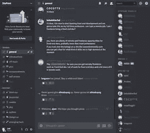

# 在我们新的不和谐社区中与我们讨论技术

> 原文：<https://www.sitepoint.com/talk-tech-with-us-in-our-new-discord-community/>

想找一个地方和志同道合的人谈论编码、设计、网络和技术吗？

或者，您可能在远程工作，需要一个可以与您同行的社区？

 我们今天要公开我们的不和。我们想创造一个休闲的地方，在那里我们可以谈论很酷的技术和完成事情，没有社交媒体的暴露狂和分裂气氛，但有实时的社区感。

我们的服务器是一个婴儿服务器，有很多工作要做，但现在我们有房间进行各种对话。无论您是想解决 web 开发问题，还是想讨论游戏，我们都能满足您的需求。

注册我们的 Discord，并开始与 SitePoint 员工、成员和更广泛的开发人员社区聊天！

100%免费。进来和我们聊天吧！

⚡️ [**现在加入我们的聊天。**](https://discord.gg/PyAM7tv)

## 分享这篇文章