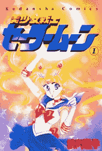
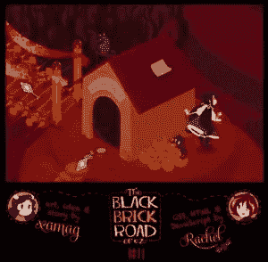

# 与瑞秋·纳伯斯谈论 CSS，动画和 x 战警

> 原文：<https://www.sitepoint.com/talking-css-animation-rachel-nabors/>

雷切尔·纳伯斯

雷切尔·纳伯斯是那些相对罕见的生物之一——一位才华横溢的艺术家和插画家，她仍然可以用代码进行思考。

在转而从事网络开发之前，她最初是 gURL.com 的一名漫画艺术家，现在过着一种喷气式飞机上的超级英雄的生活。

上周，我有机会和瑞秋聊起了 x 战警、抗衰老面霜、SVG 以及她在四月初举办的未来网页设计研讨会。

**SITEPOINT(亚历克斯·沃克):** *你好，瑞秋，非常感谢你抽出时间和我们在一起。我是喜欢你的“[无限画布截图”](https://www.youtube.com/watch?v=FlG3dDfZtoM#t=0 "Link to Episode 1 of the Infinite Canvas Screencast on Youtube.")的许多人之一。*

嗨，亚历克斯！感谢收看无限画布！我的笔记本电脑一修好，我们就要进行一场超级激动人心的面试；)

你似乎一生都热爱漫画和动画。在你的成长过程中，有哪些漫画和卡通让你着迷？

当我小的时候，我看像《小卡通历险记》和《动物》这样的节目。我特别喜欢黑暗色调的系列，如《石像鬼》和《蝙蝠侠:动画系列》。

影响:美少女战士。

大约 10 岁时，我因为 x 战警卡通而迷上了漫画。我不认为这部卡通片的动画(或文字)特别好，但我爱上了 Rogue，一个会飞会撞石头的红发超级英雄(听起来很熟悉吧？).

这让我去了漫画店，买 x 战警漫画。但是当我进入青少年时期，我想从故事中得到更多。

就在那时，美少女战士登陆了美国。我对这位美国男扮女装的日本女英雄肃然起敬。她让我认为女性可以成为她们自己节目中的明星，她们自己的权力和关系占据中心舞台，而不是成为一部更加史诗般戏剧的背景。

我就是这样迷上日本漫画的，这种痴迷让我走上了现在的道路。

在 web 开发中，设计师和开发人员之间通常有一条天然的分界线。通常，设计师可能会设计一个菜单系统，并指导编码人员如何操作。

你所做的这种图形故事讲述方式有点与众不同，因为你既要处理艺术作品，又要处理纯代码部分。我觉得对动画的微妙的数学控制——例如，一只猫如何慢跑或一根羽毛如何在空中划出弧线——比菜单如何工作更难委派给一个称职的程序员。

相信我，我几乎就要问了..(大笑)

那么，网络动画的未来是多学科的吗——还是我们只是在等待合适的工具或平台？—如果是，你有没有看到任何 HTML5 创作工具有潜力填补这个空间？

雷切尔:好问题。

我认为，每当一项新的专业知识被移植到 web 开发过程中，市场就会向两个方向发展:会有专家只做一件事，要么为大公司工作，要么提供咨询，也会有多面手将这种技能添加到他们可以在团队中做的事情清单中。

互动讲故事:奥兹的黑砖路

所以我认为我们会看到两者，我们会看到两种类型不同程度的质量。

我认为正确的工具/平台还没有准备好，否则我们会看到教程网站充斥着“如何使用*在此插入平台*”。

平台和工具就像抗衰老霜:有这么多，因为它们都不能解决问题，至少在代码的情况下，没有一个能 100%解决所有人的问题(而抗衰老霜没有一个像它们声称的那样有效——如果有的话)。

随着市场的尝试、测试、评估和持续发展，每年都会有新的名字出现。但与抗衰老面霜不同，我认为有了代码，我们就有能力真正解决手头的问题。:)

现在，一切都取决于未来工作流的样子。在过去，人们做动画更多的是把内容分割开来，可以放在页面的某个地方。

现在，我们终于将动画探索为页面上任何交互的一个集成部分。我们如何在快速响应的工作流程中做到这一点？原型工作流程？可访问性工作流？

在我们尝试过为所有人以所有方式在所有地方制作所有事物的动画之前，我们不会知道。有人会为最流行的流程构建或改进工具，这就是为什么这个时候实验非常重要。我们今天建造的东西决定了明天的工具。

那么我们今天有什么工具呢？学习 Creative Cloud 程序的学生和熟悉 Flash 的人很容易接触到 Adobe 的 Edge Animate。

我自己曾经使用过它，对于只有一点 CSS/JS 背景的人来说，这是一个很有吸引力的起点。我也看到了一些非常好的信息，听到了关于 Hype 的极好的反馈，据我所知，它提供了极好的向后兼容性、性能和对库的独立性，所以它应该对成熟的前端开发人员非常有吸引力。

两者都有时间线工具，在浏览器将这些东西构建到他们的开发工具中之前(如果有的话),它们仍然是使用这些工具的理由。根据我的经验，视觉创意人员很难想象复杂动画中复杂的时间安排，而时间线可以帮助他们。

我希望看到一种特殊的设计师/开发人员/动画师出现，他们可以手工完成所有的艺术、CSS、JavaScript 等。

在 [CodePen](http://codepen.io) 上看到瑞秋·纳伯斯([@瑞秋·纳伯斯](http://codepen.io/rachelnabors))的 Pen [完整的 CSS3 + HTML5 音乐视频](http://codepen.io/rachelnabors/pen/rCost)。