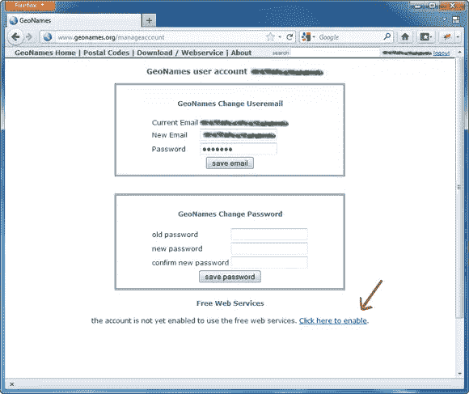

# 使用地理名称的定向地理定位

> 原文：<https://www.sitepoint.com/targeted-geolocation-with-geonames/>

基于位置的应用程序风靡一时。曾经非常昂贵的 GPS 设备现在正以前所未有的规模嵌入到许多人的口袋里，嵌入到智能手机和其他设备中，利用位置信息的服务也在不断涌现。例如，社交网络已经变得具有位置感知功能，现有的服务如[脸书](http://www.facebook.com/)紧随领先的 [Foursquare](https://foursquare.com/) 和 [Gowalla](http://gowalla.com/) 之后引入了位置。 [Twitter](http://www.twitter.com/) 已经将位置信息添加到推文中，越来越多的服务正在根据你所在的地理位置进行定制，当然，广告也加入了进来，基于位置的广告定位这是一个利润丰厚且不断扩大的领域。

除了通过手持设备上的 GPS 精确定位之外，从基于 IP 地址的地理定位到 Wi-Fi 三角测量的其他机制正变得越来越复杂，随着 W3C 通过其地理定位 API 规范巩固对地理定位的支持，机会是巨大的。

在本文中，我将与您分享地理定位的一个重要方面——将物理位置映射到描述性的地名。我将介绍如何使用 [Geonames](http://www.geonames.org/) ，这是一种在线服务，提供对大量地理数据的免费访问，帮助您开发利用位置信息的应用程序。

## 什么是地理定位？

位置感知应用依赖于能够定位你所在的位置，这就是地理定位的意义所在。毕竟，一旦应用程序知道了你的位置，它就可以找到最近的商店，引导你通过适当的路线到达目的地，或者向你发送相关的广告。那么，地理定位就是识别你的地理位置的简单机制。

地理定位有两个挑战——找到某人的位置，然后描述那个位置。确定某人位置的技术有很多种，它们的复杂程度不同，最重要的是精确度不同。纬度和经度可以将你的位置精确到地球上任何地方的几米之内，但这些值本身对大多数人来说没有什么意义。有时并不需要很好的分辨率，它足以识别最近的城市或城镇的名称。

## 地名服务

Geonames 是一个在线资源，提供大量地理信息的可下载数据库，包括纬度和经度信息到现实世界位置的映射。可以想象，这些文件既大又不稳定。你可以自己免费下载和使用这些文件，但是 Geonames 也提供网络服务，其中之一就是我在这里使用的。

为了使用网络服务，你需要创建一个免费帐户。前往[www.geonames.org](http://www.geonames.org/)，点击页面右上角的登录链接。在那里，您可以登录或创建新的用户帐户。注册后，您将收到一封带有确认链接的电子邮件；检查您的邮件并确认您的帐户。

确认您的帐户后，单击页面右上角的用户名转到帐户管理页面，使您的帐户能够使用 web 服务。



您现在有了一个允许您访问 Geonames 网络服务的用户名。您可能希望熟悉[条款和条件](http://www.geonames.org/export/)。

我将演示的特定服务是 *findNearbyPlaceName* ，它的作用就是查找离给定纬度和经度最近的地名。文档称它是一个类似 REST 的服务，数据可以用 XML 和 JSON 格式获得(如果你不清楚什么是 REST 服务，我建议你[在继续之前阅读](http://tomayko.com/writings/rest-to-my-wife))。决定是使用 XML 还是 JSON 通常是个人决定。我更喜欢 JSON，因为它更容易解析，更轻量级，并且与 JavaScript 配合得很好。

## 类似 rest 的位置 Web 服务

使用 REST web 服务检索信息的最大好处之一是，由于其本质，您可以发出一个简单的 GET 请求来测试它——并且您只需使用 web 浏览器就可以做到这一点！您所需要做的就是提供一个格式正确的 URL。在您的浏览器中，输入以下 URL:

```
http://api.geonames.org/findNearbyPlaceNameJSON?lat=53.4774&lng=-2.2381&username=yourusername
```

让我们来分解一下:

*   `http://`是传输协议。通常，REST 服务利用了 HTTP 的普遍性和易用性。
*   `api.geonames.org`是成为服务端点的初始段的域名。
*   `findNearbyPlaceNameJSON`标识服务。通常，您请求的返回格式是作为参数、文件扩展名传递的，甚至是使用 ACCEPT 头传递的，但是这个特定的服务将它包含在服务名中。
*   `lat=53.4774&lng=-2.2381`是您要查询的最近的地名的纬度和经度参数。
*   `username=yourusername`是您允许使用该服务的用户名。该服务接受 is 作为参数，但是其他 REST 服务可能实现其他授权方案，比如 HTTP-Authentication。

服务通过发回以下 JSON 来响应请求(为了可读性，我在这里对它进行了很好的格式化):

```
{"geonames":[{"countryName":"United Kingdom",
              "adminCode1":"ENG",
              "fclName":"city, village,...",
              "countryCode":"GB",
              "lng":-2.23743438720703,
              "fcodeName":"seat of a second-order administrative division",
              "distance":"0.39678",
              "toponymName":"Manchester",
              "fcl":"P",
              "name":"Manchester",
              "fcode":"PPLA2",
              "geonameId":2643123,
              "lat":53.4809464283615,
              "adminName1":"England",
              "population":395515}]}
```

如您所见，结果是一个具有属性`geonames`的对象，其中包含一个具有多个属性的对象的数组。`lat`和`lng`属性提供该服务所识别的地点的地理位置，`distance`显示该地点离您所提供的位置有多远，最有用的是`name`属性，它告诉您该地点的名称。`countryName`属性告诉您国家，在本例中是英国。

该数据还提供了有关行政区划的信息。这种划分的确切性质因国家而异；本例中`adminCode1`(一级行政区划)标识“英格兰”；如果您使用此服务查找美国的休斯顿，您会发现 adminCode1 显示德克萨斯州的“TX”。

此外，`geonameId`包含 Geonames 数据库中使用的唯一标识符，您应该记得，这是可下载的。如果您继续将这些数据用于更重要的事情，在某些时候您可能会用到它。

## 有针对性的提示——一个实际例子

例如，假设您的网站具有提示用户查找影院列表的功能，并且您希望使用用户最近的城镇名称来个性化标题文本，类似于“在曼彻斯特查找您附近的影院列表”。现在有一个您应该知道的重要限制:在大多数情况下，地理定位是在客户机上执行的。无论是通过网络浏览器还是设备本身，如果您希望在服务器上使用这些信息，就必须将它们发送回服务器。客户端的 JavaScript 将获得用户的坐标，并通过 Ajax 将它们发送给服务器端脚本，然后服务器端脚本与 web 服务交互并返回位置名称。

### 服务器端代码

让我们从编写服务器端 PHP 代码开始。Geonames 网站确实提供了一个 [PEAR 包](http://pear.php.net/package/Services_GeoNames)，以及包括 [Zend Framework](https://github.com/borisguery/bgylibrary/tree/master/library/Bgy/Service) 和 [Yii](http://www.yiiframework.com/extension/egeonameservice/) 在内的框架库，以简化对其服务的访问——然而，出于本教程的目的，我将使用普通 PHP。

这个简单的类封装了对 findNearbyPlaceName 服务的调用:

```
<?php
class Geonames
{
    protected $username;

    public function  __construct($username) {
        $this->username =  $username;
    }

    public function  getPlaceName($lat, $lng) {
        $url =  sprintf(
            "http://api.geonames.org/findNearbyPlaceNameJSON?lat=%f&lng=%f&username=%s",
            $lat, $lng, $this->username);
        $response = file_get_contents($url);
        if ($response === false) {
            throw new Exception("Failure to obtain data");
        }

        $places = json_decode($response);
        if (!$places) {
            throw new Exception("Invalid JSON response");
        }
        if (is_array($places->geonames) && count($places->geonames)) {
            return $places->geonames[0]->name;
        }
        else {
            return "Unknown";
        }
   }
}
```

这个类被命名为`Geonames`，它的构造函数将一个参数作为实参——您之前注册的用户名，然后存储在一个受保护的成员变量中。

`getPlaceName()`方法调用 findNearbyPlaceName 服务。因为这是一个对 GET 类服务的简单 GET 请求，所以您可以像之前通过浏览器测试 web 服务时一样，简单地将参数合并到 URL 中。我使用了`sprintf()`来构建 up URL，我觉得这种方法比串联更干净，并且允许我指定占位符的格式类型；纬度和经度是浮点数(`%f`)，用户名是字符串(`%s`)。然后 URL 被传递给`file_get_contents()`，后者接收服务的 JSON 响应。使用`json_decode()`对响应进行解码，并从该方法返回第一个地名。

Ajax 调用的脚本将接收纬度和经度坐标，使用它们通过新类查询 Geonames web 服务，并返回最近位置的名称。

```
<?php
require "../include/Geonames.php";

$lat = floatval($_GET["lat"]);
$lng = floatval($_GET["lng"]);

$geo = new Geonames("username");
$prompt = "Find cinema listings near you";
try {
    $place = $geo->getPlaceName($lat, $lng);
    if ($place != "Unknown") {
        $prompt .= " in " . $place;
    }
}
catch (Exception $e) {
    error_log("Error with web service: " . $e->getMessage());
}
header("Content-Type: text/plain");
echo $prompt;
```

代码以一条默认消息开始，“查找你附近的影院列表”。如果对`getPlaceName()`方法的调用没有引发异常，并且返回的名称不是“未知”,则消息被进一步个性化。

### 客户端代码

现在让我们把注意力转向 HTML 页面和调用 PHP 的 JavaScript 代码。

```
<!DOCTYPE html>
<html lang="en">
 <head>
  <meta charset="utf-8">
  <title>Hello!</title>
  <script src="jquery.js"></script>
  <script>
(function ($) {
    $(document).ready(function() {
        if (navigator.geolocation) {
            navigator.geolocation.getCurrentPosition(
                function (position) {
                    var lat = position.coords.latitude;
                    var lng = position.coords.longitude;
                    $("#banner").load("/prompt.php?lat="+lat+"&lng="+lng);
                },
                function (error) {
                    console.log("An error occurred obtaining position.");
                });
        }
        else {
            $("#banner").html("Default content goes here"); 
        }
    });
})(jQuery);
  </script>
 </head>
 <body>
  <div id="banner"></div>
 </body>
</html>
```

如果浏览器支持地理定位，那么`navigator.geolocation`将返回 true，否则一些默认内容将被插入到 ID 为`banner`的元素中。当地理位置*被*支持时，尝试使用`navigator.geolocation.getCurrentPosition()`获得用户的位置，这被传递成功和错误回调。

此时，浏览器将请求您允许与网页共享您的位置信息。如果您授予权限，则执行成功回调，如果应用程序成功检索到该位置的名称，横幅将包含个性化的邀请，以探索电影院列表。如果您拒绝授予浏览器权限，将改为执行错误回调。

## 摘要

在这篇短文中，我介绍了地理定位，以及一种你现在就可以利用它来个性化访问者在网站上的体验的方法。虽然我给出的这个例子在使用 AJAX 将块加载到页面上时有些笨拙，但它说明了地理定位的一个技术挑战——信息主要是在客户端获得的，因此需要克服一些障碍，比如请求允许使用信息。一旦获得信息，您可能希望尝试在会话中存储服务器端的信息，考虑使用缓存来提高性能，或者尝试更复杂的定位。下一个合乎逻辑的步骤是检查你将如何管理城镇之间的关系——如果我所在的村庄没有电影院，最近的城镇或城市有吗？这是另一个时间，但现在我鼓励你看看 API 对地理定位的支持(你甚至可以看看 T2 的规范，看看完全基于服务器端的解决方案，或者深入研究地理定位背后的数学。最重要的是，我鼓励你玩得开心！

图片通过[【Olivier El moal】](http://www.shutterstock.com/gallery-85608p1.html)/[快门闭锁](http://www.shutterstock.com)

## 分享这篇文章