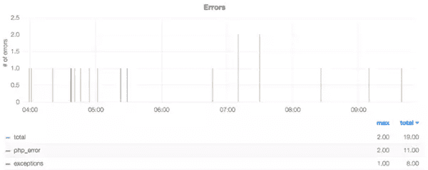

# 技术债务:通过重构拯救遗留代码

> 原文：<https://www.sitepoint.com/technical-debt-rescuing-legacy-code-through-refactoring/>

如何控制遗留代码库并使其达到新的成熟度水平？在这篇文章中，耶鲁安总结了多年来从事大型遗留 web 应用的经验教训。本文最初由 [intracto](http://marketing.intracto.com/paying-technical-debt-how-to-rescue-legacy-code-through-refactoring) 发布。

* * *

## 遗留代码可以通过重构来保存

我有好消息告诉你！松鼠每年都会种植成千上万棵新树，只是忘记了它们把橡子放在哪里。还有:**你的项目可以保存**。

无论你的老板勇敢地主动要求你处理多么糟糕的遗留代码烂摊子，总有一条*走出泥潭的路。一路上会有曲折，每隔一棵树后面就有一个怪物。但是，一步一个脚印，你会成功的。*

### 不怕邪恶

很公平，你没有要求这个可怕的任务。code swamp 入口附近的血迹斑斑的“这里是龙”标志引发了一种强烈的冲动，那就是在接下来的几年里请病假。乍一看，你宁愿先吃点清淡的午餐，然后在草地上悠闲地散步，也不愿做一个吓呆了的农民去赶走沼泽里的怪物。

然而不幸的是，老板用一种加兰特但坚定的方式推了你一把，迫使你越过了标志，老板将留下来保卫城镇，并在此过程中与拥有沼泽的公爵共进午餐。

除非采取激烈的措施，否则你无法改变这些基本事实。然而，**你*可以*把一片沼泽变成一片壮丽的草地**只要一片奶牛居住的泥泞地！

## 技术债务:怎么会变成这样？

当你用棍子戳戳刚刚经过警告标志的地方时，你可能会想:怎么会有人让这种事情发生呢？一定有人预见到了这一切，是吗？写这个代码的人*是不是那个*无能？

可能吧。但并不比其他人多。到了紧要关头，不管人们看起来多么自信，也没人知道他们在做什么。

无能远非全部。这里的工作原理通常用一个比喻来指代:[技术债](https://www.youtube.com/watch?v=pqeJFYwnkjE)。

### 编码癌症

这个想法是，在任何项目的开发过程中，都会走捷径。丑陋的黑客将被允许快速晋升，仅此一次。这样，债务就累积起来了:代码可以以任何方式完成工作，但完全无法正确维护，更不用说构建了。

因此，一点一点，一个项目的代码被破坏了。没人在乎这个，只要他们不是必须碰它的人。但最终总要有人去做，而那个人很可能就是你。

这个原则适用于任何项目，如果不是这样，很可能意味着你进展得不够快。你的竞争对手*将*走捷径，更快地推出新功能。因此，*你宝贵的用户将离开*，加入隔壁沼泽的派对，在那里的鸡尾酒吧喝一杯长岛冰茶，而不是站在你过去一年辛苦创造的无可挑剔的平方米草地上。你的草地本身可能很漂亮，但那里没什么变化。

因此，**任何健康的项目都会积累一些技术债务**，但是为了不破产——代码变得如此难以维护以至于变得难以管理——在某个时候这些债务将不得不被解决。

这就是惊恐和怨恨的农民进来的原因，*被迫代替沼泽主人偿还债务。偿还这笔债务通常被称为[重构](http://martinfowler.com/books/refactoring.html):将一段代码与另一段代码交换，这段代码做的完全一样，但是更容易维护和扩展。*

## 说服客户

作为沼泽的主人，公爵对你应该添加哪些怪物有一些意见。总有*个新功能*是你的客户想要实现的，每个功能的截止日期是上周，你应该为两周前没有完成所有功能而感到无能。所以你可能需要做一些解释来说服他，他需要*让你重建*他认为已经在他手中的东西。

这是一个临界点。如果你不能成功说服你的客户开始偿还欠款，技术债务将会增长到崩溃的边缘。你将是那个被留在废墟中的人，被追究责任。

最终，**你的客户和你想要的是完全一样的东西**:拥有一份有趣且轻松的工作，让每个人都可以谋生。这来自于一个*稳定项目*，它由你可以改变的代码构建而成，而不需要整个事情发生在你身上。

### 为你的自由而战

所以为了你好，你需要把情况说清楚。我认为最好的方法是描述即将来临的厄运，还有什么选择，让沼泽主人知道你的好意:

*   **解释技术债务的含义**，以及如果技术债务过高，它是如何使开发减速甚至停止的。客户必须意识到这会在哪些方面让他付出代价:花在查找 bug、修复 bug 和创建新 bug 上的时间，没有足够的时间来添加功能和推进业务。
*   牢记清晰的短期目标进行重构。你可以在一周内添加一个新的特性，或者你可以重构一周，然后在一天内添加，这样将来就可以非常容易地添加类似的特性。展示第二种选择在短期内会更贵，但从长期来看会便宜很多。
*   **指出你希望你的客户**和你自己都得到最好的，这两个问题其实是一回事。

一旦沼泽主人站在你这边，最困难的部分就过去了。现在你可以自由地将项目朝着正确的方向推进。

## 新的沼泽不会形成

你可以从巨大的混乱中恢复过来；*不要换成新的*。绿地改写很少奏效；大多数人永远不会被释放。

当你最终说服公爵，走进他的沼泽的人不会再出来，他可能会想建立一个新的版本。你可能很想遵从，使用闪亮的新工具重新开始，确信当你完成时一切都会变得更好。**不要。**

在我看来，重写的主要风险是:

*   **红色大按钮开关**:新代码以前从未在生产中运行过，保证在第一次生产使用时爆炸。
*   **数据迁移**:从旧系统导出和导入数据，同时跟上实时数据的到来，这很可能会出错。
*   新旧错误:在重写代码的时候，你会产生错误，重现旧的错误，错过微妙之处和隐含的特性……通常这些问题会发生在系统中本来没有问题的部分。您损失了大量时间，却没有为客户的业务增加任何价值。
*   **跟上业务发展**:在你从事新项目的长时间里，旧项目也需要随着业务需求不断发展。新代码将需要重建旧功能*和*添加新功能不断被添加到旧项目。

**所以，不要重新开始。改善你所拥有的。**

## 让问题变得可见

这听起来可能有点令人不快，但你的沼泽里的怪物应该会朝你的脸上吐口水，龙会烧掉你手臂上的毛发，住在蘑菇状岩石附近的侏儒会踢你的小腿。

不管你有没有注意到，这些讨厌的东西正在破坏你的项目。你需要面对它们，才能摆脱它们。你需要能够**在任何时间点看到哪里出了问题**。

*   将错误可视化:每周花些时间修复一些最常出现的错误。最终图表会变平，希望比你快。
*   **监控您的环境**:这对于诊断瓶颈和即将到来的危机至关重要(见下一段)。

现在你知道哪里和什么时候疼了，使你能够进行急救，而不是潜在地花所有的时间在垂死的人身上抓痒。

## 打击最伤人的东西

接下来，对这个系统有一个**愿景是至关重要的，因为它在一个完美的世界中应该是**的——一幅关于你的最终牧场的脑海画面指导着你的每一步行动:

把它刻在泥里，这样你就不会忘记了。通过朝着天堂的方向迈出中间的一小步，你最终会发现自己在透过栅栏看。

现在的关键是利用你从监控工具中获得的信息，以及对瓦尔哈拉的渴望，结合这两者来决定先解决哪个问题。你最大的问题可能不是一个现实的目标，但是*首先开始重构可管理的障碍*并努力实现它。

因为某些原因看起来对你生气的瘸腿小精灵可能会惹恼你，但她是无害的。你最好把时间花在思考如何赶走食人魔上。

## 这个代码是我的

解决重要的问题至关重要，但这并不意味着细节不重要。事实上，它们可能同样重要。

**的童子军规则保持野营地比你发现的还要干净**是沼泽生存指南的第一条规则。通过不断清理杂物，注意不要在任何地方留下新的脏东西，你的环境会变得越来越干净，直到你发现自己在你渴望的原始草地上。

要做到这一点，态度就是一切。努力实现干净的代码。

*   你必须关心:代码是你的，任何接触它的人都必须对你负责。马虎和粗心是不能容忍的。
*   整个团队都必须关心:无论你为清理一个项目付出了多少努力，如果有人在你身后撤销了你的努力，你将一事无成。
*   **纪律至关重要**:一旦你(*或任何团队成员！*)开始放任自流，几乎不可能逃脱。
*   保持小步前进:当然是朝着正确的方向。进步比达到完美更重要。
*   小胜利产生动力:你将开始看到非常好的代码补丁，促使你也清理邻近的补丁。

## 建一座图书馆

文明的一个很好的指标是每平方米图书馆的数量。因此，在你的项目中引入礼貌，这似乎是一个很好的方法。

即使是最危险的泥沼，在这里和那里，也会有几个不太坏的地方。每当你发现一点代码做得很好，**把它移到你的全新库**中，这样它就可以被重用。

毫无疑问，期望您挽救的代码会完全出错。它会以某种方式完全忽略和规避任何标准或最佳实践，而这些标准或实践会使您作为开发人员的生活更加轻松。没有人会帮你解决这个问题，只有一条路可走:*在你的新代码*中开始遵循这些实践和标准。

**准备好行业标准组件或模块**并开始使用。您将拥有使用旧的或定制的方式来完成事情的代码，但是这并不意味着您不能以适当的方式构建新的东西。

### 使用新工具进行重构

一旦有了工具，你就可以**重构**现有的代码来使用它们。你不一定要保持马拉松冲刺才能做到这一点；只要你偶然发现一个用老方法做事的案例，就解决它。小步前进。你会发现所有的东西都被替换了，你再也认不出旧代码了。

通常情况下，代码是完全可以接受的，如果不是分散在各处的无数**依赖关系**(比如会话访问、模块或现场咨询的服务)。处理这个问题的一个好方法是通过*将这些从代码所在的方法*或函数中推出，所以它们通过方法的参数进来。这样，你就可以让那段代码**自包含**，并且有可能移动它或者进一步分割它。

一旦代码是独立的，**你就可以测试它了**。

## 建立信心:测试

一个在泥泞中游荡的暴力食人魔比一个戴着镣铐的暴力食人魔造成的伤害更大。获得对系统的一些控制的一个很好的方法是尝试在最关键的部分加上锁链，从而潜在地导致 T2 最大的损害——测试，最好是自动化的，在每个构建中运行。

你检查系统行为的自动化测试越多，你在改变事情时就越有信心。因为，如果有什么东西坏了，你的测试会告诉你有问题，所以你可以在问题进入**生产环境**之前修复它。

### 高级测试

开始测试您的系统的一种方法是在您的系统中添加针对关键场景的**验收测试。对于一个普通的电子商务系统，这肯定包括结账过程:如果没有订单进来，你就赔钱。如果订单来了，但在处理过程中出现了问题，你可以在没有任何客户注意到的情况下恢复过来。有了这样的测试，你可以保护自己不被无意中引入重大问题。**

### 低级测试

在**的下一层**上，你可以应用[单元测试](http://martinfowler.com/bliki/UnitTest.html)。使用一小步一小步地将依赖项从你的方法中推出，结果将是代码有一个**清晰的输入和一个清晰的输出**。在这种情况下，就有可能使用单元测试来覆盖代码的功能。你定义一组输入，并声明你期望你的代码产生的输出，你的测试套件将*确保那段代码保持预期的行为*。

### 不要测试一切

测试系统中的每一行代码在经济上是不可行的，也是不必要的。原则上，对你的系统的每个方面都完全有信心是很好的，但是使一切都是可测试的，编写测试和维护测试的成本将在某个时候开始超过好处。根据我的经验，你的时间最好花在为非琐碎的业务逻辑和系统的某些部分编写测试上，如果它们出故障的话会引起混乱(即使代码实际上很简单)。

通过这种方式，你可以将最危险的怪物锁起来，而沼泽将会是一个更安全、更可预测的地方。

## 隔离并替换

一种结合了上面列出的几乎所有战略模式的有用技术是古老的“隔离-替换”。

偶尔，您会遇到一些代码，它们的内部工作方式和效果是无形的，需要在多项式时间内进行适当的小步骤重构。在这种情况下，考虑以下方法:

*   **隔离杂乱的部分**，放在单独的方法或类中。
*   推出依赖关系,这样它们就作为参数进来了。
*   使用小步骤的方法将逻辑从副作用中分离出来。
*   **用单独的方法隔离逻辑**。
*   添加覆盖逻辑行为的单元测试。
*   **从头重写逻辑**。如果它通过了测试，至少应该接近旧版本显示的行为。
*   **在生产环境中并排运行新旧版本的逻辑**。实际使用的还是老版本。
*   **记录新旧版本之间的输出差异**。
*   **认真监控日志**。每当出现差异时，为该案例添加一个新的单元测试，并修改新版本以通过新案例。
*   重复，直到新旧版本**一致同意**为止。
*   **放心用新版本**切换老版本逻辑。

这项技术可以让你在汽车不出故障的情况下更换汽车的发动机，甚至汽车都不会注意到它的内部零件被更换了。

## 说服自己

对我来说，上面概述的思维方式和工具已经被证明是一种成功的方法，可以引导一个濒临崩溃的系统远离灾难。

最初，我犹豫是否要将全部精力投入到接受长期遗留挑战的任务中，现在我看到了它帮助我**成为一名更好的开发人员**的许多方式:

*   **学会识别坏代码**:你学会发现什么是坏代码，因为这是你必须花大部分时间去做的事情。当你在一个新项目中工作时，你在这里看到的模式不会绊倒你，因为你知道它将来会如何伤害你。
*   回到基础知识:在我的案例中，系统的每一个方面都需要被质疑和重新评估。没有什么是神圣的，现代框架为你处理的许多问题都会得到你的赞赏。
*   **你与系统一起发展**:随着你所关心的系统的发展，你会看到新的挑战。这样，随着越来越多的人使用你的作品，你就知道你需要处理哪些瓶颈，你需要扩大规模以保持领先。
*   人们不断产生闪亮的新遗产:勤奋地，比他们在我们的海洋中产生垃圾带更快地，知道如何让它工作是一项很好的技能。
*   **乐趣和回报**:特别是回顾走过的路，意识到你今天拥有的系统与你多年前第一次遇到的系统完全不同，会让你有一种真正的成就感。

### 为了结束这篇重要的(或者至少是冗长的)文章

你可以像受惊的农民一样踮着脚穿过沼泽，希望有人会发现你并带你去迪斯尼乐园，或者你可以自己处理事情，表现得像你拥有这个地方并执行你自己的规则。任何沼泽下面都有坚实的地面，你可以找到它。

*后记:*

几年后，你漫步穿过草地。在地平线上，你可以看到公爵用啤酒广告取代了旧的“龙在这里”的标志。

他脸上挂着灿烂的笑容。

## 分享这篇文章